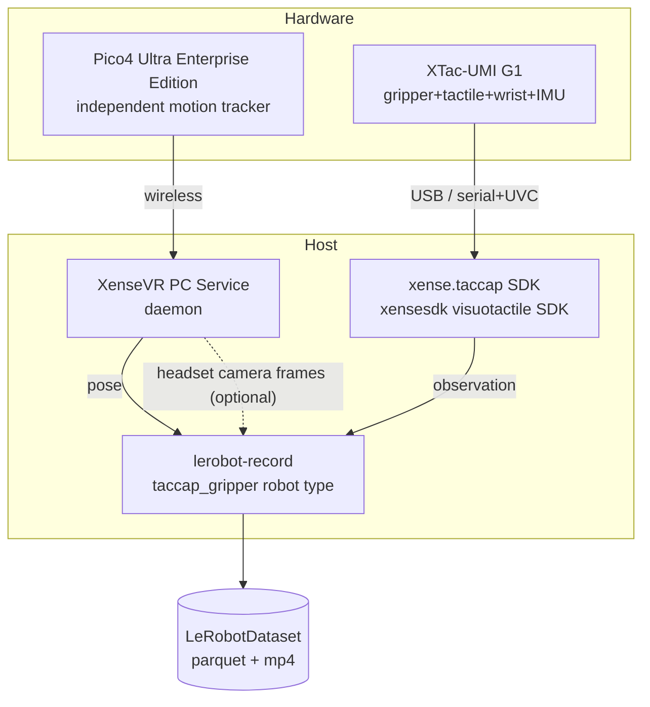

# 1. Overview

## 1.1 What is the XTac-UMI G1

The **XTac-UMI G1** is XenseRobotics'
**handheld UMI leader gripper** for multimodal tactile data collection. A single unit
integrates:

| Part | Notes | Rate |
|---|---|---|
| Encoder | Jaw opening angle; [calibration](04-calibration.md#41) normalises it to closed = 0, open = 1 (the physical travel differs per unit) | 100 Hz |
| IMU | Accel / gyro / mag / temperature | 100 Hz |
| Two visuotactile sensors (GSPS, one per finger) | Rectified image ~`(400, 700, 3)` | ~30 Hz |
| Wrist camera (XC, UVC) | Wrist-view RGB | ~30 Hz |
| Motor jaw | **Follower units only**; for robot-side execution or replay | — |

!!! warning "The device is passive / self-driven"
    During collection the motor is **never driven or enabled**. The operator **mechanically
    drives the jaw by hand** — so there is **no separate teleoperator**, and **no
    `--teleop.*` flags** are needed on the CLI.

## 1.2 System components

A full collection involves four cooperating parts:

The same PC Service connection can also carry the **headset's own stereo camera** — optional, off
by default, and requiring service ≥ v0.2.0. See
[5.6 Headset camera](05-data-collection.md#56).

## 1.3 Architecture & data flow

`xense.taccap` is a pure **device-access layer** — it does not record datasets. Recording,
time alignment and episode handling live in `xense-taccap-lerobot`.

!!! note "Tactile imaging is at the Python level"
    Since SDK 0.1.4, visuotactile (OG) capture/rectify is **not** in the C++ SDK — it is
    handled by the `xensesdk` visuotactile sensor SDK. `xense.taccap` is **gripper protocol +
    wrist camera** only.

## 1.4 Supported platforms & dependency versions

**Exact version numbers live in [Versions & support](versions.md)** — the single
source, listing "supported range" and "validated baseline" separately. What
follows are only the constraints that decide whether, and how, this installs:

- **Linux amd64 only.** The capture path is V4L2 + UVC; macOS and Windows cannot run it.
  Ubuntu 22.04 / 24.04 are tested.
- **Python 3.12 or newer.** The main repository declares `requires-python = ">=3.12"`
  and `conda_environment.yaml` pins `python=3.12`; 3.10 and 3.11 will not install —
  this is a hard floor, not a recommendation.
- **The collection host has a spec floor.** The minimum is a **12th-gen i7, 8 GB of
  RAM and an NVIDIA RTX 3060 with 8 GB VRAM**, driver **≥ 570.144**; both tiers are in
  [Collection host requirements](02-environment.md#host-spec). Anything below that will
  install and record, but **noticeably less efficiently** — see
  [Recording on a machine with no NVIDIA GPU](05-data-collection.md#no-gpu).
- **Mamba / Miniforge strongly recommended** — roughly 10× faster dependency solving
  than conda.
- **The gripper SDK is built from source** (`third_party/taccap-gripper`), not
  installed from PyPI, so it must be [rebuilt](02-environment.md) after a submodule
  update.
- **Video codecs come from wheels**: `torchcodec` pinned to the PyTorch compatibility
  matrix, PyAV pinned, FFmpeg kept out of the conda solve so it cannot fight the ROS
  stack.

!!! danger "Prerequisites"
    - Your user must be in the `dialout` / `video` groups (see [3.1](03-host-hardware.md#31)).
    - A udev rule to keep ModemManager off the gripper serial is recommended (see [3.2](03-host-hardware.md#32)).

Next → [2. Environment Setup](02-environment.md)
