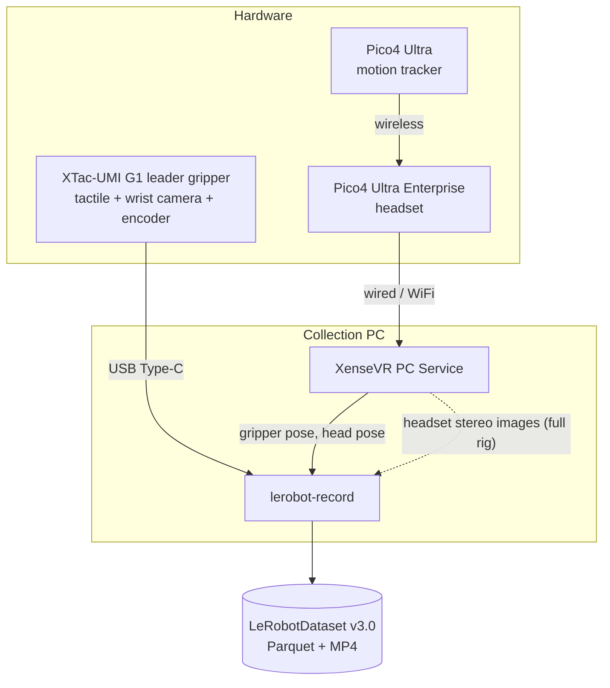

# 1. Overview

!!! abstract "Scope of this manual"
    Covers the full path from **handheld collection** to **data on disk as a [LeRobotDataset v3.0](06-dataset.md)**:
    hardware → installation → host setup → calibration → collection → dataset. **Model training, inference and deployment are out of scope.**

## 1.1 What is the XTac-UMI G1

The **XTac-UMI G1** is XenseRobotics' **handheld visuotactile multimodal data-collection gripper** for robot
manipulation learning; see [Highlights](highlights.md) for more. Each leader gripper integrates:

| Part | Notes | Rate |
|---|---|---|
| Encoder | Jaw opening; [calibration](04-calibration.md#41) normalises it to closed = 0, open = 1 | 100 Hz |
| Two visuotactile sensors (one per finger) | Visuotactile image, about `(400, 700, 3)` after rectification | ~30 Hz |
| Wrist camera | Wrist-view RGB | ~30 Hz |
| IMU | Accel, gyro, magnetometer; reserved, not recorded by default | 100 Hz |

!!! note "Handheld demonstration, no teleoperator"
    The operator performs the demonstration with the gripper in hand, so the recording command needs **no `--teleop.*` flags**.

## 1.2 System components

```mermaid
flowchart TB
    subgraph Hardware
      G[XTac-UMI G1 leader gripper<br/>tactile + wrist camera + encoder]
      T[Pico4 Ultra<br/>motion tracker]
      H[Pico4 Ultra Enterprise<br/>headset]
    end
    subgraph Collection PC
      PS[XenseVR PC Service]
      LR[lerobot-record]
    end
    G -- USB Type-C --> LR
    T -- wireless --> H
    H -- wired / WiFi --> PS
    PS -- gripper pose, head pose --> LR
    PS -. headset stereo images (full rig) .-> LR
    LR --> DS[(LeRobotDataset v3.0<br/>Parquet + MP4)]
```

- The **leader gripper** connects to the PC over USB and provides opening, visuotactile images and the wrist camera.
- The **motion tracker** sits on top of the gripper and is tracked by the **headset**, giving the gripper's 6-DoF pose.
- The **headset** connects to the PC over a cable (recommended) or WiFi and hands the pose to the **XenseVR PC Service**; in the full rig it also sends the headset stereo images and head pose.
- **`lerobot-record`** gathers every stream and writes the dataset frame by frame.

Collection comes in three tiers depending on the connected devices, chosen with `--robot.type`:

| Tier | Devices needed | Data recorded |
|---|---|---|
| ① Grippers only | Leader grippers | Tactile, wrist cameras, opening |
| ② With wrist pose | Grippers + trackers + headset | Adds the gripper pose |
| ③ Full rig | Same as ② | Adds headset stereo images and head pose |

Commands are in [5. Data preview and collection](05-data-collection.md).

## 1.3 What each frame records

Each frame combines the latest value of every stream: the observation is the visuotactile images, wrist
camera and opening (plus the headset images in ③); the action is the next frame's gripper pose and
opening (plus the head pose in ③). Field details are in [5.3 What each frame records](05-data-collection.md#53),
the dataset format in [6. Dataset & Examples](06-dataset.md).

## 1.4 Platform requirements

Exact versions are in [Versions & support](versions.md). Whether it installs comes down to:

- **Linux amd64 only**, tested on Ubuntu 22.04 / 24.04; macOS and Windows are not supported.
- **Python 3.12 or newer**, set up by following [Environment Setup](02-environment.md).
- **Minimum collection host**: 12th-gen i7, 8 GB RAM, NVIDIA RTX 3060 with 8 GB VRAM, driver ≥ 570.144;
  both tiers are in [Collection host requirements](02-environment.md#host-spec).
  Below that it installs and records, but noticeably less efficiently; see [Recording on a machine with no NVIDIA GPU](05-data-collection.md#no-gpu).
- Your user must be in the `dialout` and `video` groups, see [3.1 Serial permissions](03-host-hardware.md#31); and keep ModemManager off the gripper serial port, see [3.2](03-host-hardware.md#32).

Next → [2. Environment Setup](02-environment.md)
