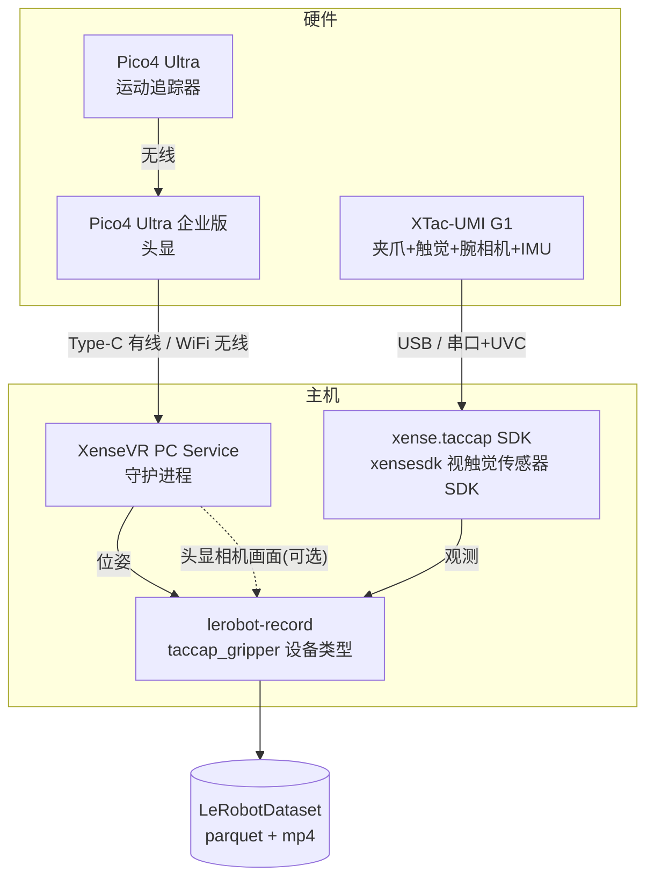
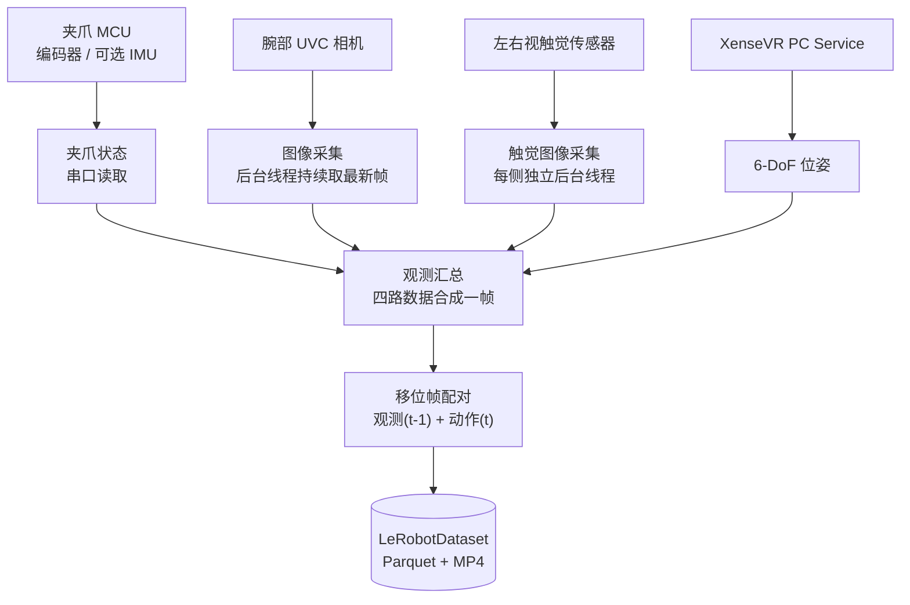

# 1. 概述

!!! abstract "本手册范围"
    覆盖 **从数采夹爪硬件 → 数据落盘为 `LeRobotDataset`** 的完整链路:
    概述/硬件 → 环境安装 → 软件使用采集 → 数据落盘与介绍。
    **模型训练、推理、部署不在范围内。**

## 1.1 XTac-UMI G1 是什么

**XTac-UMI G1** 是 XenseRobotics 的**手持式 UMI 主夹爪**,专为多模态触觉数据采集设计。产品定位为
**面向机器人操作学习的穿戴式视触觉多模态数据采集夹爪**,更多产品价值见 [产品亮点](highlights.md)。
单个夹爪单元集成:

| 部件 | 说明 | 采样率 |
|---|---|---|
| 编码器(Encoder) | 夹爪开合角度;[标定](04-calibration.md#41)后归一化为闭合=0、张开=1(真实行程每台各异) | 100 Hz |
| IMU | 加速度 / 角速度 / 磁力 / 温度 | 100 Hz |
| 双视触觉传感器(GSPS,左右指各一) | 视触觉图像,校正后约 `(400, 700, 3)` | ~30 Hz |
| 腕部相机(XC,UVC) | 手腕视角 RGB | ~30 Hz |
| 电机夹爪(motor jaw) | **仅从夹爪(Follower)配备**;用于机器人执行端操作或回放 | — |

!!! warning "本设备是被动 / 自驱动的"
    采集时**不驱动电机**,电机始终不使能。操作员**手持夹爪机械地**带动夹爪走完演示
    动作——因此**没有独立遥操作端**,命令行上**不需要任何 `--teleop.*` 参数**。

## 1.2 数采系统组成

一次完整采集涉及以下部分协同:

- **夹爪 MCU** 通过 `xense.taccap` 读取编码器与可选 IMU;腕相机和触觉图像由采集程序直接读取。
- **Pico4 Ultra 运动追踪器**装在夹爪顶部,通过无线与 **Pico4 Ultra 企业版头显**通信。
- **Pico4 Ultra 企业版头显**通过 Type-C 有线网络或 WiFi 无线网络连接数采电脑,将位姿发送至 XenseVR PC Service。
- **XenseVR PC Service** 是位姿数据的主机守护进程,采集端从中读取 6-DoF 位姿。
  同一条连接还可以送来**头显自带双目相机**的画面(可选,默认关闭,需服务 ≥ v0.2.0;见
  [5.6 头显相机](05-data-collection.md#56))。
- **lerobot-record** 把观测(t-1 帧)与动作(t 帧位姿 + 归一化夹爪开度)配对,写出数据集
  (见 [5.1 采集原理](05-data-collection.md))。

## 1.3 系统架构与数据流

`xense-taccap-lerobot` 负责设备发现、相机采集、观测汇总与数据集录制。四路数据来源先汇总成
一帧观测,再由 `lerobot-record` 完成移位帧配对与数据集写入:

!!! note "相机数据不经过 xense.taccap"
    - **腕相机流**:直接通过 OpenCV / V4L2 采集,后台线程持续更新最新帧。
    - **触觉图像流**:直接通过 `xensesdk` 采集,每个传感器由独立后台线程读取。
    - 汇总时取各路的最新图像,与夹爪状态、Pico4 位姿合成一帧观测。

**每帧最终会记录**:夹爪末端(EEF TCP)位姿(`tcp.*`)、归一化夹爪开度(`gripper.pos`)、
可选 IMU、左右触觉图、腕相机图——详见 [5.3 每帧记录内容](05-data-collection.md#53)。

## 1.4 支持的平台与依赖版本

**具体版本号见 [版本与支持](versions.md)** —— 那一页是唯一出处,同时列出"支持范围"和
"已验证基线"。这里只讲几条会影响能不能装、怎么装的硬约束:

- **只支持 Linux amd64。**采集路径是 V4L2 + UVC,macOS / Windows 用不了。已验证 Ubuntu 22.04 / 24.04。
- **Python 至少 3.12。**主仓库 `requires-python = ">=3.12"`,`conda_environment.yaml` 也固定
  `python=3.12`;3.10/3.11 装不上,不是"能跑但不推荐"。
- **采集主机有配置门槛。**最低要求是 **12 代 i7 / 8 GB 内存 / NVIDIA RTX 3060 8 GB 显存**,
  驱动 **≥ 570.144**;完整的最低与推荐两档见
  [采集主机配置要求](02-environment.md#host-spec)。低于这个配置的机器**能装能录,但效率明显下降**,
  见 [没有 NVIDIA GPU 的主机怎么录](05-data-collection.md#no-gpu)。
- **强烈推荐 Mamba / Miniforge** 管理环境,依赖求解比 conda 快约 10×。
- **夹爪 SDK 从源码本地构建**(`third_party/taccap-gripper`),不是从 PyPI 装的。
  更新子模块后需要[重新编译](02-environment.md)。
- **视频编解码走 wheel**:`torchcodec` 按 PyTorch 兼容矩阵固定,PyAV 固定版本,
  FFmpeg 不参与 conda 求解——避免与 ROS 栈相互拉扯。

!!! danger "先决条件"
    - 用户需加入 `dialout`、`video` 用户组(见 [3.1 串口权限](03-host-hardware.md#31))。
    - 建议为夹爪串口配置 udev 规则,避免 ModemManager 抢占(见 [3.2](03-host-hardware.md#32))。

下一步 → [2. 环境部署](02-environment.md)
