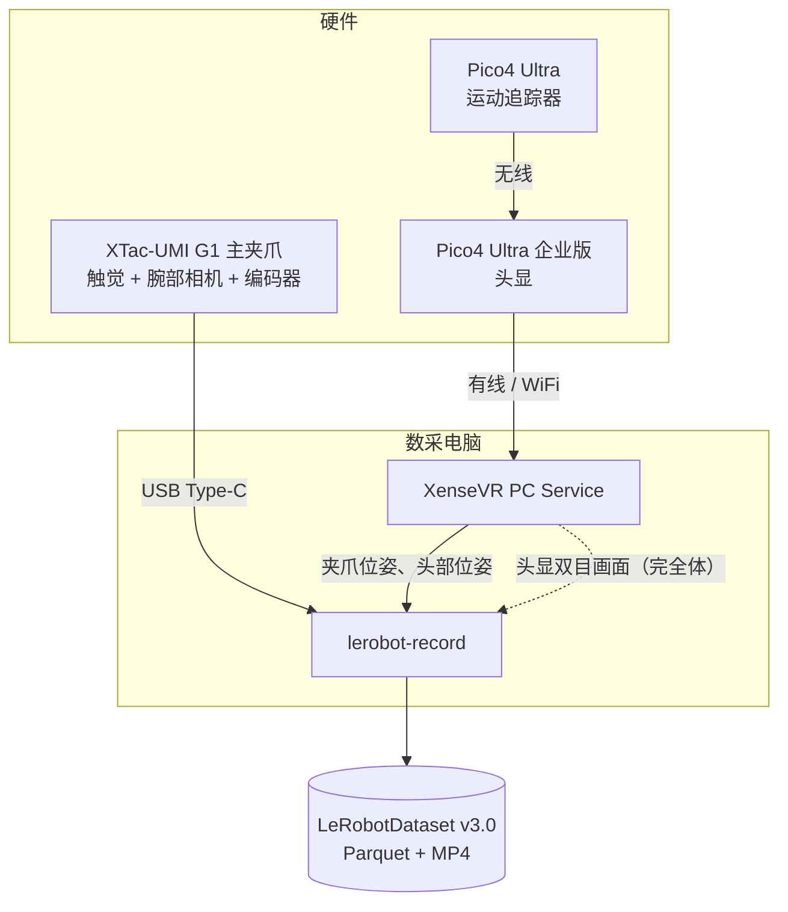

# 1. 概述

!!! abstract "本手册范围"
    覆盖从**手持采集**到**数据落盘为 [LeRobotDataset v3.0](06-dataset.md)** 的完整链路：
    硬件 → 环境安装 → 主机配置 → 标定 → 采集 → 数据集。**模型训练、推理、部署不在范围内。**

## 1.1 XTac-UMI G1 是什么

**XTac-UMI G1** 是 XenseRobotics 面向机器人操作学习的**手持式视触觉多模态数据采集夹爪**，
更多产品价值见 [产品亮点](highlights.md)。每只主夹爪集成：

| 部件 | 说明 | 采样率 |
|---|---|---|
| 编码器 | 夹爪开合；[标定](04-calibration.md#41) 后归一化为闭合 = 0、张开 = 1 | 100 Hz |
| 双视触觉传感器（左右指各一） | 视触觉图像，校正后约 `(400, 700, 3)` | 约 30 Hz |
| 腕部相机 | 手腕视角 RGB | 约 30 Hz |
| IMU | 加速度、角速度、磁力；预留，默认不录 | 100 Hz |

!!! note "手持演示，没有遥操作端"
    操作员手持夹爪完成演示动作，录制时命令行**不需要任何 `--teleop.*` 参数**。

## 1.2 数采系统组成

```mermaid
flowchart TB
    subgraph 硬件
      G[XTac-UMI G1 主夹爪<br/>触觉 + 腕部相机 + 编码器]
      T[Pico4 Ultra<br/>运动追踪器]
      H[Pico4 Ultra 企业版<br/>头显]
    end
    subgraph 数采电脑
      PS[XenseVR PC Service]
      LR[lerobot-record]
    end
    G -- USB Type-C --> LR
    T -- 无线 --> H
    H -- 有线 / WiFi --> PS
    PS -- 夹爪位姿、头部位姿 --> LR
    PS -. 头显双目画面（完全体） .-> LR
    LR --> DS[(LeRobotDataset v3.0<br/>Parquet + MP4)]
```

- **主夹爪**经 USB 接数采电脑，提供开合度、视触觉图像和腕部相机画面。
- **运动追踪器**装在夹爪顶部，由**头显**跟踪，得到夹爪的 6-DoF 位姿。
- **头显**经有线（推荐）或 WiFi 连接数采电脑，把位姿交给 **XenseVR PC Service**；完全体档还会送来头显双目画面与头部位姿。
- **`lerobot-record`** 汇总各路数据，逐帧写成数据集。

按接入的设备，采集分三档，用 `--robot.type` 选择：

| 档位 | 需要的设备 | 录到的数据 |
|---|---|---|
| ① 只有夹爪 | 主夹爪 | 触觉、腕部相机、开合度 |
| ② 带腕部位姿 | 主夹爪 + 追踪器 + 头显 | 再加夹爪位姿 |
| ③ 完全体 | 同上 | 再加头显双目画面与头部位姿 |

具体命令见 [5. 数据预览与采集](05-data-collection.md)。

## 1.3 每帧记录什么

每一帧把各路数据的最新值合在一起：观测是视触觉图像、腕部相机画面和开合度（③ 档再加头显画面），
动作是下一帧的夹爪位姿和开合度（③ 档再加头部位姿）。字段明细见
[5.3 每帧记录内容](05-data-collection.md#53)，数据集格式见 [6. 数据集与示例](06-dataset.md)。

## 1.4 平台要求

具体版本号见 [版本与支持](versions.md)。能不能装取决于下面几条：

- **只支持 Linux amd64**，已验证 Ubuntu 22.04 / 24.04；macOS / Windows 不支持。
- **Python 3.12 及以上**，按 [环境安装](02-environment.md) 装好即可。
- **采集主机最低配置**：12 代 i7、8 GB 内存、NVIDIA RTX 3060 8 GB 显存，驱动 ≥ 570.144；
  最低与推荐两档见 [采集主机配置要求](02-environment.md#host-spec)。
  低于这个配置能装能录，但效率明显下降，见 [没有 NVIDIA GPU 的主机怎么录](05-data-collection.md#no-gpu)。
- 用户需加入 `dialout`、`video` 用户组，见 [3.1 串口权限](03-host-hardware.md#31)；并关闭 ModemManager 对夹爪串口的抢占，见 [3.2](03-host-hardware.md#32)。

下一步 → [2. 环境部署](02-environment.md)
