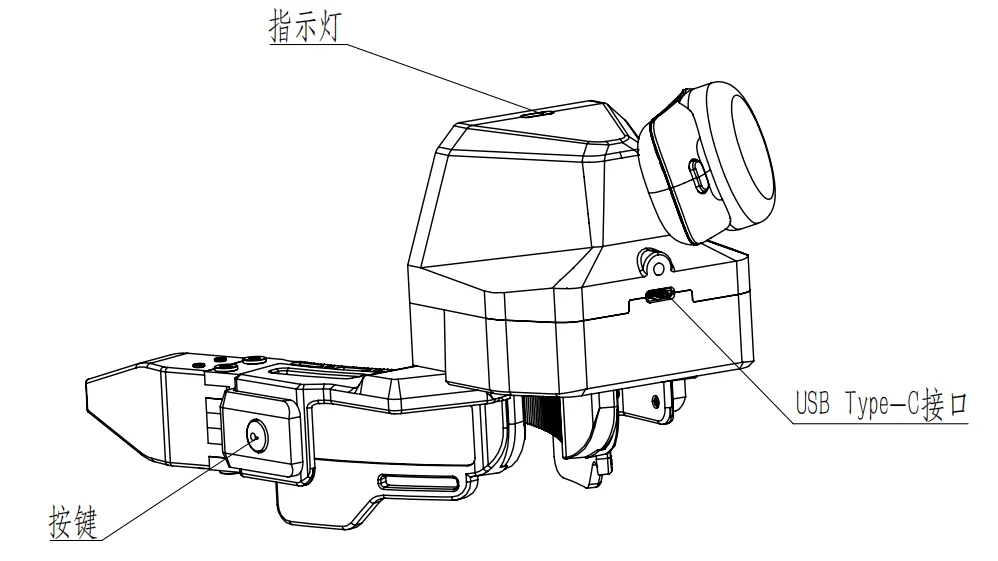

# Gripper buttons, LEDs and voice {#buttons-leds}

On the Backpack Kit the gripper's two side buttons start, stop and delete recordings, the LED reports the current state, and the device gives voice announcements. The buttons and LED patterns are handled by XTac-UMI Collector on the backpack, so no browser needs to be online. How to connect the grippers and tell left from right by serial number is in [Gripper connection and serial numbers](../common/gripper.md).

{ width="480" }

## Buttons {#buttons}

The button state machine runs on the backpack and **does not need the browser to be open**. While recording, a double-press or a right-gripper hold is silently ignored (against accidental presses); with nothing to delete, a double-press is refused (fast yellow blink).

| Gesture | Action |
|---|---|
| **Right gripper hold** | Start recording |
| **Left gripper hold** | Stop recording |
| **Left gripper double-press** | Enter delete confirmation (purple blink; exits by itself after 5 s without input) |
| **Double-press** again while confirming | Delete the previous episode (solid purple for 3 s; those 3 s are also the cool-down, during which double-presses are ignored) |
| **Left gripper hold** while confirming | Cancel the delete |
| **Right gripper hold** while confirming | Abandon the delete and start a new recording right away (the previous episode is kept) |
| **Right gripper single press** while recording | Place a subtask marker (a sub-step boundary) in this recording, with a tone |

Which gripper does what (right starts / left stops), the press timings and the LED patterns are fixed fleet-wide and cannot be changed on site, and the console offers no way to change them; the values in effect are shown on the console's System → Capture settings page (see [System settings](system.md)).

## LEDs {#leds}

| LED | Meaning |
|---|---|
| Solid green | Standby: ready to record |
| Breathing green | Recording (one bright-dim cycle per second) |
| White blink | Saved normally (0.4 s on, once) |
| Solid yellow | Failed to start recording (2 s), or a fatal problem while recording (stays lit) |
| Pulsing yellow | Data suspect: still recording, but that episode's quality is questionable (0.2 s on, 0.8 s off, 3 times) |
| Fast yellow blink | Action refused, e.g. pressing start while already recording (0.1 s on/off, 3 times) |
| Purple blink | Delete confirmation pending, waiting for your second double-press; 0.3 s on/off, cancels itself on timeout |
| Solid purple | The 3 s cool-down right after a delete; double-presses do nothing during it |
| Solid red | System problem (e.g. a gripper dropped off; lit by the backpack side) |
| Red strobe | Gripper-side problem (lit by the gripper MCU itself, not routed through the backpack) |

Recording is breathing green; red only ever means a fault. Fast blink and pulse are both yellow and differ only in rhythm: the fast blink is dense, the pulse sparse. The console's System → Capture settings page renders this table as an animated legend that plays each shape and rhythm, so the two are easy to tell apart (see [System settings](system.md)).

## Voice prompts {#voice-cues}

Backpack Kit only: while collecting, both hands are on the grippers and your eyes are on the scene, so reading the LED means looking up at the gripper. The device therefore speaks up at key moments, complementing the LED patterns. Prompts play through the headset by default; when the headset is disconnected or unsupported they fall back to the backpack's speaker, and the "Pico connection failed" prompt always uses the backpack's speaker. No tablet needs to be nearby and the browser is not involved.

| When | What it says |
|---|---|
| Recording starts | "Recording started." |
| An episode finishes | "Recording complete. Please reset the scene." — reset the scene and get ready for the next one |
| A fatal problem while recording | "Recording failed." — that episode is a write-off |
| A gripper drops off while recording | "Gripper connection failed." |
| The headset drops off while recording | "Pico connection failed." |
| A tracker drops off while recording | "Tracker connection failed." — the headset may still be connected, so check the tracker on your hand first |
| Right gripper single press to mark a subtask | Subtask marker tone (no speech) |

The audio language can be Chinese or English. When the page loads or the console's interface language changes, the audio language follows the interface language; an audio language chosen separately in the settings lasts until the next page load or interface language change. For English playback through the headset, XTac-UMI XR on the headset must include the English audio; if it is missing, that prompt plays from the backpack's speaker instead, still in English.

The toggle, the audio language, the per-line preview and the 0–100 volume slider are all on the console's System → [Capture settings](system.md#voice) page; the preview also shows where the sound played and why. The toggle and volume survive a reboot. The wording and the timing are fixed values that cannot be changed on site, so every device in a fleet behaves the same.
