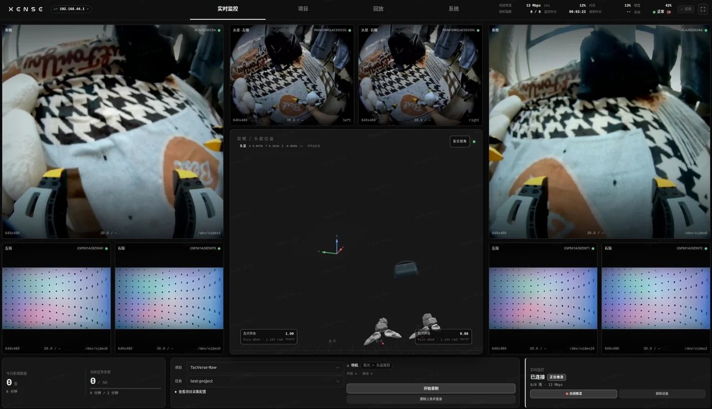

# 背包版：XTac-UMI 数采背包

这一页是背包版的入口：第一次拿到设备照「首次部署清单」走一遍，之后每天开工只看「日常采集速查」。读完能独立完成从开机到导出数据集的一次采集。

## 这一版是什么 {#overview}

- 背包即主机：采集软件 XTac-UMI Collector 跑在背包里，采集、回放与 LeRobot 导出全部在背包自己的控制台里完成；平板、手机或 PC 只当浏览器用，不需要单独的数采主机。
- 箱内：Pico4 Ultra 企业版头显（含手柄与追踪器）×1、XTac-UMI G1 ×2、夹爪连接线 ×2、头显连接线（Pico → Pack）×1、数采背包 ×1、12 V 3 A 适配器 ×1、充电宝 ×1 与 0.3 m 12 V PD 电源线 ×1、平板电脑 ×1；完整清单见[箱内清单与接线](../product/editions.md#kit)，开箱核对见[开箱、接线与供电](unbox-connect.md#unbox)。
- 产出：每条录制一个 MCAP 原始记录，同步记录左右鱼眼、四路视触觉、头显与双追踪器 6DoF 位姿、夹爪开合度；导出按任务做，[`LeRobot 数据集`](projects-export.md#lerobot) 与 [`mcap`](projects-export.md#mcap) 两种格式并列，可下载成压缩包，也可上传到事先配置好的上传后端。
- 操作：夹爪按键开录、停录，指示灯反馈状态，单人可完成整套采集。
- 适合：规模化数采工厂与采集团队；软件闭源交付，支持轻量二次开发。需要接自己的 x86 工作站、完全走 LeRobot 框架的另一种形态见 [PC 版](../pc/index.md)；两种配置的差异见[产品线与配置对比](../product/editions.md)。

录之前先看见：控制台同屏显示六路相机、两侧视触觉与头显位姿，夹爪开合度实时归一化；录制状态、磁盘余量与追踪器丢失都在同一屏上，平板和手机都能看。开录前该逐项确认什么见[实时监控里确认](monitor-record.md#checks)。

产品定位与控制台介绍见[认识数采背包](../product/backpack.md)；[背包接口](unbox-connect.md#ports)、[适配器](unbox-connect.md#adapter)与[充电宝](unbox-connect.md#powerbank)两种接线方式、[机身标签](network.md#label)在各自的操作页里。

## 数采系统组成 {#system}

整套采集在数采背包里完成：各路设备接到背包，背包保存原始记录，导出时再按任务生成数据集。把鼠标移到（手机上点按）任一模块，可以看到它的数据从哪来、到哪去；上方按钮切换三种采集模式。

- **主夹爪**接背包的 `UMI-L` / `UMI-R`：开合度、IMU 与按键经 USB 上报，视触觉与腕部鱼眼按原始画面保存。
- **追踪器**装在夹爪顶部，由**头显**跟踪；头显用一根线以 USB网络接背包，送来位姿，录头显画面的模式下还送来双目或右单目画面。
- **背包**把每条录制存成一个 MCAP 原始记录；按任务导出 LeRobotDataset v3 或 MCAP，下载到本地或上传到远端。控制台用平板、手机或电脑的浏览器打开。

## 每帧记录什么 {#frame}

导出的 LeRobot 数据集里，每一行由第 t-1 帧的**观测**和第 t 帧的**动作**组成。把鼠标移到（手机上点按）任一数据项、来源或落盘位置，可以看到它从哪来、存到哪；按钮切换三种采集模式。

- 观测取第 t-1 帧、动作取第 t 帧，动作领先观测一步；每集第一帧没有上一帧可配对，因此少 1 帧。
- 位姿 `*_tcp.*` 与 `head.*` 都是 9 维：位置 x、y、z 加 6-D 旋转，世界系为 X 前 / Y 左 / Z 上。
- 三种模式的维数：「双爪」观测状态与动作各 20 维、6 路画面；「双爪 + 头显双目」各 29 维、8 路画面；「双爪 + 头显右单目」各 29 维、7 路画面（只有 `head_right`）。

导出格式与附带文件见 [LeRobot 数据集](projects-export.md#lerobot)。

## 首次部署清单 {#first-deploy}

开始前读一遍[安全与合规](../product/safety.md)。下面每一步的详细操作在各自的页面里，本页只说做什么、在哪做。

1. 头显配置：把 Pico OS 升到 5.15.5.U 以上并[开启开发者模式、把灭屏与休眠设为永不](../common/pico4.md#pico-system)；两只追踪器按「左奇右偶」[配对到头显](../common/pico4.md#pico-tracker-bind)并切到独立追踪模式；[安装 XTac-UMI XR](../common/pico4.md#pico-app)。
2. 接线与供电：[顺序固定](unbox-connect.md#order)夹爪 → 头显 → 背包上电，左右夹爪分别接 UMI-L / UMI-R，头显用头显连接线（Pico → Pack）接背包 PICO 口。供电二选一：[适配器供电](unbox-connect.md#adapter)时适配器接背包 DC 口；[充电宝供电](unbox-connect.md#powerbank)时充电宝经 0.3 m 12 V PD 电源线接背包 DC 口。夹爪的连接与供电要求见[夹爪连接与序列号](../common/gripper.md#power)。
3. 连上背包：用数据线把平板接到背包的 `HOST1` 或 `HOST2` 口，背包会自动在平板上打开控制台，见[平板插 USB](network.md#tablet)。没有平板时可用[背包热点](network.md#softap)。
4. [头显连背包](unbox-connect.md#pico-link)：戴上头显打开 XTac-UMI XR，勾选「USB网络」点连接，背包会自动在 USB 链路上建网（地址 `192.168.58.1`），不用手填。界面与连接状态见 [Pico4 头显与追踪器](../common/pico4.md#pico-toolkit-ui)。
5. 定[采集模式](system.md#capture-mode)：采集模式是项目的属性，在[新建项目](monitor-record.md#project-task)时按实际接了什么选「双爪」「双爪 + 头显双目」「双爪 + 头显右单目」之一，建完不可更改；系统页只做只读展示。每种模式都需要头显与追踪器提供位姿。
6. 可选：控制台 → 系统 → [上传配置](system.md#upload)，新建一档上传后端并填好凭据（获取步骤在同一节）。新建项目时可以绑定它，之后该项目导出选「上传到远端」默认走这档配置；凭据只在这一页填一次，导出窗口里不再重复填。

## 日常采集速查 {#daily}

每天开工照[一页速通](quickstart.md)走一遍：接线上电 → 平板插 USB 打开控制台 → 连接头显 → 选项目与任务 → 开录前检查 → 按键录制 → 导出。

采集全程不要重启 XTac-UMI XR：重启会重设世界坐标系原点，同一数据集内的位姿参考系就不一致了，见[启动与坐标系对齐](../common/pico4.md#pico-frame)。

## 录完之后 {#after}

- 回放与检查：控制台 → 项目，层级为 项目 → 任务 → 录制条目，每条显示时长、帧数、数据量与质量标注。点「回放」在网页里[流式回放](playback.md)，可拖进度条；有问题的条目就地[删除](projects-export.md#delete)，会连同其 MCAP 与 H264 导出文件一起删，不可恢复。
- 导出：选定任务点「导出」打开[导出对话框](projects-export.md#export)，先自动预检数据完整性——未通过时逐条列出阻塞项，删掉或修好后重新预检；通过后先选「导出去向」，再选「导出格式」：
    - 去向二选一：「下载到设备」先在背包上打包，完成后用按钮把[压缩包](projects-export.md#export)取回；「上传到远端」从下拉里选事先配置好的[上传后端](system.md#upload)，跟随项目默认、临时改用另一档或就地新建。
    - 格式二选一：[`LeRobot 数据集`](projects-export.md#lerobot) 与 [`mcap`](projects-export.md#mcap) 是平级的，同一个任务可以先出一种、之后再出另一种，两份产物同时保留；项目可设默认格式，单次导出能临时改。
    - 上传完成后**默认保留本地文件**，要腾空间就在上传前勾选清理，或之后随时[归档](projects-export.md#archive)；归档只留记录、清掉原始文件，清理时会保护还没用过的格式。

## 常见问题 {#faq}

- [连不上控制台](troubleshooting.md#connect)：先用平板插 USB 进入；走热点时确认设备支持 5 GHz、连的是这台背包的热点、地址带了 `http://` 前缀；偶发无响应时给背包重新上电。
- [追踪器丢失](troubleshooting.md#tracker)：追踪精度不准或头显断开时，XTac-UMI XR 与监控页都会有图标提示；先看追踪器是否亮蓝灯、[配对](../common/pico4.md#pico-tracker-bind)是否正确。
- [开录被拒](troubleshooting.md#record)：录制盘已用达到 80% 时拒绝开始录制，提示「录制盘已用 N%（剩余 …），达到 80% 上限，已拒绝开录」；先把已采数据上传或下载走，再[归档](projects-export.md#archive)腾空间，或删掉不要的条目。
- [回放与实时预览不能同时进行](playback.md)：回放被拒时，先关掉其他标签页或其他设备上打开的实时监控。
- 录制进行中，切换项目 / 任务、夹爪标定、固件升级、系统更新等操作都会被拒绝，先停止录制；采集模式随项目固定，任何时候都不能切换。
- 界面语言：控制台按浏览器语言自动显示中文或英文（其他语言显示英文）；在系统页或手机版设置里可以临时切换「界面语言」，刷新页面后回到「跟随浏览器」。设备的语音播报语言跟随界面语言，见[语音播报](gripper.md#voice-cues)。

## 版本 {#version}

本页按 XTac-UMI Collector 0.4.3 编写，各组件的[版本基线](versions.md#baseline)以控制台系统页显示为准，升级见[升级与 OTA](update.md)；文中的序列号只是示例。
