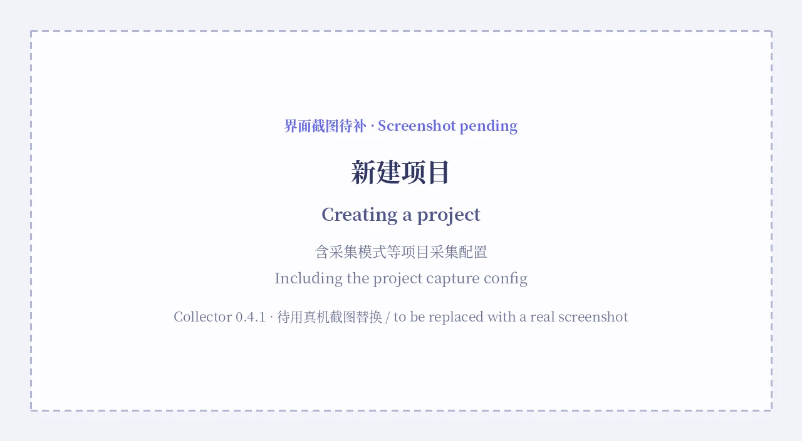
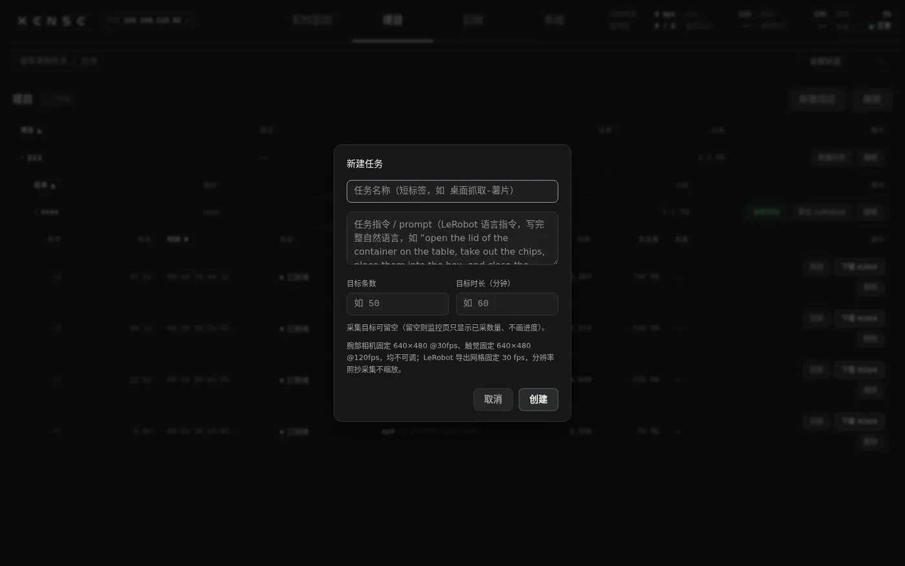
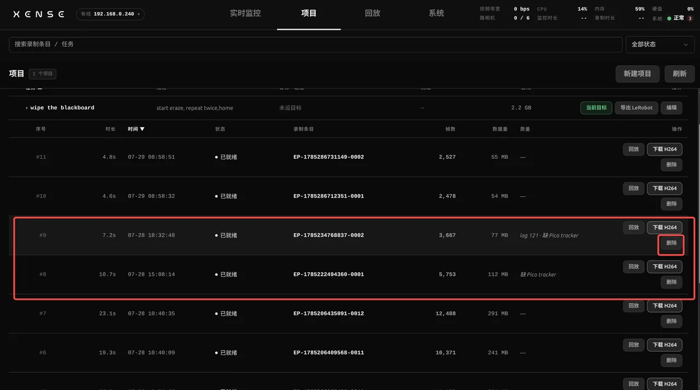
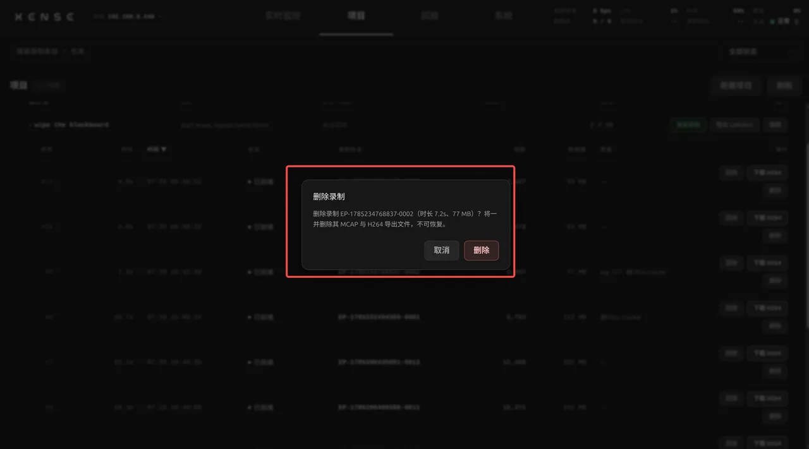

# 实时监控与录制

本页讲 XTac-UMI Collector 控制台(下称控制台)的「实时监控」页:开录前要在这一屏上确认什么、项目与任务怎么选、录制怎么开始与停止、录坏的一条怎么当场删掉。夹爪按键的手势、灯语与语音播报的正文都在[夹爪按键与指示灯](../common/gripper.md#buttons-leds)一处,本页只链接。

页面自上而下分三层:顶栏是设备状态(视频带宽、路相机、监控时长、录制时长、CPU、内存、硬盘、系统);中间左右两列各是一只夹爪的鱼眼与左指 / 右指两路视触觉,中列是头显双目与「双臂 / 头部位姿」3D 视图,视图下方两张卡是左右爪开合角度;底部左起是「当前任务条数」卡、项目 / 任务选择与录制按钮、实时监控连接卡(「关闭推流」「刷新设备」)。

## 开录前在控制台确认 {#checks}

每次开录前把下面五项过一遍,任何一项不对都不要开录:

| 看什么 | 期望 | 不对时 |
|---|---|---|
| 六路画面 | 顶栏「路相机」与采集模式一致(双爪 6 / 6,带头显 8 / 8),每格都有画面。两路鱼眼清晰不糊;视触觉是差分渲染,按压时接触区域显出彩色形变场,指衬边缘常态可见轻微纹理属正常 | 鱼眼糊影多半是旋钮被误碰、焦距变了,先拧回清晰再录;路数不对去[系统 → 采集模式](system.md#capture-mode)核对;某一路一直黑点「刷新设备」 |
| 头显位姿与追踪器状态 | 动一动夹爪与头显,3D 模型跟随;位姿卡右上角指示灯绿 | 「位姿在线」但模型不动,多半是 Pico 里的追踪器 APP 没真正开起来,长按追踪器电源键重新激活并重启 Pico 内 APP;灯由绿转黄并提示,是追踪器出了头显视野(设备只报方向、没有位置),把追踪器转回视野内;左右追踪器的归属按左单右双核对序列号,见 [Pico4 追踪器序列号](../common/pico4.md#pico-tracker-sn) |
| 两爪开合度 | 位姿视图下方两张卡各显示弧度、角度与归一化百分比:张到底约 100 %,闭合约 0 %(闭合时约 0.02 rad,再加一点力可以到 0) | 张到底顶不到 100 % 或闭合回不到 0,去[系统 → 夹爪配置](system.md#gripper)重标 |
| 磁盘余量 | 顶栏「硬盘」占用低于 80 % | 达到 80 % 会直接拒绝开录,先把已采数据[导出后归档](projects-export.md#archive)或删掉不要的录制 |
| 录制状态 | 项目 / 任务卡右上的状态行显示「待机」,后面的徽章是当前采集模式(如「双爪 + 头显」);「开始录制」按钮可点 | 徽章带「Pico 未就绪」、按钮灰掉时,状态行下面会写原因(未选项目 / 任务、Pico 位姿 / 双目 / 时钟同步未就绪等),先处理原因 |

头显与视触觉的预览是减半分辨率推流的,看起来比录制粗一些是正常的,录进 MCAP 的仍是全分辨率。平板弱网时某一路断掉只会那一路显示「网络抖动,等待恢复」并自动重连,其它路不受影响,不用刷新页面;只有一路长时间黑才点「刷新设备」。

## 选项目与任务 {#project-task}

录制条目落在「项目 → 任务」两级之下,监控页底部的两个下拉分别选项目和任务,末项分别是「新建项目...」「新建任务...」,可以就地新建;也可以在[项目页](projects-export.md)新建并把某个任务「设为当前目标」。任务里的采集模式(双爪 / 带头显 / 单爪)不在这里选,在[系统 → 采集模式](system.md#capture-mode)切,并且同一任务从头到尾保持同一模式。

新建项目只填名称。如果已在[系统 → 上传配置](system.md#upload)配好上传后端,可以在这里给项目绑定一个,之后该项目发布时默认用它;不绑定就在发布时再选。

新建任务的字段:

| 字段 | 填什么 |
|---|---|
| 任务名称 | 短标签,如「桌面抓取-薯片」 |
| 任务指令 / prompt(必填) | LeRobot 语言指令,写完整的自然语言,如 *open the lid of the container on the table, take out the chips, place them into the box, and close the lid* |
| 目标条数 | 这个任务要采多少条,可留空 |
| 目标时长(分钟) | 这个任务要采多长,可留空 |

目标留空时监控页只显示已采数量、不画进度。填了目标条数就是硬门槛:录满即拒绝开录,控制台按钮和夹爪按键都会被挡。

这道拦截按**累计采集**计算(0.3.14 起):「已就绪」与「已上传」的条目都算进去,归档只删本地文件、不改状态,所以**上传与归档都腾不出名额**。录满后要继续采只有两条路 —— 提高任务的目标条数,或删除不该计入目标的录制。「删除上条并重录」净条数不变,不受影响。

左下角「当前任务条数」卡显示当前任务已采条数、时长与对目标的进度,与上面那道拦截同一口径。已删除的不计入,上传与归档都不会让进度倒退;用夹爪按键或另一台平板开 / 停录,这张卡与项目页的列表也会即时更新。

腕部相机固定 640×480 @ 30 fps、触觉固定 640×480 @ 120 fps,都不可调;LeRobot 导出固定 30 fps,分辨率照抄采集不缩放。

## 录制 {#record}

日常以夹爪按键为主:右爪长按开始,左爪长按停止,由设备端状态机接管,不需要浏览器在线。手势表、灯语表与删除确认的按法见[夹爪按键与指示灯](../common/gripper.md#buttons),绑定爪位与时序是全机队固定值,现场不可调。控制台底部的「开始录制 / 结束录制」按钮做同一件事,给没拿夹爪的人用;想给这两个按钮绑浏览器快捷键,去[设置 › 采集设置 › 录制快捷键](system.md#keybinding)。

### 现场反馈:灯语与语音 {#feedback}

采集时双手都在夹爪上、眼睛盯着现场,不一定看得见平板。设备因此给两条不看屏幕也成立的反馈,内容互补:

- **灯语**:夹爪上的指示灯,按常亮 / 呼吸 / 闪 / 脉冲 / 快闪区分状态,要抬头看一眼爪子。含义见[指示灯](../common/gripper.md#leds)。
- **语音播报**:设备喇叭直接出声,不需要平板在旁边,也不受浏览器影响。四个时机:开始录制、一条录完(提示复位现场、准备下一条)、录制中出现严重问题、录制中夹爪或头显掉线。句子见[语音播报](../common/gripper.md#voice-cues)。

播报的内容与时机是固定值,现场不可更改,保证同批设备行为一致;能改的只有开关与音量(0–100 滑块),开关旁可逐句试听、确认喇叭是否正常,设置重启后保留,位置在[设置 › 采集设置](system.md#voice)。

### 开录门槛 {#record-gates}

无论从按键还是按钮开录,设备都按这个顺序检查,第一项不过就停下:

1. 磁盘占用低于 80 %;
2. 已选项目与任务,且该任务的累计采集条数未达目标条数;
3. 夹爪 MCU 在线;
4. 带头显的模式:Pico 位姿、双目与时钟同步就绪;
5. 追踪器处于「视线内正常追踪」:静止 5 秒以上或移出视野时拒绝开录(录制中途短暂静止不会中断,也不计入质检,静止时位置仍然准确)。

被拒时控制台弹「无法开始录制」窗口写明原因,按键开录被拒也弹同一个窗口;人不在平板旁就听语音、看灯语。录满时的原话是「任务「…」已达到累计采集目标(N/M),已拒绝开始录制。如需继续采集,请提高任务的目标条数,或删除不应计入目标的录制」。

### 录制中 {#record-live}

状态行变成「录制中」加走表时长,采集模式徽章仍在;顶栏「录制时长」同步走表。录制卡上用红字实时累计三项:「坏帧 N」(送达但内容残缺)、「掉线 N」(设备级断开、帧根本没送达)、「tracker 出视野 X s」(次数多于一次时带 ×N)。相机全绿时出视野是唯一的线索,看到就该考虑停下重录。录制中不能切采集模式、不能删除条目、不能改任务。

### 停止后 {#record-stop}

左爪长按或点「结束录制」,条目保存进当前任务,灯白闪一下回到待机;条目编号的规则见[项目页](projects-export.md#projects)。

停录瞬间设备做一次质检,下面任一项命中就把这条标为「数据可疑」:夹爪黄脉冲,项目页该条的「质量」列有标记,条目照样保存。

- 录制时长低于 1 s(基本是误触);
- 任一相机通道一帧都没录到,或整条没收到任何视频帧;
- 追踪器追踪失效时长超过本条时长的 20 %(疑似出视野);
- 触觉矫正配方缺失(这条的 LeRobot 导出必失败)。

被标可疑的条目,当场用[删除上一条](#record-delete)删掉重录,比事后在项目页翻要省事。

### 条目状态 {#episode-state}

条目保存后有四档状态,项目页的条目行与手机端卡片都按这四档显示:

| 状态 | 含义 | 还能做什么 |
|---|---|---|
| 已就绪 | 刚录完,原始文件在设备上,没上传过 | 回放、导出(两种格式)、上传、归档、删除 |
| 已上传 | 至少用一种格式上传过,原始文件仍在设备上 | 同上;还能再导出另一种格式 |
| 已归档 | 只剩目录里的记录,原始文件已在归档时清理 | 只剩记录与删除;回放入口置灰,也导不出任何格式 |
| 已丢弃 | 录制中途失败,没形成可用数据 | 删除 |

「已上传」说的是远端有没有副本,「已归档」说的是本地文件还在不在,两件事各占一列。上传完成后**默认不删本地文件**(0.3.10 起的行为变化),要删得在上传前勾自动归档;不勾就随时可以事后手动[归档](projects-export.md#archive)。累计采集条数数的是「已就绪」与「已上传」两档,归档不改变状态、仍然计入,只有「已丢弃」和已删除的不算。

### 删除上一条 {#record-delete}

按键:左爪双击进入删除确认(紫闪,5 秒超时),确认态再双击删除,按法见[夹爪按键与指示灯](../common/gripper.md#buttons)。控制台:点「删除上条并重录」,会删掉当前任务最新一条并立即开始新录制,没有二次确认,录制中不可用。

要删更早的条目,到[项目页](projects-export.md)找到那一行点「删除」,确认框会写出条目编号、时长与大小,并一并删除它的 MCAP 与 H264 文件,不可恢复。

