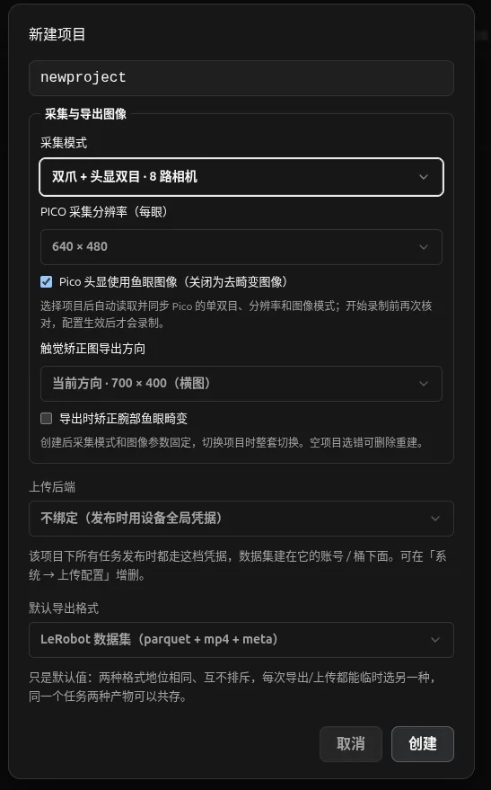
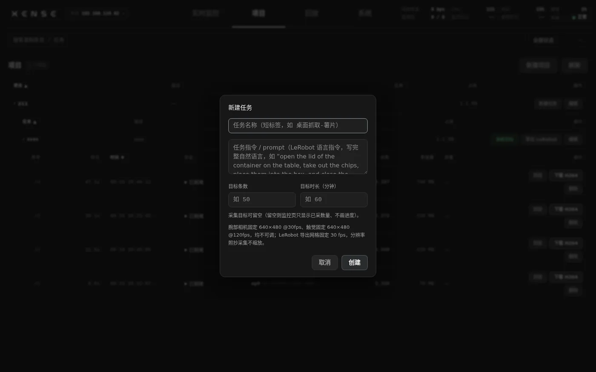
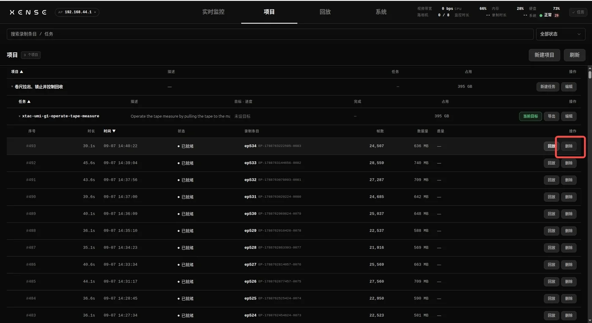
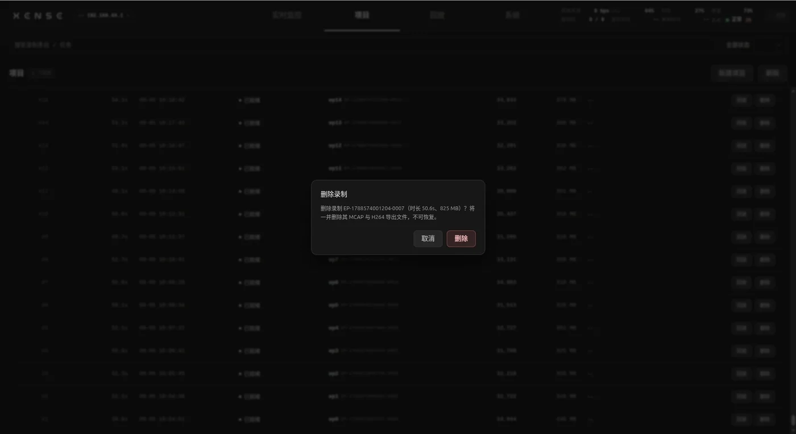

# 实时监控与录制

本页讲 XTac-UMI Collector 控制台（下称控制台）的「实时监控」页。夹爪按键手势、灯语与语音播报详见[夹爪按键与指示灯](gripper.md#buttons-leds)。

- **顶栏**：设备状态（视频带宽、CPU、内存、硬盘、相机路数、监控时长、录制时长、系统）。
- **中间**：两侧各为一只夹爪的鱼眼与左 / 右指视触觉；中列是头显双目、「双臂 / 头部位姿」3D 视图及下方的左右爪开合角度卡。
- **底部**：左起「当前任务条数」卡、项目 / 任务选择与录制按钮、实时监控连接卡（「关闭推流」「刷新设备」）。

## 开录前在控制台确认 {#checks}

开录前逐项确认，任一项不对都不要开录：

| 看什么 | 期望 | 不对时 |
|---|---|---|
| 各路画面 | 顶栏「相机路数」与采集模式一致（「双爪」6 / 6，「双爪 + 头显双目」8 / 8，「双爪 + 头显右单目」7 / 7），每格有画面；鱼眼清晰；视触觉为几何矫正后画面、不叠加差分，按压时接触区随之变化 | 鱼眼糊多半是旋钮被碰跑焦，拧回清晰再录；路数不对去[系统 → 采集模式](system.md#capture-mode)核对；某一路长时间黑才点「刷新设备」 |
| 位姿追踪 | 移动夹爪与头显，3D 模型跟随；位姿卡右上角亮绿灯 | 「位姿在线」但模型不动：多为 Pico 内追踪器 APP 未真正启动，长按追踪器电源键重新激活并重启 Pico 内 APP；灯转黄：追踪器出了头显视野（只报方向、无位置），移回视野内；左右按左单右双核对序列号，见 [Pico4 追踪器序列号](../common/pico4.md#pico-tracker-sn) |
| 两爪开合度 | 位姿视图下方两卡显示弧度、角度与归一化百分比：张到底约 100%，闭合约 0%（约 0.02rad，加点力可到 0） | 张到底不到 100% 或闭合回不到 0，去[系统 → 夹爪配置](system.md#gripper)重标 |
| 磁盘余量 | 顶栏「硬盘」占用低于 80%（录制盘实测），悬停看挂载点、已用、总量与可用空间 | 达到 80% 拒绝开录；把已采数据[导出后归档](projects-export.md#archive)或删掉不要的录制 |
| 录制状态 | 项目 / 任务卡右上状态行显示「待机」，后跟采集模式徽章（如「双爪 + 头显双目」）；「开始录制」可点 | 徽章带「Pico 未就绪」、按钮灰时，状态行下写原因：「Pico 未就绪」与「Tracker 未就绪」分开、可同时出现，后跟具体原因（如未连接或连接超时、位姿数据缺失或超时、左眼 / 右眼视频缺失或超时、时钟同步缺失或超时、Tracker 不在视野内或静止超过 5 秒）；未选项目 / 任务也写明。先处理原因 |

- 预览由背包硬件编码器编码一次、推给所有打开控制台的设备；头显与视触觉预览减半分辨率，比录制粗属正常。录制不走预览链路，MCAP 里是相机原始 MJPEG 帧，全分辨率。
- 平板弱网时只有断的那路显示「网络抖动，等待恢复」并自动重连，其它路不受影响，无需刷新页面。

## 选项目与任务 {#project-task}

录制条目归在「项目 → 任务」两级下。监控页底部两个下拉选项目和任务，末项「新建项目...」「新建任务...」可就地新建；也可在[项目页](projects-export.md)新建并把任务「设为当前目标」。

新建项目时一并定下**采集配置**，**建完冻结**，换参数要新建项目；系统页只读展示，各项含义见[当前项目采集配置](system.md#capture-mode)。

- **采集模式**：「双爪」「双爪 + 头显双目」「双爪 + 头显右单目」三选一。
- **PICO 每眼分辨率**：640 × 480 或 1024 × 768，仅录头显画面的模式要选。
- **PICO 图像源**：鱼眼图像 / 去畸变图像。
- **触觉矫正图导出方向**：默认 700 × 400 横图，可再逆时针 90° 得 400 × 700。
- **腕部鱼眼**：导出时是否矫正畸变。
- **上传后端**：可绑定[系统 → 上传配置](system.md#upload)里配好的一个作为该项目上传默认，不绑定就上传时再选。

{ width="360" }

新建任务的字段：

| 字段 | 填什么 |
|---|---|
| 任务名称 | 短标签，只能用英文小写字母、数字和连字符，如 `pick-chips` |
| 任务指令 / prompt | 必填。LeRobot 语言指令，写完整的自然语言，如 *open the lid of the container on the table, take out the chips, place them into the box, and close the lid* |
| 目标条数 | 这个任务要采多少条，可留空 |
| 目标时长（分钟） | 这个任务要采多长，可留空 |

- 目标留空只显示已采数量，不画进度。
- **目标条数是硬门槛**：录满即拒绝开录，控制台按钮和夹爪按键都被挡。
- **按累计采集计**：「已就绪」「已上传」都算；归档只删本地文件、不改状态，所以**上传与归档都腾不出名额**，进度也不倒退。已删除的不算；「删除上条并重录」净条数不变。
- **录满后继续采**：提高目标条数，或删除不该计入的录制。
- **「当前任务条数」卡**：左下角，显示已采条数、时长与目标进度，口径同上；按键或其他平板开 / 停录时与项目页列表同步。

相机参数与矫正：

- **腕部相机与触觉**：分别固定 640×480 @ 30fps 与 640×480 @ 120fps，不可调。
- **矫正都在导出时做**：触觉按所选方向做几何矫正；腕部鱼眼若开了矫正，用开录时冻结进这条录制的标定参数。
- **LeRobot 导出**：固定 30fps。

## 录制 {#record}

- **夹爪按键（日常）**：右爪长按开始，左爪长按停止，由设备端状态机处理，无需浏览器在线；绑定爪位与时序是全机队固定值，现场不可调。手势、灯语与删除确认按法见[夹爪按键与指示灯](gripper.md#buttons)。
- **控制台按钮**：「开始录制 / 结束录制」作用相同，给没拿夹爪的人用；绑浏览器快捷键见 系统 → [采集设置 › 录制快捷键](system.md#keybinding)。

### 现场反馈：灯语与语音 {#feedback}

双手在夹爪上、眼盯现场时，靠两条互补反馈：

- **灯语**：夹爪指示灯按常亮 / 呼吸 / 闪 / 脉冲 / 快闪区分状态，需抬头看，含义见[指示灯](gripper.md#leds)。
- **语音播报**：句子见[语音播报](gripper.md#voice-cues)。
    - 默认从头显播放，头显未连接或不支持时回落到背包喇叭；不需要平板，不受浏览器影响。
    - 六句：开始录制、一条录完（提示复位现场、准备下一条）、录制中出现严重问题、夹爪 / 头显 / Tracker 掉线（分三句，各查不同设备）。
    - 另有一声 subtask 标记提示音。

- **固定与可调**：内容与时机固定、现场不可改，保证同批设备一致；可调开关、音量（0–100 滑块）与播报语言（中文 / 英文），开关旁可逐句试听，显示从哪里出声及原因。见 系统 → [采集设置](system.md#voice)。
- **播报语言**：页面加载或切换[界面语言](index.md#faq)时跟随界面语言；单独选的保持到下次加载或切换为止。

### 开录门槛 {#record-gates}

按键或按钮开录都按此顺序检查，一项不过即停：

1. 磁盘占用低于 80%；
2. 已选项目与任务，且任务累计采集条数未达目标；
3. 夹爪 MCU 在线；
4. Pico 就绪：头显已连接，位姿与时钟同步正常；录头显画面的模式还要所选眼的视频正常；
5. Tracker 就绪：追踪器已连接、处于「视线内正常追踪」，静止 5 秒以上或移出视野拒绝开录（录制中短暂静止不中断、不计入质检，静止时位置仍准确）；
6. 头显画面参数与项目对得上：选中项目或头显重连后，设备自动重读单目 / 双目、分辨率与图像源，开录前再核对。**没收到确认、核对超时，或期间头显断过线、参数变过，都拒绝开录**，提示写明是哪一种；
7. 头显画面时钟正常：某只眼的视频时间比接收时间超前超过 1 秒，提示「头显…眼视频时间同步异常」并拒绝开录。问题在头显应用的相机时钟与同步时钟，不在背包。

- **被拒时**：弹「无法开始录制」窗口写明原因（按键开录同样）；人不在平板旁就听语音、看灯语。
- **录满提示**：「任务「…」已达到累计采集目标（N/M），已拒绝开始录制。如需继续采集，请提高任务的目标条数，或删除不应计入目标的录制」。

### 录制中 {#record-live}

- **状态行**：变成「录制中」加走表时长，采集模式徽章仍在；顶栏「录制时长」同步走表。
- **红字累计**：录制卡实时累计「坏帧 N」（送达但内容残缺）、「掉线 N」（设备级断开、帧没送达）、「tracker 出视野 X s」（多于一次带 ×N）。相机全绿时出视野是唯一线索，看到就考虑停下重录。
- 录制中不能删条目、改任务；采集模式任何时候都不能切。

### 录制中头显断联 {#pico-disconnect}

- **触发**：PICO 口的线拔掉或松动、头显断开，或位姿 / 所需头显画面连续约 3 秒没更新。
- **设备动作**：立即停录，安全收尾后标为失败。
- **控制台提示**：弹「Pico 异常：录制已中断」，写明断联类别（如「Pico 已断开连接」「Pico tracker 已断开连接」「Pico 位姿数据连续 3 秒未更新」）。同一次断联只弹一次，刷新或重开页面不重复；手机端也显示失败原因。
- **语音与灯**：播「pico连接失败」或「Tracker 连接失败」，夹爪灯按录制失败亮黄。
- **失败的录制**：保留供排查，不计入累计条数，不进正常导出与上传。
- **恢复后不会自动续录**：数据恢复、收尾完成后黄灯自动解除并提示「Pico 已恢复，可在设备就绪后重新开始录制」，再手动开录。

### 停止后 {#record-stop}

左爪长按或点「结束录制」，条目存进当前任务，灯白闪一下回待机；编号规则见[项目页](projects-export.md#projects)。

停录时自动质检，任一项命中即标「数据可疑」（夹爪黄脉冲，项目页「质量」列有标记，条目照样保存）：

- 录制时长低于 1s（基本是误触）；
- 任一相机通道一帧都没录到，或整条没收到任何视频帧；
- 追踪器追踪失效时长超过本条时长的 20%（疑似出视野）；
- 触觉矫正配方缺失（这条的 LeRobot 导出必失败）。

可疑条目最好当场[删除上一条](#record-delete)重录。

### 条目状态 {#episode-state}

项目页条目行与手机端卡片按四档状态显示：

| 状态 | 含义 | 还能做什么 |
|---|---|---|
| 已就绪 | 刚录完，原始文件在设备上，没上传过 | 回放、导出、上传、归档、删除 |
| 已上传 | 至少用一种格式上传过，原始文件仍在设备上 | 同上；还能再导出另一种格式 |
| 已归档 | 只剩目录里的记录，原始文件已在归档时清理 | 只剩记录与删除；回放入口置灰，也导不出任何格式 |
| 已丢弃 | 录制中途失败（如[头显断联](#pico-disconnect)、夹爪掉线，或录制中断电 / 系统重启），条目行写明失败原因；数据量按实际留下的文件显示，保留供排查 | 删除 |

- 「已上传」看远端有无副本，「已归档」看本地文件在不在，各占一列。
- **本地文件**：上传完成**默认不删**，要删得上传前勾自动归档，或事后手动[归档](projects-export.md#archive)。

### 删除上一条 {#record-delete}

- **按键**：左爪双击进删除确认（紫闪，5 秒超时），确认态再双击删除，按法见[夹爪按键与指示灯](gripper.md#buttons)。
- **控制台**：「删除上条并重录」删掉当前任务最新一条并立即开录，无二次确认，录制中不可用。
- **更早的条目**：在[项目页](projects-export.md)那一行点「删除」。确认框列出编号、时长与大小，连同 MCAP 与 H264 导出文件一并删除，不可恢复。

