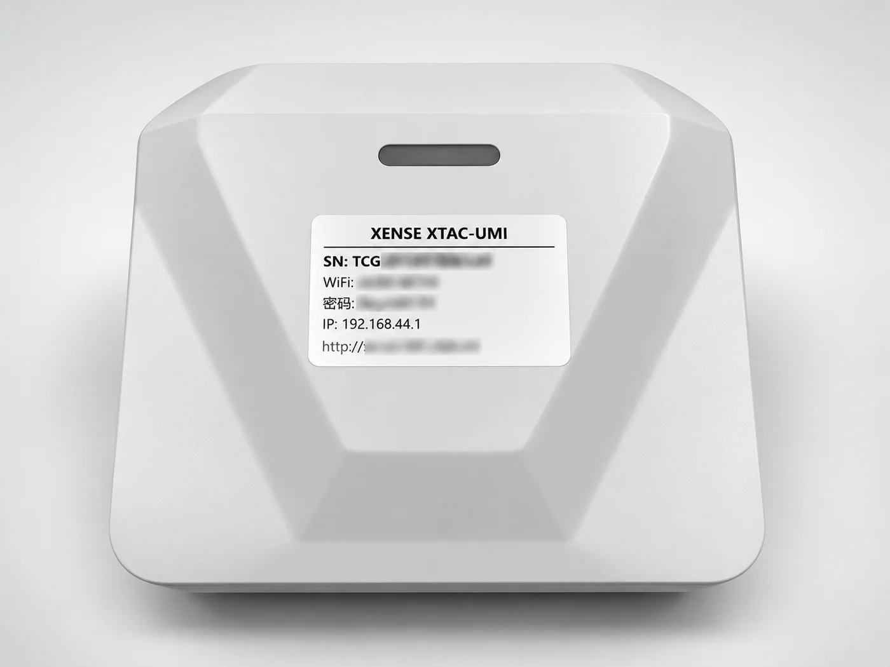
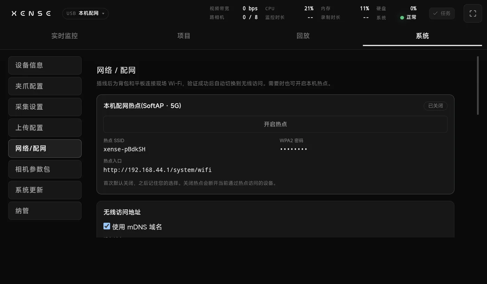
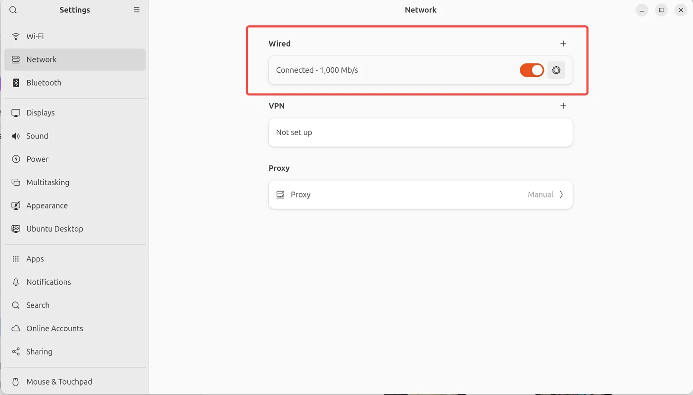
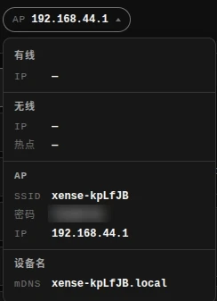

# Network and console access

This page covers how to open the XTac-UMI Collector console (below, "the console"). **The recommended way is to plug the bundled tablet into USB**: the backpack opens the console on the tablet by itself, and can put both the backpack and the tablet on the site WiFi in one step.

## Identify the unit by its label, not by IP {#label}

{ width="420" }

The body label carries the backpack's SN, hotspot name and password, and device name. The backpack's IP changes and differs from unit to unit, so never write an IP into a procedure; identify a unit by its SN (shown on the console's System → [Device info](system.md#device-info) page) and its hotspot name.

## Recommended: the tablet over USB {#tablet}

Connect the tablet to the backpack's front `HOST1` or `HOST2` port with a data cable. Once the tablet is unlocked, the backpack opens the console's System → Network page on it by itself; no WiFi and no address to type.

The bundled tablet is authorised on the production line before shipping, so it works as soon as you plug it in. After a factory reset or revoking USB debugging authorisations, plugging in no longer opens the console; re-authorise it as described in [Troubleshooting](troubleshooting.md#tablet-adb).

### Putting the backpack on WiFi from the tablet {#tablet-wifi}

On this page, pick the site's 5 GHz WiFi and enter its password: the backpack and the tablet **join together**. Once the backpack confirms the tablet is on the same network, the tablet switches to the backpack's WiFi address and you can unplug the USB cable.

## The backpack's three network interfaces {#interfaces}

| Interface | What it is | Use |
|---|---|---|
| Wired | Ethernet to a router, IP by DHCP, static possible | Labs and fixed workstations; the steadiest bandwidth |
| Wireless | The backpack joins the site's 5 GHz WiFi | Several people on the same network |
| Hotspot | The backpack's own 5 GHz hotspot, fixed address `192.168.44.1` | The way in when there is no tablet and no site network |

## The backpack hotspot {#softap}

Without a tablet, use the backpack hotspot to reach the console:

1. Join the hotspot from a phone, tablet or computer (name and password on the body label).
2. Open `http://192.168.44.1` in a browser.

!!! note "On a new unit the hotspot is off at first boot"
    Use "Turn on hotspot" in System → [Network](system.md#wifi); the device remembers the choice. You can reach the console with the [tablet over USB](#tablet) to turn it on. The hotspot is 5 GHz only; 2.4 GHz-only devices will not see it.

- On iOS / Safari, type the full `http://` prefix.
- With several backpacks on site, check the hotspot name against the body label before joining.
- Turn off auto-join for other saved networks on the phone or tablet so it does not hop away mid-collection.

## Device name {#mdns}

On the same network as the backpack you can use its device name instead of an IP: `http://xense-<name>.local` (see the body label). The name can be changed or turned off in System → [Network](system.md#wifi). Windows and some Android phones cannot open `.local` names; use the IP from the [network drop-down](#status) instead.

## Joining a site network {#lan}

### Wired {#wired}

Run the backpack's Ethernet port to a router LAN port and it works as soon as it is plugged in; a computer on the same router uses the wired IP shown in the [network drop-down](#status) or the device name. On Ubuntu, remember to tick Wired in the system settings:

{ width="480" }

Set a static IP only when the site has no DHCP (backpack cabled straight to a computer) or IT requires a fixed address, see System → [Wired IP](system.md#wifi-wired).

### Site WiFi {#site-wifi}

The easiest way is [WiFi setup from the tablet over USB](#tablet-wifi), which joins the backpack and the tablet together. You can also set up the backpack alone in the console's System → [Joining the site WiFi](system.md#wifi-site). The backpack only joins 5 GHz WiFi.

## Checking the current network state {#status}

The IP drop-down at the left of the console's top bar gathers every way into this unit: the wired IP, the wireless IP and the hotspot it is joined to, and its own hotspot's SSID / password / gateway, plus the mDNS device name. Collapsed it shows only "the one address you should use to reach it right now" (the first available of wired > wireless > hotspot), and expanding it shows them all. When the network environment has changed and you are not sure which address to use, look here first.

{ width="520" }

## Choosing a method by scenario {#choose}

| Scenario | Recommended method |
|---|---|
| Everyday collection with the bundled tablet | [Plug the tablet into USB](#tablet); the backpack opens the console for you |
| Lab or fixed workstation with your own router | [Wired](#wired) to a router LAN port, then use the address in the [network drop-down](#status) |
| Customer site, uncontrolled network | [Tablet over USB](#tablet), or turn on the [hotspot](#softap) |
| Site has 5 GHz WiFi and several people need access | Use the tablet to [put the backpack on the site WiFi](#site-wifi); PCs on the same network then reach it directly |
| Backpack wired directly to a laptop, no router | A [static IP](#wired) on the same subnet at each end |
| Nothing works at all | Plug the tablet into USB to check the network in the console; if that fails, work through [Troubleshooting](troubleshooting.md) |

## Advanced diagnosis: handled by technical support {#ssh}

The day-to-day network state and connection operations are all done in the console: every address currently available for reaching this unit is in the top bar's [network drop-down](#status), and the wired address, the gateway, connection states such as "no cable", joining the site WiFi and changing the wired IP are all in System → [Network](system.md#wifi).

The device back end is for technical support to diagnose with. **Do not log in to the back end or change the system configuration yourself**: changes there are outside what the console can show you, and a bad configuration can cost you even the hotspot way in.

When you have worked through this page's access methods and [Troubleshooting](troubleshooting.md) and still cannot connect, hand these to technical support rather than going into the back end yourself:

- The SN on the body label, and which way in you were using (hotspot / device name / wired IP);
- The addresses shown in the top bar's [network drop-down](#status), and the wired state and current internet connection on the System → [Network](system.md#wifi) page;
- The exact text of the error on screen.
