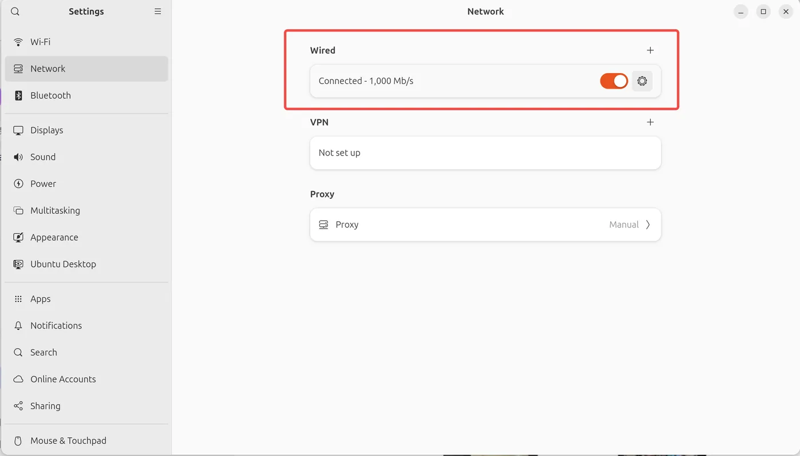
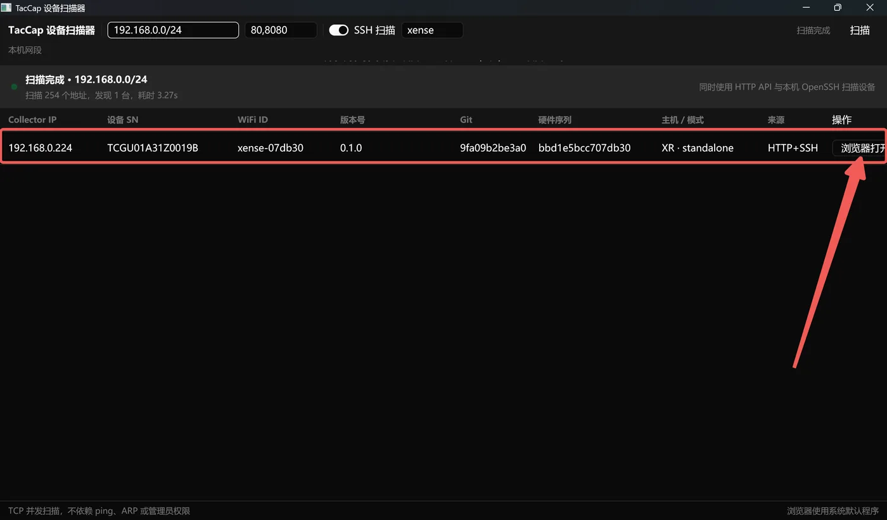
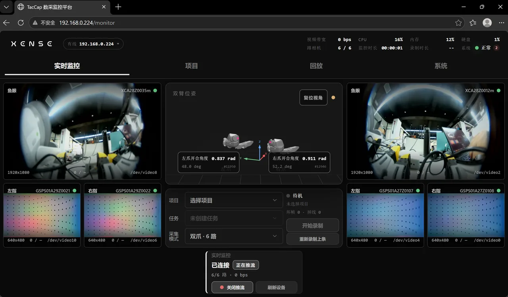
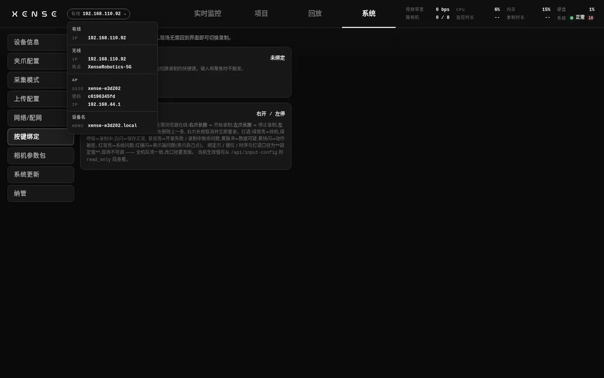

# 网络与控制台入口

本页解决"怎么打开控制台":背包热点、mDNS 设备名、局域网 IP 三种入口,以及把背包接进现场 WiFi 或配有线 IP。读完在任何网络环境下都能打开 XTac-UMI Collector 控制台(下称控制台)。

## 认机看标签,不记 IP {#label}

{ width="520" }

机身标签印着这台设备的全部入口:SN、热点名 `xense-<序列号后 6 位>`、热点密码、热点 IP `192.168.44.1`、设备名 `http://xense-<序列号后 6 位>.local`。背包的有线 IP 走 DHCP,会变且每台不同,不要把 IP 写进任何流程;认机用 SN(控制台 系统 → [设备信息](system.md#device-info)可查)、热点名与设备名。文中 `xense-e3d202` 这类序列号只是示例。

## 背包的三个网络口 {#interfaces}

| 网络口 | 是什么 | 地址 | 用途 |
|---|---|---|---|
| 有线 `eth0` | 网口接路由器 | DHCP 自动获取,可改静态 | 实验室 / 固定工位的主力连接,带宽最稳 |
| 无线 `wlan0` | 背包作为客户端连现场 WiFi | 现场路由器分配 | 不方便拉网线时接入现场网络 |
| 热点 `ap0` | 背包自己常开的 WiFi 热点 | 网关固定 `192.168.44.1` | 兜底入口,不依赖现场网络 |

三个口同时工作:插着网线、连着现场 WiFi 时,热点仍然开着。无论现场网络怎么变,连上热点访问 `192.168.44.1` 永远能打开控制台。控制台跑在 80 端口,地址不用带端口号。

## 方式一:背包热点 {#softap}

每台背包常开一个自己的热点,SSID 即身份。在客户现场等不可控网络(组播被掐、客户端隔离)下它是主力入口,全程不碰现场网络,不用向现场 IT 申请权限。

1. 手机、平板或电脑连热点 `xense-<序列号后 6 位>`(如 `xense-e3d202`),密码见机身标签或控制台顶栏的[网络下拉](#status)。
2. 浏览器打开 `http://192.168.44.1`,或 `http://xense-<序列号后 6 位>.local`。

- **iOS / Safari 必须敲全 `http://` 前缀**(如 `http://xense-e3d202.local`):只输设备名会被 Safari 当成搜索词丢给搜索引擎,现象像「打不开」,其实没发起访问。
- 部分安卓机型打不开 `.local` 设备名,直接用 `http://192.168.44.1`。
- 现场多台背包的热点前缀都是 `xense-`,连之前核对后 6 位与目标机身标签一致,别连到隔壁那台。
- 把手机 / 平板上其他已保存网络的「自动连接」关掉,否则系统会在采集中自动跳到信号更好的网络,控制台断连。

!!! warning "热点只有 5 GHz"
    连接的手机 / 平板 / 电脑要支持 5 GHz WiFi,只支持 2.4 GHz 的设备搜不到这个热点。

## 方式二:mDNS 设备名 {#mdns}

与背包同网段时(同一路由器下,或连着它的热点),直接用设备名访问,免记 IP:

```
http://xense-<序列号后 6 位>.local
```

macOS、iOS 与大部分 Linux 开箱即用。Windows 对 mDNS 解析支持不稳定,打不开属已知环境差异:改用[设备扫描器](#scanner)扫 IP,或走热点入口 `http://192.168.44.1`;排查见[故障排查](troubleshooting.md)。

## 方式三:接入现场网络 {#lan}

### 有线 {#wired}

背包网口接路由器 LAN 口,出厂默认 DHCP 自动获取,插上即用。PC 接同一台路由器,浏览器打开背包 IP(用[扫描器](#scanner)找)或设备名;接线拓扑见[固定工位的布置](unbox-connect.md#desk)。Ubuntu 的 PC 记得在系统设置里勾选 Wired:

{ width="480" }

只有两种情况才配静态 IP:现场没有 DHCP(背包与电脑网线直连、接无 DHCP 的交换机),或现场 IT 要求固定地址。怎么配、改完为什么可能把自己踢下线,见 系统 → [有线 IP](system.md#wifi-wired)。

### 现场 WiFi {#site-wifi}

背包能作为客户端连上现场 WiFi,之后同网段的电脑直接访问它;适合现场有 5 GHz WiFi、多人同时访问的场景,只有一台平板、走热点就够时不需要配。推荐先连热点、再在控制台里配网,全程不需要背包先有网;步骤与「只连 5 GHz」的原因见 系统 → [连现场 WiFi](system.md#wifi-site)。

## 局域网里找 IP:Windows 设备扫描器 {#scanner}

背包与电脑接同一台路由器时,Windows 端用 `taccap-device-scanner.exe` 找 IP。启动后自动扫描本机所在网段,也可手动输入网段(如 `192.168.0.0/24`);默认探测 80 与 8080 端口,可同时用 OpenSSH 探测;TCP 并发扫描,不依赖 ping、ARP,不需要管理员权限。

扫到的每台背包列出 IP、设备 SN、WiFi ID、版本号、硬件序列与运行模式,点「浏览器打开」直达控制台:





多台背包同网时会全部列出,按 SN / WiFi ID 对照机身标签确认是哪台,不要凭 IP 记忆。

## 核对当前网络状态 {#status}

控制台顶栏左侧的 IP 下拉汇总本机全部入口:有线 IP、无线 IP 与所连热点、自身热点的 SSID / 密码 / 网关、mDNS 设备名。折叠态只显示一条「此刻最该用来连它的地址」(按 有线 > 无线 > 热点 取第一个可用的),点开可见全部。换了网络环境、不确定该用哪个地址时先看这里。

{ width="520" }

## 按场景选接入方式 {#choose}

| 场景 | 推荐方式 |
|---|---|
| 实验室 / 固定工位,自备路由器 | [有线](#wired)接路由器 LAN 口 + [扫描器](#scanner)找 IP |
| 客户现场,网络不可控 | [热点](#softap) + `http://192.168.44.1`,全程不碰现场网络 |
| 现场有 5 GHz WiFi,多人同时访问 | 先走热点把背包[配上现场 WiFi](#site-wifi),之后同网电脑直接访问 |
| 背包与笔记本网线直连,无路由器 | 两侧各配同网段[静态 IP](#wired) |
| 怎么都连不上 | 按[故障排查](troubleshooting.md)逐条查;终极兜底是重新上电后连热点 |

## 高级:SSH 登录背包 {#ssh}

非开发人员不需要登录背包。需要看网口状态时:

```bash
ssh xense@<背包IP>
ifconfig
```

`ap0` 是热点口,恒为 `192.168.44.1`;`eth0` 是有线口;`wlan0` 是连现场 WiFi 的无线口。
