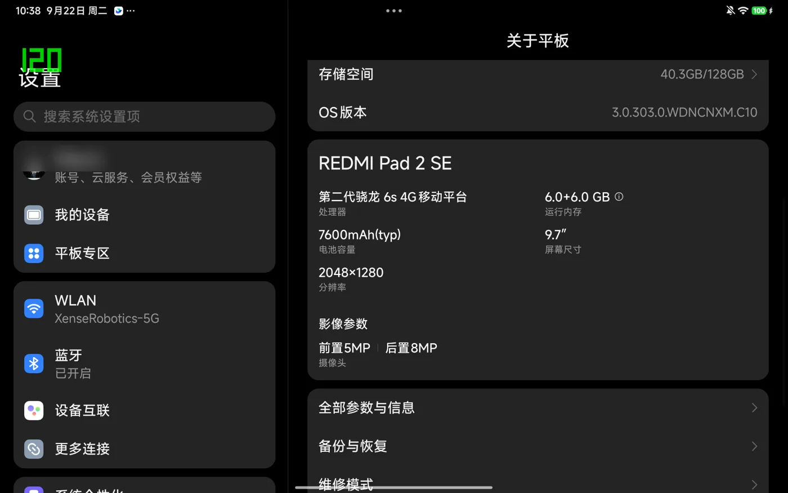
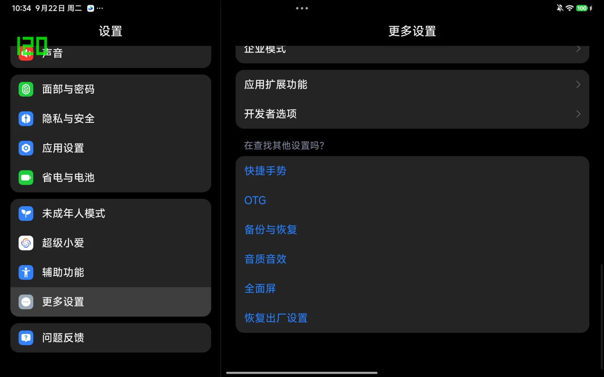
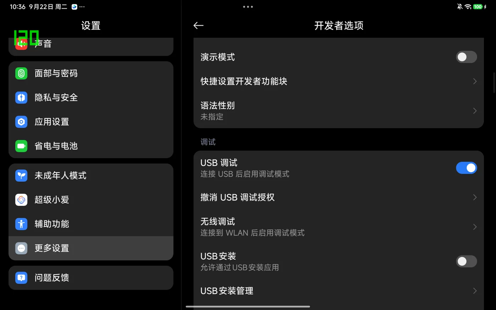

# 网络与控制台入口

本页讲怎么打开 XTac-UMI Collector 控制台（下称控制台）。**推荐用随箱平板插 USB**：背包会自动在平板上打开控制台，并可一步把背包和平板都接入现场 WiFi。

## 认机看标签，不记 IP {#label}

{ width="420" }

机身标签印着这台背包的 SN、热点名与密码、设备名。背包的 IP 会变且每台不同，不要把 IP 写进任何流程；认机用 SN（控制台 系统 → [设备信息](system.md#device-info)可查）和热点名。

## 推荐：平板插 USB {#tablet}

用数据线把平板接到背包前面板的 `HOST1` 或 `HOST2` 口，平板解锁后，背包会自动在平板上打开控制台的 系统 → 网络 / 配网 页，不需要连 WiFi、不需要输入地址。

**每台平板第一次使用前**，要在平板上打开 USB 调试并信任背包（随箱平板以 REDMI Pad 2 SE 为例）：

=== "1. 打开开发者模式"

    设置 → 我的设备，连续点「OS 版本」约 7 次，直到提示已进入开发者模式。

    

=== "2. 找到开发者选项"

    设置 → 更多设置 → 开发者选项。

    

=== "3. 打开 USB 调试"

    在「调试」分组打开「USB 调试」，按提示确认。

    

=== "4. 信任背包"

    插上背包后，平板弹出「允许 USB 调试？」时勾选「始终允许使用这台计算机进行调试」，再点「允许」。之后再插就不用确认了。

授权后背包会自动关闭平板的调试授权超时，平时不用再管。平板恢复出厂、撤销调试授权后需要重新信任。

### 用平板给背包配网 {#tablet-wifi}

在这个页面选择现场的 5 GHz WiFi 并输入密码，背包和平板会**同时接入**。背包确认平板已连上同一网络后，平板自动切到背包的 WiFi 地址，之后拔掉 USB 也能继续用。

## 背包的三个网络口 {#interfaces}

| 网络口 | 是什么 | 用途 |
|---|---|---|
| 有线 | 网口接路由器，自动获取 IP，可改静态 | 实验室 / 固定工位，带宽最稳 |
| 无线 | 背包连现场 5 GHz WiFi | 多人同网访问 |
| 热点 | 背包自己的 5 GHz 热点，地址固定 `192.168.44.1` | 没有平板、也没有现场网络时的入口 |

## 背包热点 {#softap}

没有平板可用时，用背包热点进入控制台：

1. 手机、平板或电脑连热点（名字与密码见机身标签）。
2. 浏览器打开 `http://192.168.44.1`。

!!! note "新设备首次开机热点是关闭的"
    在 系统 → [网络 / 配网](system.md#wifi) 里「开启热点」，设备会记住这个选择；可以先用[平板插 USB](#tablet) 进入控制台再打开。热点只有 5 GHz，只支持 2.4 GHz 的设备搜不到。

- iOS / Safari 访问时要敲全 `http://` 前缀。
- 现场多台背包时，连之前核对热点名与机身标签一致。
- 把手机 / 平板其他已保存网络的「自动连接」关掉，免得采集中跳到别的网络。

## 设备名访问 {#mdns}

与背包在同一网络时，可以用设备名访问，免记 IP：`http://xense-<设备名>.local`（见机身标签）。设备名可在 系统 → [网络 / 配网](system.md#wifi) 里改名或关闭。Windows 与部分安卓手机打不开 `.local` 设备名，改用[网络下拉](#status)里的 IP。

## 接入现场网络 {#lan}

### 有线 {#wired}

背包网口接路由器 LAN 口，插上即用；同一路由器下的电脑用[网络下拉](#status)里显示的有线 IP 或设备名访问。接线拓扑见[固定工位的布置](unbox-connect.md#desk)。Ubuntu 电脑记得在系统设置里勾选 Wired：

{ width="480" }

只有现场没有 DHCP（背包与电脑网线直连），或 IT 要求固定地址时才配静态 IP，见 系统 → [有线 IP](system.md#wifi-wired)。

### 现场 WiFi {#site-wifi}

最简单的是用[平板插 USB 配网](#tablet-wifi)，背包和平板一起接入。也可以在控制台 系统 → [连现场 WiFi](system.md#wifi-site) 里单独给背包配网。背包只连 5 GHz WiFi。

## 核对当前网络状态 {#status}

控制台顶栏左侧的 IP 下拉汇总本机全部入口：有线 IP、无线 IP 与所连热点、自身热点的 SSID / 密码 / 网关、mDNS 设备名。折叠态只显示一条「此刻最该用来连它的地址」（按 有线 > 无线 > 热点 取第一个可用的），点开可见全部。换了网络环境、不确定该用哪个地址时先看这里。

{ width="520" }

## 按场景选接入方式 {#choose}

| 场景 | 推荐方式 |
|---|---|
| 日常采集，用随箱平板 | [平板插 USB](#tablet)，背包自动打开控制台 |
| 实验室 / 固定工位，自备路由器 | [有线](#wired)接路由器 LAN 口，用[网络下拉](#status)里的地址访问 |
| 客户现场，网络不可控 | [平板插 USB](#tablet)，或开启[热点](#softap) |
| 现场有 5 GHz WiFi，多人同时访问 | 用平板把背包[配上现场 WiFi](#site-wifi)，之后同网电脑直接访问 |
| 背包与笔记本网线直连，无路由器 | 两侧各配同网段[静态 IP](#wired) |
| 怎么都连不上 | 平板插 USB 进入控制台检查网络；仍不行按[故障排查](troubleshooting.md)逐条查 |

## 高级排查：由技术支持处理 {#ssh}

日常的网络状态与连接操作都在控制台里完成：本机当前可用的全部访问地址看顶栏的[网络下拉](#status)；有线地址、网关、「未插线」这类连接状态，以及连现场 WiFi、改有线 IP，都在 系统 → [网络 / 配网](system.md#wifi)。

设备后台只供技术支持做诊断。**请勿自行登录后台或改动系统配置**：那里的改动不在控制台的可见范围内，配错会让设备连热点入口一起失去。

按本页的接入方式与[故障排查](troubleshooting.md)逐条试过仍然连不上时，把这些交给技术支持，不要自己进后台：

- 机身标签上的 SN，以及你用的是哪个入口（热点 / 设备名 / 有线 IP）；
- 顶栏[网络下拉](#status)里显示的地址，以及 系统 → [网络 / 配网](system.md#wifi) 页上的有线状态与当前外网连接；
- 界面上的报错原文。
