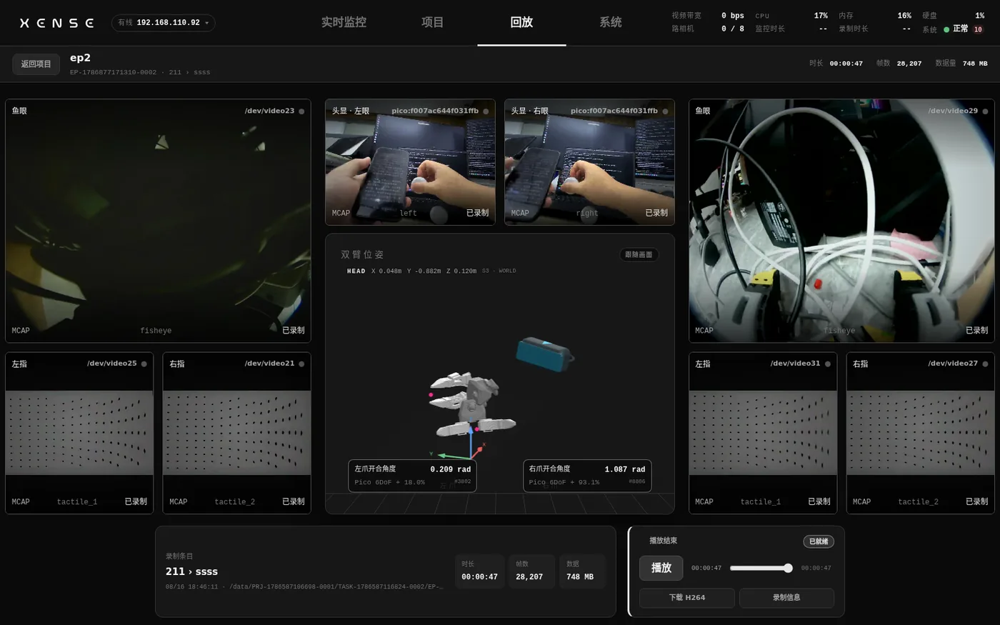

# 回放

录完的条目不用下载,在 XTac-UMI Collector 控制台(下称控制台)里就能逐条回放,画面、位姿与开合度按录制节奏同步播出。用它复查一条数据能不能要,再决定删还是留。

在[项目页](projects-export.md)找到录制条目,点行尾的「回放」进入回放页;顶栏的「回放」标签只在选过条目后才有内容,地址栏带着条目 id,刷新页面不会丢。手机版界面没有回放页,用平板或电脑打开控制台。

布局与[实时监控](monitor-record.md)一致:左右两列是两只夹爪的鱼眼与两路视触觉,中列是头显双目与「双臂位姿」3D 视图(顶部一行是 HEAD 在世界系里的坐标,视图下方两张卡是左右爪开合角度),每格底部标着来源通道(`fisheye` / `tactile_1` / `tactile_2` / `left` / `right`)与「已录制 / 回放中 / 空位」。页头与底部左侧是这条录制的信息:项目 › 任务、录制时间、落盘路径、时长、帧数、数据量;底部右侧是播放控制卡。

!!! warning "回放与实时预览不能同时进行"
    回放独占背包的硬件编码器(MPP)。只要还有任何一台平板或浏览器在看实时预览,或有导出正在转码,点「在线播放」就会被拒,状态行显示「资源占用:MPP 正被占用,暂不能开始回放(…)」并写出占用方。先到实时监控页点「关闭推流」(每一台连着的设备都要关),等导出转码结束,再回来播放。回放开始后别人打开预览不会打断回放。

## 播放控制 {#controls}

- **在线播放**:流式回放,不下载整段文件。起播后按钮变成「播放 / 暂停」,状态行显示「在线播放中 · N 路」;进度条可以拖拽跳转,画面与位姿共用一个时钟,一起停、一起跳。播完显示「播放结束」,把进度条拖回去可以重播。回放帧率上限 30 fps(MCAP 里触觉归档是 120 fps),触觉画面与实时监看一样是矫正后的差分图;弱网下码率自适应,不需要手动调。
- **位姿卡**:回放时位姿与开合角度跟着画面走。卡片右上角据实标出状态:静态(未起播)/ 等待起播 / 跟随画面 / 本条未录位姿;没录位姿的旧条目保持静态模型并注明。
- **下载 H264**:下载这条的 H264 MCAP(`.h264.mcap`)。还没转码的会先转再下,按钮旁显示转码进度,失败时按钮变成「重试 H264」。项目页的条目行已经没有这个按钮,单条 H264 只在回放页下载;成批下载用[导出对话框](projects-export.md#mcap)。
- **录制信息**:弹出这条 MCAP 的元数据:大小、消息数、通道数、分片数、时长、有无 Summary,以及完整的数据通道列表。
- **返回项目**:回到项目页,回放会话随之结束。

## 质量标记与每条统计 {#quality}

回放页页头的时长、帧数、数据量与项目页条目行的统计是同一份数据。项目页每条还有一列「质量」:正常显示「—」,否则用 `·` 串起几项:`lag N` 是采集侧滞后丢帧数,`断 N` 是设备掉线次数,`坏 N` 是坏帧数(采集侧与转码侧各检一次,取较大值),后面跟停录质检写下的问题,例如「缺 Pico tracker」、相机通道无帧、追踪器追踪失效占比、触觉矫正配方缺失。停录时被判「数据可疑」、夹爪黄脉冲的那一条,就是这列有标记的那一条,判据见[停止后](monitor-record.md#record-stop)。

有标记的条目先回放看一遍:追踪器出视野的那段,位姿卡会明显不跟画面;缺路或零帧的条目在 LeRobot 导出预检时会被拦下,留着也导不出去,直接在项目页删掉。追踪置信度会逐帧写进 LeRobot 数据集的 `observation.tracker_confidence`,剔除或掩码留给训练侧,见[导出](projects-export.md#lerobot)。
