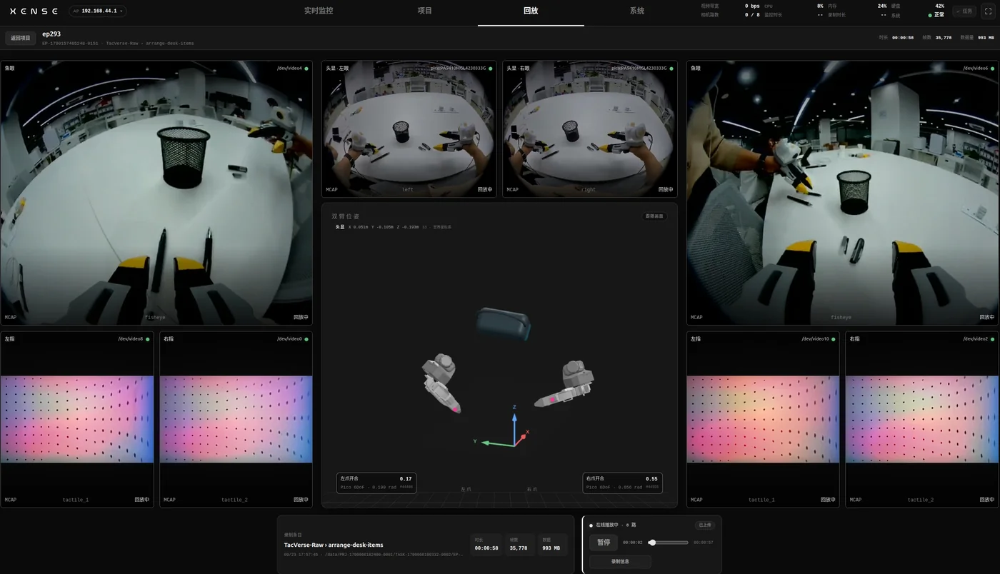

# 回放

录完的数据不用下载，在控制台里就能逐条回放，用来判断这条要不要留。

在[项目页](projects-export.md#projects)找到录制条目，点行尾的「回放」。手机版界面没有回放页，用平板或电脑打开。

## 播放 {#controls}

- 点「在线播放」开始，画面、位姿与开合度同步播放；进度条可拖动。
- 「录制信息」查看这条录制的时长、通道等明细。
- 「返回项目」回到项目页。

!!! warning "回放与实时预览不能同时进行"
    有设备在看实时预览、或有导出正在转码时，回放会被拒绝并提示原因。先在实时监控页「关闭推流」，再回来播放。

已归档的录制原始文件已清理，不能回放；要看这批数据，去上传到的远端取。

## 质量标记 {#quality}

项目页每条录制有一列「质量」：

| 显示 | 含义 |
|---|---|
| 未发现异常 | 这条是干净的 |
| 滞后 N / 断 N / 坏 N | 丢帧、设备掉线或坏帧次数 |
| 统计中 | 还在录制 |
| 未完成统计 / 暂无统计 | 录制失败或较早的录制，没有完整统计 |

有标记的先回放看一遍，不能用就在项目页删掉；缺路或零帧的录制导出时也会被拦下。
