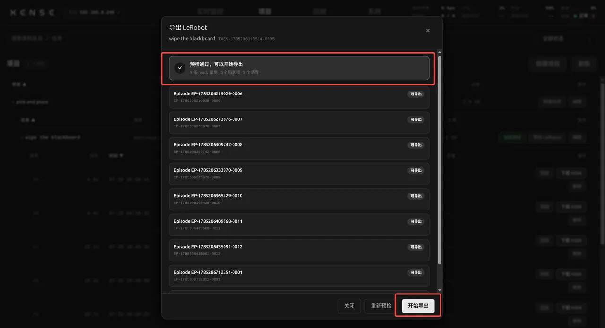

# 项目、导出与发布

本页讲 XTac-UMI Collector 控制台(下称控制台)的「项目」页:管理已录制的数据,把 MCAP 下载到本地,或把任务导出为 LeRobot v3 数据集发布到 ModelScope。读完能独立完成一个任务从检查、下载到发布清盘的全过程。

## 项目页 {#projects}

层级为 项目 → 任务 → 录制条目。项目行显示描述、任务数与磁盘占用;任务行显示任务指令与已采条数;录制条目行显示时长、帧数、数据量与质量标注,行尾是「回放」与「删除」。

- 新建项目与任务在监控页完成,见[项目 / 任务选择](monitor-record.md#project-task)。
- 任务行「设为目标」把该任务设为当前目标,监控页与夹爪按键的录制都落入这个任务;当前目标绿色高亮,点它等于重新确认。
- 录制条目编号在任务内持久递增,首条为 `ep0`;删除中间某条后编号不回收,断电重启后接着编。
- 状态 `ready` 表示可回放、可导出;发布到 ModelScope 后变为 `published`,清盘删掉本地文件也不改状态,仍计入任务已采条数。
- 任务的「目标条数」是硬门槛:已采条数达到目标后,浏览器与夹爪按键都拒绝开始录制,并弹窗说明原因。要继续采,在「改任务」里提高目标或新建任务。

## 编辑项目与任务 {#edit}

项目行「编辑」弹出 改名 / 上传后端 / 彻底删除;任务行「编辑」弹出 改任务 / 彻底删除任务。「上传后端」给项目改绑[上传配置](#modelscope-backend),建项目时还没配好凭据的,之后从这里补绑。

!!! danger "彻底删除不可恢复"
    彻底删除是硬删:级联删除项目或任务下的全部录制条目,并删除磁盘上的 MCAP、H264 转码文件与导出产物。确认框会列出将删除的任务数、录制条数与占用空间,并要求输入项目或任务的名称才放行。

## 删除录制 {#delete}

录制条目行点「删除」,确认框显示该条的编号、时长与数据量;确认后连同它的 MCAP 与 H264 转码文件一起删除,不可恢复。刚录完的上一条也能用夹爪按键删,见[夹爪按键](../common/gripper.md#buttons)。

## 导出对话框 {#export}

任务行点「导出」打开「导出任务数据」对话框。0.3.6 起 MCAP 下载与 LeRobot 发布共用这一个入口,流程是:选项目 / 任务 → 自动预检 → 勾选 episode → 下载或发布。

1. 预检:打开对话框即自动预检任务下全部 `ready` 录制,顶部一行给出结论(N 条 ready 录制 · 阻塞项 · 提醒)。阻塞项分任务级与逐条两种,常见的有:相机路由缺失、同一任务混采了不同采集模式(与首条 episode 通道不一致)、任务指令为空、录制时间轴不重叠或不单调、含头显的采集模式下全程没有有效头显位姿。
2. 勾选 episode:对话框主体是录制列表,默认全选,可全选 / 清空。每行并列时长、数据量与状态,有阻塞项的行显示「N 项阻塞」并逐条列出明细。
3. 二选一:[批量下载 MCAP](#mcap)按勾选下载;[发布 LeRobot 到 ModelScope](#modelscope)不按勾选,发全部待发布 episode。两者互斥,转码与上传都占背包资源,同一时间只跑一个。

截图为 0.3.4 界面,0.3.9 的对话框已改为「导出任务数据」:预检结论、可勾选的 episode 列表、MCAP 批量下载区与发布表单在同一个对话框里。

预检未通过时发布按钮不可用,MCAP 下载不受影响。删除或修好有问题的条目(混采的分开建任务)后点「重新预检」,通过即可发布:

同为 0.3.4 界面;0.3.9 里预检通过后,对话框下方直接是 MCAP 批量下载区与发布表单。

「关闭(后台继续)」不会打断正在进行的下载或发布,重新打开对话框接着看进度。

## 批量下载 MCAP {#mcap}

「MCAP 批量下载」区按上方勾选下载,每条 episode 对应一个 MCAP 文件,由背包串行逐条推送到当前浏览器。两种格式:

| 按钮 | 文件 | 说明 |
|---|---|---|
| raw | `<episode_id>.mcap` | 原始录制真源(MJPEG 图像 + 全部运行时事件),不经转码,点了立刻开始下载 |
| 转码 | `<episode_id>.h264.mcap` | 硬件转码为 H264 的回放友好版本;未转码的条目现转,一次一条,转完再下 |

进度在对话框里就地显示,可随时「停止」(同时取消后端正在跑的转码),失败的条目逐条列出。浏览器询问是否允许下载多个文件时选允许,下载完成前不要关闭标签页。已发布并清盘的条目本地文件已删,不能再下载;发布时勾选了保留本地的条目只能下 raw、不能转码。

## LeRobot 数据集格式 {#lerobot}

发布到 ModelScope 的是标准 LeRobotDataset v3.0(`codebase_version` v3.0,`robot_type` `bi_taccap_gripper`),根目录直接是 `meta/`、`data/`、`videos/`。格式本身的介绍与加载方式见 [LeRobotDataset 格式速览](../pc/dataset.md#61)。

- 帧率固定 30 fps:各路视频按源时间戳最近邻重采样到同一条 30 Hz 网格,分辨率照抄采集不缩放。
- 视频:左右鱼眼 + 左右爪各两路视触觉共六路,含头显的采集模式再加头显双目两路,均为 H264 MP4。
- `observation.state` 20 维:左右各 10 维,即 `left_tcp.*` / `right_tcp.*` 的末端位置 3 维 + 姿态 6-D 旋转 6 维,加夹爪开合度 1 维(归一化);`action` 是后移一帧的 state。6-D 旋转的列取法与 PC 版一致,见[每帧记录内容](../pc/recording.md#53)。
- 头显位姿(0.3.3 起):含头显的采集模式下,state 与 action 末尾追加 9 维(头显位置 3 维 + 6-D 旋转 6 维),变为 29 维;无头显的数据集仍是 20 维。同一任务里不能混装含头显与不含头显的 episode,预检会逐条拒绝;追踪丢失的样本丢弃后由最近邻补。
- `observation.tracker_confidence`(0.3.7 起):shape [2],逐帧记录左右追踪器的置信度(0 视线内静止、1 正常追踪、2 视线外只有方向没有位置、3 / 4 设备判定异常、-1 老固件未上报)。追踪器出视野时位置读数不可信,导出不改写轨迹,剔除或掩码留给训练侧。
- `meta/taccap_extrinsics.json`:逐 episode 记录来源录制 ID、左右追踪器绑定与 tracker→EE 外参(0.3.8 起默认出厂内置值)。

## 发布到 ModelScope {#modelscope}

一个任务对应 ModelScope 上一个数据集仓库。发布走增量:每次只发这批新增的待发布 episode,成功后它们掉出待导出集合,下一批录制接着同一个数据集往后写。所以发布始终包含全部待发布 episode,不按勾选。

### 上传配置 {#modelscope-backend}

发布用的 ModelScope 访问令牌怎么获取、怎么存成一档上传配置并校验,正文在 控制台 → 系统 → [上传配置](system.md#upload)。新建项目时绑定它,已建的项目从项目行「编辑 → 上传后端」改绑;绑定后发布时不用再填 token,数据集建在该档 owner 名下。

!!! warning "发布前核对绑定的是哪一档"
    数据传进错误账号后,ModelScope 的程序化删除受限,撤回要到 ModelScope 网页控制台手工处理;公开发布不可逆。

### 发布 {#modelscope-publish}

预检通过后在对话框底部的发布表单里填:

- 仓库:`owner/name`;留空由背包按 owner + `<项目>-<任务>` 自动命名。同一任务后续批次必须发到同一个仓库,换仓库会被拒绝。
- Token:项目绑定了上传配置的不用填;否则首次必填,之后留空复用背包上已存的那份(保存后不再回显)。
- 「上传完成后保留本地文件(不自动清盘)」:默认不勾。

按钮文字随勾选变化:「开始发布(完成后自动清盘)」或「开始发布(保留本地)」。流程为 预检 → 转码 → 构建 → 上传 → 完成;元信息最后提交,中途失败线上仍是上一批的完整状态,修好后重新发布即可。

截图为 0.3.4 界面,0.3.9 的对话框已改为「导出任务数据」,发布阶段为 预检 → 转码 → 构建 → 上传 → 完成,进度在同一个对话框里显示。

发布后的清盘(0.3.5 起):

- 默认自动清盘:上传成功、发布游标落盘后立即删除已发布 episode 的本地 MCAP、H264 转码文件与转码中间产物,腾出录制空间,完成提示给出释放量。自动清盘失败不算发布失败,数据已在线上,之后手动清即可。
- 勾选保留本地:只发布不删,之后随时用对话框里的「清盘(删已发布的本地录制)」手动清,只删发布游标记录的已发布条目。

!!! warning "需要本地留档的,发布前先下载"
    发布后这些 episode 不再进入导出集合;清盘后本地文件也没了。要留副本,先[批量下载 MCAP](#mcap),或发布时勾选保留本地。

## 下载单条 H264 {#h264}

0.3.6 起单条「下载 H264」在[回放页](playback.md):未转码的先转码再下载,按钮旁显示转码进度;已转码的直接下载,文件名 `<episode_id>.h264.mcap`。

导出或发布报错的处理见[故障排查](troubleshooting.md)。本页按 XTac-UMI Collector 0.3.9 编写,实际版本以[版本](versions.md#baseline)页说明为准。
