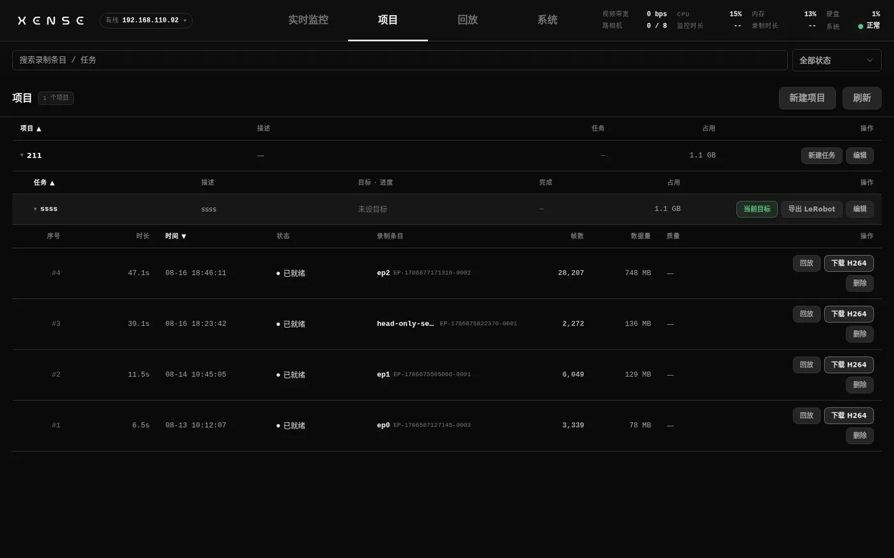
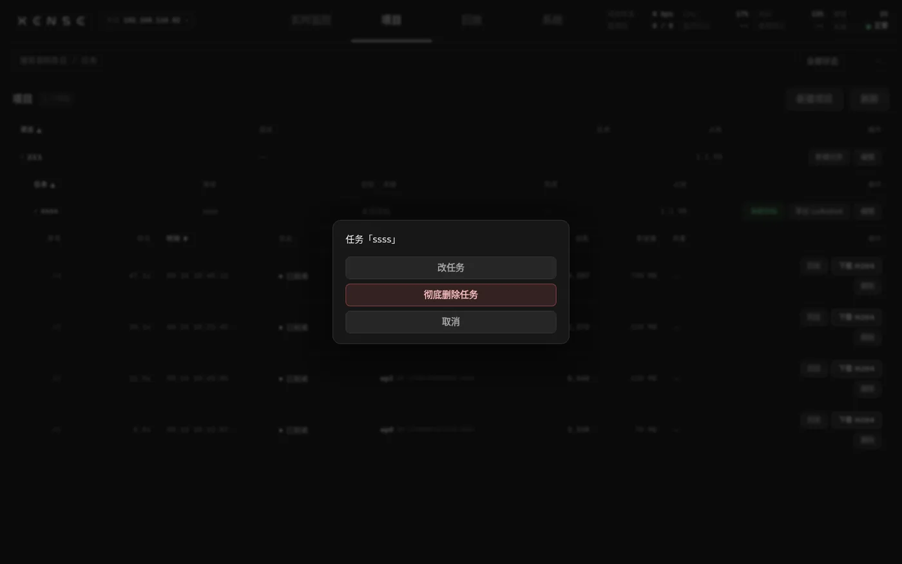
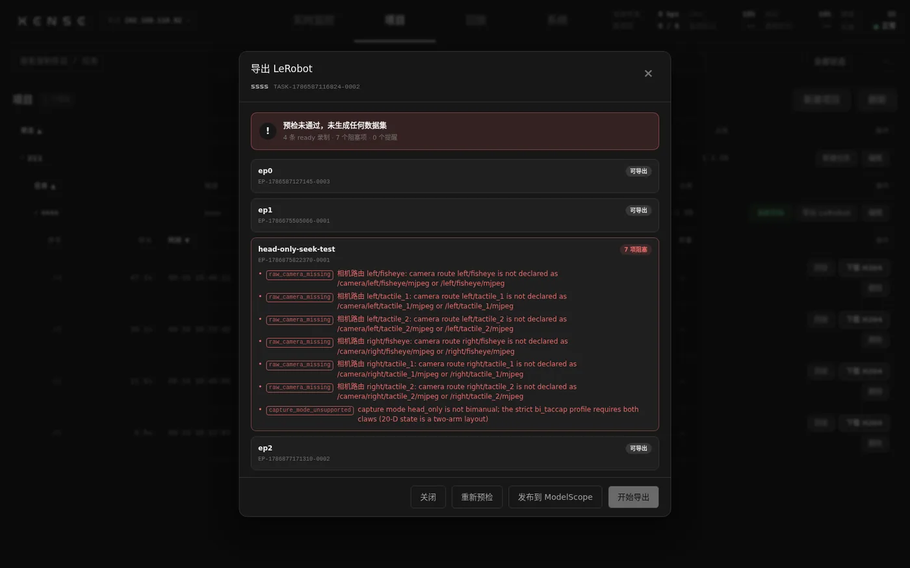
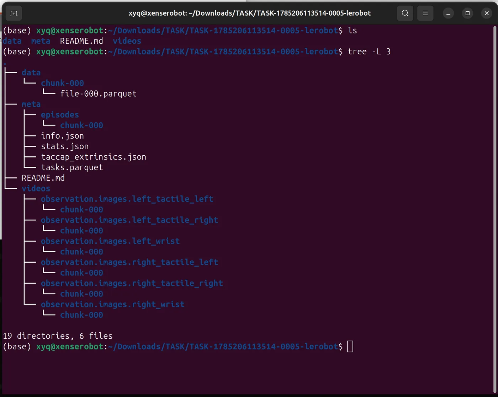
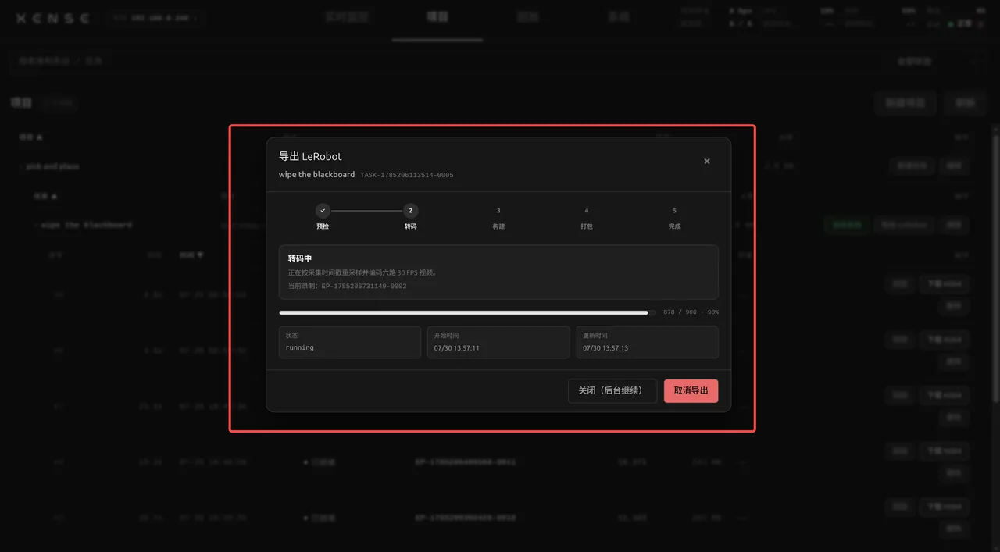

# 项目、导出与发布

本页讲 XTac-UMI Collector 控制台(下称控制台)的「项目」页:管理已录制的数据,按任务把数据导出成 LeRobot 数据集或 mcap,下载到设备或上传到远端,以及用「归档」腾出录制空间。读完能独立完成一个任务从检查、导出到归档的全过程。

## 项目页 {#projects}

层级为 项目 → 任务 → 录制条目。项目行显示描述、任务数与磁盘占用;任务行显示任务指令与已采条数;录制条目行显示时长、帧数、数据量与质量标注,行尾是「回放」与「删除」。

- 新建项目与任务在监控页完成,见[项目 / 任务选择](monitor-record.md#project-task)。
- 任务行「设为目标」把该任务设为当前目标,监控页与夹爪按键的录制都落入这个任务;当前目标绿色高亮,点它等于重新确认。
- 录制条目编号在任务内持久递增,首条为 `ep0`;删除中间某条后编号不回收,断电重启后接着编。
- 任务的「目标条数」是硬门槛,按**累计采集**计算:已采条数达到目标后,浏览器与夹爪按键都拒绝开始录制。上传与归档都不腾出名额,任务进度也不会因为上传或归档而倒退。要继续采,在「改任务」里提高目标条数,或删掉不该计入目标的录制。

### 录制状态 {#status}

一条录制有两件事要分开看:传没传过、原始文件还在不在设备上。列表里的状态把这两件事合成四档:

| 状态 | 含义 | 还能做什么 |
|---|---|---|
| 已就绪 | 录完落盘,没上传过 | 回放、导出两种格式、上传、归档 |
| 已上传 | 至少一种格式传到过远端,原始文件仍在设备上 | 回放、补导另一种格式、再上传、归档 |
| 已归档 | 只剩目录里的记录,原始文件已在归档时清理 | 只剩记录可查;回放入口置灰,不能再导出或上传 |
| 已丢弃 | 录制未正常结束或已被删除 | 不再出现在导出范围里 |

已上传的录制可以正常回放;已归档的回放与下载会直接说明原始文件已在归档时清理,而不是笼统报失败。

## 编辑项目与任务 {#edit}

项目行「编辑」弹出 改名 / 上传后端 / 彻底删除;任务行「编辑」弹出 改任务 / 彻底删除任务。「上传后端」给项目改绑[上传配置](#modelscope-backend),建项目时还没配好凭据的,之后从这里补绑。

项目的**默认导出格式**只在新建项目时选定(「LeRobot 数据集」或「mcap」),之后不在编辑菜单里;它只是默认值,每次导出都能临时改成另一种。

!!! danger "彻底删除不可恢复"
    彻底删除是硬删:级联删除项目或任务下的全部录制条目,并删除磁盘上的 MCAP、H264 转码文件与导出产物。确认框会列出将删除的任务数、录制条数与占用空间,并要求输入项目或任务的名称才放行。

## 删除录制 {#delete}

录制条目行点「删除」,确认框显示该条的编号、时长与数据量;确认后连同它的 MCAP 与 H264 转码文件一起删除,不可恢复。刚录完的上一条也能用夹爪按键删,见[夹爪按键](../common/gripper.md#buttons)。

删除与[归档](#archive)是两件事:归档只删本地原始文件、目录里还留着记录;删除连记录一起去掉,这条录制从任务里消失。

## 导出对话框 {#export}

任务行点「导出」打开「导出任务数据」对话框。所有取数据的动作都收敛到这一个入口,流程是:自动预检 → (可选)勾选缩小范围 → 选**导出去向** → 选**导出格式** → 按去向补一项配置 → 开始。

1. **预检**:打开对话框即自动预检任务下全部可导出的录制,顶部一行给出结论(N 条 ready 录制 · N 个阻塞项 · N 个提醒)。阻塞项分任务级与逐条两种,常见的有:相机路由缺失、同一任务混采了不同采集模式(与首条 episode 通道不一致)、任务指令为空、录制时间轴不重叠或不单调、含头显的采集模式下全程没有有效头显位姿。预检未通过时下载与上传都不可用;删除或修好有问题的条目(混采的分开建任务)后点「重新导出」重新预检。
2. **勾选**:对话框主体是录制列表,每行并列时长、数据量与状态,有阻塞项的行显示「N 项阻塞」并逐条列出明细。**不勾 = 全部**,勾选只用来缩小本次范围;下载、上传、归档、彻底删除四个动作都认这个勾选。已归档的行没有本地源,勾选框禁用。
3. **导出去向**:「下载到设备」或「上传到远端」。先定去向再问别的——[下载](#download)不需要任何远端配置,只有[上传](#modelscope)才会出现上传后端那一节。
4. **导出格式**:「跟随项目设置」「LeRobot 数据集」「mcap」三选一,见[两种导出格式](#formats)。

截图为旧版界面,0.3.16 的导出对话框已改为先选去向再选格式。

对话框底部还有两个动作:「归档」随时可用,见[归档](#archive);「彻底删除 (N)」只在勾选后出现,连记录一起删掉勾中的那几条。「关闭(后台继续)」不会打断正在进行的导出或上传,重新打开对话框接着看进度。

!!! warning "单条下载入口已经没有了"
    导出窗口里按条勾选下载 MCAP、回放页上单条录制的「下载 H264」按钮都已移除,取数据统一走任务级导出:选去向 → 选格式 → 一次取回。

## 两种导出格式 {#formats}

`LeRobot 数据集` 与 `mcap` 是两个平级出口,**互不排斥**:同一个任务可以先出一种、之后再出另一种,两份产物同时保留,也可以两种都上传。每个项目在新建时选一个默认格式,导出时选「跟随项目设置」就用它,单次导出仍可临时改。

### LeRobot 数据集 {#lerobot}

标准 LeRobotDataset v3.0(`codebase_version` v3.0,`robot_type` `bi_taccap_gripper`),根目录直接是 `meta/`、`data/`、`videos/`。格式本身的介绍与加载方式见 [LeRobotDataset 格式速览](../pc/dataset.md#61)。

- 帧率固定 30 fps:各路视频按源时间戳最近邻重采样到同一条 30 Hz 网格,分辨率照抄采集不缩放。
- 视频:左右鱼眼 + 左右爪各两路视触觉共六路,含头显的采集模式再加头显双目两路,均为 H264 MP4。腕部画面是否做去畸变由[采集设置](system.md#capture-mode)里的开关决定,矫正只在导出时进行。
- `observation.state` 20 维:左右各 10 维,即 `left_tcp.*` / `right_tcp.*` 的末端位置 3 维 + 姿态 6-D 旋转 6 维,加夹爪开合度 1 维(归一化);`action` 是后移一帧的 state。6-D 旋转的列取法与 PC 版一致,见[每帧记录内容](../pc/recording.md#53)。
- 头显位姿:含头显的采集模式下,state 与 action 末尾追加 9 维(头显位置 3 维 + 6-D 旋转 6 维),变为 29 维;无头显的数据集仍是 20 维。同一任务里不能混装含头显与不含头显的 episode,预检会逐条拒绝;追踪丢失的样本丢弃后由最近邻补。
- `observation.tracker_confidence`:shape [2],逐帧记录左右追踪器的置信度(0 视线内静止、1 正常追踪、2 视线外只有方向没有位置、3 / 4 设备判定异常、-1 老固件未上报)。追踪器出视野时位置读数不可信,导出不改写轨迹,剔除或掩码留给训练侧。
- `meta/taccap_extrinsics.json`:逐 episode 记录来源录制 ID、左右追踪器绑定与 tracker→EE 外参。
- `meta/xumi_collection_devices.json`(0.3.16 起):逐 episode 记录这条数据**实际由哪套设备采出来**,见[采集设备追溯](#devices)。
- `meta/info.json` 的顶层字段与各项 feature 按固定顺序输出(0.3.16 修复),Dataset Card 页面可以按预期排列;字段含义与已有数据内容没有变化。

### 采集设备追溯 {#devices}

0.3.16 起,每次开始录制时会固定这一条实际用到的背包、头显、左右夹爪、左右 tracker 与六路相机的 SN 和软件版本,写进录制文件;之后换相机、换夹爪、换头显都不会改写历史录制。导出 LeRobot 数据集时这份快照逐 episode 落进 `meta/xumi_collection_devices.json`,拿到数据集的人可以按 episode 追溯采集设备。

- 对外只保留够用的字段:背包保留 SN 与软件版本,相机保留侧别、角色与 SN。
- 某个 SN 暂时读不到会标为未知并给出提示,不拦住采集,也不算质量问题。
- 0.3.16 之前录的老数据没有这份快照,导出时写成 `legacy: true` 占位,只恢复能够可靠确认的 tracker 绑定,不会拿导出时在线的设备去反推历史,不需要重录。

### mcap {#mcap}

与数据集同源的 30 Hz 产物:同一份 state / action、同一份六路视频与传感器数据,一条 episode 一个自包含的 `<episode_id>.train.mcap` 文件,便于直接用 Foxglove 等通用可视化工具打开核对。

两种格式的动作与状态数据完全一致,选哪种只影响封装。下载 mcap 得到的压缩包解开就是平铺的一堆 `.train.mcap`;上传到 [STS](#sts) 的也是这些文件。

## 下载到设备 {#download}

选「下载到设备」后,下方只剩一行说明与一个按钮:产物先在设备上打包,完成后再取回。

- 阶段为 预检 → 转码 → 构建 → 打包 → 完成,进度在对话框里就地显示,可随时「取消导出」。
- 打包完成后底部出现「下载 数据集」或「下载 mcap」按钮,点它把压缩包拉到当前浏览器。两种格式的取回方式完全一样,压缩包文件名标明任务与格式。
- LeRobot 的包解开根目录直接是 `meta/`、`data/`、`videos/`;mcap 的包解开是平铺的一堆 `.train.mcap`。
- 下载完成前不要关闭标签页;「关闭(后台继续)」只关对话框,打包本身照跑。

!!! warning "已归档的录制取不回来"
    归档删掉的是本地原始文件,之后这些 episode 既不能回放,也不能再导出任何格式。需要本地留档的,先下载,或者上传时不勾自动归档。

## 上传到远端 {#modelscope}

选「上传到远端」后,产物直传远端仓库,不在设备上留压缩包。阶段为 预检 → 转码 → 构建 → 上传 → 完成;元信息最后提交,中途失败线上仍是上一批的完整状态,修好后重新上传即可。

上传走增量:每种格式各有一份发布游标,每次只发这批尚未上传的 episode,成功后它们掉出该格式的待发布集合,下一批录制接着同一个仓库往后写。所以同一条 episode 在同一种格式下只会上传一次,但换一种格式还能再传一遍。

截图为旧版界面,0.3.16 的导出对话框已改为先选去向再选格式。

### 上传后端 {#modelscope-backend}

**凭据不在导出对话框里填**。仓库地址与访问凭据只在 控制台 → 系统 → [上传配置](system.md#upload) 建成一档一档的「上传后端」,导出时从下拉里选一档就够了。下拉恒在,三种情形都是里面的一项:

- 「跟随项目设置」:走项目绑定的那档,括号里写明它到底是谁(未绑定时走设备上已存的全局凭据;绑定的档被删掉了会直说,那种情况上传会失败)。
- 某一具体档:显示 名称 · 种类 · 目标,项目默认的那档带「(项目默认)」。
- 「＋ 新建上传后端…」:跳到上传配置页新建,回来后下拉里就有了。

后端种类有三种:**ModelScope**(仓库建为 `owner/名称`)、**S3**(桶需预先建好,数据集放在 `桶 / 项目-任务 /` 下)、**[STS(导出 MCAP)](#sts)**。仓库名由后端按档的 owner + `<项目>-<任务>` 自动命名,不用手填。

保持当前后端会续写原仓库;改选其它上传后端时,只把尚未上传的新数据写入新仓库,并从第 0 条开始编号,以后切回原档仍能接着原仓库的进度往下写。

!!! warning "上传前核对走的是哪一档"
    数据传进错误账号后,ModelScope 的程序化删除受限,撤回要到 ModelScope 网页控制台手工处理;公开发布不可逆。

### 开始上传 {#modelscope-publish}

上传设置区只有两样东西:上面的上传后端下拉,和一个勾选框。

- 「上传完成后自动归档(删除本地源,只留元数据)」:**默认不勾**。不勾就只上传,本地文件全部保留,之后随时手动[归档](#archive);勾上则上传成功后立即删本地源腾空间。
- 按钮文字随勾选变化:「上传 LeRobot 数据集」或「上传 LeRobot 数据集(完成后归档)」,mcap 同理。
- 完成提示会说明结果:未勾选时是「已上传到 <仓库>,共 N 个 episode。本地源已保留」,勾选时追加本次释放了多少空间。

!!! warning "0.3.10 起默认不再清盘"
    此前的默认是上传成功即删除本地录制。现在必须在上传前勾选才会清理,老文档里「发布后默认清盘、勾选才保留」的说法已经反过来了。

## 归档 {#archive}

「归档」就是原先的「清盘」:删掉录制的本地原始文件,只保留目录里的记录。0.3.11 起它**随时可用**——按钮固定在导出对话框底部,不再只在一次上传完成后才出现,刚下载完一批想腾盘也能直接用。不勾就是整个任务,勾了就只归档勾中的那几条。

归档不可逆,确认框按后果分两级:

- **上传过的**:远端还有副本,归档只是腾本地空间。确认框会写出远端仓库,并说明此后无法回放、无法导出其它格式。
- **没上传过的**:远端一份都没有,归档后数据本身不复存在。这种情况会走一档更醒目的确认,把条数与后果单独说清楚。

只上传过一种格式的录制**照样会被归档**,但它的代价更大:源文件一删就再也导不出另一种格式。归档完成的提示里会分两栏列出——哪几条从未上传、哪几条只上传过一种格式——并给出本次释放的空间。要两种格式都留,就在归档前把另一种也导出或上传一遍。

!!! danger "归档删的是原始文件,不是记录"
    已归档的录制仍然计入任务已采条数与进度,但回放入口置灰、不能再导出任何格式。要连记录一起去掉,用[删除录制](#delete)或任务级的彻底删除。

## STS 训练 MCAP 上传 {#sts}

0.3.16 新增 `STS(导出 MCAP)` 这一档上传后端,与 ModelScope、S3 平级。它**只接收离线导出的训练 MCAP**(`*.train.mcap`),不接收 LeRobot 目录,也不上传录制的源 MCAP。

- 用法:在[上传配置](system.md#upload)里新建一档 STS 后端,填 Server、Account / OpenID、Project、Project Type 与 Task ID(可留空);导出时把**导出格式切到 `mcap`**,去向选「上传到远端」,后端下拉里选这一档。格式选成 LeRobot 时对话框会直接提示先切到 mcap,上传按钮不可用。
- 上传按 episode 逐个进行:以录制开始时间向 Server 申请一次上传,拿到服务端下发的临时凭据后流式传文件,再回调登记。服务端上已存在的文件直接复用,不重传。
- 设备身份不可伪造:上传时固定读取本机背包 SN,不能在配置里覆盖。

### 训练 MCAP 里的操作标签 {#sts-tags}

录制中**右夹爪按钮单击**会写入一个操作标签 `/events/operator_tag`,同一次有效单击还会写入一个状态节点 `/events/subtask_state`。节点名在每条录制内从 `Subtask 1` 起顺序递增,新录制重新从 1 开始。两个 topic 都会原样保留在导出的训练 MCAP 里。

在 Foxglove 里加一个 **State Transitions** 面板,Series Expression 填 `/events/subtask_state.subtask_name`,就能按时间看到这些节点并点击跳转到对应画面,用来定位现场标记过的操作段落。

导出或上传报错的处理见[故障排查](troubleshooting.md)。本页按 XTac-UMI Collector 0.3.16 编写,设备实际版本以 控制台 → 系统 → [设备信息](system.md#device-info) 页显示为准,各版本变化见[版本](versions.md#baseline)。
