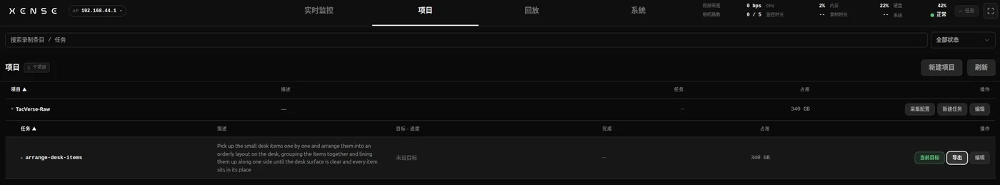
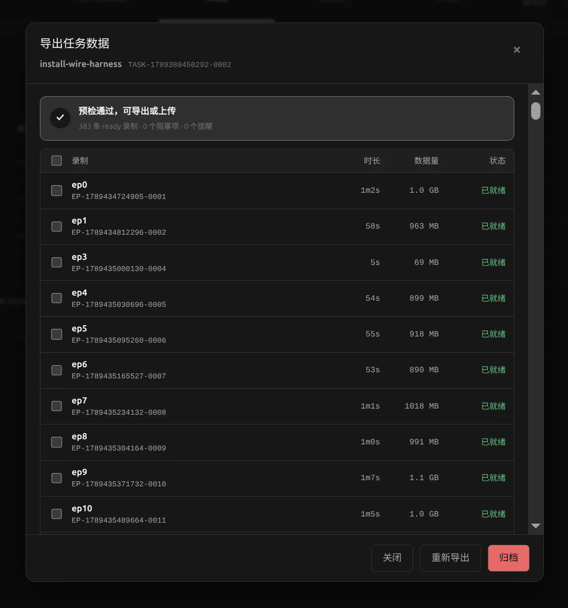
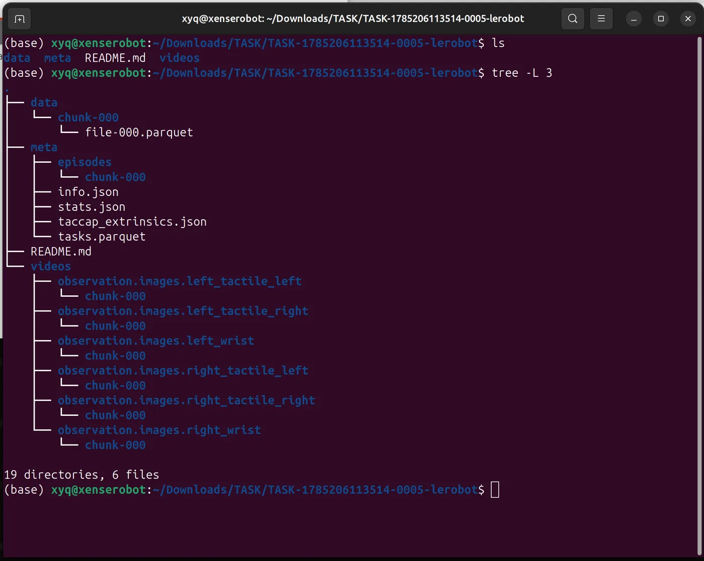

# 项目、导出与发布

在控制台「项目」页管理录好的数据：按任务导出成 LeRobot 数据集或 MCAP，下载到本地或上传到远端（如发布到 ModelScope），再用「归档」腾出空间。

## 项目页 {#projects}

层级为 **项目 → 任务 → 录制条目**。每条录制显示帧数、数据量与[质量](playback.md#quality)，行尾是「回放」和「删除」。

| 位置 | 操作 |
|---|---|
| 页头 | 新建项目、搜索、按状态筛选 |
| 项目行 | 采集配置、新建任务、编辑（改名 / 上传后端 / 彻底删除） |
| 任务行 | 设为目标（录制都落进这个任务）、导出、编辑（改任务 / 彻底删除任务） |
| 录制条目 | 回放、删除 |

### 新建项目与任务 {#new}

- **新建项目**：填项目名称，选采集模式（六种之一）；含头显的模式再选头显分辨率与图像类型；可选触觉导出方向、腕部鱼眼矫正、上传后端与默认导出格式。**建好后不能改**，选错了删掉空项目重建。
- **新建任务**：任务名称（小写字母、数字和连字符，如 `pick-cube`）、任务指令（必填，就是 LeRobot 的语言指令），目标条数与目标时长可留空。

## 导出 {#export}

任务行点「导出」打开「导出任务数据」：

1. **预检**：自动检查任务下的录制，通过显示「预检通过，可导出或上传」；未通过时列出阻塞项，按提示处理后点「重新导出」。
2. **选录制**：不勾选就是全部，勾选只用来缩小范围。
3. **选去向**：「下载到设备」或「上传到远端」。
4. **选格式**：跟随项目设置、LeRobot 数据集或 MCAP。
5. **开始**：点「下载 …」或「上传 …」。进度依次是 预检 → 转码 → 构建 → 打包 / 上传 → 完成；关掉对话框也会在后台继续。

!!! note "目前只有双爪类模式能导出"
    「双爪」「双爪 + 头显双目」「双爪 + 头显右单目」三种模式的录制可以导出；单爪与仅头显模式的录制能回放，但还不能导出。

### 下载到设备 {#download}

完成后点「下载数据集」或「下载 mcap」，浏览器下载一个压缩包。

### 上传到远端 {#upload}

选一个[上传后端](system.md#upload)（或就地新建），可勾选「上传完成后自动归档」。

| 后端 | 支持的格式 |
|---|---|
| ModelScope | LeRobot 数据集、MCAP；自动创建仓库，可选私有或公开 |
| S3 对象存储 | LeRobot 数据集、MCAP |
| FTP / FTPS、NFS 网络存储 | LeRobot 数据集、MCAP |
| STS | 仅 MCAP |

**发布到 ModelScope** 就是选 ModelScope 后端上传，没有单独的发布按钮。公开发布后不能撤回。

## 导出格式 {#formats}

两种格式可以都导，互不影响。

### LeRobot 数据集 {#lerobot}

标准 LeRobotDataset v3.0，30 fps，包含 `meta/`、`data/`、`videos/`。

| 采集模式 | `robot_type` | 视频路数 | 状态 / 动作维度 |
|---|---|---|---|
| 双爪 | `bi_taccap_gripper` | 6 | 20 |
| 双爪 + 头显双目 | `xtac_umi_g1` | 8 | 29 |
| 双爪 + 头显右单目 | `xtac_umi_g1` | 7 | 29 |

另附 `meta/taccap_extrinsics.json`（追踪器外参）与 `meta/xumi_collection_devices.json`（每条数据由哪套设备采集）。格式与读取方法见 [LeRobotDataset 格式速览](../pc/dataset.md#61)。

### MCAP {#mcap}

每条录制一个 `.train.mcap` 文件，包含 30 Hz 的状态与动作、各路视频和传感器数据，可以直接用 Foxglove 等工具打开。

## 归档 {#archive}

归档会**删掉设备上的原始文件，只保留记录**，用来腾出空间；归档后不能再回放或导出。

在导出对话框勾选录制后点「归档」，或上传时勾选「上传完成后自动归档」。确认时会按录制是否已上传、是否已下载分开提示，从未上传或下载过的录制需要最后再确认一次。

## 删除 {#delete}

- **单条**：录制行点「删除」，连同文件一起删除，不可恢复。
- **多条**：在导出对话框勾选后点「彻底删除」。和归档不同，删除连记录一起去掉；已上传到远端的副本不受影响。
- **整个项目或任务**：编辑菜单里「彻底删除」，需要输入名称确认。
