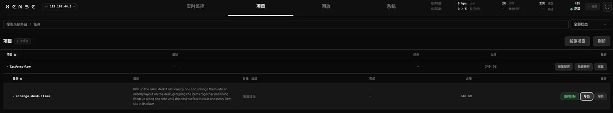
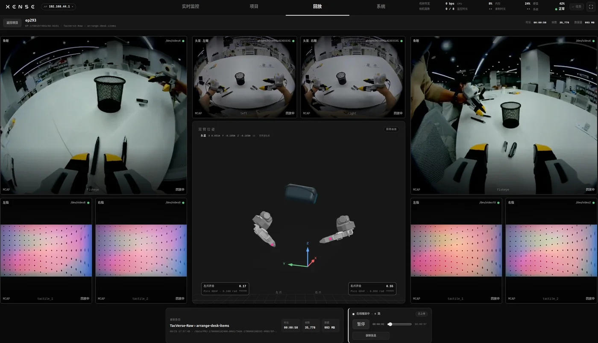
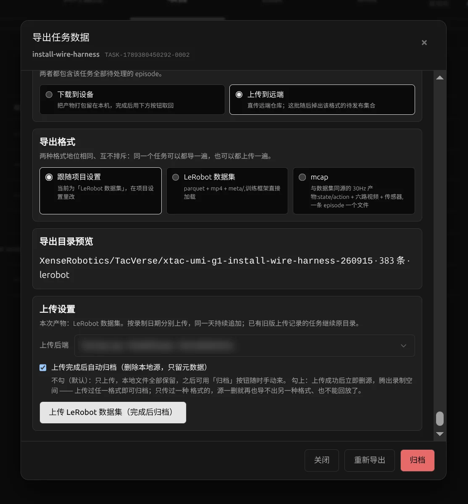

# 项目、回放与导出

在控制台「项目」页管理录制数据。XHE 项目可在录制封存后[回放](#playback)，也可按任务批量导出或上传原始 XHE MCAP。V1 项目沿用 LeRobot 数据集和 Training MCAP 导出流程。

## 项目页 {#projects}

层级为 **项目 → 任务 → 录制条目**。每条录制显示帧数、数据量与[质量](#quality)，行尾是「回放」和「删除」。

| 位置 | 操作 |
|---|---|
| 页头 | 新建项目、按项目 / 任务名称搜索（不区分大小写，命中处高亮）、按状态筛选 |
| 项目行 | 采集配置、新建任务、编辑（改名 / 上传后端 / 彻底删除） |
| 任务行 | 设为目标（录制都落进这个任务）、导出、编辑（改任务 / 彻底删除任务） |
| 录制条目 | 回放、删除 |

新建项目与任务的字段见[选项目与任务](monitor-record.md#project-task)。

## 回放 {#playback}

用平板或电脑打开背包控制台，进入「项目」，在对应任务下找到录制条目，点击行尾的「回放」。回放读取设备上的源文件，无需下载。已归档的录制无法在控制台回放，可到之前保存副本的位置查看。

**Collector 0.5.0 的 XHE 项目**：停录后等待条目通过[封存检查](monitor-record.md#record-stop)，然后从「项目」页打开回放。回放无需先导出 Training MCAP 或 LeRobot 数据集。

**Collector 0.4.7 的播放操作**

手机版界面没有回放入口，请使用平板或电脑。

1. 点击「在线播放」。相机画面、位姿和夹爪开合度同步播放，可拖动进度条定位。
2. 点击「录制信息」查看录制时长和通道信息。
3. 点击「返回项目」回到项目页。

!!! warning "Collector 0.4.7 的回放限制"
    有设备正在使用实时预览，或有导出正在转码时，回放会被拒绝。请在实时监控页点击「关闭推流」，或等待导出转码结束后重试。

### 质量标记 {#quality}

Collector 0.5.0 的 XHE 项目在停录时逐路检查相机。跳帧超限时，控制台会显示异常相机及其帧数。见[停录后的封存检查](monitor-record.md#record-stop)。

以下是 Collector 0.4.7 项目页「质量」列的标记：

| 显示 | 含义 |
|---|---|
| 未发现异常 | 这条是干净的 |
| 滞后 N / 断 N / 坏 N | 丢帧、设备掉线或坏帧次数 |
| 统计中 | 还在录制 |
| 未完成统计 / 暂无统计 | 录制失败或较早的录制，没有完整统计 |

有标记的先回放看一遍，不能用就在项目页删掉；缺路或零帧的录制导出时也会被拦下。

## 导出 {#export}

任务行点「导出」打开「导出任务数据」：

1. **预检**：自动检查任务下的录制，通过显示「预检通过，可导出或上传」；未通过时列出阻塞项，按提示处理后点「重新导出」。
2. **选录制**：勾选本次要处理的录制，表头的复选框可一次全选。不勾选时不能下载、上传、归档或删除。
3. **选去向**：「下载到设备」或「上传到远端」。
4. **选格式**：XHE 项目可选择原始 XHE。需要 LeRobot 或 Training MCAP 的下游应在创建项目时选择 V1。按 MCAP 格式上传时，文件名随格式变化。
5. **开始**：点「下载 …」或「上传 …」。进度依次是 预检 → 转码 → 构建 → 打包 / 上传 → 完成；关掉对话框也会在后台继续。
6. **导出提示**：如有条目开录时双手不在[初始范围](monitor-record.md#initial-pose)内，会提示「N 条录制开录时双手位置不在设定范围内」并列出编号；导出照常完成。

### 下载到设备 {#download}

完成后通过浏览器下载压缩包。XHE 项目可按任务选择多条录制，下载包含原始 `.xhe.mcap` 的 ZIP。也可从历史项目中多选 XHE 录制。

### 上传到远端 {#upload}

选一个[上传后端](system.md#upload)（或就地新建），可勾选「上传完成后自动归档」。

- **确认文件清单**：打包完成后弹出「确认本次上传文件」，列出要上传的文件个数、总大小和文件列表，点「确认上传」才开始传输。等待确认期间关掉对话框，再打开仍可确认。
- **进度**：显示文件序号、已传字节、上传速度和当前组预计剩余时间。Collector 0.5.0 支持多条录制边导出边上传，失败时自动重试，S3 可断点续传。参阅[上传配置](system.md#upload)。

| 后端 | 支持的格式 |
|---|---|
| ModelScope | LeRobot 数据集、MCAP；自动创建仓库，可选私有或公开 |
| S3 对象存储 | LeRobot 数据集、MCAP |
| 腾讯云 COS | LeRobot 数据集、MCAP |
| FTP / FTPS、NFS 网络存储 | LeRobot 数据集、MCAP |
| STS | 仅 MCAP |

**发布到 ModelScope** 就是选 ModelScope 后端上传，没有单独的发布按钮。公开发布后不能撤回。

## 导出格式 {#formats}

V1 项目可分别导出 LeRobot 或 Training MCAP。XHE 项目直接生成 `.xhe.mcap`，默认不生成 `.train.mcap`。XHE 保留各路相机及传感器的原生帧率和全部传感器读数（触觉 60 fps），记录 USB 相机采集时间、设备和版本信息，并提供用于去畸变的相机内参。可用 Foxglove 直接打开。

### LeRobot 数据集 {#lerobot}

标准 LeRobotDataset v3.0，30fps，包含 `meta/`、`data/`、`videos/`。目录结构与读取方法见 [LeRobotDataset v3.0 官方文档](https://huggingface.co/docs/lerobot/lerobot-dataset-v3)。

| 采集模式 | `robot_type` | 视频路数 | 状态 / 动作维度 |
|---|---|---|---|
| 双爪 | `bi_taccap_gripper` | 6 | 20 |
| 双爪 + 头显双目 | `xtac_umi_g1` | 8 | 29 |
| 双爪 + 头显右单目 | `xtac_umi_g1` | 7 | 29 |

另附 `meta/taccap_extrinsics.json`（追踪器外参）与 `meta/xumi_collection_devices.json`（每条数据由哪套设备采集、由哪个版本导出）。

- **位姿原点**：状态与动作里的头显、左右 TCP 位姿以每条开录时的头显为原点，见[坐标系 · 导出数据的原点](../common/coordinates.md#episode-origin)。
- **6-D 旋转 `r1..r6`**：与 PC 版同一取法，按列取旋转矩阵 R（世界 ← 本体）的前两列，`r1..r3` 为本体 X 轴、`r4..r6` 为本体 Y 轴，第三列为二者叉积，见[每帧记录内容](../pc/recording.md#53)。这里的「世界」是上一条说的开录头显原点系（「双爪」模式为录制时的世界系）。左手 TCP 在 `mirrored-v1` 下绕自身 X 轴转了 180°，相比同轴约定 `r4..r6` 整体反号、`r1..r3` 不变。
- **数据集级声明**：`meta/info.json` 写明 `tcp_frame_convention`（当前为 `mirrored-v1`，左手 TCP 是右手约定绕自身 X 轴转 180°）和 `headset_mount`（`head` / `neck`）。一个数据集只能有一种佩戴方式，混在一起导出会报错。
- **和 0.4.3 及更早的导出不能混用**：位姿原点、左手 TCP 约定都变了，合并新旧数据前按上面两个字段区分。

### MCAP {#mcap}

导出的是训练用 MCAP：每条录制一个 `.train.mcap` 文件，与 LeRobot 数据集同源，只是换了封装。内容是按 30Hz 对齐后的状态与动作、各路视频和传感器数据，可以直接用 Foxglove 等工具打开。

下表对比旧版 V1 的原始记录与 Training MCAP。Collector 0.5.0 的 Training MCAP 图像保留原始帧号，并优化了数据组织及存储效率：

| | 原始记录 | 导出的 `.train.mcap` |
|---|---|---|
| 在哪 | 背包数据盘；可在工程模式下[按单条下载](#raw-mcap) | 下载或上传到远端 |
| 频率 | 各路按设备原生频率：视触觉 120fps，腕部鱼眼 30fps，夹爪开合与 IMU 100Hz | 统一对齐到 30Hz |
| 图像 | 原始画面，未矫正 | 按项目设置矫正后的画面 |

## 下载原始录制 {#raw-mcap}

XHE 项目可通过[任务导出](#export)下载 ZIP 或上传原始 `.xhe.mcap`。以下工程模式步骤用于下载旧版 V1 的单条原始录制，供技术支持或数据分析使用。

1. 在技术支持指导下开启工程模式；普通模式不显示此入口。
2. 在「项目」页找到目标录制，点「导出原始 MCAP」，浏览器直接下载该条的 `.mcap` 文件（电脑、手机均可）。

- 只有已就绪，或已上传且仍保留本地源文件的录制可以下载；已归档的不行，需要保留原始文件请在[归档](#archive)前下载。
- 下载的是设备上的原件，不转码、不矫正、不做 30Hz 重采样，和任务导出的 `.train.mcap` 不同。

## 归档 {#archive}

归档会**删掉设备上的原始文件，只保留记录**，用来腾出空间；归档后不能再回放、重新导出或下载原始 MCAP。

在导出对话框勾选录制后点「归档」，或上传时勾选「上传完成后自动归档」。确认时会按录制是否已上传、是否已下载分开提示，从未上传或下载过的录制需要最后再确认一次。

## 删除 {#delete}

- **单条**：录制行点「删除」，连同文件一起删除，不可恢复。
- **多条**：在导出对话框勾选后点「彻底删除」。和归档不同，删除连记录一起去掉；已上传到远端的副本不受影响。
- **整个项目或任务**：编辑菜单里「彻底删除」，需要输入名称确认。
