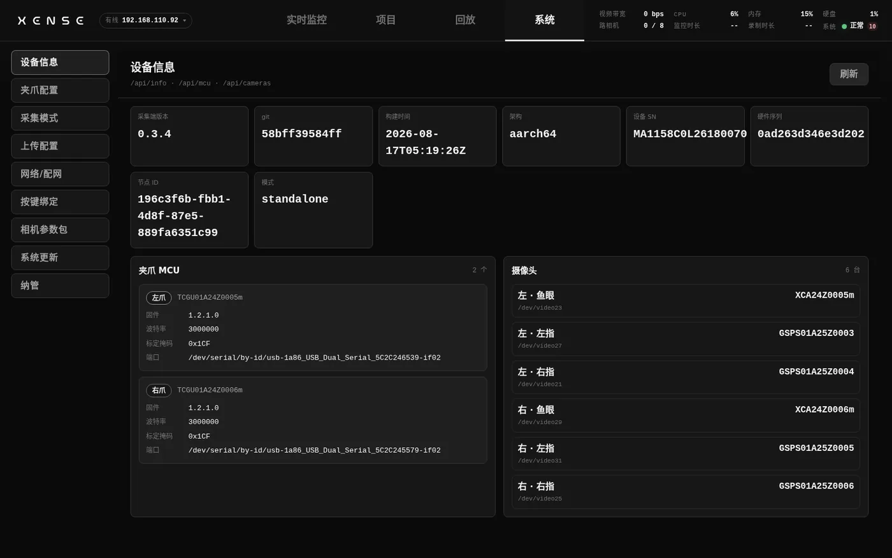
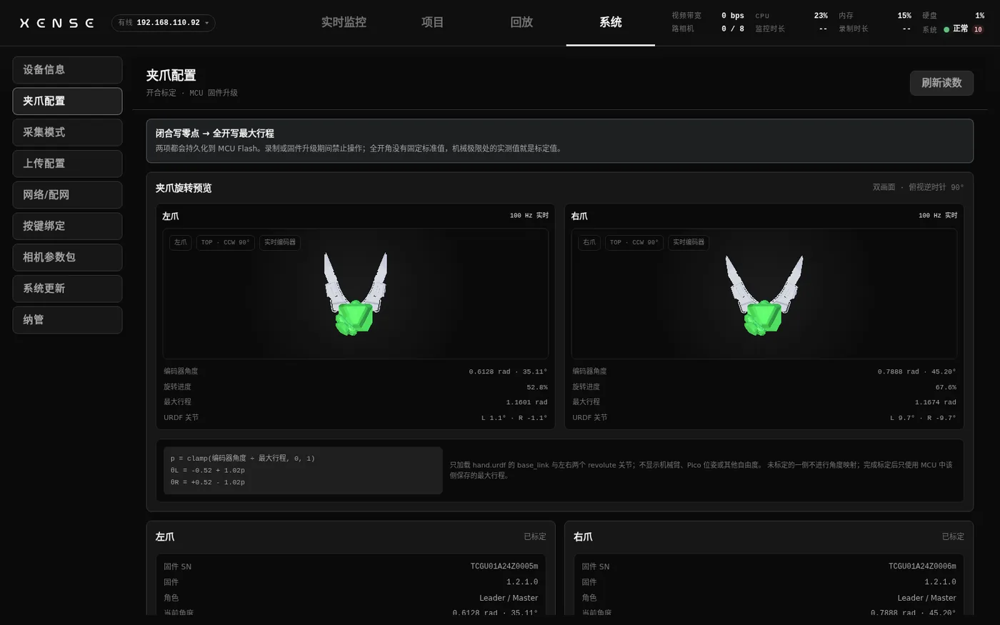
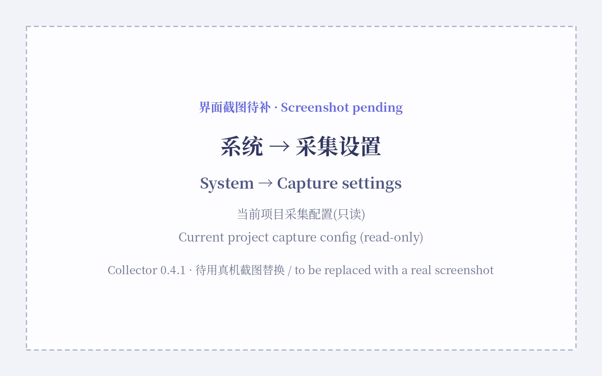
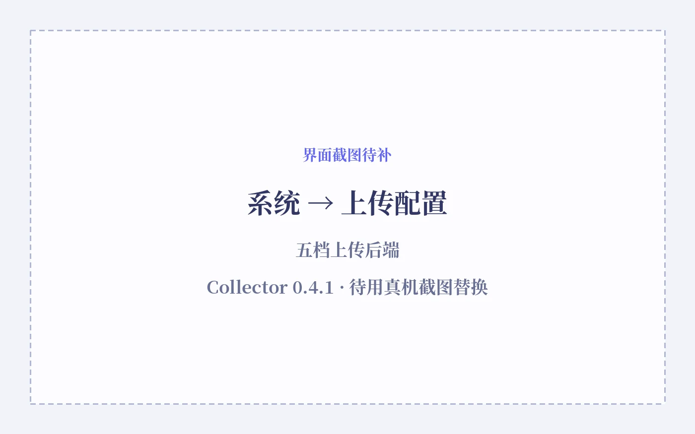
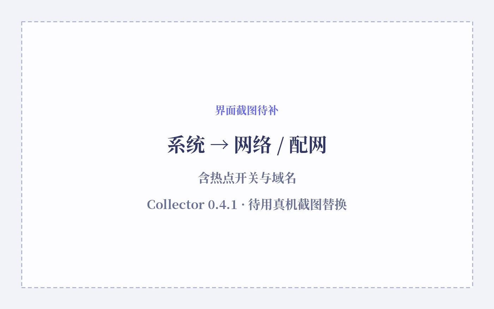
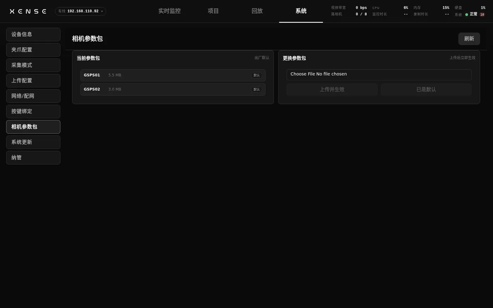

# System settings

This page covers every item on the "System" page of the XTac-UMI Collector console (below, "the console"): what it is, when you need to change it, how to change it, and what happens if you get it wrong. By the end you can carry out the gripper calibration, capture settings, upload credentials and network configuration of a first deployment on your own, and know which items should be left alone day to day.

## What is on the System page

Open "System" from the console's top bar; the items down the left are ordered by how often they are used. Each one opens directly at `/system/<id>`, which makes it easy for support staff to send a link.

| Item | Direct link | Purpose | When you need it |
|---|---|---|---|
| [Device info](#device-info) | `/system/device-info` | Versions, serial numbers, headset details, gripper MCUs and the camera list | Repairs, identifying a unit, verifying after an upgrade |
| [Gripper](#gripper) | `/system/gripper-calibration` | Gripper travel calibration, MCU firmware upgrade | First deployment, after changing a gripper |
| [Capture settings](#capture-settings) | `/system/capture-settings` | Current project capture config (read-only), recording shortcut, voice announcements, LED and button reference | First deployment, changed wiring, adjusting on-site feedback |
| [Upload configuration](#upload) | `/system/upload` | Remote upload credentials (ModelScope / S3 / FTP / NFS / STS) | Before uploading any data |
| [Network](#wifi) | `/system/wifi` | Joining site WiFi, wired IP, hotspot entry point | Changing venue, giving several people access |
| [Camera profiles](#camera-profiles) | `/system/camera-profiles` | Import or restore a camera profile pack (.xpack) | Technical support has sent a new pack |
| [System update](#update) | `/system/update` | Upgrade and rollback | When there is a new version |
| [Fleet management](#matrix) | `/system/matrix` | Multi-device management enrolment | Not needed at present |

!!! warning "Stop recording first"
    While a recording is in progress, the device refuses all of these: switching the capture mode, changing the wrist undistortion configuration, gripper travel calibration, gripper firmware upgrades, camera profile upload / restore, and applying a system update (the interface says "Recording in progress"). When you see that message, stop the recording on the Live monitor page first.

## Device info {#device-info}

One page showing this backpack's software versions, identity serial numbers, headset details, gripper MCUs and camera list. It is entirely read-only; there is nothing to change.

- Metrics card: collector version, git, build time, architecture, device SN (burned in on the production line and printed on the body label), hardware serial, node ID, and mode (standalone / matrix). Anything that cannot be read shows `--`.
- Headset: one card per unit, showing online / offline plus the Head SN, XUMI software version, resolution, and the left and right camera intrinsics (in the original order, 4 values) and extrinsics (in the original 4×4 order). When a headset has been found but its camera parameters have not arrived yet it says "Headset found, camera parameters not received yet."; with no headset connected it says "No headset detected."
- Gripper MCU: one row per gripper, with a left / right badge, SN, firmware version, baud rate, calibration mask (hexadecimal, `0x`) and serial port.
- Cameras: the runtime's aggregated list of logical cameras, each row showing side · role, product / serial and the v4l2 node; offline ones are marked "(offline)".

The four sets of data are fetched independently, so a headset or MCU dropping out does not blank the whole page; "Refresh" at the top right re-fetches by hand.

!!! warning "Identify a headset by its Head SN, not by the connection ID"
    Since 0.3.16 a headset's identity is its "Head SN" and "XUMI software version", both taken from the values the headset reports along with its camera parameters. The "connection ID" that older versions showed is no longer displayed and is no longer usable as the headset's device SN — use the Head SN for records, repairs and identifying a unit.

When you need this page:

- Repairs, identifying a unit: copy the device SN and hardware serial, and the Head SN for the headset. Identify units only by these; do not go by IP, because DHCP addresses change.
- After an upgrade: check the "collector version / git / build time" to confirm the new version really took effect. The documentation is written against 0.3.16, but what this page shows is authoritative.
- When the number of camera feeds on the Live monitor page does not match expectations: look here first to see which camera is "(offline)".
- Before gripper calibration: check whether the firmware version is ≥ 1.2.0.0 (the command set V2.1 and build 1.2.0 the Developer Kit talks about, see [Three numbering schemes](../pc/versions.md#v21)); a gripper below that does not support travel calibration.

## Gripper {#gripper}

This is where you do the gripper's opening (travel) calibration: close it to write the zero, then open it fully to write the maximum travel, both of which are written to the gripper MCU's flash. The same page also flashes the gripper MCU's firmware.

The upper half is a pair of top-down URDF previews, left and right, showing the encoder angle live (in radians and degrees), the rotation progress and the stored maximum travel ("Not calibrated" when there is none). Below that is one calibration card per gripper: status (reading / offline / unsupported / calibrated / not calibrated), firmware SN, firmware version, role (leader / follower), current angle, stored maximum travel and current normalised opening. The two-step wizard only appears for grippers that support calibration.

### When calibration is needed

The calibration values live in the gripper's own flash: they survive a power cycle, and moving to another backpack does not require redoing them — calibrate a gripper once and that is enough. The console wizard and the Developer Kit's `calibrate.py` script write the same values and are equivalent: calibrate in either place and you do not need to do it in the other. What counts as "not calibrated" or "calibrated wrong" (the encoder has been removed and refitted, the mechanical limit has been altered, the firmware has been erased), and why calibrating only one of two grippers is worse than calibrating neither, are in the Developer Kit's [Gripper calibration](../pc/calibration.md#41) — the rules are identical. On the Backpack Kit it shows up as a calibration card reading "Not calibrated", or as a normalised opening on the Live monitor page that will not reach 1.0 when the gripper is opened to its mechanical limit.

### How to calibrate

Do one gripper at a time and do not skip steps; the step 2 button stays locked until step 1 is complete.

1. Confirm the gripper is online and its status is not "offline / unsupported". Travel calibration needs leader firmware ≥ 1.2.0.0 (the command set V2.1 and build 1.2.0 the Developer Kit talks about, see [Three numbering schemes](../pc/versions.md#v21)), and follower grippers do not support it; if it says "unsupported", check the firmware version or confirm you have a leader gripper connected.
2. Close the gripper fully and hold it there, click "Confirm fully closed" and confirm the dialog to write the zero. The device reads the value back automatically; a residual of ≤ 0.01 rad is normal, and anything larger prompts you to redo step 1.
3. Open the gripper to its mechanical limit and hold it still, then click "Confirm fully open" to write the maximum travel. The reading must be greater than 0, and it is read back and verified immediately after writing.
4. "Travel calibration complete: maximum travel … rad, normalised opening range 0–1" means you are done; repeat for the other side.

There is no fixed standard value for the fully-open angle — the measured value at the mechanical limit is the calibration value.

!!! danger "Writing to flash overwrites the old values, and the job must be finished in one go"
    The zero and the maximum travel overwrite the MCU flash as soon as they are written, and cannot be undone. Step 2 must follow immediately after step 1: writing the zero without the travel leaves a half-calibrated state in which the normalised opening is unusable, and calibrating only one of two grippers puts the left and right openings on different scales — with nothing in the data to show it. If you calibrate, finish both sides.

### Gripper firmware upgrade

The "Gripper firmware upgrade" panel at the bottom of the same page: pick the target gripper, pick the `.bin`, "Upload and flash", and once it is done wait for the gripper to restart and then power the backpack off and on again. The steps, the rule for picking an image by role, and why you must power-cycle afterwards are in [Gripper firmware](update.md#gripper-firmware).

## Capture settings {#capture-settings}

This page covers **how recording is triggered on site and how the device reports back**: the recording shortcut, voice announcements, and the LED and device-button reference. At the top of the page there is also a "current project capture config" block, which shows read-only which feeds this project records and how they are exported.

**Which feeds get recorded and how they get exported are not changed here** — those are properties of the project, chosen when you [create the project](monitor-record.md#project-task) and frozen once it exists. This page only lets you check which set the current project is using.

### Current project capture config {#capture-mode}

This block at the top of the page shows, read-only, the four capture and export parameters of the current project. They are chosen when the project is created and cannot be changed afterwards, so there is nothing clickable here — to use a different set, create a new project.

The **project capture mode** decides how many grippers are recorded and whether the headset is included, and with it the Live monitor layout, what gets recorded and the channel contract of the export. There are six presets:

| Mode | Grippers | Headset | Camera feeds |
|---|---|---|---|
| Dual gripper | 2 grippers | No headset | 6 |
| Dual gripper + headset stereo | 2 grippers | PICO stereo pair | 8 |
| Dual gripper + headset right eye | 2 grippers | PICO right eye | 7 |
| Single gripper | 1 gripper | No headset | 3 |
| Single gripper + headset stereo | 1 gripper | PICO stereo pair | 5 |
| Headset stereo only | No gripper | PICO stereo pair | 2 |

For "single gripper" you do not choose the side: the device works it out from which side the gripper is actually plugged into, so changing grippers needs no configuration change.

The other three: the **project PICO resolution** (`640x480` or `1024x768` per eye, only for modes that include the headset), the **project tactile export orientation** (`700 × 400 · current orientation`, or `400 × 700 · rotated 90° counter-clockwise · SDK orientation`), and the **PICO image source** (the raw fisheye frame or the undistorted one) together with the wrist fisheye rectification switch. Think these through before creating the project, because you cannot change them afterwards.

!!! warning "The capture config freezes when the project is created; getting it wrong means creating a new project"
    These four cannot be changed once the project exists, and the device will not change them for you during recording. Pick too few channels and every later recording in this project has fewer channels, and the export pre-check will block them by profile (for example "headset stereo only" data will not pass the bimanual profile's LeRobot pre-check). Historical projects keep whatever they had for fields they never specified, and can still be viewed, exported and uploaded; to use the new parameters, create a new project.

### Wrist fisheye rectification and tactile orientation {#undistort}

Both belong to the project capture config, chosen along with the mode when the project is created; this page only displays them.

**Wrist fisheye rectification**: the wrist camera has a wide-angle lens, so the edges of the frame are visibly stretched. With it on, the wrist view **in the exported dataset** is rectified to something close to a rectilinear perspective. It is an **export** option, not a recording option — what is stored in the recording file is always the camera's raw fisheye image, and the rectification happens only at export; re-exporting a historical episode still gives you the framing frozen at the time it was recorded.

The rectification parameters are read from the gripper MCU's flash (written during production calibration). Each gripper has a row showing its status: "Calibrated · reference W×H", "Not calibrated · rectified with default intrinsics", "Not calibrated" or "MCU offline".

!!! warning "\"Not calibrated · rectified with default intrinsics\" does not mean it is calibrated"
    An uncalibrated side is also rectified, using generic parameters for that lens model, and its exported wrist view is likewise close to a rectilinear perspective. But generic parameters do not capture an individual lens's variation, so they are less accurate than per-unit calibration, and that side's status still reads "Not calibrated" as a hint that this device is worth calibrating once. Once that is done it automatically switches to the device's own parameters, with nothing to do on site. Being uncalibrated does not block collection.

### Recording shortcut {#keybinding}

A keyboard shortcut for "start / stop recording" in the browser, so you do not have to go back to the interface and click a button on site. When you would use it: a tablet or PC with a keyboard attached.

How to change it: click "Bind shortcut" and press the key you want (optionally with Ctrl / Alt / Shift) to finish; "Rebind" changes the key, "Clear" removes it, and Esc during binding ("Cancel (Esc)" in the interface) cancels. The shortcut is stored in the current browser, so a different tablet needs rebinding. It only works while the console page is open, and does not fire while an input box has focus, so it will not start a recording by accident while you type a task instruction. Binding the wrong key has no consequences — clear it and bind again.

The shortcut and the device buttons below are two independent paths: the shortcut needs the browser online and focused, while the device buttons do not go through the browser at all and are the recommended way to record on site.

### Voice announcements {#voice}

The device speaker gives spoken prompts in Chinese at key moments, with no need for a tablet nearby and independent of the browser. The reason is practical: during collection both hands are on the grippers and your eyes are on the scene, so reading an LED means deliberately looking up, while a spoken prompt does not.

There are four moments, corresponding to five fixed announcements:

| Moment | Announcement |
|---|---|
| Recording starts | "Recording started" |
| An episode finishes | "Recording complete, please reset the environment" |
| A serious problem occurs while recording | "Recording failed" |
| A gripper or the headset drops out while recording | "Gripper connection failed" / "Pico connection failed" |

Only two things in this block are adjustable, and both survive a reboot:

- Switch: mute with one click (the interface shows "On" / "Muted").
- Playback volume: a 0–100 slider (new in 0.3.16) that adjusts only the software gain at playback; it does not alter the WAV assets and does not touch the system sound card. The maximum setting is about +3 dB.

Each line has a "Preview \"…\"" button next to it, which goes through exactly the same path as a real announcement, so a silent preview still tells you why: if it is currently muted it prompts you to turn the switch on first, and if the device has no usable audio output it says voice announcements have been disabled for this run.

The wording and the timing of the announcements are fixed values that cannot be changed on site — changing them requires a release — so every device in a fleet behaves identically.

### LEDs and device buttons

At the very bottom of the same page is the reference table for the LED patterns and the device buttons, read-only and not configurable. The button column lists the sequences for a long press on the right gripper, a long press on the left gripper, a double-click on the left gripper, and pressing the right gripper during a delete confirmation. In the LED column each pattern is demonstrated with its real shape and rhythm — solid, breathing, blinking, pulsing and fast-blinking are all distinguishable at a glance, so you no longer have to tell "fast blink" from "pulse" by reading a description; the purple light during a delete confirmation is in the table too.

Which gripper does what, the key assignments, the timings and the LED conventions are fixed fleet-wide, cannot be changed on site, and the console offers no way to change them; the values currently in effect are shown in this block. The main text on the gestures and the LED patterns is in [Gripper buttons, LEDs and serial numbers](../common/gripper.md#buttons).

## Upload configuration {#upload}

An upload configuration holds the account credentials used to send data to a remote end. You can configure several, each with a name (a named slot), and bind one of them when you create a project, after which that project's uploads use it by default. When one backpack collects data for different customers or projects that go to different destinations, create one configuration for each. The credentials are entered here once, and the export dialog no longer asks for a repository or a token.

There are five kinds of backend, and the fields change with the kind (their credentials have no field in common):

| Kind | What it uploads | What to fill in |
|---|---|---|
| ModelScope | LeRobot datasets | Owner (account / organisation), Token, visibility for new repositories |
| S3 object storage | LeRobot datasets | Bucket, Endpoint, Region (may be left blank), Access Key, Secret Key |
| FTP / FTPS | LeRobot datasets and exported MCAP | FTP server, port, username, password, target directory, connection security; with FTPS you may also supply a private CA |
| NFS network storage | LeRobot datasets and exported MCAP | Server, export path, protocol version; subdirectory, UID / GID and ports as needed |
| STS (exported MCAP) | Offline-exported `*.train.mcap` | Server, Account / OpenID, Project, Project Type, Task ID (may be left blank) |

Whether this device offers FTP / FTPS and NFS depends on whether those options appear on its own System → Upload configuration page; if they are not there, contact technical support to confirm the device version.

Each row in the list shows the name, a kind badge and the destination (owner / bucket / project), plus the last four characters of the credential masked, and "Verify / Edit / Delete".

All five kinds name their directories the same way: **`<root>/ project name / mode prefix-task name-date /`**, where the "root" is the Owner, the bucket or the target root directory depending on the kind. The project directory uses **the name you gave the project when you created it**, and you do not add the mode prefix or the date to the task name yourself — the device does that. A task that has already uploaded keeps its original directory and is not renamed by this rule.

What to know about each kind:

- **ModelScope**: the dataset repository is created under the Owner (`<owner>/<repo>`). Visibility, private (recommended) or public, applies only when the repository is first created; changing it here does not touch an existing repository. To get a token: log in to [ModelScope](https://www.modelscope.cn/my/overview), click your avatar → Account settings → Access tokens → Create access token.
- **S3**: the bucket must already exist — the device only writes into it, does not create buckets, and has no control over the bucket's access policy (which is why there is no visibility option).
- **FTP / FTPS**: use FTPS (explicit TLS) where you can; with plain FTP the account, the password and the data are all unencrypted. The target directory must **already exist** and must start with `/`, taken from the root you see after logging in over FTP. When the NAS uses a private certificate, put the CA that issued it into "Private CA certificate", and the server address must match the certificate. After changing the server, the port, the account, or switching connection security from FTPS back to plain, the password has to be entered again.
- **NFS**: the protocol version defaults to "automatic" (v4.1 first, then v3), and can be pinned to v3 or v4.1; v4.0 is experimental support only, and v4.2 and Kerberos are not supported. The target subdirectory must **already exist** — the device will not create it for you — and leaving UID / GID blank writes as the device account.
- **STS**: it uploads only offline-exported training MCAP files and does not accept LeRobot. Short-lived credentials are issued by the Server before each file is uploaded, and the device SN is always this backpack's own and cannot be overridden in the configuration.

How to configure one:

1. "New configuration", fill in the name, choose the backend kind, fill in that kind's fields, and save.
2. Check the configuration from its own button: ModelScope, S3 and STS show "Verify", while NFS and FTP / FTPS show "Check read/write".
    - "Verify": ModelScope validates the token and checks that the online account matches the owner you entered; S3 checks that the bucket is readable and writable; STS only checks that the configuration is complete, with account authentication happening when each MCAP is uploaded.
    - "Check read/write": it actually runs a create, write, read-back, rename and delete at the target to confirm the permissions are all there. On success the entry shows as usable (for NFS it also reports the free space on the export); on failure, work through the hints on the page — the directory, the permissions, the protocol version or the certificate.
    - Saving a configuration does **not** require the check to pass first, and a failed check does **not** block uploads by itself — it only tells you whether that target is writable right now. After you change a configuration the previous check result no longer applies and you have to run it again.
3. Select this configuration under "Upload backend" when you create a project; for an existing project, bind it from "Upload backend" on the project's row. When a project has no binding, the export dialog lets you pick one from a drop-down for that occasion.

The upload steps themselves are in [Export and upload](projects-export.md#export).

!!! warning "Binding the wrong configuration cannot be undone"
    Once customer A's data has gone into customer B's account, ModelScope's programmatic deletion is limited and withdrawing it means going through their web console; publishing publicly is equally irreversible. Check which configuration you are binding when you create a project. Once a project has uploaded once, the repository coordinates are recorded in its cursor, and rebinding it to a configuration that would change the repository is refused by the device.

!!! warning "Do not roll back to an older version after configuring NFS or FTP / FTPS"
    An older version that does not know these two kinds may fail to read the whole upload configuration, taking your existing ModelScope, S3 and STS entries down with it. If you do need to roll back, delete the newly created entries first, or ask technical support to back the configuration up.

Other things to know: credentials are stored on the device's state disk (permissions 0600) and are not shown again after saving — leaving a field blank when editing means keeping the copy already on the device. If you change the backend kind while editing, the credentials must be re-entered, because there is no field to carry over. Deleting a configuration does not affect data already uploaded; a project bound to it will prompt you to rebind when it next uploads.

## Network {#wifi}

This page manages the backpack's three network interfaces: its own always-on configuration hotspot (read-only display), joining site WiFi as a client, and the wired IPv4. The three ways of opening the console and when each applies are in [Network and console access](network.md); this page only covers how to change things.

The page has four blocks:

- Local configuration hotspot (SoftAP · 5G, always on): the hotspot SSID, the WPA2 password, the browser entry point `http://xense-<last 6 of the serial>.local` and the fallback entry point `http://192.168.44.1`. This block cannot be changed; it is the permanent fallback way in.
- Current internet connection (wlan0): the SSID it is joined to, the IPv4 address, and "Disconnect and forget".
- Nearby WiFi: "Rescan", with a list showing SSID, signal strength, `5G`, and "Open" / "Current" badges.
- Wired connection: network interface, current address, gateway and DNS shown read-only; mode "Automatic (DHCP)" or "Static IP"; "Apply wired configuration".

### Joining site WiFi {#wifi-site}

When you need it: there is usable 5 GHz WiFi on site and you want several PCs or tablets on the same network to reach the backpack directly. If you only have one tablet and the hotspot is enough, you do not need this.

Doing it entirely over the hotspot is recommended, and does not require the backpack to have a network connection first:

1. Connect a phone or tablet to the backpack hotspot `xense-<last 6 of the serial>` (the password is on the body label or on this page).
2. Open `http://192.168.44.1` in a browser (see [the hotspot entry point](network.md#softap)) and go to System → Network.
3. "Rescan", click the target SSID, enter the password and connect; an open network connects with a single click.
4. When you are done, just disconnect the phone from the hotspot. The backpack remembers this network and reconnects automatically after a reboot; "Disconnect and forget" deletes the record.

Only 5 GHz is listed: the hotspot and the site WiFi share the same radio, so if the site WiFi ends up on 2.4 GHz the hotspot gets dragged onto the same channel and drops. The scan list therefore filters out 2.4 GHz on the device, so a 2.4 GHz-only network is neither visible nor connectable; dual-band networks sharing one SSID are pinned to 5 GHz. If the site has only 2.4 GHz, use the wired connection or stay on the hotspot.

### Wired IP {#wifi-wired}

The wired port defaults to DHCP from the factory and works as soon as you plug it into a router's LAN port; day to day there is nothing to change. Configure a static address only when the site has no DHCP (the backpack wired directly to a PC, or plugged into a switch without DHCP) or IT requires a fixed address: set the mode to "Static IP", give the IP with its CIDR prefix (for example `192.168.1.10/24`, comma-separated for several), leave the gateway and DNS blank if you like (for a direct connection they should be blank), and click "Apply wired configuration". You can save it with no cable plugged in, and it takes effect once you plug one in. In static mode an empty IP cannot be submitted. The topology for a wired setup is in [A fixed workstation layout](unbox-connect.md#desk).

!!! warning "Changing the wired IP can cut you off"
    After you apply it, the backpack's wired IP changes. If you are reaching the console over that wired connection, the page will drop and you will have to reopen it at the new address; during the changeover the page may report a network error even though the configuration has almost certainly taken effect. If you get it badly wrong, join the hotspot, go to `192.168.44.1` and set the mode back to "Automatic (DHCP)" to recover.

## Camera profiles {#camera-profiles}

A camera profile pack (`.xpack`) holds the cameras' calibration and exposure parameters. The backpack ships with a set built in and there is nothing to do on this page day to day; you only need to import one when technical support has given you a new `.xpack` (after a camera module has been replaced or repaired, or when the parameters are updated).

The page shows the current profile status (factory default / customised) and lists each pack's prefix, size and a "Replaced / Default" label. Below that is "Replace profile pack": pick an `.xpack` file and "Upload and apply" (with a progress bar), or "Restore defaults" to go back to the factory set (the button is disabled when you are already on the defaults).

How to import one:

1. Pick the `.xpack`, click "Upload and apply" and confirm the dialog.
2. Wait for "Applied; online cameras have been reopened and verified, offline cameras will apply it when they come online".
3. To go back to the factory set: "Restore defaults", and confirm.

Uploading applies immediately — there is no intermediate "stage then apply" state — and the cameras are reopened and their parameters verified, which is why it is refused during recording (with "Operation refused: recording is in progress or the camera state has changed, stop recording, refresh and try again"). If the uploaded content is identical to the current one, nothing changes. If activation fails, the new pack is cleared automatically, the device stays on its previous parameters, and no partial pack is left behind. If you import a pack that does not match but it activates successfully, it shows up as a distorted image — "Restore defaults" takes you back.

## System update {#update}

Importing an upgrade bundle for the collection unit, A/B rollback and remote updates have their own page, see [Upgrades and OTA](update.md).

## Fleet management {#matrix}

Reserved for multi-device management; nothing to configure at present.
