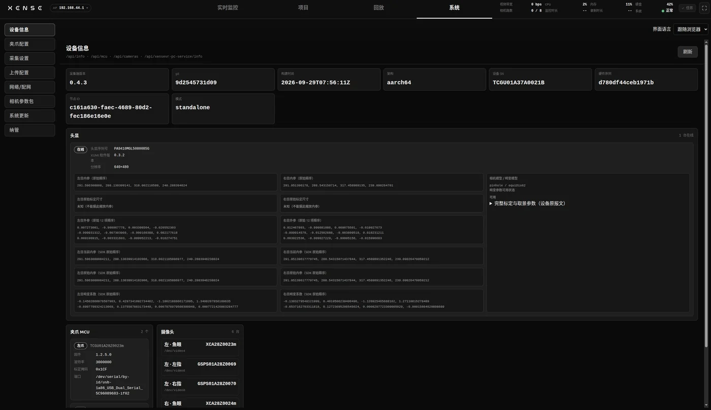
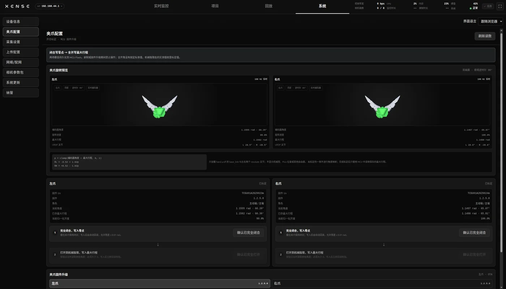
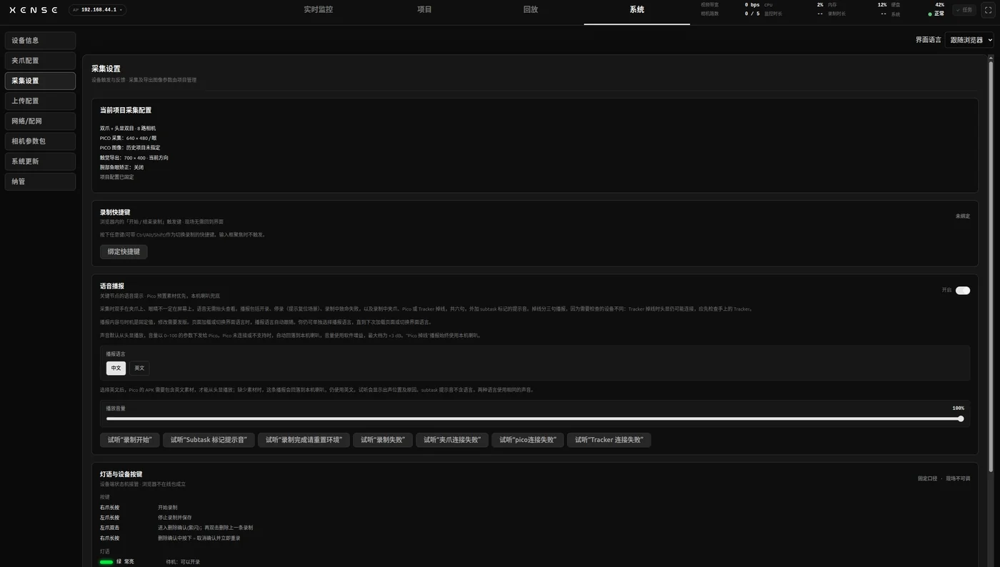
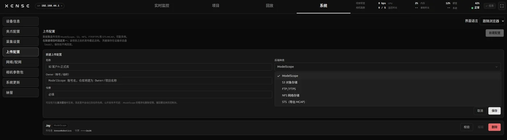
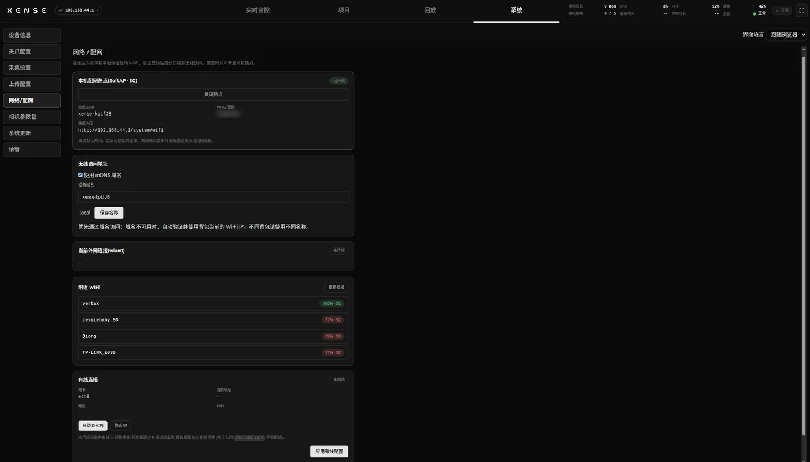
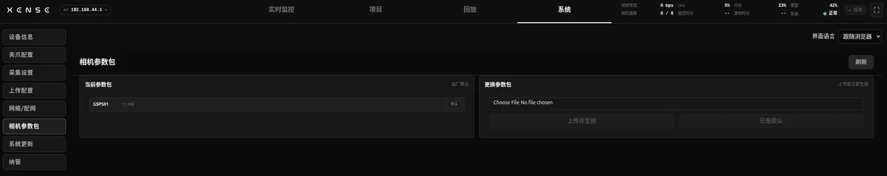

# 系统设置

控制台顶栏进「系统」，左侧是各子项。首次部署要做的是夹爪标定、上传配置和网络；其余项日常不用动。

| 子项 | 用途 | 什么时候来 |
|---|---|---|
| [设备信息](#device-info) | 版本、序列号、头显、夹爪与相机状态 | 报修、升级后核对 |
| [夹爪配置](#gripper) | 夹爪开合标定、固件升级 | 首次部署、换过夹爪 |
| [采集设置](#capture-settings) | 查看项目采集配置、录制快捷键、语音播报 | 核对配置、调语音 |
| [上传配置](#upload) | 远端上传账号 | 上传数据之前 |
| [网络 / 配网](#wifi) | 热点开关、现场 WiFi、有线 IP | 换场地、多人访问 |
| [相机参数包](#camera-profiles) | 导入或恢复相机参数 | 技术支持给了新包 |
| [系统更新](#update) | 升级与回滚 | 有新版本时 |

界面语言也在这里切换，默认跟随浏览器。

!!! warning "先停录制"
    录制进行中，切换项目、夹爪标定、夹爪固件升级、相机参数包导入和系统更新都会被拒绝，页面提示「录制进行中」。先在监控页停止录制。

## 设备信息 {#device-info}

只读页面，右上角「刷新」重新读取。

- **采集端**：软件版本、构建时间、设备 SN（与机身标签一致）。
- **头显**：在线状态、头显序列号、XUMI 软件版本、分辨率与相机参数。
- **夹爪**：左右爪各自的 SN 与固件版本。
- **相机**：各路相机清单，离线的标注「（离线）」。

什么时候来看：

- 报修、对机器：记设备 SN 和头显序列号，不要记 IP（会变）。
- 升级后：核对版本与构建时间是否已更新。
- 监控页相机路数不对：看哪路「（离线）」。
- 标定前：确认主夹爪固件 ≥ 1.2.0。

## 夹爪配置 {#gripper}

开合标定让夹爪开度归一到 0–1：闭合时写零点，全开时写最大行程。标定值存在夹爪里，断电、换背包都不丢，每只爪标一次即可；控制台与 PC 版标定脚本写的是同一份值。需要重标的情况见 PC 版[夹爪标定](../pc/calibration.md#41)。

逐爪进行，两步不可跳：

1. 确认该爪在线；状态显示「不支持」时，检查是否为主夹爪、固件是否 ≥ 1.2.0。
2. 夹爪完全闭合并握住，点「确认已完全闭合」，写入零点。
3. 夹爪打开到机械极限并保持，点「确认已完全打开」，写入最大行程。
4. 提示「开合标定完成」后，另一只爪重复。

!!! danger "写入即覆盖，两只爪都要标完"
    标定值写入后不可撤销。只写零点不写行程，开度不可用；只标一只爪，左右开度刻度不一致，数据里看不出来。

同页下方是「夹爪固件升级」，步骤见[夹爪固件](update.md#gripper-firmware)。

## 采集设置 {#capture-settings}

### 当前项目采集配置 {#capture-mode}

只读展示当前项目的采集配置。这些项在[新建项目](monitor-record.md#project-task)时选定，建完不能改。

| 模式 | 夹爪 | 头显 | 相机路数 |
|---|---|---|---|
| 双爪 | 2 只夹爪 | 不含头显 | 6 路 |
| 双爪 + 头显双目 | 2 只夹爪 | PICO 双目 | 8 路 |
| 双爪 + 头显右单目 | 2 只夹爪 | PICO 右眼 | 7 路 |

另外四项：

- **PICO 分辨率**：每眼 `640x480` 或 `1024x768`，仅带头显的模式。
- **PICO 图像源**：鱼眼原图或去畸变画面。
- **腕部鱼眼矫正**：见[下文](#undistort)。
- **触觉矫正图导出方向**：「当前方向 · 700 × 400（横图）」或「再逆时针 90° · 400 × 700（与 SDK 对齐）」。

选中项目后，头显会自动同步成项目的设置。

!!! warning "选错只能新建项目"
    配置建完即冻结。还没录过数据的空项目可以直接删掉重建。

### 腕部鱼眼矫正 {#undistort}

开启后，导出的数据集里腕部画面矫正为直线透视。录制文件始终保存原始鱼眼图，矫正只在导出时进行。

每只爪显示矫正参数状态。「未标定 · 按默认内参矫正」表示用该型号镜头的通用参数矫正，可以正常采集导出，精度略低于逐台标定。

### 录制快捷键 {#keybinding}

平板接了键盘时，可以绑定一个键来开始 / 结束录制：点「绑定快捷键」后按下想用的键，「清除」撤销。

- 快捷键存在当前浏览器里，换平板要重新绑。
- 只在控制台页面打开时生效，输入框里打字不会触发。

现场更推荐用[夹爪按键](gripper.md#buttons)录制，不依赖浏览器。

### 语音播报 {#voice}

语音从头显播放；头显未连接时由背包喇叭播放。播报内容与时机见[语音播报](gripper.md#voice-cues)。

这里可调三项：

- **开关**：一键静音。
- **音量**：0–100。
- **语言**：中文或英文，默认跟随界面语言。

每句旁边有「试听」按钮，会告诉你声音从哪里出。

## 上传配置 {#upload}

在这里保存远端上传账号，可以存多份，每份起一个名字。新建项目时绑定其中一份，之后导出上传不用再填账号。

| 种类 | 支持格式 | 要填 |
|---|---|---|
| ModelScope | LeRobot、MCAP | Owner、Token、新建仓库可见性 |
| S3 对象存储 | LeRobot、MCAP | 桶名、Endpoint、Region、Access Key、Secret Key |
| FTP / FTPS | LeRobot、MCAP | 服务器、端口、用户名、密码、目标目录 |
| NFS 网络存储 | LeRobot、MCAP | 服务器、导出路径、协议版本 |
| STS | 仅 MCAP | Server、Account、Project、Project Type |

上传目录统一为 **`<根>/ 项目名称 / 模式前缀-任务名-日期 /`**，前缀和日期由设备自动加（STS 除外）。

- **ModelScope**：Token 在 [ModelScope](https://www.modelscope.cn/my/overview) 头像 → 账号设置 → 访问令牌里新建；仓库可见性推荐私有。
- **S3**：桶要提前建好。
- **FTP / FTPS**：推荐 FTPS；目标目录要提前建好，从 `/` 开始写。
- **NFS**：目标目录要提前建好；协议版本默认「自动」。

配置步骤：

1. 「新建配置」，填名称、选种类、填字段，保存。
2. 点「校验」或「检测读写」，确认账号和目录可用。
3. 新建项目时在「上传后端」里选这份；已有项目在项目行里补绑。

凭据保存后不再显示，编辑时留空表示沿用原值。上传步骤见[导出与上传](projects-export.md#export)。

!!! warning "绑错账号撤不回来"
    数据传进别人的账号后很难撤回，公开发布同样不可逆。建项目时核对绑定的是哪一份。

## 网络 / 配网 {#wifi}

打开控制台的几种方式见[网络与控制台入口](network.md)，这里只讲怎么改。

| 区块 | 内容 |
|---|---|
| 本机热点 | 热点开关、名称与密码 |
| 当前 WiFi | 已连网络、IP，「断开并遗忘」 |
| 附近 WiFi | 扫描并连接现场网络 |
| 有线连接 | 自动（DHCP）或静态 IP |

### 连现场 WiFi {#wifi-site}

现场有 5 GHz WiFi、想让多台电脑或平板访问背包时再配。

1. 用平板（USB）或[背包热点](network.md#softap)打开控制台，进 系统 → 网络 / 配网。
2. 「重新扫描」，点目标网络，输入密码，连接。
3. 背包会记住这个网络，重启后自动重连。

列表只显示 5 GHz 网络（2.4 GHz 会干扰背包热点）。现场只有 2.4 GHz 时改用有线或热点。

### 有线 IP {#wifi-wired}

默认自动获取（DHCP），插上路由器即可用。只有网线直连电脑、或 IT 要求固定地址时才改：

1. 模式选「静态 IP」。
2. 填 IP 与前缀，如 `192.168.1.10/24`；直连时网关和 DNS 留空。
3. 「应用有线配置」。

!!! warning "改有线 IP 可能断开当前页面"
    正通过有线访问时，应用后要用新地址重新打开。改错了用平板或热点进入，改回「自动（DHCP）」。

## 相机参数包 {#camera-profiles}

相机参数包（`.xpack`）出厂已内置，只有技术支持提供新包时才需要导入。

1. 选择 `.xpack` 文件，点「上传并生效」，确认。
2. 提示「已生效」即完成；离线的相机会在上线时应用。
3. 画面异常或要退回出厂：点「恢复默认」。

导入失败时设备保持原参数不变。

## 系统更新 {#update}

升级与回滚见[升级与 OTA](update.md)。
