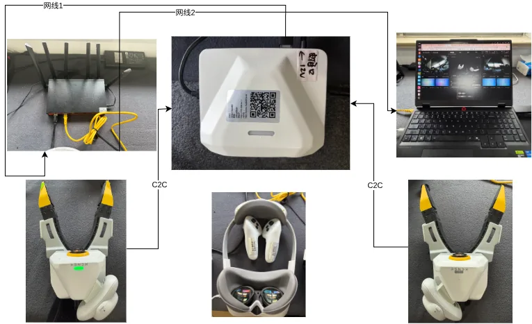
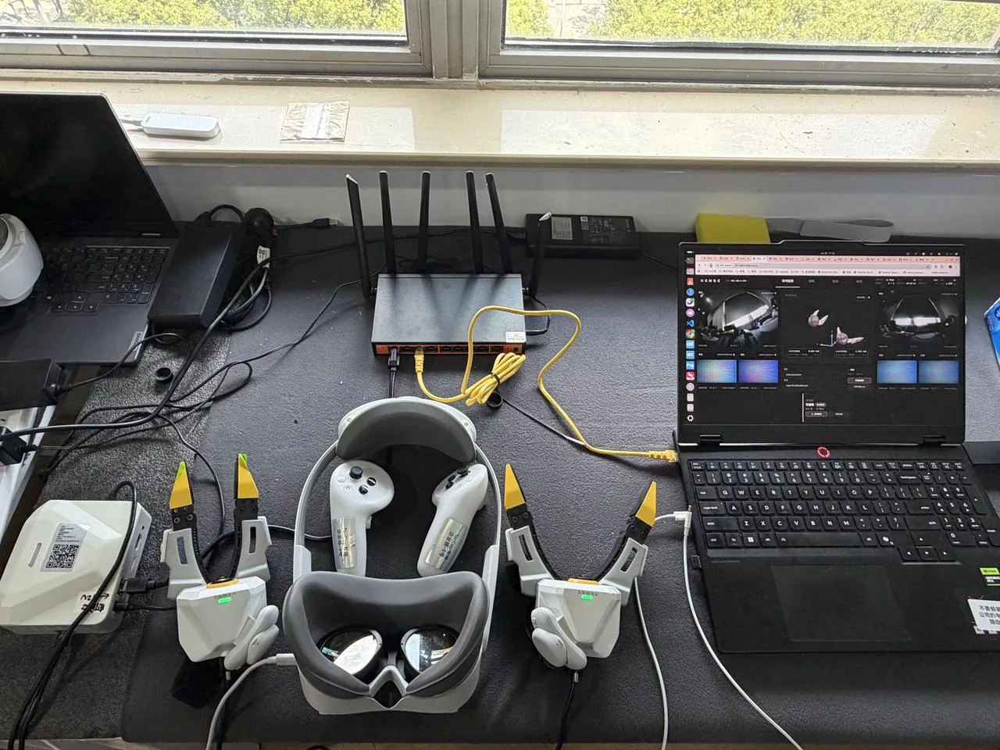

# 开箱、接线与供电

把箱里的东西接成一套能上电的系统:夹爪接背包、头显接背包、适配器或充电宝二选一供电。读完背包已上电、夹爪指示灯绿常亮,接着翻到[网络与控制台入口](network.md)打开控制台。

## 开箱核对 {#unbox}

箱内物品与数量见[产品线与配置对比](../product/editions.md)。接线前只核对三件事:

- 两只 XTac-UMI G1 一左一右:序列号末位单数为左、双数为右([序列号与左右识别](../common/gripper.md#sn));Type-C 线的锁紧接头完好,夹爪接口内无异物。
- 背包机身标签印着这台设备的 SN、热点名 `xense-<序列号后 6 位>`、热点密码与控制台地址,连网时要用,别撕([认机看标签](network.md#label))。
- 头显已按[Pico4 头显与追踪器](../common/pico4.md)配好:开发者模式、灭屏与休眠设为永不、两只追踪器已配对、XTac-UMI XR 已安装。接线不依赖这些,但没配好头显连不上。

## 背包接口 {#ports}

| 接口 | 位置 | 接什么 |
|---|---|---|
| UMI-L / UMI-R | 两侧 | 左 / 右夹爪,Type-C 锁紧线 |
| PICO | 前面板 | 头显,Type-C;走 USB 网络,能否同时给头显供电以随机说明为准 |
| HEAD、USB | 前面板 | 本页流程不用 |
| DC | 后面板 | 12 V 供电输入,接线图上标为 Type-C,以实物为准;接适配器或充电宝 |
| 网口 | 后面板 | RJ45,接路由器 LAN 口 |
| SD 卡槽、HDMI、耳机 | 后面板 | 日常采集不用 |

接口照片见[认识数采背包](../product/backpack.md)。

## 接线与拔线顺序 {#order}

顺序固定:夹爪 → 头显 → 背包上电。

1. 接夹爪:Type-C 锁紧线带螺钉的一端接夹爪本体,旋紧锁紧螺钉;另一端接背包侧面,左爪接 UMI-L,右爪接 UMI-R。夹爪由这根线总线供电,不需要单独电源。
2. 接头显:按[适配器供电](#adapter)或[充电宝供电](#powerbank)两种接法之一。
3. 给背包上电:DC 口接适配器或充电宝。开机后热点自动开启,夹爪指示灯绿常亮即待机(灯语见[夹爪按键、指示灯与序列号](../common/gripper.md#buttons-leds))。

拔线顺序相反:先停止录制,再拔背包端,最后松开锁紧螺钉拔夹爪端。上下电与插拔线缆时注意防静电。

!!! warning "先锁紧夹爪端,再接背包端"
    锁紧螺钉没旋紧,采集中线缆一松动夹爪就掉线,系统日志会反复出现 `mcu ... disconnected / reconnected`,这一条数据就废了。

## 适配器供电 {#adapter}

有插座的固定工位用这一种:头显一根线接背包,适配器接市电。

1. 左 / 右夹爪分别接 UMI-L / UMI-R。
2. 头显用 Type-C 线接背包 PICO 口,走 USB 网络;这一根线能否同时给头显供电以随机说明为准。
3. 12V3A 36W 适配器接背包 DC 口,再插市电。

## 充电宝供电 {#powerbank}

离开插座移动采集用这一种:头显与背包各由一路充电宝输出供电,箱内配两只充电宝(Type-C 输出 5V3A / 12V3A)。

线束按图中标签对号:

| 线束标签 | 线 | 接法 |
|---|---|---|
| UMI-L / UMI-R | 1.5 m 双 C | 左 / 右夹爪 ↔ 背包 UMI-L / UMI-R |
| PICO-LINK / PICO-DATA / POWER-PICO | 二合一 Type-C(数据 + 充电) | PICO-LINK 端接头显;PICO-DATA 接背包 PICO 口;POWER-PICO 接充电宝 |
| 12V DC-IN / POWER-COMPUTE | 0.5 m 双 C | 充电宝 ↔ 背包 DC 口,用充电宝的 12V3A 输出 |

1. 左 / 右夹爪分别接 UMI-L / UMI-R。
2. 头显先接二合一 Type-C 线:充电口接充电宝,数据口接背包 PICO 口。
3. 充电宝另一条线接背包 DC 口。

头显供电不足会掉电关机(运行功耗约 6–7 W,但需要稳定的供电能力)。箱内充电宝已按此选型;自购充电宝按 20 W 以上稳定输出选,磁吸充电宝要输出 5.4–8.4 V / 5 A Max 并配磁吸底座。背包自身的电池、续航与功耗数据待补。

!!! warning "采集中不要往充电宝上加设备"
    部分充电宝接上第二台设备时会停掉原有输出口,头显或背包会当场断电。所有线在开录前接好。

## 头显接背包 {#pico-link}

戴上头显打开 XTac-UMI XR,两种连接方式:

- USB 网络(默认,正式采集用这条):头显 Type-C 口已通过上面的接线连到背包 PICO 口。在 XR 里勾选「USB 网络」点「连接」,背包会自动在 USB 链路上建网(地址 `192.168.58.1`),不用手填。
- WiFi(仅供临时调试,会有网络波动与位姿延迟):头显与背包接同一台路由器(头显连路由器 WiFi,背包走网口或现场 WiFi,见[接入现场网络](network.md#lan)),XR 里不勾「USB 网络」,填背包的 IP 再连接。要事先知道背包 IP,且背包服务已开启。

XR 右上角是折叠按钮;追踪器精度不准或与背包断开时,XR 与控制台监控页都有图标提示。界面说明见 [XTac-UMI XR 界面](../common/pico4.md#pico-toolkit-ui)。

站到作业位、面朝作业方向再打开 XR:首次启动 XR 的位置就是[世界坐标系原点](../common/pico4.md#pico-frame),采集过程中不要重启 XR。

!!! warning "头显灭屏与休眠必须设为永不"
    头显灭屏后停止工作,位姿数据随之中断。在头显的 开发者选项 → 企业设置 → 电源策略 里把系统休眠和灭屏时间都改为永不,步骤见[Pico4 头显与追踪器](../common/pico4.md#pico-system)。

## 固定工位的布置 {#desk}

实验室里常把背包、PC 与路由器接成一个局域网,PC 用浏览器开控制台:

- 背包网口与 PC 网线都接路由器 LAN 口;背包有线口出厂 DHCP,插上即用。
- 头显仍走 PICO 口 USB 网络;或连路由器 WiFi,在 XR 里填背包 IP。
- PC 浏览器打开背包 IP 或 `http://xense-<序列号后 6 位>.local`。找 IP 用 [Windows 设备扫描器](network.md#scanner);Ubuntu 的 PC 记得在系统设置里勾选 Wired,见[有线](network.md#wired)。

## 上电后核对 {#verify}

打开控制台后看三处,任何一处不对回头查接线:

- 顶栏右侧「路相机」显示 在线数 / 总数,双爪模式应为 6 / 6;少一路多半是夹爪线没锁紧或没插到底。
- 夹爪指示灯绿常亮。红爆闪是夹爪端自检有问题,红常亮是背包侧检测到夹爪掉线。
- 系统 → [采集模式](system.md#capture-mode)与实际接法一致(双爪 / 双爪 + 头显 / 单爪 / 单爪 + 头显 / 仅头显);头显连上后监控页位姿视图跟手动,见[画面与位姿检查](monitor-record.md#checks)。

上电没反应或头显时断时续,先换线、换口试。DC 口、PICO 口或 USB 口本身接触不良属硬件问题,记下机身 SN 联系支持,不要用力掰扯接口,见[故障排查](troubleshooting.md)。
