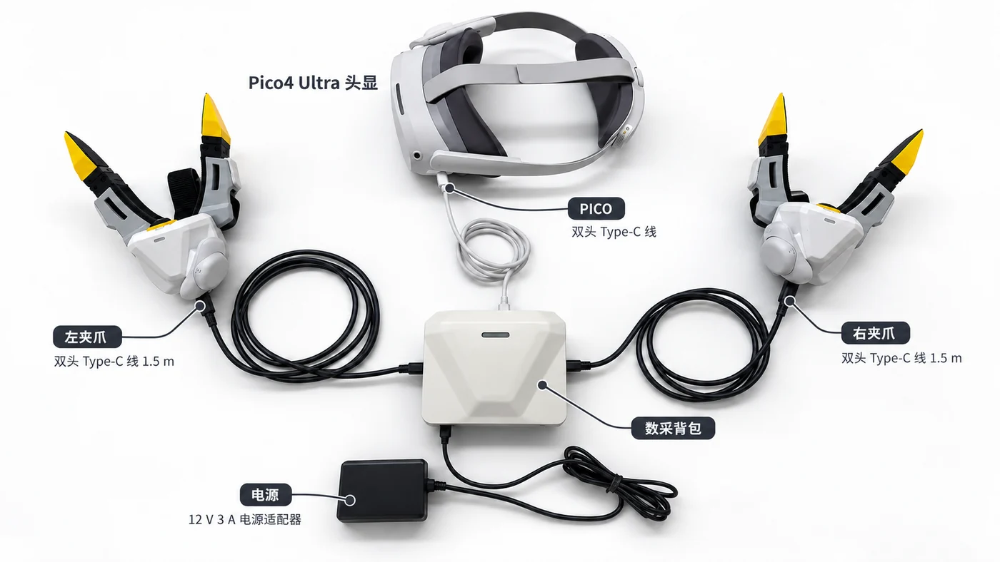
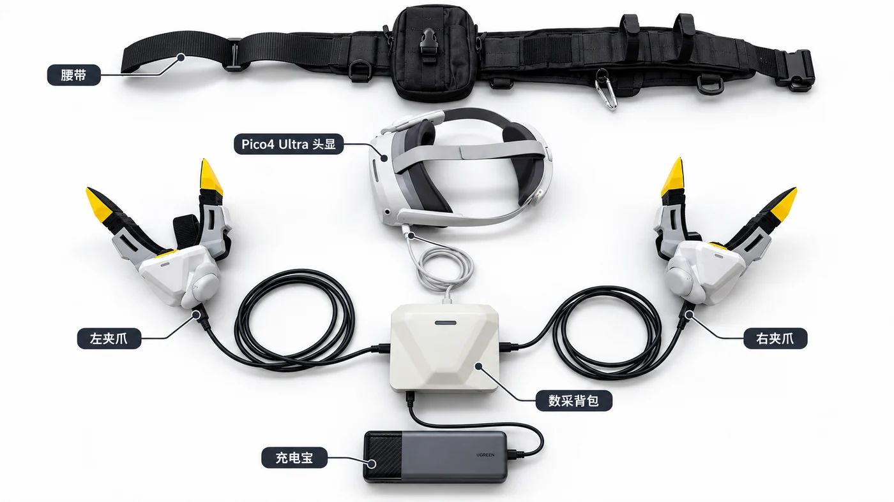
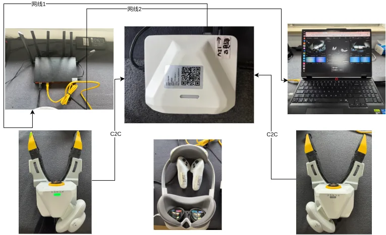
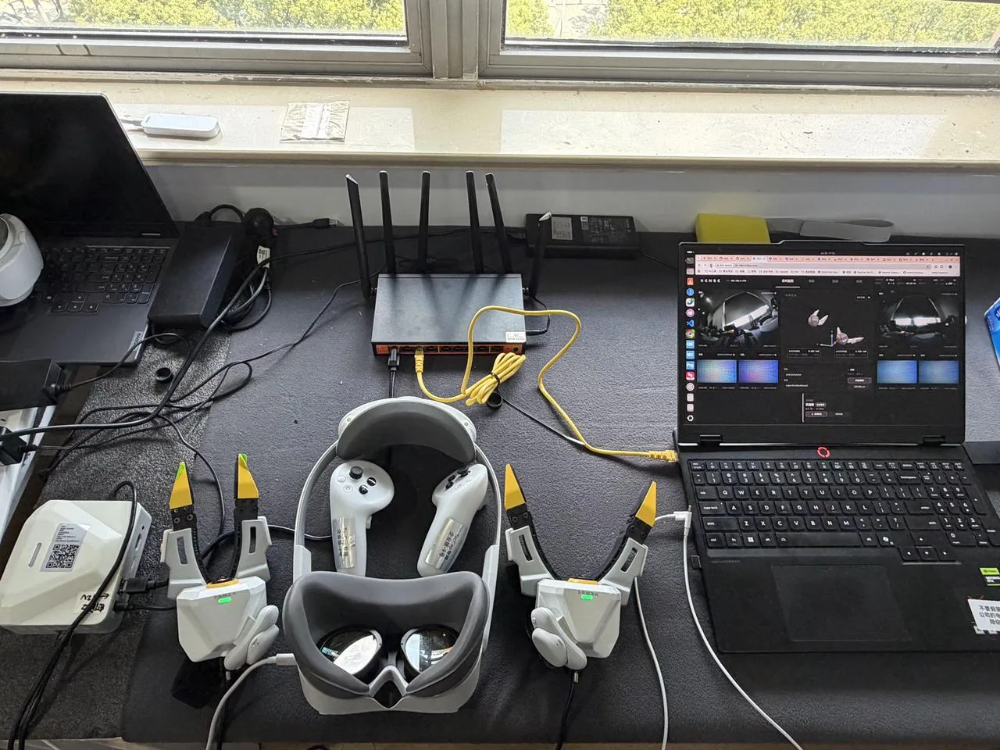

# 开箱、接线与供电

把箱里的东西接成一套能上电的系统：夹爪接背包、头显接背包、适配器或充电宝二选一供电。读完背包已上电、夹爪指示灯绿常亮，接着翻到[网络与控制台入口](network.md)打开控制台。

## 开箱核对 {#unbox}

箱内物品与数量见[产品线与配置对比](../product/editions.md)。接线前只核对三件事：

- 两只 XTac-UMI G1 一左一右：序列号末位单数为左、双数为右（[序列号与左右识别](../common/gripper.md#sn)）；Type-C 线的锁紧接头完好，夹爪接口内无异物。
- 背包机身标签印着这台设备的 SN、热点名 `xense-<序列号后 6 位>`、热点密码与控制台地址，连网时要用，别撕（[认机看标签](network.md#label)）。
- 头显已按[Pico4 头显与追踪器](../common/pico4.md)配好：开发者模式、灭屏与休眠设为永不、两只追踪器已配对、XTac-UMI XR 已安装。接线不依赖这些，但没配好头显连不上。

## 背包接口 {#ports}

| 接口 | 位置 | 接什么 |
|---|---|---|
| UMI-L / UMI-R | 两侧 | 左 / 右夹爪，Type-C 锁紧线 |
| PICO | 前面板 | 头显，Type-C；走 USB网络，能否同时给头显供电以随机说明为准 |
| HEAD、USB | 前面板 | 本页流程不用 |
| DC | 后面板 | 12 V 供电输入，接线图上标为 Type-C，以实物为准；接适配器或充电宝 |
| 网口 | 后面板 | RJ45，接路由器 LAN 口 |
| SD 卡槽、HDMI、耳机 | 后面板 | 日常采集不用 |

接口照片见[认识数采背包](../product/backpack.md)。

## 接线与拔线顺序 {#order}

顺序固定：夹爪 → 头显 → 背包上电。

1. 接夹爪：Type-C 锁紧线带螺钉的一端接夹爪本体，旋紧锁紧螺钉；另一端接背包侧面，左爪接 UMI-L，右爪接 UMI-R。夹爪由这根线总线供电，不需要单独电源。
2. 接头显：头显用头显连接线（Pico → Pack）接背包 PICO 口，[适配器供电](#adapter)与[充电宝供电](#powerbank)两种方式接法相同。
3. 给背包上电：DC 口接适配器或充电宝。开机后热点自动开启，夹爪指示灯绿常亮即待机（灯语见[夹爪按键、指示灯与语音](gripper.md#buttons-leds)）。

拔线顺序相反：先停止录制，再拔背包端，最后松开锁紧螺钉拔夹爪端。上下电与插拔线缆时注意防静电。

!!! warning "先锁紧夹爪端，再接背包端"
    锁紧螺钉没旋紧，采集中线缆一松动夹爪就掉线，系统日志会反复出现 `mcu ... disconnected / reconnected`，这一条数据就废了。

## 适配器供电 {#adapter}

有插座的固定工位用这一种：头显一根线接背包，适配器接市电。

1. 左 / 右夹爪分别接 UMI-L / UMI-R。
2. 头显用头显连接线（Pico → Pack）接背包 PICO 口，走 USB网络；这一根线能否同时给头显供电以随机说明为准。
3. 12 V 3 A 适配器接背包 DC 口，再插市电。

## 充电宝供电 {#powerbank}

离开插座移动采集用这一种：箱内一只充电宝（20000 mAh，45 W）经 0.3 m 12 V PD 电源线给背包供电，头显仍用头显连接线接背包 PICO 口，接法与适配器供电相同。

| 线 | 接法 |
|---|---|
| 夹爪连接线（1.5 m 双 C）×2 | 左 / 右夹爪 ↔ 背包 UMI-L / UMI-R |
| 头显连接线（Pico → Pack，1.5 m 双 C） | 头显 Type-C 口 ↔ 背包 PICO 口 |
| 12 V PD 电源线（0.3 m） | 充电宝 ↔ 背包 DC 口，用充电宝的 12 V 输出 |

1. 左 / 右夹爪分别接 UMI-L / UMI-R。
2. 头显用头显连接线接背包 PICO 口，走 USB网络；这一根线能否同时给头显供电以随机说明为准。
3. 12 V PD 电源线一端接充电宝，另一端接背包 DC 口。

头显供电不足会掉电关机，采集随之中断；开工前确认头显电量充足，采集中留意头显的电量图标（在[电源策略](../common/pico4.md#pico-system)里设为常驻显示）。背包自身的电池、续航与功耗数据待补。

!!! warning "采集中不要往充电宝上加设备"
    部分充电宝接上第二台设备时会停掉原有输出口，背包会当场断电。所有线在开录前接好。

## 头显接背包 {#pico-link}

戴上头显打开 XTac-UMI XR。头显与背包**只能有线连接**：头显 Type-C 口已通过上面的接线连到背包 PICO 口，在 XR 里勾选「USB网络」点「连接」，背包会自动在 USB 链路上建网（地址 `192.168.58.1`），不用手填。

XR 右上角是折叠按钮；追踪器精度不准或与背包断开时，XR 与控制台监控页都有图标提示。界面说明见 [XTac-UMI XR 界面](../common/pico4.md#pico-toolkit-ui)。

录制中不要碰这根线：拔掉或松动会让设备立即停止并作废当前这条录制，见[录制中头显断联](monitor-record.md#pico-disconnect)。

站到作业位、面朝作业方向再打开 XR：首次启动 XR 的位置就是[世界坐标系原点](../common/pico4.md#pico-frame)，采集过程中不要重启 XR。

!!! warning "头显灭屏与休眠必须设为永不"
    头显灭屏后停止工作，位姿数据随之中断。在头显的 开发者选项 → 企业设置 → 电源策略 里把系统休眠和灭屏时间都改为永不，步骤见[Pico4 头显与追踪器](../common/pico4.md#pico-system)。

## 固定工位的布置 {#desk}

实验室里常把背包、PC 与路由器接成一个局域网，PC 用浏览器开控制台：

- 背包网口与 PC 网线都接路由器 LAN 口；背包有线口出厂 DHCP，插上即用。
- 头显仍用 Type-C 线接背包 PICO 口，走 USB网络，不走路由器。
- PC 浏览器打开背包 IP 或 `http://xense-<序列号后 6 位>.local`。找 IP 用 [Windows 设备扫描器](network.md#scanner)；Ubuntu 的 PC 记得在系统设置里勾选 Wired，见[有线](network.md#wired)。

## 上电后核对 {#verify}

打开控制台后看三处，任何一处不对回头查接线：

- 顶栏右侧「相机路数」显示 在线数 / 总数，「双爪」模式应为 6 / 6；少一路多半是夹爪线没锁紧或没插到底。
- 夹爪指示灯绿常亮。红爆闪是夹爪端自检有问题，红常亮是背包侧检测到夹爪掉线。
- 当前项目的[采集模式](system.md#capture-mode)与实际接法一致（「双爪」「双爪 + 头显双目」「双爪 + 头显右单目」「单爪」「单爪 + 头显」「仅头显」，系统页可查看）；头显连上后监控页位姿视图跟手动，见[画面与位姿检查](monitor-record.md#checks)。

上电没反应或头显时断时续，先换线、换口试。DC 口、PICO 口或 USB 口本身接触不良属硬件问题，记下机身 SN 联系支持，不要用力掰扯接口，见[故障排查](troubleshooting.md)。
