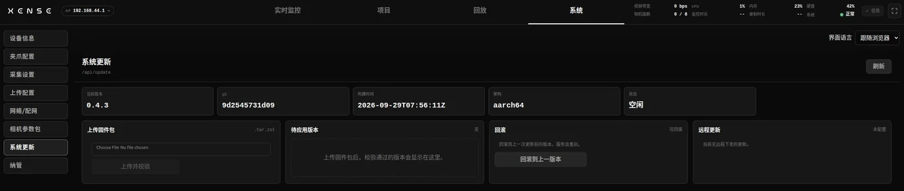

# Upgrades and OTA

Console upgrades are done on System → System update; gripper firmware is flashed on System → Gripper, see [Gripper firmware](#gripper-firmware).

## Importing an upgrade bundle {#bundle}

An upgrade bundle is a `.tar.zst` file from technical support, with the version in its name, such as `taccap-collector-v0.4.3-….tar.zst`. It updates only the console program: no gripper firmware, no camera profiles, and your collected data is untouched.

1. Stop recording.
2. "Upload firmware package" → pick the `.tar.zst` → "Upload and verify".
3. Once it passes, check the version on the "Version pending application" card.
4. "Apply update and restart" → confirm. The restart takes about a minute; "Update applied" means done. If it times out, refresh the page.
5. On [Device info](system.md#device-info), confirm the version and build time have changed.

If verification fails, the device refuses the bundle, writes the reason into "Last error" and keeps running the current version. Common causes: a corrupt or incomplete file, or a version that jumps too far or is older than the current one.

!!! note "Some fixes are handled by technical support"
    A few fixes involve the device's system components, are not in the upgrade bundle and cannot be done on site. Whether a device needs one is for technical support to tell you. "Upload firmware package" accepts only `.tar.zst` bundles; do not upload any other file technical support gives you there.

## Rollback {#rollback}

The device keeps the previous version when it upgrades. If the new version fails to start, the file is corrupt or power is lost mid-upgrade, it falls back to the previous version automatically and cannot be bricked.

Manual rollback: when the "Rollback" card shows "Rollback available", click "Roll back to previous version" → confirm. You can go back only one step; a device that has never been upgraded since leaving the factory has no previous version.

Upgrades and rollbacks do not affect recorded data, projects, upload configurations or network settings.

## Gripper firmware {#gripper-firmware}

Gripper firmware does not use the upgrade bundle; flash it from "Gripper firmware upgrade" at the bottom of System → [Gripper](system.md#gripper), with no computer needed. The firmware files and whether you need to flash are covered in the Developer Kit's [firmware OTA upgrade](../pc/versions.md#ota).

1. Stop recording, and make sure no travel calibration is in progress.
2. Pick the target gripper (left / right) → pick the `.bin` → "Upload and flash" → confirm.
3. After "Firmware flashed, the device is restarting", **power the backpack off and on again** (or replug that gripper's Type-C cable); otherwise the gripper drops data.
4. Check the firmware version on [Device info](system.md#device-info); if the calibration card shows "Not calibrated", recalibrate on [Gripper](system.md#gripper).

You can "Abort" while flashing; if it fails, just start again — it cannot brick the gripper.

!!! danger "Pick the firmware by role, and never cut power while flashing"
    The leader gripper (SN ending in `m`) takes `tc-gu-01-master.bin` and the follower (SN ending in `s`) takes `tc-gu-01-slave.bin` — by role, not by left or right. Flash the wrong one and the gripper will not start, and only the factory can recover it; cutting power or unplugging during writing also corrupts the firmware.
