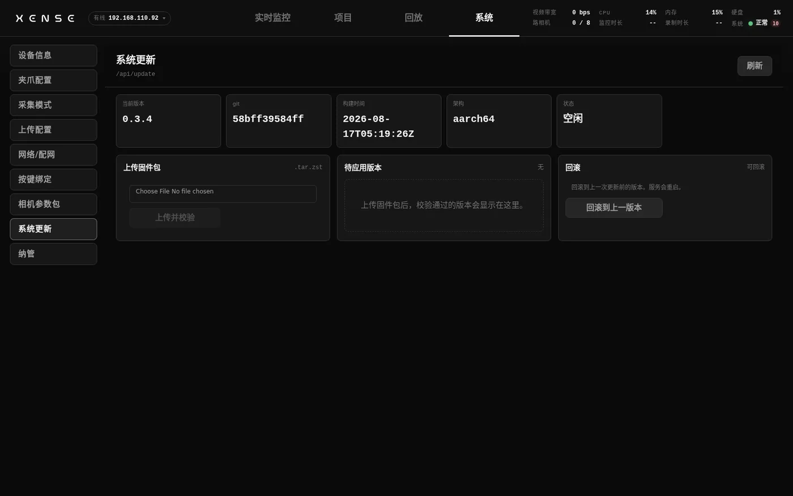

# 升级与 OTA

本页讲 XTac-UMI Collector 控制台(下称控制台)自身的升级:在系统页导入升级包、升级失败时怎么回到上一版、远端下发的强制更新在现场会怎么表现。读完能独立完成一次升级并核对结果。夹爪固件的刷写在页末单独一节。

所有操作都在 控制台 → 系统 → 系统更新 页完成,版本以这一页显示为准(本文按 0.3.9 写)。页面从上到下是指标卡(当前版本、git、构建时间、架构、状态:空闲 / 已就绪 / 应用中 / 错误)与「上传固件包」「待应用版本」「回滚」「远程更新」四张卡。

截图为 0.3.4 界面,0.3.9 的页面在「回滚」右侧多了一张「远程更新」卡。

## 导入升级包 {#bundle}

升级包是一个 `.tar.zst` 文件,由技术支持提供,文件名形如 `taccap-collector-95a9f890c421-v0.3.9-aarch64.tar.zst`:中间 12 位是 git hash,后面是版本号与架构。包里只有控制台程序(前后端打在同一个二进制里)和一份 `manifest.json`,不含夹爪固件、相机参数包与任何采集数据。

一个版本的身份是**版本号 + 12 位 git hash**:版本号更高会升;版本号相同但 hash 不同也会升(同版本的修订构建);两者都相同则什么也不做。核对版本时两样都要对上。

1. 停止录制。应用更新时服务会重启,录制进行中会被直接拒绝。
2. 「上传固件包」→ 选 `.tar.zst` → 「上传并校验」,带上传进度条。校验通过后提示「已上传并校验:<版本>」,状态变为「已就绪」。
3. 在「待应用版本」卡核对版本号、git 与 `sha256`。
4. 「应用更新并重启」→ 确认。页面显示「服务重启中,等待重新连接…」,新版本起来后提示「更新已应用,服务已重启」。前端最多等 90 秒,超时提示「服务重启超时,请手动刷新确认状态」,通常刷新一下就回来了。
5. 到[设备信息](system.md#device-info)核对「采集端版本 / git / 构建时间」确实变了。

校验在设备端做三件事,任一不过就拒收并写进「上次错误」:`sha256` 与包内 `manifest.json` 对账(包损坏或传输不完整);架构必须与设备一致(背包是 `aarch64`);当前版本必须不低于包声明的最低起始版本(不允许跨大版本或降级)。上传本身不改变任何东西,拒收后当前版本照常运行。

## A/B 双槽与回滚 {#rollback}

应用更新时,设备把正在运行的程序保留为上一版,再原子地换入新版并重启;新版启动后要真正监听、连续存活 30 秒且本机健康检查通过,这次升级才算提交。提交后上一版仍然留着供手动回滚;下一次升级会把它覆盖,所以只能退一步。

自动回滚在这些情况下发生,不需要人干预:

- 新程序起不来、启动早期崩溃或健康检查不过,连续失败 3 次后自动换回上一版并重启。
- 启动时发现换入的文件与记录不符(损坏或错包),立即换回。
- 升级中途断电:换入的顺序是先保留旧版、再原子替换,任何时刻磁盘上都有一份完整可运行的程序;重新上电后要么新版通过自检并提交,要么按上面的规则退回旧版,不会变砖。重新上电后到系统更新页看当前版本与「上次操作 / 上次错误」,需要的话重新导入包。

手动回滚:「回滚」卡显示「可回滚」时,点「回滚到上一版本」→ 确认,服务重启回到旧版。显示「不可用」说明这台设备还没成功应用过更新(出厂首装),没有上一版可退。回滚同样要求没有进行中的录制。

回滚与升级只换控制台程序;录制数据、项目 / 任务、上传配置与网络配置存放在别处,不受影响。

## 远程强制更新 {#remote}

0.3.9 起,管理端可以指定版本下发到设备并强制安装,操作员不需要逐台导入包;也可以分批发布,先在小范围验证再推广。前提是背包能访问远端:接[有线或现场 WiFi](network.md#lan);只开着自己热点的背包收不到。

设备收到后按固定顺序走,「什么时候真的重启」只由设备端决定:

1. 下载:后台下载升级包,右下角卡片显示进度(源不给总大小时只显示已下载多少)。
2. 暂存:下载完成后走与手动导入完全相同的校验;通过后才开始倒计时,下载耗时不计入。
3. 倒计时:宽限期由下发方指定,默认 5 分钟、最短 30 秒。卡片显示「将在 N 分 NN 秒后自动更新并重启」;想提前可以点「立即更新」(录制中会被拒)。
4. 到点:没在录制就立即应用并重启;正在录制则卡片变为「更新等待采集结束」,等本条 episode 正常收尾后再重启,绝不打断采集。晚几分钟升级,比一条被腰斩的 episode 便宜得多。
5. 新版本第一次进入界面,卡片显示「已更新到新版本」与本次更新内容,点「知道了」关闭。

卡片贴在右下角常驻,刻意不做全屏遮罩:宽限期里操作员很可能正在采集,画面与停止按钮都不能被挡住。另有两次一次性提示抓注意力:新版本刚下发时弹一次确认框(「现在就更新吗?」选「取消」则继续倒计时),倒计时快到时弹一次「即将自动更新,请尽快收尾」。

| 卡片状态 | 含义 | 你要做的 |
|---|---|---|
| 管理端已下发更新,正在下载 | 后台下载中 | 不用管,可以继续采集 |
| 管理端要求更新,将在 … 后自动更新 | 已暂存,倒计时中 | 收尾当前工作;或点「立即更新」 |
| 更新等待采集结束 | 到点但在录制 | 正常录完这条,停录后自动重启 |
| 正在更新 | 服务即将重启 | 等界面短暂断开后自动恢复 |
| 更新准备失败 | 下载或校验失败 | 不用手动重试,设备下一轮自动重投;持续失败先查网络 |
| 已更新到新版本 | 升级完成 | 看一眼更新内容,点「知道了」 |

系统更新页的「远程更新」卡显示同一份状态(来源、阶段、剩余秒数),没有下发时显示「当前无远程下发的更新」。远端下发的重启与回滚同样遵守录制保护。

## 夹爪固件 {#gripper-firmware}

夹爪(XTac-UMI G1)的 MCU 固件不走上面的升级包。背包版在控制台里直接刷:控制台 → 系统 → [夹爪配置](system.md#gripper) 页的「夹爪固件升级」面板,不需要 PC 与 SDK 脚本。固件镜像、按角色选镜像的规则、当前发布版本(主夹爪 1.2.2)与「我需要刷吗」的判断见 [PC 版的固件 OTA 升级](../pc/versions.md#ota),两种形态刷的是同一份镜像。

1. 停止录制,且没有正在进行的开合标定。固件升级独占串口,两者进行中都会被拒。
2. 「夹爪固件升级」→ 选目标爪(左爪 / 右爪,面板显示该爪的 SN,固件只会刷到选中的这一只;该爪的角色 Leader / Follower 看同页标定卡)→ 选 `.bin` → 「上传并刷写」→ 确认。
3. 看上传进度与刷写阶段(启动中 → 写入中 → 校验中 → 应用中 → 完成),完成后提示「固件已刷写完成,设备正在重启」。中途可「中止」:新固件写在备用分区,校验通过前不覆盖运行中的那份,中止或传输失败不会刷坏,重来即可。
4. 等夹爪重启完成后,给背包断电再上电(或拔插该夹爪的 Type-C 线)。刷后的重启是软复位,夹爪的 USB 转串口芯片没断过电,会停在悄悄丢状态帧的降级状态,原因见 [PC 版的说明](../pc/versions.md#ota)。
5. 到[设备信息](system.md#device-info)的「夹爪 MCU」核对固件版本;主夹爪升到 1.2.0 以上后回[夹爪配置](system.md#gripper)重标零点与行程。

!!! danger "按角色选镜像,刷写期间不要断电或拔线"
    主夹爪(SN 末位 `m`)刷 `tc-gu-01-master.bin`,从夹爪(SN 末位 `s`)刷 `tc-gu-01-slave.bin`,按角色不按左右;控制台不校验镜像与角色是否匹配,刷错角色夹爪无法启动,需返厂恢复。写入与应用阶段断电或拔线会写坏固件。
