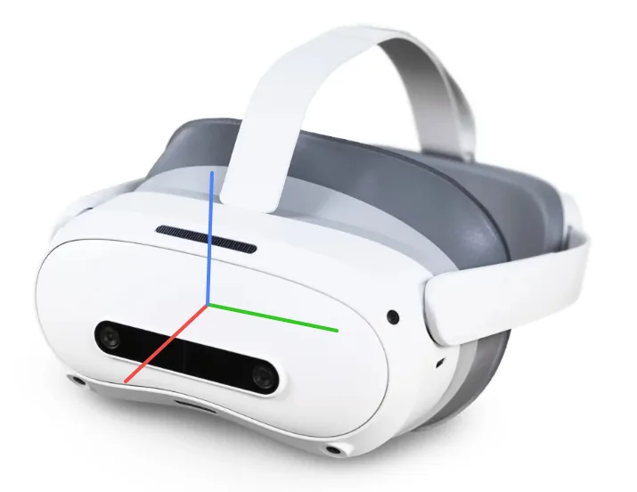

# 坐标系

本页定义位姿数据所在的坐标系:世界坐标系在哪、朝哪,以及采集时怎么看位姿是否正确。两种形态的位姿都来自同一套 Pico4 头显与追踪器,坐标系定义相同;查看位姿的界面不同,那一段用「背包版 / PC 版」标签页分开写。

## 世界坐标系

世界坐标系由头显上的 XTac-UMI XR 在启动瞬间建立并冻结,是右手系,重力对齐:

| 轴 | 方向 |
|---|---|
| 原点 | 首次启动 XTac-UMI XR 那一刻头显所在的位置 |
| X 轴(红) | 设备前向,沿头显前部相机安装面法线指向前方 |
| Y 轴(绿) | 设备左向,与 X 轴正交,按右手坐标系约定确定 |
| Z 轴(蓝) | 设备上向,与 X、Y 均正交,由右手定则唯一确定 |

{ width="420" }

坐标系只在启动瞬间跟着头显,冻结后就固定在空间里,转头、走动都不会带着它动;重启 XTac-UMI XR 会重新建系,原点和方向都会变。所以启动时要面朝机器人正前方,让 X 轴对齐机器人正前方,而且同一个数据集采集期间不要重启它,操作步骤见[启动与坐标系对齐](pico4.md#pico-frame)。

数据集里所有位姿都以这个世界系为参考:PC 版落盘的是末端 TCP 位姿 `tcp.x/y/z` 加 6D 旋转 `r1..r6`(旋转矩阵前两列,约定见[每帧记录内容](../pc/recording.md#53));背包版 MCAP 里记录头显与追踪器的位姿。

## 采集时的位姿视图 {#world-view}

=== "背包版"

    控制台「实时监控」页的位姿视图实时显示左右爪与头显的位姿,下方是左右爪开合角度(rad / deg / 开合百分比)。夹爪闭合时角度约 0.02 rad,再施加一定的力可以到零。开录前逐个摇晃夹爪,确认左右位姿各自跟着动;不动或跳变先查[追踪器绑定](pico4.md#pico-tracker-bind)与视野遮挡。

=== "PC 版"

    `--display_data=true` 会在 Rerun 里开出 `/world` 3D 视图:夹爪以带标签的椭球 + 三轴画在实时 `tcp.*` 处,拖出一条轨迹面包屑。

    - 场景按 `FLU` 声明,初始视角朝 +X,世界轴标 `+X forward / +Y left / +Z up`。
    - 面包屑保留最近 90 个采样点(30 fps 下约 3 秒),越旧越淡。
    - 头显相机开启时,头显以更小的琥珀色 `HEAD` 标记画进同一个 `/world`,不带轨迹。
    - `--show_trajectory` 默认开启,`false` 关闭;`--robot.enable_tracker=false` 时自动跳过。
    - 夹爪平放时 EE 标记应在两指中点、三轴呈 X 前 / Y 左 / Z 上,否则追踪器装错了。
    - 标量面板里的 `tracker pose` 是追踪器原始位姿,仅供查看;落盘的是 `tcp.*`。

## 局部坐标系

头显本体坐标系的三轴与世界系同一约定:X 前(前部相机安装面法线方向)、Y 左、Z 上,右手系;原点定义待补。

夹爪局部坐标系定义待补。目前已知的是 PC 版落盘的 `tcp.*` 由追踪器位姿经每侧内置的实测 tracker→EE 变换得到,可用 `robot.tracker_to_ee_pos` / `robot.tracker_to_ee_quat` 覆盖,见 [RobotConfig 配置项](../pc/reference.md#robotconfig)。
