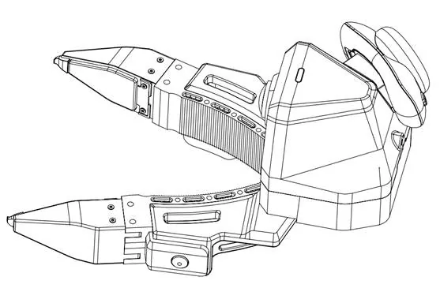
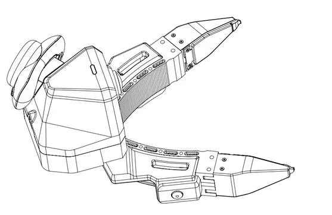
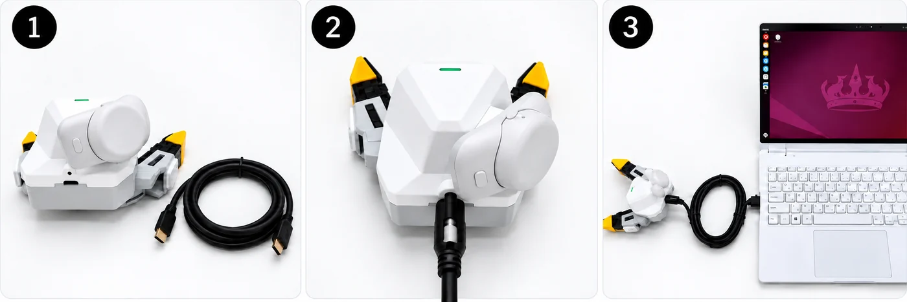
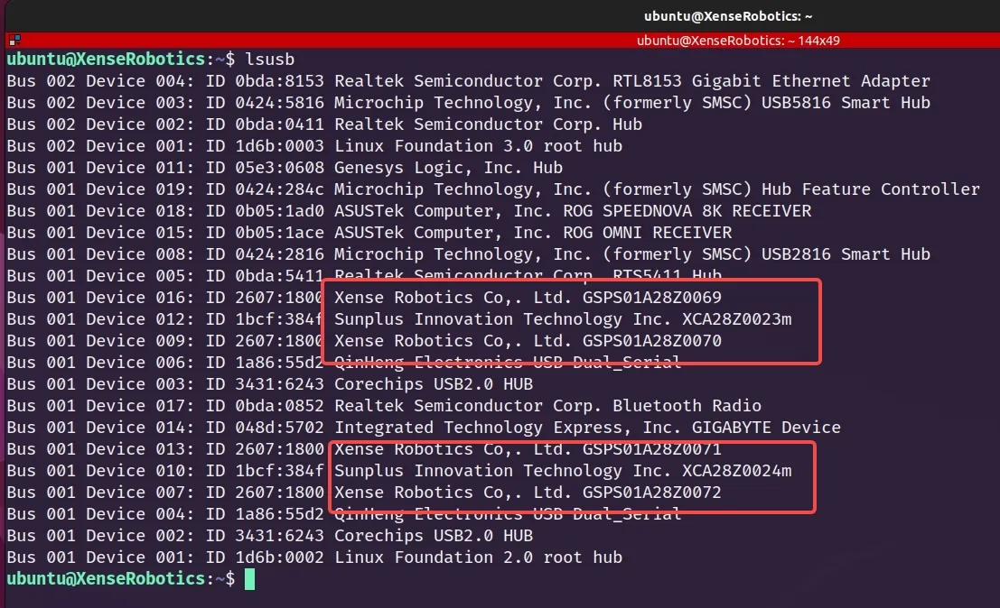
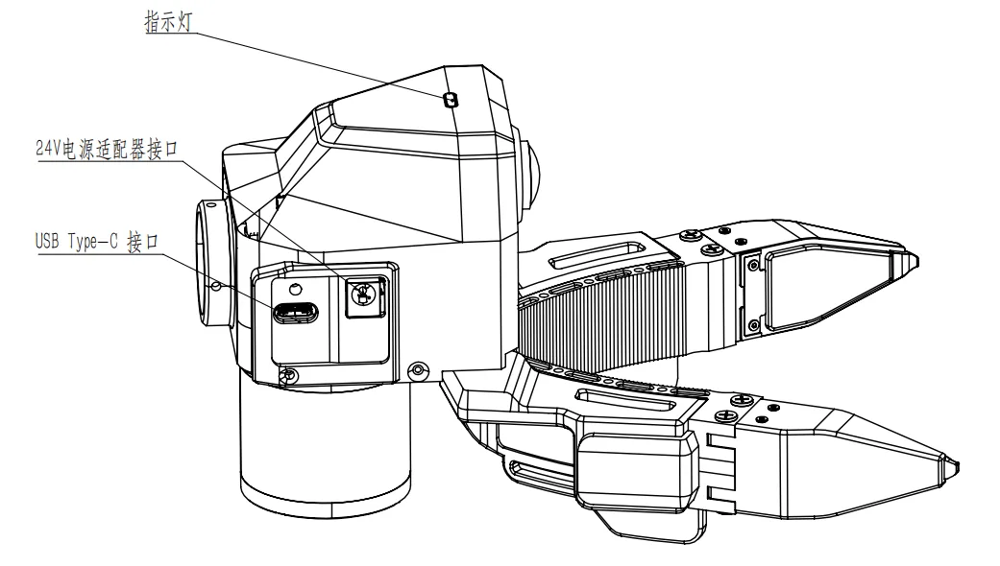
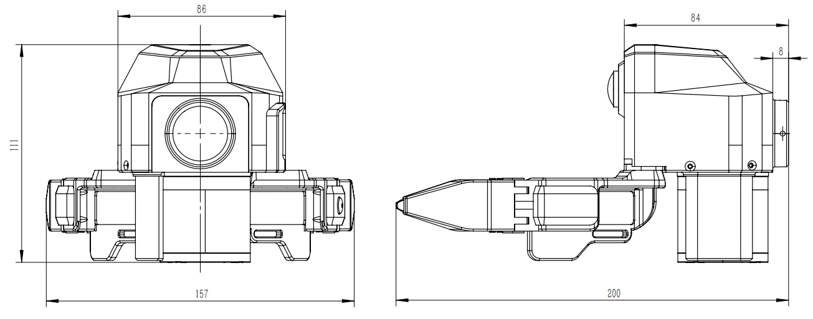
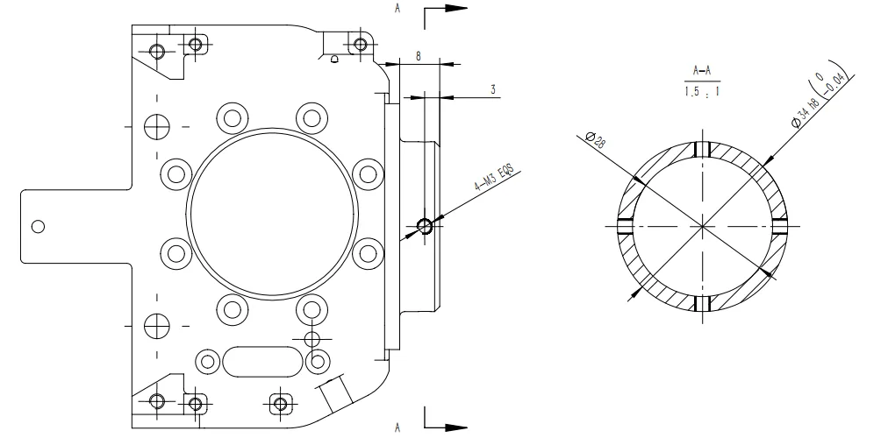
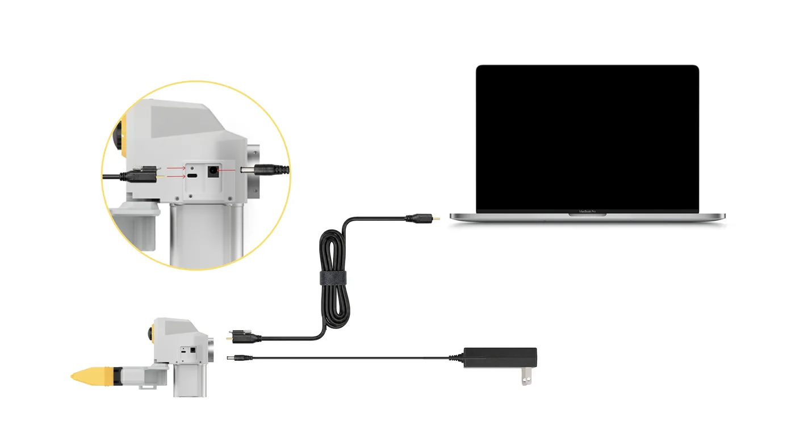
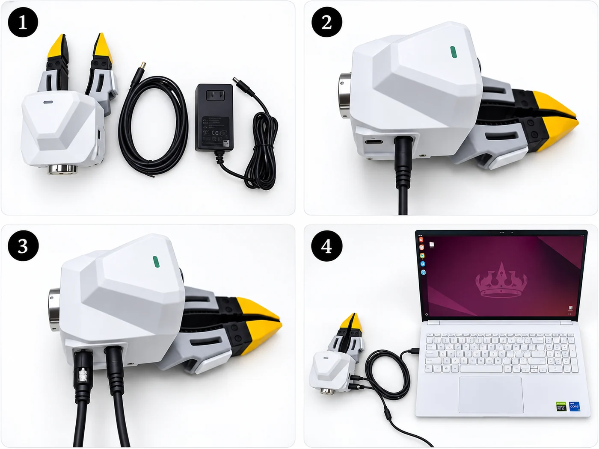

# Gripper connection and serial numbers

The gripper is the same on both editions; only where the cable goes and how detection is checked are split into "Backpack Kit / Developer Kit" tabs.

- Backpack Kit buttons, LEDs and voice: [Gripper buttons, LEDs and voice](../backpack/gripper.md).
- Product positioning and components: [XTac-UMI G1](../product/g1.md); specs: [Specifications](../product/specs.md#specs).

## Leader gripper connection and use {#install}

=== "Left leader gripper"

    { width="360" }

=== "Right leader gripper"

    { width="360" }

The leader gripper takes power and communication over USB Type-C.

### Before connecting

- Left and right leader grippers, two USB locking cables, and the collection terminal (the backpack or the collection PC; for the PC see [Collection host requirements](../pc/install.md#host-spec)).
- No 9V/12V fast-charging adapter connected directly to the leader gripper.
- Type-C locking end intact, nothing foreign in the port.
- Visuotactile sensor surfaces free of dirt, scratches, looseness and foreign objects.

### Connection steps

{ width="560" }

1. Take out the USB Type-C communication cable.
2. Plug it into the leader gripper body's Type-C port and **tighten the locking screws**.
3. Plug the other end into the collection terminal: Backpack Kit left gripper to `UMI-L`, right to `UMI-R`; Developer Kit to a Type-C or Type-A port on the PC.

{ width="480" }

### Power-on and detection

=== "Backpack Kit"

    - LED solid green (standby).
    - The "cameras" counter at the console's top right shows online equal to total, 6 on the gripper side (2 wrist cameras + 4 visuotactile).
    - The "Live monitor" page shows both fisheye views and all four tactile views.
    - Offline cameras are marked "(offline)" on the System → Device info page.

=== "Developer Kit"

    Check the UVC device count with `lsusb`: 6 for two grippers (2 wrist cameras + 4 visuotactile sensors), 3 for a single arm.

    ```bash
    lsusb
    ```

    { width="720" }

    Each red box is one leader gripper:

    | Text in the box | What it is | Per leader gripper |
    |---|---|---|
    | `Xense Robotics ... GSPS01…` | Visuotactile sensor | 2 |
    | `Sunplus ... XCA…` | Wrist fisheye camera | 1 |

    - **Telling sides**: by the serial number's last digit (odd-left / even-right, see [Serial numbers and side identification](#sn)); in the picture `…0069`/`…0071` are left, `…0070`/`…0072` right.
    - **Wrong count**: check cable locking and USB contact; if still wrong, see [Hardware faults](../pc/troubleshooting.md#hardware).

A leader gripper needs travel calibration for a normalised opening:

- **Backpack Kit**: console System → Gripper page (write zero closed → write maximum travel fully open).
- **Developer Kit**: see [Gripper calibration](../pc/calibration.md#41); an uncalibrated leader is refused at connect, and both sides of a pair must be calibrated.
- Firmware, SDK and repository versions must match; see [You must upgrade to the latest versions](../pc/versions.md#required).

## Follower gripper mounting and connection {#follower-install}

{ width="360" }

The follower gripper mounts on the robot's end effector and is not side-specific; mind flange orientation, cable routing and workspace.

### Before mounting

- The robot is stopped and in a safe pose.
- Flange size, screw spec, mounting orientation and end-effector payload meet the project requirements.
- 24V adapter, Type-C communication cable and locking parts intact.
- Cables routed clear of joints, the gripper's range of motion and obstacles.

### Flange mounting

=== "Flange mounting"

    { width="420" }

=== "Flange dimensions"

    { width="420" }

### Power and communication connection

{ width="560" }

1. Take out the USB Type-C communication cable and the 24V power adapter.
2. Connect the 24V power adapter to the gripper body.
3. Plug the screw end of the Type-C locking cable into the body and **tighten the locking screws**.
4. Plug the other end into the collection terminal and confirm communication in the software.

{ width="480" }

!!! warning "Cable and mounting check"
    - Gripper firmly fixed, 24V secure, Type-C locked with enough slack.
    - Cables cannot be pulled, bent or tangled during motion.
    - First run at low speed to confirm nothing interferes.

## Power and connection requirements {#power}

| Item | Leader gripper | Follower gripper |
|---|---|---|
| Power | USB Type-C bus power, DC 5V/500mA, no separate supply needed | 24V power adapter (do not use a supply with the wrong rating or a faulty one); Type-C is communication only |
| Cables | Supplied locking cable: Type-C on the gripper end, Type-C or Type-A on the other | Type-C communication cable + 24V power cable |
| Connect and lock order | Connect the gripper end and tighten the locking screws first, then the collection terminal | Connect 24V power first, then Type-C, and tighten the locking screws |
| Disconnect order | Unplug the collection terminal end first, then loosen the screws and unplug the gripper end | Unplug the collection terminal end first, then cut 24V, and finally loosen the screws and unplug the gripper-end Type-C |
| Static | Anti-static precautions when powering on/off and removing or fitting sensors | Same as leader |

- Before unplugging, stop collection, recording, robot motion and replay.
- Whole-system power order: Backpack Kit [Connection and disconnection order](../backpack/unbox-connect.md#order), Developer Kit [Power-on and power-off order](../pc/quickstart.md#power-on).
- On an unexpected reboot or no detection, stop immediately; see [Hardware faults](../pc/troubleshooting.md#hardware).

## Serial numbers and side identification {#sn}

Last digit of the serial's running number: **odd = left, even = right**.

- Applies to grippers, visuotactile sensors, wrist cameras and Pico trackers.
- **Developer Kit**: the collection software assigns sides automatically (see [Device discovery rules](../pc/host-setup.md#33)); to check by hand, run `lsusb` and read the last digit.
- **Backpack Kit**: the console's System → Device info page shows each gripper's left / right badge and SN.

## Safety notes {#safety}

Power, the ban on direct fast charging, plugging, static and sensor-surface requirements: [Safety and compliance](../product/safety.md).

- Sensor cleaning, storage and removal/refitting: [Maintenance](maintenance.md).
- Run the follower's [self-check](../follower/setup.md) before letting it move.
- Once detected, run a first collection with the [Backpack Kit quickstart](../backpack/index.md) or the [Developer Kit quickstart](../pc/quickstart.md).
