# 夹爪按键、指示灯与序列号

本页讲 XTac-UMI G1 主 / 从夹爪怎么接、接好后怎么核对识别、两个按键、指示灯与语音播报各是什么意思、序列号怎么分左右。夹爪本体在两种形态里完全一样,只有「线接到哪、识别怎么核、按键与现场反馈」不同,那几处用「背包版 / PC 版」标签页分开写。产品定位与系统组成见[认识 XTac-UMI G1](../product/g1.md),规格见[技术参数](../product/specs.md#specs)。

## 主夹爪连接与使用 {#install}

=== "左主夹爪"

    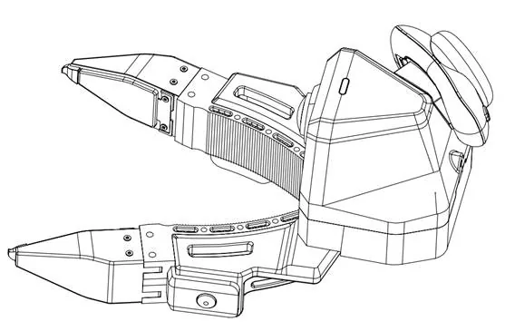{ width="360" }

=== "右主夹爪"

    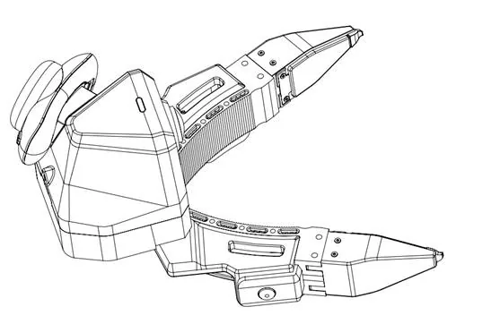{ width="360" }

主夹爪的电源与通信统一走 USB Type-C;按键用于录制控制,指示灯用于判断运行状态。

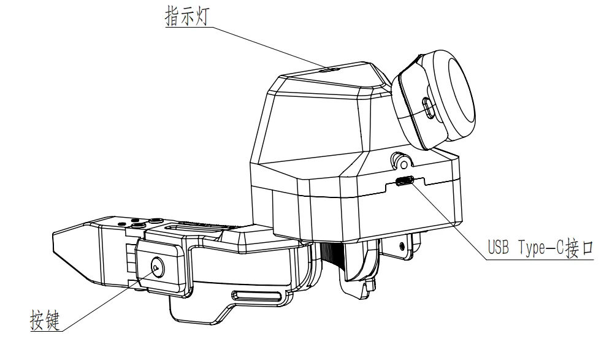{ width="480" }

### 连接前检查

- 备齐左 / 右主夹爪、两根 USB 锁紧线(夹爪端 Type-C 锁紧接头,另一端按终端接口选 Type-C 或 Type-A)、数采终端(背包版是数采背包;PC 版是数采主机,配置要求见[采集主机配置要求](../pc/install.md#host-spec))。
- 确认未使用 9V/12V 快充适配器直连主夹爪。
- Type-C 锁紧端完好、夹爪接口内无异物。
- 视触觉传感器表面无污渍、划伤、松动、异物。

### 连接步骤

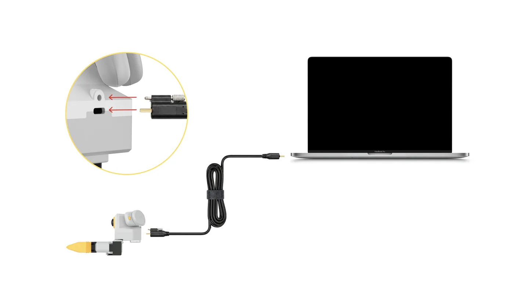{ width="560" }

1. 取出 USB Type-C 通讯线。
2. 接主夹爪本体端的 Type-C 接口,**旋紧锁紧螺钉**。
3. 另一端接数采终端:背包版左爪接背包的 `UMI-L` 口、右爪接 `UMI-R` 口;PC 版接数采主机,Type-C 或 Type-A 口皆可。

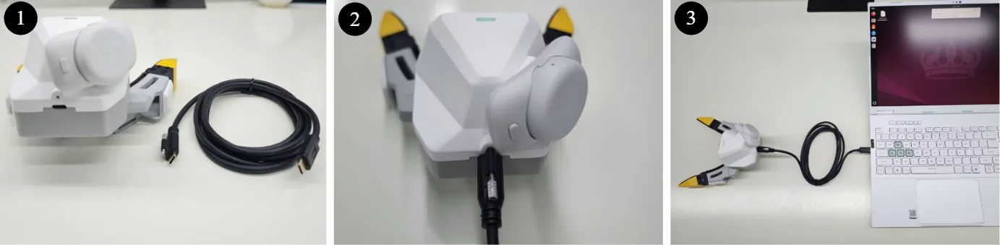{ width="480" }

### 上电与识别

=== "背包版"

    接好后指示灯应绿色常亮(待机)。打开控制台,顶栏右上角系统指标区「路相机」的在线数应等于总数,夹爪侧一共 6 路(2 路腕相机 + 4 路视触觉);「实时监控」页应看到左右鱼眼与四路触觉画面。哪一路离线,到 系统 → 设备信息 页看摄像头清单,离线的会标「(离线)」。

=== "PC 版"

    接好后指示灯应白色长亮,再用 `lsusb` 核对 UVC 设备数:双夹爪应有 6 个(2 个腕部相机 + 4 个视触觉传感器),单臂 3 个。

    ```bash
    lsusb
    ```

    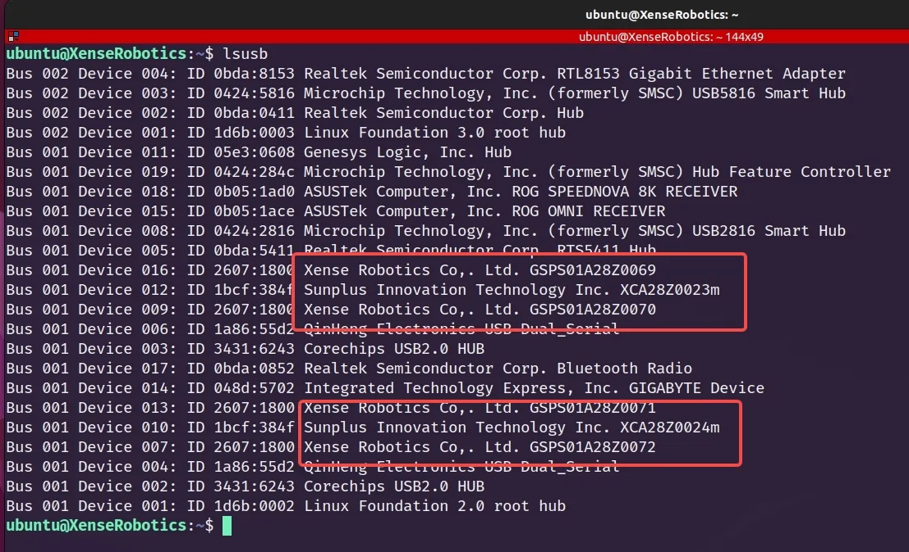{ width="720" }

    两个红框各对应一只主夹爪,框内是它的 3 个 UVC 设备:

    | 框内字样 | 是什么 | 每只主爪 |
    |---|---|---|
    | `Xense Robotics ... GSPS01…` | 视触觉传感器 | 2 个 |
    | `Sunplus ... XCA…` | 腕部鱼眼相机 | 1 个 |

    序列号末位可看出左右(单左双右,见[序列号与左右识别](#sn)):图中 `…0069`/`…0071` 是左,`…0070`/`…0072` 是右。数量不对时检查线缆锁紧与 USB 口接触;仍不对见[硬件异常](../pc/troubleshooting.md#hardware)。

主夹爪要先做开合标定才有归一化开度:背包版在控制台 系统 → 夹爪配置 页做(闭合写零点 → 全开写最大行程);PC 版见[夹爪标定](../pc/calibration.md#41),没标定的主夹爪会被拒绝连接,双夹爪两侧都要标。固件、SDK 与仓库版本要配套,见[必须升级到最新版本](../pc/versions.md#required)。

## 按键、指示灯与语音 {#buttons-leds}

两个侧边按键用于录制控制,指示灯反馈当前状态;背包版还会用设备喇叭做[语音播报](#voice-cues)。背包版由背包上的 Collector 接管按键与灯语,是现场推荐的录制控制方式;PC 版目前用命令行控制录制,按键映射仍在完善。

### 按键 {#buttons}

=== "背包版"

    按键状态机跑在背包上,**不需要浏览器在线**;录制中双击、右爪长按一律静默忽略(防手抖);没有可删条目时双击会被拒绝(黄快闪)。

    | 手势 | 动作 |
    |---|---|
    | **右爪长按** | 开始录制 |
    | **左爪长按** | 停止录制 |
    | **左爪双击** | 进入删除确认(灯紫闪,5 秒无操作自动退出) |
    | 确认态再**双击** | 删除上一条(灯紫常亮 3 秒,这 3 秒同时是冷却期,期间双击不响应) |
    | 确认态**左爪长按** | 取消删除 |
    | 确认态**右爪长按** | 放弃删除并立即开始新录制(上一条保留) |

    绑定爪位(右开 / 左停)、键位时序与灯语是全机队固定值,现场不可调、控制台里也没有改的入口;当前生效值在控制台 系统 → 采集设置 页查看(见[系统设置](../backpack/system.md))。

=== "PC 版"

    单击 / 双击 / 长按的映射仍在开发完善中;当前用命令行控制录制,见[数据采集](../pc/recording.md)。

### 指示灯 {#leds}

=== "背包版"

    | 灯 | 含义 |
    |---|---|
    | 绿 常亮 | 待机:可以开录 |
    | 绿 呼吸 | 录制中(1 秒一个明暗周期) |
    | 白 闪 | 保存正常(亮 0.4 秒,闪一次) |
    | 黄 常亮 | 开录失败(亮 2 秒),或录制中出现致命问题(长亮不灭) |
    | 黄 脉冲 | 数据可疑:录着,但那条质量存疑(亮 0.2 秒、灭 0.8 秒,共 3 次) |
    | 黄 快闪 | 动作被拒,如正在录时又按开录(0.1 秒明灭,共 3 次) |
    | 紫 闪 | 删除确认中,等你再双击;0.3 秒明灭,超时自动取消 |
    | 紫 常亮 | 刚删完的 3 秒冷却期,期间双击不响应 |
    | 红 常亮 | 系统问题(如夹爪掉线,由背包侧点亮) |
    | 红 爆闪 | 夹爪端问题(夹爪 MCU 自己点,不经过背包) |

    录制中是绿呼吸,红色只代表故障。「快闪」和「脉冲」都是黄色,差别在节奏:快闪密集、脉冲稀疏。控制台 系统 → 采集设置 页把这张表做成了会动的对照表,按实际形状与节奏演示,一眼可辨(见[系统设置](../backpack/system.md))。

=== "PC 版"

    | 指示灯 | 含义 | 用户动作 |
    |---|---|---|
    | 白色长亮 | 正常运行 | 已上电,可以开始采集 |
    | 蓝色闪烁 | 固件 OTA 升级中 | 不要断电或拔线,见[固件升级](../pc/versions.md#ota) |

    录制中、故障等灯语尚在开发测试中,以最终发布版本为准;非以上两种时按[硬件异常](../pc/troubleshooting.md#hardware)处理。

### 语音播报 {#voice-cues}

背包版专有:采集时双手都在夹爪上、眼睛盯着现场,看灯要专门抬头,所以数采背包会在四个时机用自己的喇叭出声提示,与灯语互补。语音从背包喇叭发出,不需要平板在旁边,也不受浏览器影响。

| 时机 | 播报 |
|---|---|
| 开始录制 | 「录制开始」 |
| 一条录完 | 「录制完成请重置环境」,提示复位现场、准备下一条 |
| 录制中出现严重问题 | 「录制失败」,这一条录废了 |
| 录制中夹爪或头显掉线 | 「夹爪连接失败」或「pico连接失败」 |

开关、逐句试听与 0–100 音量滑块都在控制台 系统 → [采集设置](../backpack/system.md#voice) 页(音量滑块 0.3.16 起提供),设置重启后保留。播报的内容与时机是固定值,现场不可更改,保证同一批设备行为一致。

## 从夹爪安装与连接

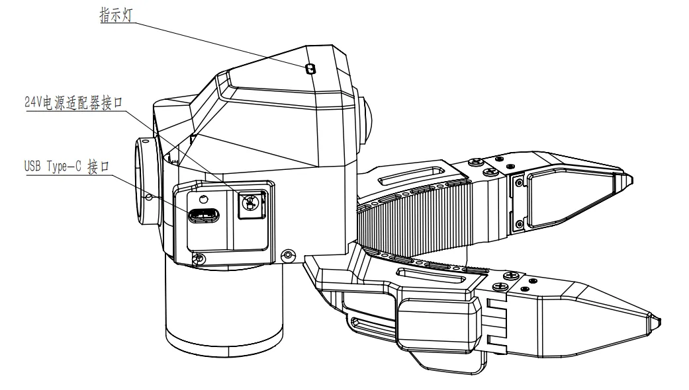{ width="360" }

从夹爪装在机器人末端,不区分左右;安装时注意法兰方向、线缆走线与机器人运动空间。

### 安装前检查

- 机器人已停机、处于安全姿态。
- 末端法兰尺寸、螺钉规格、安装方向与末端负载满足项目要求。
- 24V 适配器、Type-C 通信线与锁紧结构完好。
- 规划线缆走线,避免与关节 / 夹爪运动区 / 障碍物干涉。

### 法兰安装

通过法兰装到机器人末端,尺寸与孔位见下图。

=== "法兰安装"

    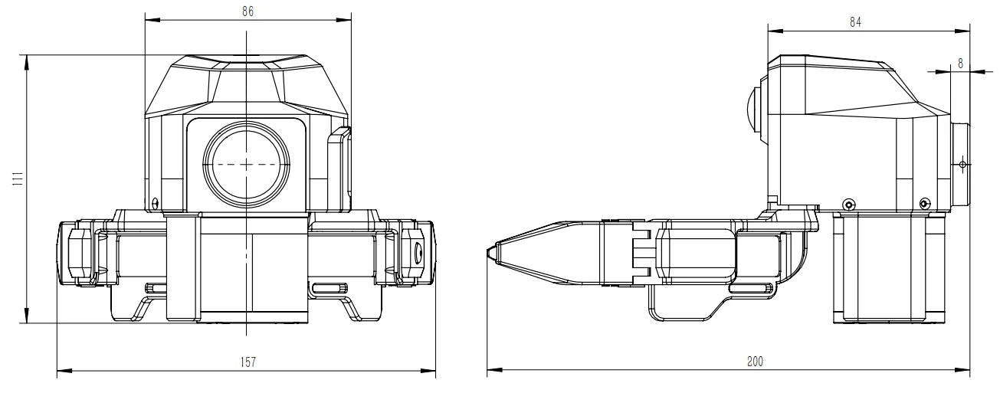{ width="420" }

=== "法兰尺寸"

    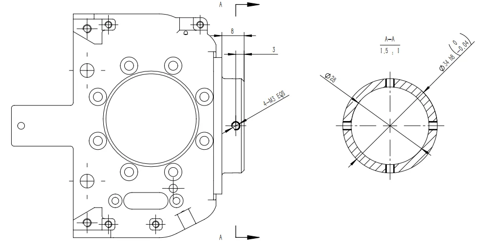{ width="420" }

### 电源与通信连接

从夹爪通信与供电分开:通信走 Type-C,供电用 24V 适配器。

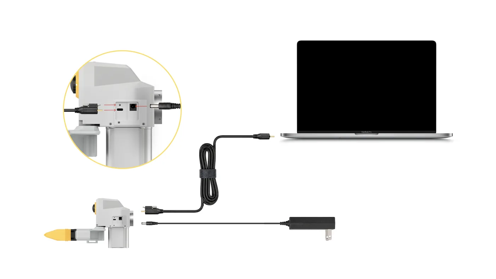{ width="560" }

1. 取出 USB Type-C 通讯线、24V 电源适配器。
2. 接从夹爪本体端的 24V 电源适配器。
3. Type-C 锁紧线带螺钉的一端接从夹爪本体,**旋紧锁紧螺钉**。
4. 另一端接数采终端,在软件中确认从夹爪通信正常。

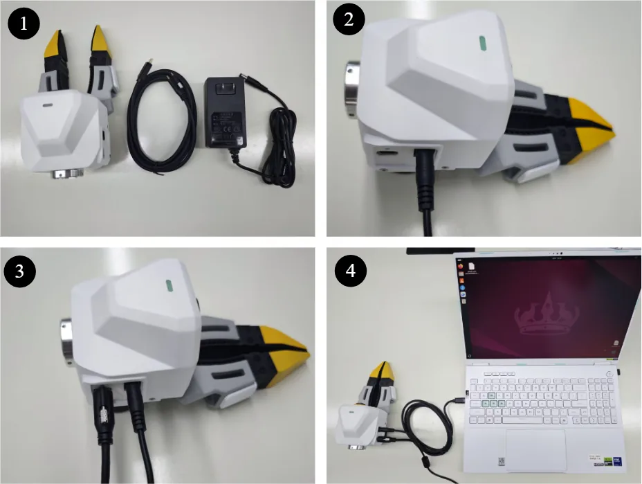{ width="480" }

!!! warning "线缆与安装检查"
    确认从夹爪固定牢靠、24V 连接可靠、Type-C 已锁紧并留足余量,线缆不会在机器人运动中被拉扯 / 弯折 / 缠绕。首次运行前先低速测试,确认无干涉。

## 供电与连接要求 {#power}

| 项目 | 主夹爪 | 从夹爪 |
|---|---|---|
| 供电 | USB Type-C 总线供电,DC 5V/500mA,无需单独电源 | 24V 电源适配器(勿用规格不匹配或带故障的电源),Type-C 只做通信 |
| 线缆 | 配套锁紧线:夹爪端 Type-C,另一端 Type-C 或 Type-A | Type-C 通信线 + 24V 电源线 |
| 接线锁紧顺序 | 先接夹爪端并旋紧锁紧螺钉,再接数采终端 | 先接 24V 电源,再接 Type-C 并旋紧锁紧螺钉 |
| 拔线顺序 | 先拔数采终端端,再松螺钉拔夹爪端 | 先拔数采终端端,再断 24V,最后松螺钉拔夹爪端 Type-C |
| 静电 | 上下电、拆装传感器时防静电 | 同左 |

拔线前先停止采集 / 录制 / 机器人运动 / 回放;整套系统的上电与下电顺序见背包版的[接线与拔线顺序](../backpack/unbox-connect.md#order)或 PC 版的[上电与下电顺序](../pc/index.md#power-on)。出现异常重启、无法识别或红灯闪烁时立即停止,按[硬件异常](../pc/troubleshooting.md#hardware)处理。

## 序列号与左右识别 {#sn}

左右侧别由序列号流水号末位的单双数区分:**单数 = 左,双数 = 右**。夹爪、视触觉传感器、腕相机与 Pico 追踪器都按这条规则装;PC 版采集软件据此自动分侧(见[设备发现规则](../pc/host-setup.md#33)),通常无需手动辨别,手动核对时跑 `lsusb` 看末位即可;背包版在控制台 系统 → 设备信息 页看每只夹爪的左右徽章与 SN。

## 安全须知 {#safety}

供电规格、禁止快充直连、插拔、静电与传感器表面的安全要求集中在[安全与合规](../product/safety.md)。

视触觉传感器的清洁、存放与拆装见[维护保养](maintenance.md)。接好并识别正常后,按[背包版快速开始](../backpack/index.md)或 [PC 版快速开始](../pc/index.md)跑通第一次采集。
