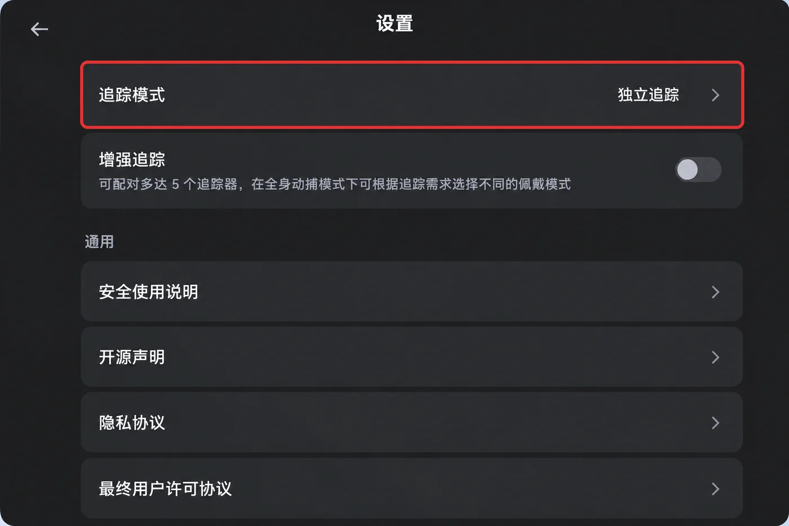

# Pico4 headset and tracker setup {#34}

- **Components**: the standalone motion tracker that ships with the Pico4 Ultra Enterprise mounts on top of the gripper and provides the 6-DoF pose; XTac-UMI XR (the VR client app) on the headset sends it to the collection side.
- **Two editions**: only the three rows below differ; those steps are split into "Backpack Kit / Developer Kit" tabs.

| | Backpack Kit | Developer Kit |
|---|---|---|
| Where the headset plugs in | The backpack's `PICO` port, **wired only** | The collection PC's Type-C port (wired USB shared network), or the same WiFi as the PC |
| Where the pose service runs | The XenseVR runtime is built into XTac-UMI Collector and is up once the backpack boots | The [XenseVR PC Service](../pc/host-setup.md#35) on the collection PC, started by hand before every session |
| How the app connects | **Leave "USB Network" unticked** and "PC IP" empty → tap "Connect" (connects to `192.168.100.1` by default) | Wired: **tick "USB Network"** → tap "Connect" (connects to `192.168.58.1` by default); WiFi: leave it unticked and enter the collection PC's IP under "PC IP" |

- **Factory-configured**: developer mode, power policy, app, tracker binding and tracking mode survive power cycles (redo them only after a factory reset or a headset swap); start at [Network connection](#pico-network).
- **Every session**: plug in, short-press the tracker's power button until the blue light comes on, [connect in the app](#pico-toolkit-ui), [align at startup](#pico-frame).

## Unboxing and the system update {#pico-unbox}

1. Unbox: peel off the front-panel sticker, the controller tape and the lens stickers, then hold the power button to switch on.

    { width="440" }

2. Update the system: a new unit ships on an older build and must be updated before you pair trackers or install the app. Join a WiFi network with internet access, go to Settings → System update and tap "Download and install" to reach Pico OS 5.15.5.U or later (about 1.9GB).

    { width="560" }

## System settings: developer mode and power policy {#pico-system}

1. Enable developer mode: Settings → About → tap "Software version" several times (with the controller, pull the index trigger repeatedly while pointing at it) → "Developer options" appears on the left → turn on USB debugging.

    <div class="tc-pair" markdown>

    

    

    </div>

2. Disable sleep and screen-off: Developer options → "Enterprise Settings" → System Settings → Power policy (Enterprise edition only; the consumer edition cannot set "Never"). It ships as screen-off 30s, system sleep 5min, battery icon hidden. Change them in order:
    1. System sleep = Never;
    2. Screen off = Never;
    3. Battery and charging status icon at the bottom = "Always show", to check the charge mid-session.

    { width="480" }

!!! warning "Sleep first, screen-off second; the order cannot be reversed"
    Screen-off is bounded by system sleep: while sleep is still at its default, screen-off's "Never" is clamped back to a finite value, so it looks set but is not in effect. Leave Settings and come back to confirm both read "Never".

Otherwise, screen-off or sleep between episodes (also triggered by taking the headset off and setting it down) suspends or kills XTac-UMI XR, and restarting it resets the world frame (see [Frame alignment](#pico-frame)).

## Installing XTac-UMI XR {#pico-app}

The APK is named `XTac-UMI-XR-<version>.apk`; the current version is 0.3.2. Install it from the headset's file manager:

1. Connect the headset to the PC over USB and copy the APK into the headset's `Download/` directory.

    { width="480" }

2. Put the headset on, tap "File Manager" on the taskbar, and open the "Download" folder.

    { width="480" }

3. Tap the APK and choose "Install" in the "Install this app?" dialog; XTac-UMI XR then appears in the "Library".

    { width="480" }


## Network connection {#pico-network}

Tracking data goes to the XenseVR pose service on the collection unit. The Backpack Kit is **wired only**; the Developer Kit is wired by default, with WiFi for quick debugging only. A Type-C cable keeps the link to itself, with stable latency.

!!! warning "On the Developer Kit, wireless is for quick debugging only, never for real collection"
    Over WiFi the headset competes for the channel with everything on site, so pose data arrives late: at best stutter and jitter, at worst dropped frames. None of it shows while recording and it is hard to tell from other causes afterwards, so the whole batch has to be recollected.

On both editions, set USB up on the headset first:

- **Settings path**: Settings → Developer options → enable "USB debugging" → set "USB connection" to "File transfer".
- **Re-check after re-plugging**: it reverts to the default after a USB re-plug; if you cannot select it, reboot the Pico.

{ width="520" }

=== "Backpack Kit"

    1. Run the headset cable (Pico → Pack, Type-C to Type-C) from the headset's side Type-C port to the backpack's `PICO` port, the same with adapter or power-bank power; see [Unboxing, cabling and power](../backpack/unbox-connect.md#order). The headset cannot use WiFi on the Backpack Kit.
    2. Power on the backpack (the pose service starts with it).
    3. Open XTac-UMI XR, leave "USB Network" unticked and "PC IP" empty (connects to the backpack at `192.168.100.1` by default), then tap "Connect".

=== "Developer Kit"

    1. Start the service on the PC first with `runService.sh` (see [Start the XenseVR PC Service](../pc/host-setup.md#35)); otherwise the app cannot connect.
    2. Cable the headset straight to the collection PC; the headset assigns the PC an IP.
    3. Open XTac-UMI XR, tick "USB Network" and tap "Connect": the app connects to the collection PC (`192.168.58.1`) by itself and Status changes to "Connected" (see [The app's screen](#pico-toolkit-ui)).

    Over WiFi: put the headset and the collection PC on the same network, leave "USB Network" unticked, enter the PC's IP in "PC IP", then tap "Connect".

    !!! warning "On the wired link, turn the collection PC's WiFi off"
        The wired shared network contends with other networks on the PC (WiFi above all) for routing and interfaces, leaving the tracker unreachable or its pose unstable; keep only the headset's shared network.

## Binding the motion tracker to the headset {#pico-tracker-bind}

On first use, or after swapping a tracker, bind the PICO Motion Tracker to this headset first; otherwise tracking mode cannot select it and neither XTac-UMI XR nor the collection side will discover its SN.

Before pairing:

- Scan the QR code on the back of the tracker with your phone for its full SN, and mount it odd-left / even-right (see [Serial numbers and side identification](gripper.md#sn)).
- The six digits in the red box are the number shown in the "My trackers" list after pairing (e.g. `Tracker 150311`).

| Scan this | You get this |
|---|---|
| { width="300" } | { width="320" }<br>`1` before the `G`, odd → left gripper |

1. Open the "Motion Tracker" app from the Library and tap the top-right icon on the main screen to enter pairing.

    { width="440" }

2. Hold the tracker's power button for about 6 seconds, until the indicator alternates blue and red (Bluetooth pairing mode).
3. Tap "Start pairing". The headset beeps on success and the tracker appears in "My trackers" with its battery level and number (e.g. `Tracker 150399`), marked "Connected".
4. Bind one per gripper; the top of the list should read "2 paired".

    { width="440" }

!!! warning "Power-on is a short press; only pairing needs the hold"
    Everyday power-on is a short press until the blue light comes on; that is not pairing mode and the app will not find it. First-time binding needs the ~6s hold until it alternates blue and red.

The binding is stored on the headset and survives power cycles and app restarts. Re-bind after swapping trackers, moving to another headset, a factory reset or pairing the wrong one: unpair from the ⓘ on the right of the list entry, then bind the new one.

!!! warning "In standalone tracking mode the tracker must stay in the headset's view"
    A tracker occluded for long by your body, the desk edge or the other hand loses tracking (pose jumps or a frozen pose).

### Reading a tracker SN {#pico-tracker-sn}

- **Purpose**: it sets the side (the digit before the `G`, odd-left / even-right) and is how the collection side identifies a tracker.
- **From the QR code**: the full SN (shaped like `PC2310MLL3200496G`) comes from the QR code on the back of the tracker; the "Motion Tracker" app only shows a short number (e.g. `Tracker 150399`), and the SN on XTac-UMI XR's Network panel (e.g. `PA9410MGL…`) is the headset's own.

=== "Backpack Kit"

    The SN comes only from the QR code; there is no command-line interface. Once connected, shake one gripper at a time in the pose view of the console's "Live monitor" page to confirm the sides are not swapped.

=== "Developer Kit"

    Read it with the PC Service's Python interface:

    ```python
    import xensevr_pc_service_sdk as xrt

    xrt.init()
    print(xrt.get_motion_tracker_serial_numbers())   # e.g. ['PC2310MLL3200496G', ...]
    ```

    - **Prerequisites**: tracker bound and on → XTac-UMI XR ["Connected"](#pico-toolkit-ui) → [PC Service](../pc/host-setup.md#35) running on the host; miss one and you get an empty list.
    - **Pin the SN**: `--robot.tracker_serial=<SN>` skips [auto-matching](../pc/host-setup.md#33); shake one gripper at a time to confirm which SN is which hand before writing it into your config.

## Tracking mode {#pico-tracker}

Once bound, open "Motion Tracking" on the headset → settings → "Tracking mode", select "Standalone tracking" and tap "Confirm"; the row should read "Standalone tracking". The factory default "Full-body motion capture" follows a human body; "Standalone tracking" follows an object the tracker is fixed to.

<div class="tc-pair" markdown>




</div>

## The app's screen {#pico-toolkit-ui}

With the headset on, open XTac-UMI XR from the Library to reach the "XENSE XR Console". Connecting only uses these items on the left:

| Item | What it means |
|---|---|
| Tracker Mode | Should read "Independent Tracking"; if not, redo [Tracking mode](#pico-tracker) |
| Pico Hardware | Should read "Enterprise" |
| Status | Until "Connected", the collection side reads no pose |
| USB Network | Developer Kit wired: tick it, and the app connects to the collection PC (`192.168.58.1`) by itself. **Backpack Kit: leave unticked** |
| PC IP | Backpack Kit: leave empty (connects to the backpack at `192.168.100.1` by default); Developer Kit: the PC's IP over WiFi, empty when wired |
| Connect / Disconnect | Tap "Connect"; once connected the button turns into "Disconnect" |

=== "Not connected"

    On opening, Status reads "Not connected". Set the items as in the table, then tap "Connect".

    { width="560" }

=== "Connected"

    Once "Connected", you can start collecting.

    { width="560" }

How the two editions differ:

=== "Backpack Kit"

    - **Panel icon**: appears when tracker accuracy degrades or the link to the backpack drops.
    - **Check the poses**: the pose view on the console's "Live monitor" page should show the headset and both gripper poses.
    - **Record button not ready**: it states the reason; both can appear together:
        - "Pico not ready": headset disconnected or timed out, pose data or clock synchronization missing or timed out;
        - "Tracker not ready": tracker out of view or stationary for over 5 seconds.
    - **Disconnect while recording**: the recording stops at once, see [Headset disconnects while recording](../backpack/monitor-record.md#pico-disconnect).

=== "Developer Kit"

    - **Never connects**: usually the [network](#pico-network) is not up or the PC's WiFi is still on.
    - **Confirm the host gets data**: "Connected" on the headset does not mean the host receives data; confirm a pose with an `sn` comes through via `ConsoleDemo` in `/opt/apps/roboticsservice/` or `python -m lerobot.robots.taccap_gripper.check_tracker`.

## Startup and frame alignment {#pico-frame}

- **Launch**: face straight towards the robot when you launch XTac-UMI XR, then [connect in the app](#pico-toolkit-ui); the world frame's origin and orientation freeze at launch.
- **World frame definition**: axes, origin, freeze rule and diagram are in [Coordinate frames](coordinates.md); every pose in the dataset is referenced to it.

!!! danger "Face straight towards the robot at launch; do not restart XTac-UMI XR between episodes"
    - **Face straight ahead**: this aligns world X with the robot's forward direction; where you stand does not matter.
    - **Do not restart**: a restart changes the origin and orientation, leaving poses inside one dataset in different frames.
