# Pico4 headset and tracker setup {#34}

The standalone motion tracker that ships with the Pico4 Ultra Enterprise mounts on top of the gripper and provides the 6-DoF pose. XTac-UMI XR (the VR client app) runs on the headset and sends the pose to the collection side. Both editions use the same headset and the same trackers; only three things differ — where the headset plugs in, where the pose service runs, and how the app connects — and those steps are split into "Backpack Kit / Developer Kit" tabs. Every other step is identical.

| | Backpack Kit | Developer Kit |
|---|---|---|
| Where the headset plugs in | The backpack's `PICO` port, **wired only** | The collection PC's Type-C port (wired USB shared network), or the same WiFi as the PC |
| Where the pose service runs | The XenseVR runtime is built into XTac-UMI Collector; it is up as soon as the backpack boots, nothing to start | The [XenseVR PC Service](../pc/host-setup.md#35) on the collection PC, started by hand before every session |
| How the app connects | **Leave "USB Network" unticked** and "PC IP" empty → tap "Connect" (connects to `192.168.100.1` by default) | Wired: **tick "USB Network"** → tap "Connect" (connects to `192.168.58.1` by default); WiFi: leave it unticked and enter the collection PC's IP under "PC IP" |

On a factory-configured headset, developer mode, the power policy, the app, the tracker binding and the tracking mode are already set and survive power cycles (redo them only after a factory reset or a headset swap), so start at [Network connection](#pico-network). Plugging in, short-pressing the tracker's power button until the blue light comes on, [connecting in the app](#pico-toolkit-ui) and [startup alignment](#pico-frame) are needed before every session.

## Unboxing and the system update {#pico-unbox}

1. Unbox: peel the protective sticker off the front panel, the tape off the controllers and the sticker off the lenses, then hold the power button to switch it on.

    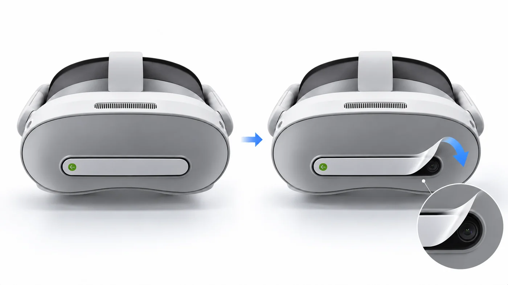{ width="440" }

2. Update the system. This is required on a new unit: it ships on an older build and only works properly once updated, and it has to be done before pairing the tracker or installing the app. Join a WiFi network with internet access, go to Settings → System update, and tap "Download and install" to reach Pico OS 5.15.5.U or later. The package is about 1.9 GB.

    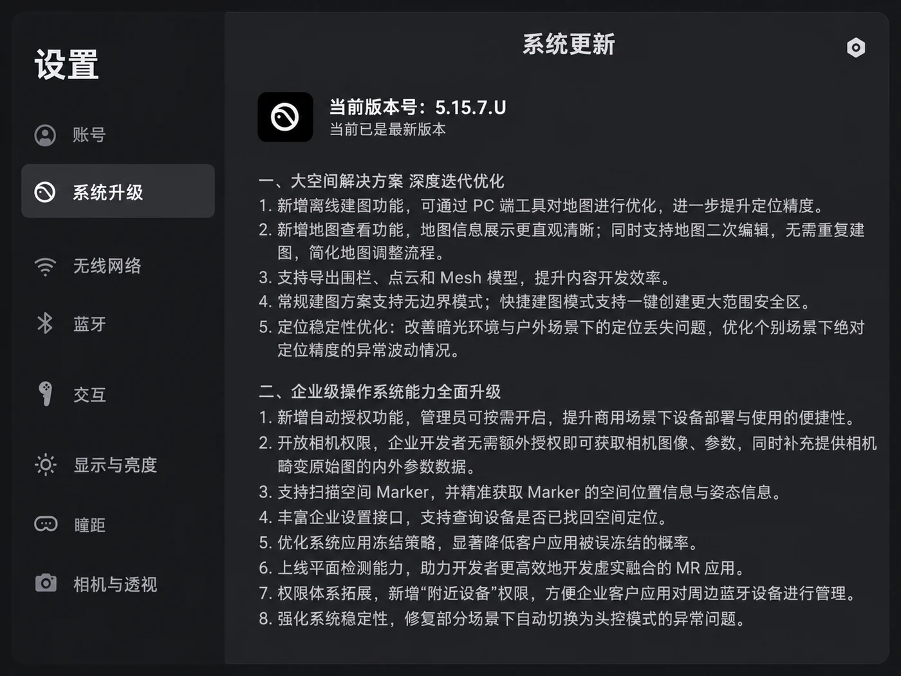{ width="560" }

## System settings: developer mode and power policy {#pico-system}

1. Enable developer mode: Settings → About → tap "Software version" several times (with the controller, pull the index-finger trigger repeatedly while pointing at it) → "Developer options" appears on the left → turn on USB debugging.

    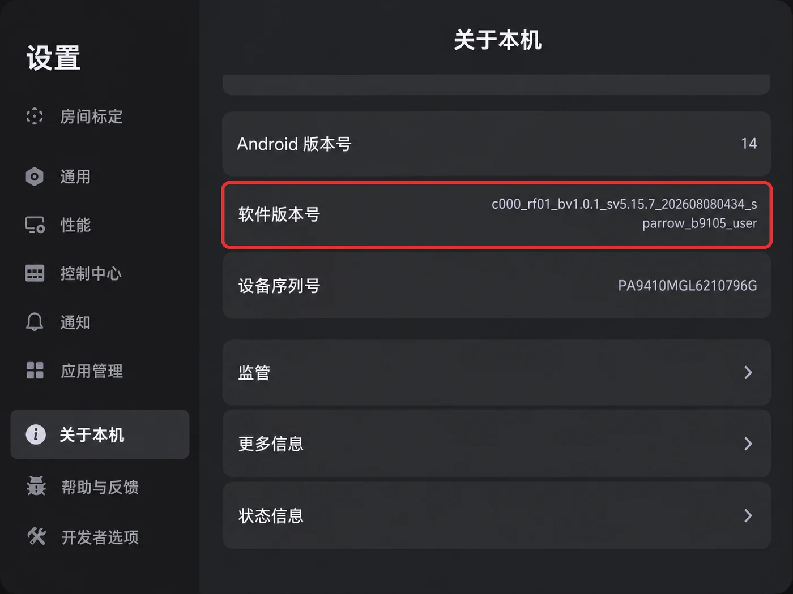{ width="480" }

    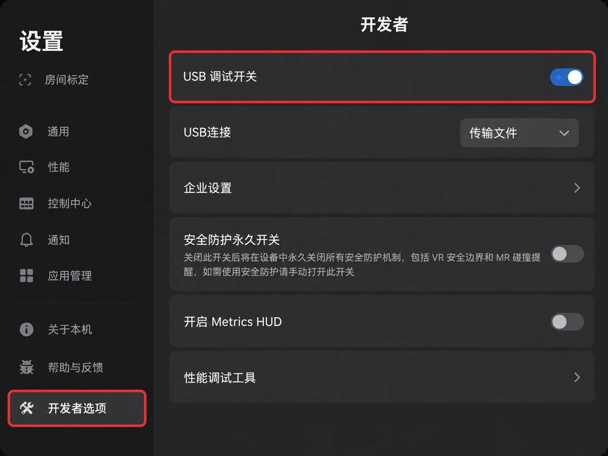{ width="480" }

2. Disable sleep and screen-off: in Developer options tap "Enterprise Settings" → System Settings → Power policy (only the Enterprise edition has this item; the consumer edition cannot set "Never"). It ships as screen-off 30 s, system sleep 5 min, battery icon hidden. Change all three, in this order:
    1. System sleep = Never first;
    2. Screen off = Never second;
    3. Set the battery and charging status icon at the bottom to "Always show", so you can check the charge mid-session.

    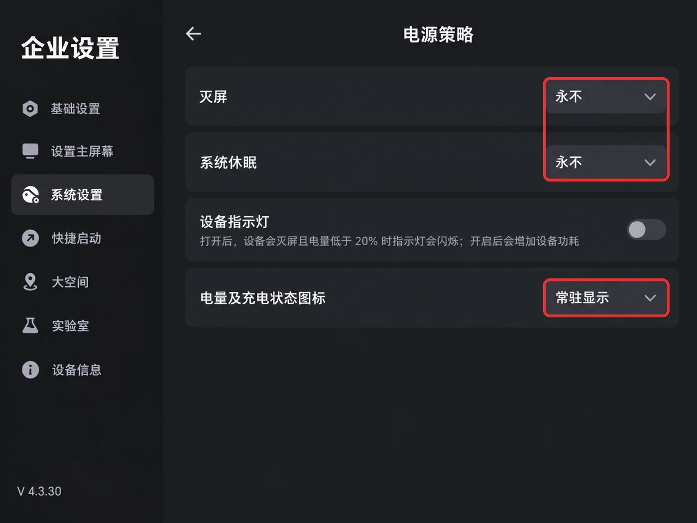{ width="480" }

!!! warning "Sleep first, screen-off second; the order cannot be reversed"
    The screen-off timeout is bounded by the system sleep timeout. Set screen-off first, while system sleep is still at its default, and its "Never" gets clamped back to a finite value: it looks set but is not in effect. When done, leave Settings and come back to confirm both read "Never".

If you skip this: once the headset screen-blanks or sleeps between episodes, XTac-UMI XR gets suspended or killed and tracking drops out, and restarting it resets the world frame (see [Frame alignment](#pico-frame)). Taking the headset off and setting it down triggers this too.

## Installing XTac-UMI XR {#pico-app}

The APK is named `XTac-UMI-XR-<version>.apk`; the current version is 0.3.2. Install it from the headset's file manager:

1. On the PC: connect the headset to the PC over USB and copy the APK into the headset's `Download/` directory.

    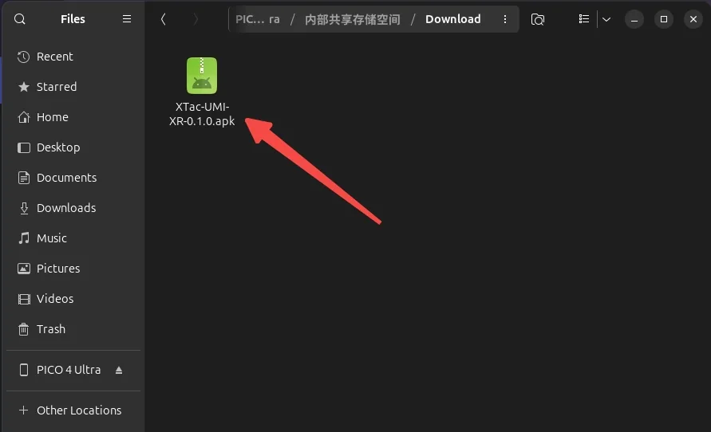{ width="480" }

2. Put the headset on, tap "File Manager" on the taskbar, and go into the "Download" folder.

    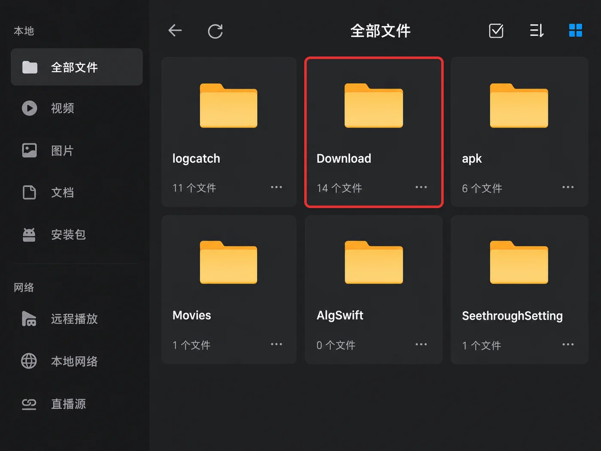{ width="480" }

3. Tap the APK and choose "Install" in the "Install this app?" dialog. Once installed, XTac-UMI XR appears in the "Library".

    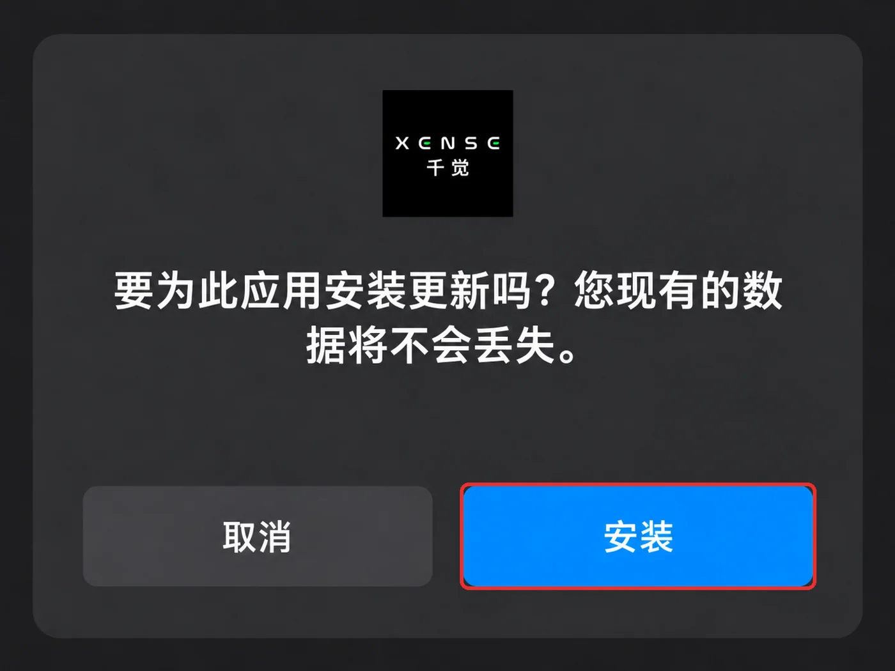{ width="480" }

If the PC has adb (Android platform-tools), you can install in one command without going into the headset, once USB debugging is on and "USB connection" is set to "File transfer":

```bash
adb devices                          # the headset should be listed
adb install XTac-UMI-XR-0.3.2.apk    # substitute the build you were given
```

## Network connection {#pico-network}

Tracking data has to reach the XenseVR pose service on the collection unit. **The Backpack Kit is wired only**; the Developer Kit is wired by default too, with WiFi for quick debugging only. A Type-C cable gives the link to itself, with stable, predictable latency.

!!! warning "On the Developer Kit, wireless is for quick debugging only, never for real collection"
    Over WiFi the headset and the collection unit compete for the channel with everything else on site. The link fluctuates and pose data arrives late: at best the pose stutters and jitters, at worst frames are dropped. None of this is visible while recording, and afterwards it is hard to tell apart from other causes, so the whole batch has to be recollected. Use the cable for real collection.

On both editions, set USB up on the headset first: Settings → Developer options → enable "USB debugging" → set "USB connection" to "File transfer". Re-check this after every USB re-plug, as it reverts to the default. If you cannot select it, reboot the Pico.

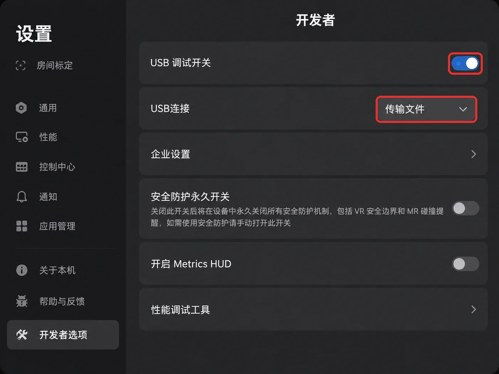{ width="520" }

=== "Backpack Kit"

    Wired setup:

    1. Run the headset cable (Pico → Pack, Type-C to Type-C) from the Type-C port on the side of the headset to the backpack's `PICO` port. It is connected the same way with adapter power and with power-bank power; wiring in [Unboxing, cabling and power](../backpack/unbox-connect.md#order).
    2. Power on the backpack. The XenseVR runtime is built into Collector and starts with it; there is no separate service to launch.
    3. Open XTac-UMI XR, leave "USB Network" unticked and "PC IP" empty (it connects to the backpack at `192.168.100.1` by default), then tap "Connect".

    The Backpack Kit does not support the headset over WiFi; the headset must be cabled to the backpack.

=== "Developer Kit"

    Wired setup:

    1. Start the service on the PC first (see [Start the XenseVR PC Service](../pc/host-setup.md#35)): `runService.sh`. With the service down, the app cannot connect.
    2. Run a Type-C cable straight from the headset to the collection PC; the headset assigns the PC an IP.
    3. Open XTac-UMI XR, tick "USB Network", tap "Connect", and Status changes to "Connected" (see [The app's screen](#pico-toolkit-ui)). With USB Network ticked the app connects to the collection PC (`192.168.58.1`) by itself; no IP to enter.

    Over WiFi, put the headset and the collection PC on the same network, leave "USB Network" unticked, type the collection PC's IP into "PC IP", then tap "Connect".

    !!! warning "On the wired link, turn the collection PC's WiFi off"
        The wired shared network conflicts with other networks on the PC (WiFi above all) through routing and interface contention, leaving the tracker unreachable or its pose unstable. Keep only the headset's shared network.

## Binding the motion tracker to the headset {#pico-tracker-bind}

On first use, or after swapping a tracker, the PICO Motion Tracker must be bound to this headset first. Until it is, it cannot be selected in tracking mode, and neither XTac-UMI XR nor the collection side will discover its SN.

Before pairing, scan the QR code on the back of the tracker with your phone to get its full SN, and mount it on the gripper by odd-left / even-right (see [Serial numbers and side identification](gripper.md#sn)). The six digits in the red box are the number shown in the "My trackers" list after pairing (e.g. `Tracker 150311`).

| Scan this | You get this |
|---|---|
| 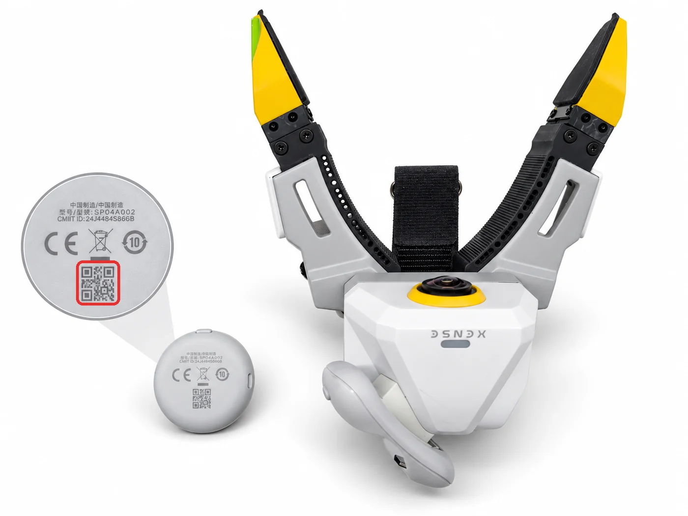{ width="300" } | 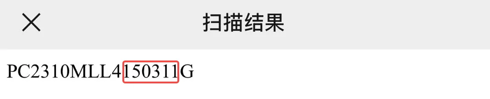{ width="320" }<br>`1` before the `G`, odd → left gripper |

1. Open the "Motion Tracker" app from the Library and tap the icon in the top-right corner of the main screen to enter the pairing screen.

    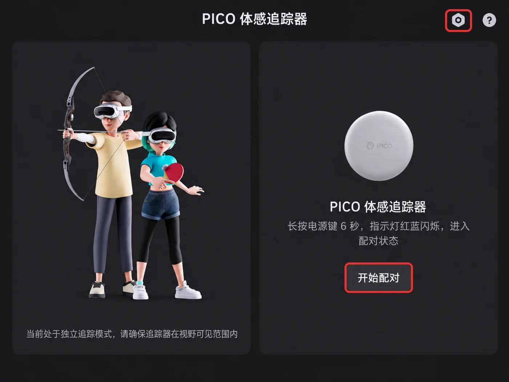{ width="440" }

2. Hold the tracker's power button for about 6 seconds, until the indicator alternates blue and red. That is Bluetooth pairing mode.
3. Tap "Start pairing". The headset plays a tone when pairing succeeds, and the tracker appears in the "My trackers" list with its battery level and number (e.g. `Tracker 150399`), marked "Connected".
4. One tracker per gripper, so bind both. The top of the list should read "2 paired".

    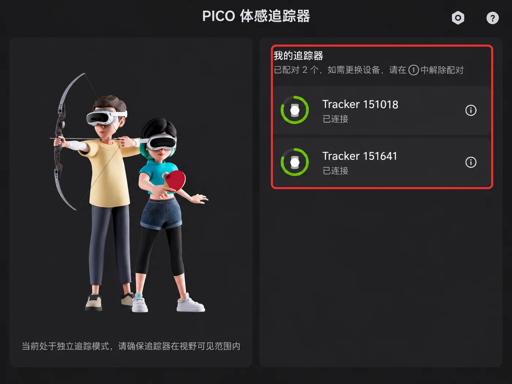{ width="440" }

!!! warning "Power-on is a short press; only pairing needs the hold"
    Solid blue is just powered on, not pairing mode, and the app will not find it. Everyday power-on is a short press until the blue light comes on; only first-time binding needs the ~6 s hold until it alternates blue and red.

The binding is stored on the headset; everyday power cycles and app restarts do not need a re-bind. Re-bind after swapping trackers, moving to another headset or a factory reset, and likewise after pairing the wrong tracker: unpair from the ⓘ on the right of the list entry first, then bind the new one.

!!! warning "In standalone tracking mode the tracker must stay in the headset's view"
    A tracker occluded for long by your body, the desk edge or the other hand loses tracking (pose jumps or a frozen pose). Do not let the tracker on top of the gripper leave the headset's view for long.

### Reading a tracker SN {#pico-tracker-sn}

The SN determines the side (the digit before the `G`, odd-left / even-right) and is also how the collection side identifies a tracker. It is not visible on the headset: the "Motion Tracker" app only shows a short number (e.g. `Tracker 150399`), and the SN on XTac-UMI XR's Network panel (e.g. `PA9410MGL…`) is the headset's own. The most direct source of the full SN (shaped like `PC2310MLL3200496G`) is the QR code on the back of the tracker.

=== "Backpack Kit"

    The Backpack Kit relies on the SN from the QR code; there is no command-line interface. Once connected, open the console's "Live monitor" page: the pose view shows the left and right gripper poses, and shaking one gripper at a time confirms the sides are not swapped.

=== "Developer Kit"

    Read it with the PC Service's Python interface:

    ```python
    import xensevr_pc_service_sdk as xrt

    xrt.init()
    print(xrt.get_motion_tracker_serial_numbers())   # e.g. ['PC2310MLL3200496G', ...]
    ```

    It only returns the trackers the service is currently receiving data from, so first: tracker bound and powered on → XTac-UMI XR ["Connected"](#pico-toolkit-ui) → [PC Service](../pc/host-setup.md#35) running on the host. Miss any one and you get an empty list. With the SN in hand you can pin it via `--robot.tracker_serial=<SN>` and skip [auto-matching](../pc/host-setup.md#33). Shake one gripper at a time to confirm which SN is which hand before writing it into your config.

## Tracking mode {#pico-tracker}

Once bound, open "Motion Tracking" on the headset, find "Tracking mode" in its settings, select "Standalone tracking" and tap "Confirm". The row should then read "Standalone tracking". The factory default "Full-body motion capture" wears trackers on the body to follow a human pose; "Standalone tracking" fixes a tracker to an object and follows that object's pose, which is how a gripper is used.

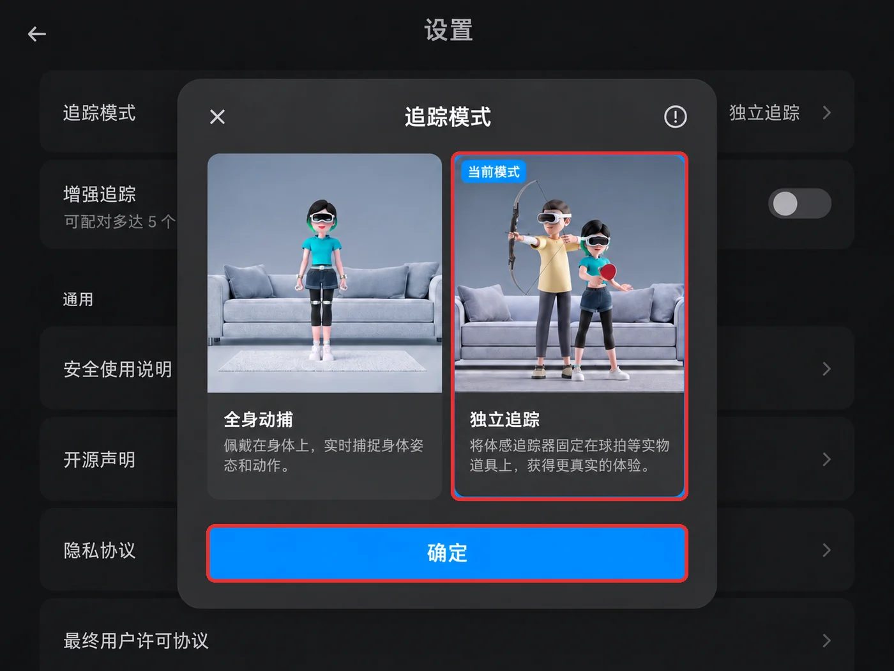{ width="480" }

## The app's screen {#pico-toolkit-ui}

With the headset on, open XTac-UMI XR from the Library to reach the "XENSE XR Console". Connecting only involves these items on the left:

| Item | What it means |
|---|---|
| Tracker Mode | Should read "Independent Tracking"; if not, go back to [Tracking mode](#pico-tracker) and set it again |
| Pico Hardware | Should read "Enterprise" |
| Status | Until it reads "Connected", the collection side reads no pose at all |
| USB Network | Tick it for a Developer Kit wired connection: the app connects to the collection PC (`192.168.58.1`) by itself. **Leave it unticked on the Backpack Kit** |
| PC IP | Backpack Kit: leave empty (connects to the backpack at `192.168.100.1` by default); Developer Kit: the collection PC's IP over WiFi, not needed when wired |
| Connect / Disconnect | Tap "Connect" to start connecting; once connected the button turns into "Disconnect" |

=== "Not connected"

    It opens with Status at "Not connected". On the Backpack Kit leave "USB Network" unticked and "PC IP" empty; on the Developer Kit tick "USB Network" for a wired connection. Then tap "Connect".

    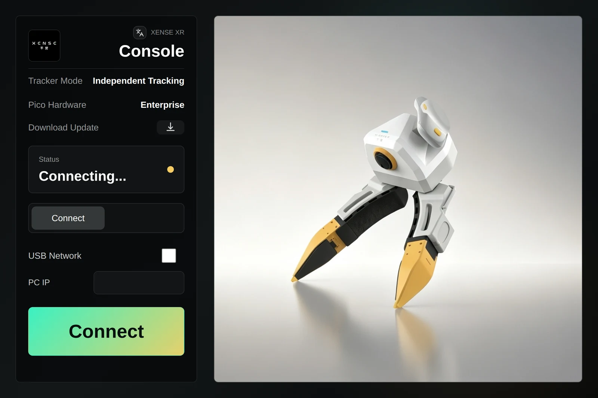{ width="560" }

=== "Connected"

    Once Status reads "Connected", you can start collecting.

    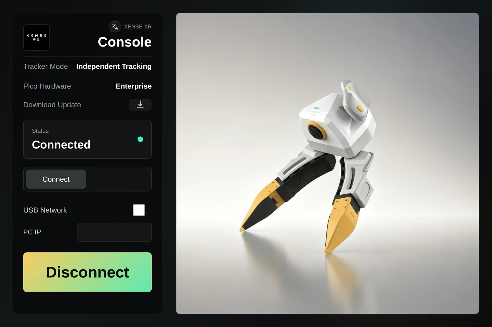{ width="560" }

How the two editions differ when connecting:

=== "Backpack Kit"

    In the panel, **leave "USB Network" unticked** and "PC IP" empty (it connects to the backpack at `192.168.100.1` by default), then tap "Connect"; the Backpack Kit only connects over the cable. When tracker accuracy degrades or the link to the backpack drops, an icon appears on the panel.

    Once connected, open the console's "Live monitor" page: the pose view should show the headset and both gripper poses. When the record button is not ready it states the reason: "Pico not ready" is followed by the headset-side cause (for example disconnected or timed out, pose data missing or timed out, clock synchronization missing or timed out), and "Tracker not ready" by the tracker's cause (for example out of view or stationary for over 5 seconds); both can appear together. If the headset disconnects while recording, that recording stops at once, see [Headset disconnects while recording](../backpack/monitor-record.md#pico-disconnect).

=== "Developer Kit"

    For a wired connection tick "USB Network" and the app connects to the collection PC (`192.168.58.1`) by itself; over WiFi leave it unticked, type the collection PC's IP into "PC IP", then tap "Connect".

    If it never connects, the cause is usually the [network](#pico-network) not being up or the PC's WiFi still on. Once it reads "Connected", confirm on the host that a pose with an `sn` comes through, via `ConsoleDemo` in `/opt/apps/roboticsservice/` or `python -m lerobot.robots.taccap_gripper.check_tracker`. The headset saying it is connected and the host actually receiving data are two different things.

## Startup and frame alignment {#pico-frame}

Wear the headset and face straight towards the robot when you launch XTac-UMI XR, then [connect in the app](#pico-toolkit-ui). The moment it launches, the world frame's origin and orientation are frozen.

The world frame's definition (axes, origin, freeze rule) and its diagram are in [Coordinate frames](coordinates.md); every pose in the dataset is referenced to it.

!!! danger "Face straight towards the robot at launch; do not restart XTac-UMI XR between episodes"
    Facing straight ahead is what aligns world X with the robot's forward direction. Only the orientation matters; where you stand does not. After a restart of XTac-UMI XR the origin and orientation change, leaving poses inside one dataset referenced to different frames.
