# Pico4 头显与追踪器配置 {#34}

Pico4 Ultra 企业版配套的独立运动追踪器装在夹爪顶部,提供 6-DoF 位姿;头显上运行 XTac-UMI XR(VR 客户端 APP),把位姿送到采集单元。两种形态用同一台头显、同一套追踪器,只有「头显接到哪、位姿服务在哪跑、APP 里怎么连」三处不同,本页把这几步放进「背包版 / PC 版」标签页,其余步骤两边完全一样。

| | 背包版 | PC 版 |
|---|---|---|
| 头显接到哪 | 数采背包的 `PICO` 口(USB 有线),或与背包接同一个 WiFi | 数采主机的 Type-C 口(USB 有线共享网络),或与主机接同一个 WiFi |
| 位姿服务在哪跑 | XTac-UMI XR 运行时内置在 XTac-UMI Collector 里,背包开机即在,不用单独启动 | 数采主机上的 [XTac-UMI XR PC Service](../pc/host-setup.md#35),每次采集前手动启动 |
| APP 里怎么连 | 勾选「USB 网络」→ 点「连接」;走 WiFi 时不勾,填背包 IP | 点「重连」,不用填 IP |

出厂已配置的头显,开发者模式、电源策略、APP、追踪器绑定、追踪模式都已设好且断电不丢(恢复出厂或换头显才要重做),直接从[网络连接](#pico-network)开始;接线、短按追踪器电源键到蓝灯亮、在 APP 里[连上](#pico-toolkit-ui)、[启动对齐](#pico-frame)每次采集都要做。

## 开箱与系统更新 {#pico-unbox}

1. 开箱:撕掉机身前面板保护贴、控制器胶条与镜片贴纸,长按电源键开机。

    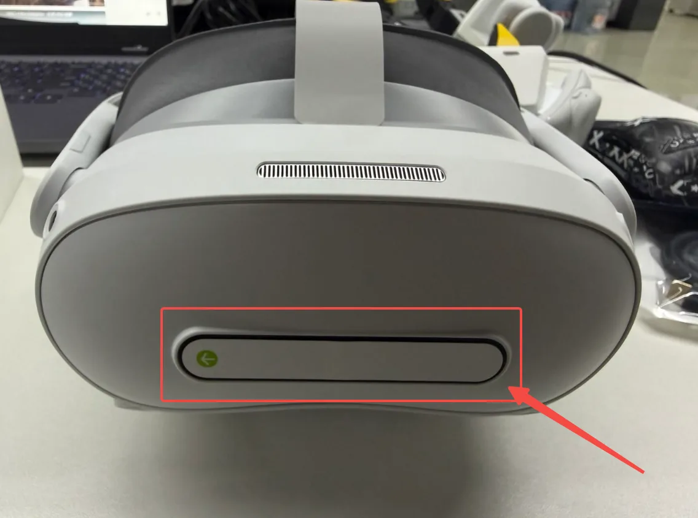{ width="440" }

2. 更新系统,新机必做,出厂系统偏低,升级后才能正常使用,要在配追踪器、装 APP 之前做完:连有网的 WiFi,进 设置 → 系统升级,点「下载并安装」升到 Pico OS 5.15.5.U 或更高,安装包约 1.9 GB。

    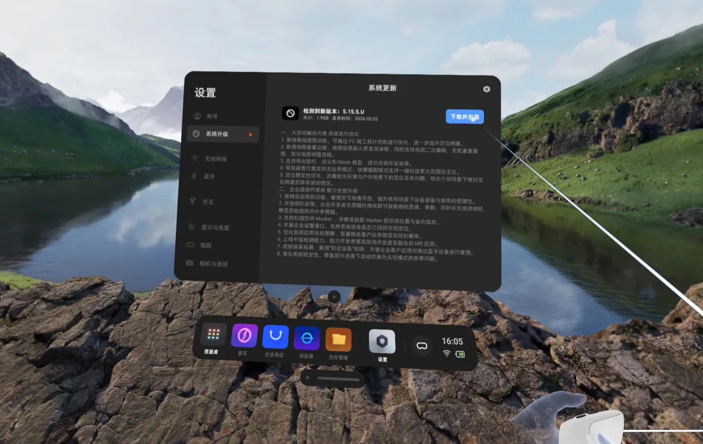{ width="560" }

## 系统设置:开发者模式与电源策略 {#pico-system}

1. 开启开发者模式:设置 → 关于本机 → 连续点击「软件版本号」数次(用手柄时对着它连续扣食指扳机)→ 左侧出现「开发者选项」→ 打开 USB 调试。

    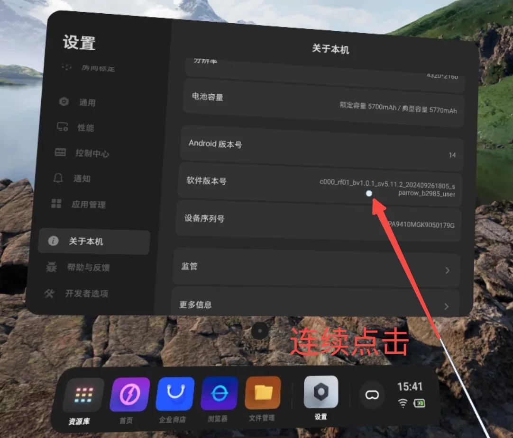{ width="480" }

    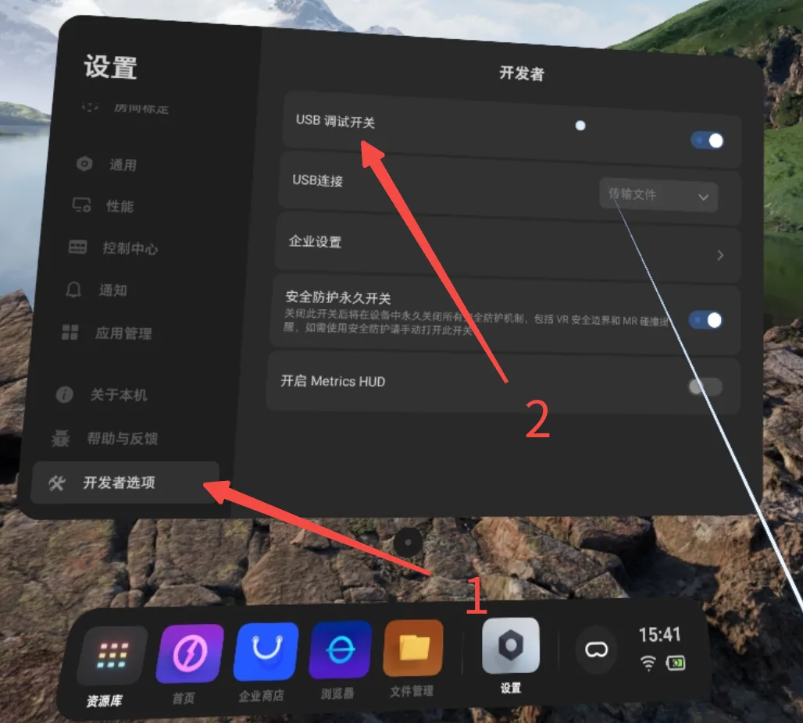{ width="480" }

2. 关闭休眠与灭屏:开发者选项里点「企业设置」→ 系统设置 → 电源策略(只有企业版有这一项,消费版调不到「永不」)。出厂默认灭屏 30 秒、系统休眠 5 分钟、电量图标不显示,三项都改,按顺序:
    1. 先设 系统休眠 = 永不;
    2. 再设 灭屏(息屏)= 永不;
    3. 把最下方的电量及充电状态图标设为「常驻显示」,采集途中可看电量。

    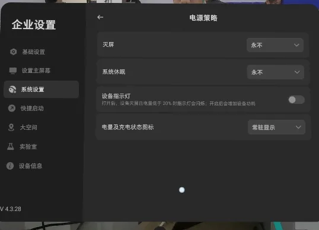{ width="480" }

!!! warning "先休眠、后灭屏,顺序不能反"
    灭屏时间受系统休眠约束:先改灭屏,系统休眠还是默认值,灭屏的「永不」会被钳回有限值,看着已设置,实际没生效。改完退出设置再进来确认两项都是「永不」。

不关的后果:头显在采集间隙灭屏/休眠后 XTac-UMI XR 会被挂起或杀掉,追踪中断,重启它又会重设世界系(见[坐标系对齐](#pico-frame));摘下头显放置时同样会触发。

## 安装 XTac-UMI XR {#pico-app}

APK 文件名形如 `XTac-UMI-XR-<版本>.apk`(背包版配套 0.2.5,PC 版以拿到的那份为准)。在头显里用文件管理安装:

1. 电脑侧:USB 线连接头显与电脑,把 APK 拷到头显的 `Download/` 目录。

    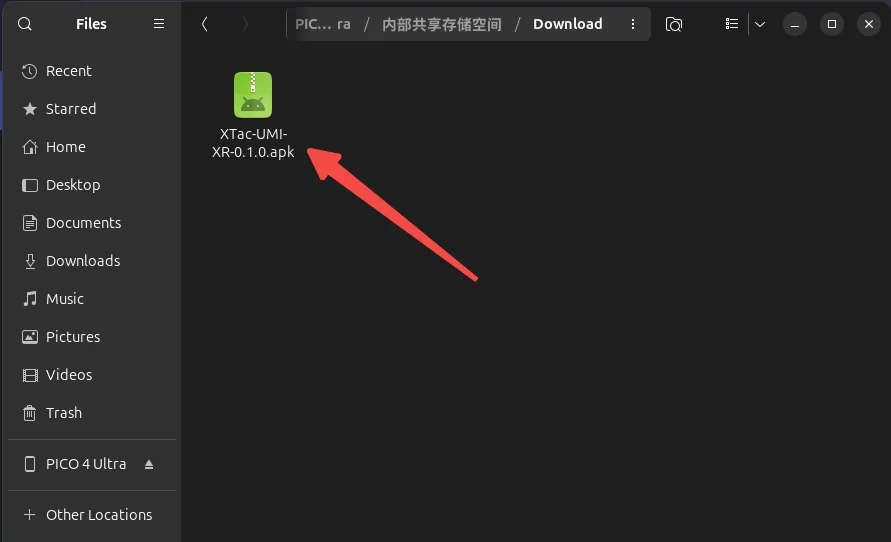{ width="480" }

2. 戴上头显,任务栏点「文件管理」,进「Download」文件夹。

    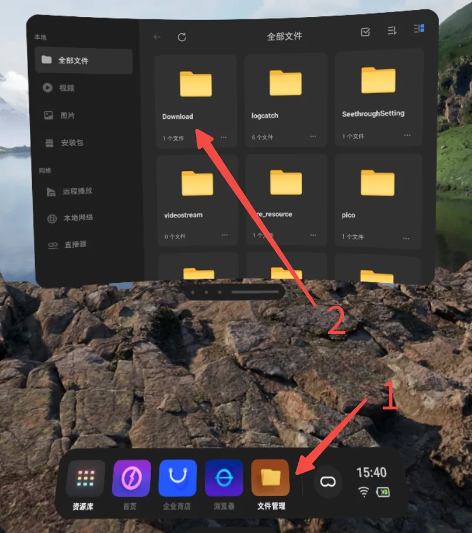{ width="480" }

3. 点 APK,在「要安装此应用吗?」里选「安装」。装好后「资源库」里应出现 XTac-UMI XR。

    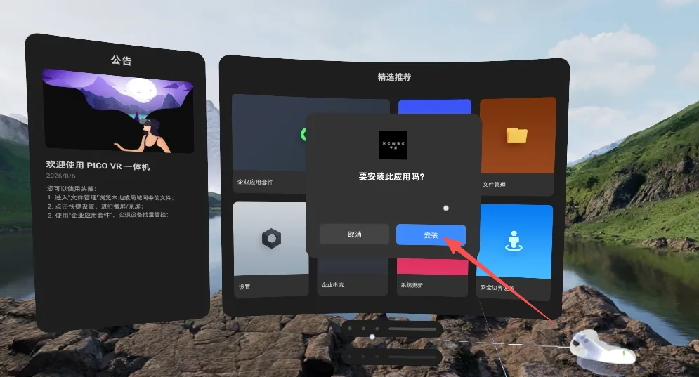{ width="480" }

电脑上装了 adb(Android platform-tools)的话,USB 调试已打开、「USB 连接」选「传输文件」后可以一键安装,不用进头显点:

```bash
adb devices                          # 应列出头显
adb install XTac-UMI-XR-0.2.5.apk    # 换成拿到的那份
```

## 网络连接 {#pico-network}

追踪数据要送到采集单元的 XTac-UMI XR 位姿服务。**默认走有线**:Type-C 线直连,链路独占,延迟稳定可预期。

!!! warning "无线只用于临时调试,不要用来正式采集"
    头显与采集单元走 WiFi 时要和现场其他设备抢信道,链路会出现网络波动,位姿数据随之延迟到达:轻则位姿卡顿、抖动,重则丢帧。这些问题在录制过程中看不出来,事后从数据里也难与别的原因区分,整批数据只能重采。正式采集一律用有线。

两种形态都先在头显里把 USB 设对:设置 → 开发者选项 → 打开「USB 调试」→「USB 连接」选「传输文件」。每次拔插 USB 后都要回来确认,它会掉回默认值;选不了就重启 Pico。

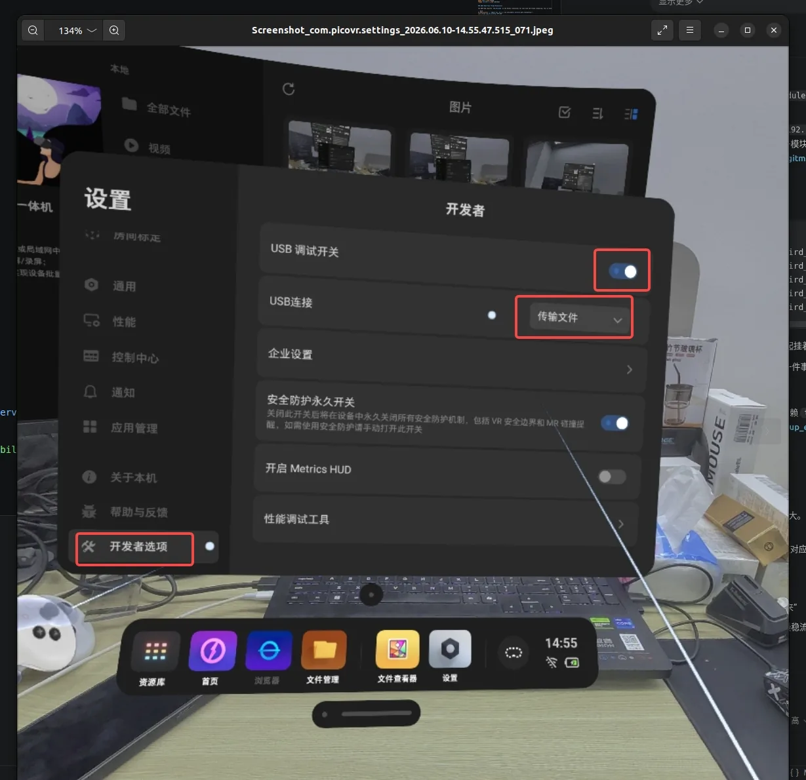{ width="520" }

=== "背包版"

    有线连接步骤:

    1. Type-C 线一端接头显侧面的 Type-C 口,另一端接背包的 `PICO` 口。用充电宝供电时头显先接二合一线:充电口接充电宝,数据口接背包 `PICO` 口,接线见[充电宝供电](../backpack/unbox-connect.md#powerbank)。
    2. 背包开机。XTac-UMI XR 运行时内置在 Collector 里,随背包一起启动,不需要单独开服务。
    3. 打开 XTac-UMI XR,勾选「USB 网络」点「连接」,背包会自动在 USB 链路上建网(地址 `192.168.58.1`),不用手填。

    走 WiFi 时头显与背包接同一个网络(例如同一台路由器;背包只连 5 GHz WiFi),APP 里不勾「USB 网络」,填背包的 IP 再点「连接」。背包 IP 在控制台顶栏的网络下拉里看。

=== "PC 版"

    有线连接步骤:

    1. 电脑端先启动服务(见[启动 XTac-UMI XR PC Service](../pc/host-setup.md#35)):`runService.sh`。服务没起来,APP 只会停在「未连接」。
    2. Type-C 线直连头显与数采主机,头显给主机分配 IP。
    3. 打开 XTac-UMI XR,点「重连」,状态变成「已连接」(见[打开 App 后的界面](#pico-toolkit-ui))。

    走 WiFi 时头显和数采主机接同一网络,其余相同。

    !!! warning "走有线时,关掉数采主机的 WiFi"
        有线共享网络会与主机上的其他网络(尤其 WiFi)冲突(路由 / 网卡抢占),导致追踪器连不上或位姿不稳。只保留头显的共享网络。

## 绑定运动追踪器到头显 {#pico-tracker-bind}

首次使用或更换追踪器后,必须先把 PICO Motion Tracker 绑定到这台头显,否则追踪模式里选不到它,XTac-UMI XR 与采集单元也发现不了它的 SN。

配对前先用手机扫追踪器背面的二维码拿到完整 SN,按单左双右(见[序列号与左右识别](gripper.md#sn))装夹爪。红框里的六位数就是配对后「我的追踪器」列表里的编号(如 `Tracker 150311`)。

| 扫这里 | 扫出来是这样 |
|---|---|
| 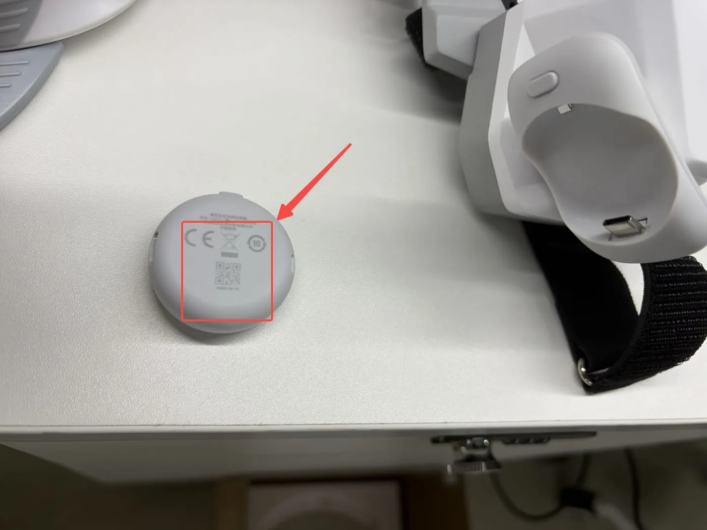{ width="300" } | 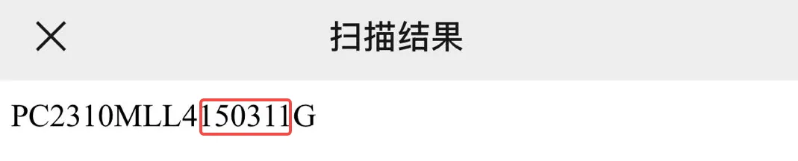{ width="320" }<br>`G` 前是 `1`,单数 → 装左夹爪 |

1. 从资源库打开「体感追踪器」App,点主界面右上角的图标进入配对界面。

    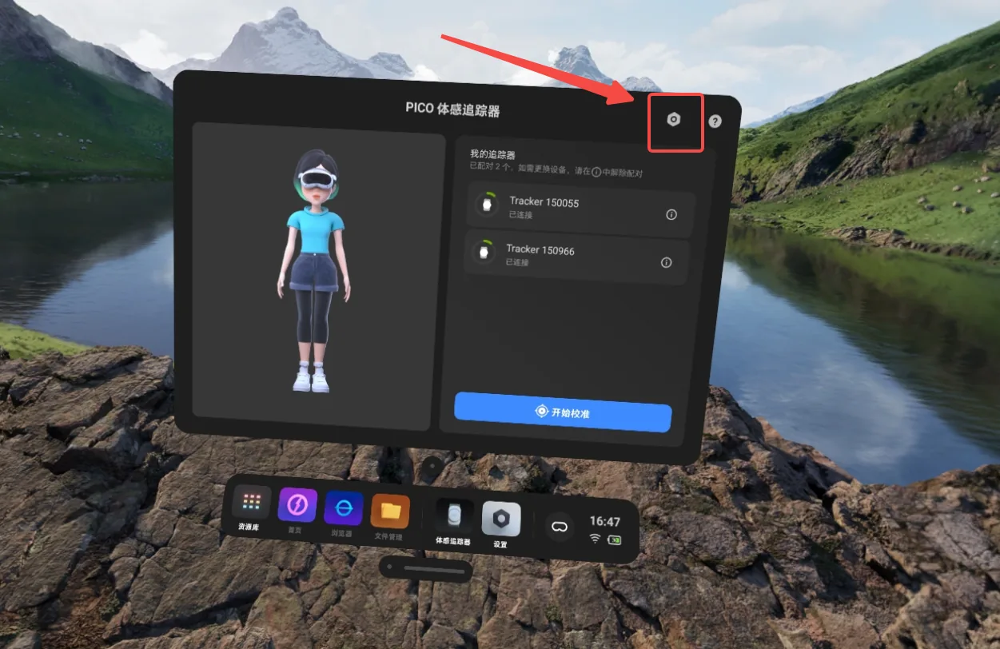{ width="440" }

2. 长按追踪器电源键约 6 秒,直到指示灯蓝红交替闪烁,这是蓝牙配对状态。
3. 点「开始配对」。配对成功时头显会响一声提示音,该追踪器出现在「我的追踪器」列表里,显示电量与编号(如 `Tracker 150399`)并标注「已连接」。
4. 两只夹爪各一枚,要绑两枚,列表顶部应显示「已配对 2 个」。

    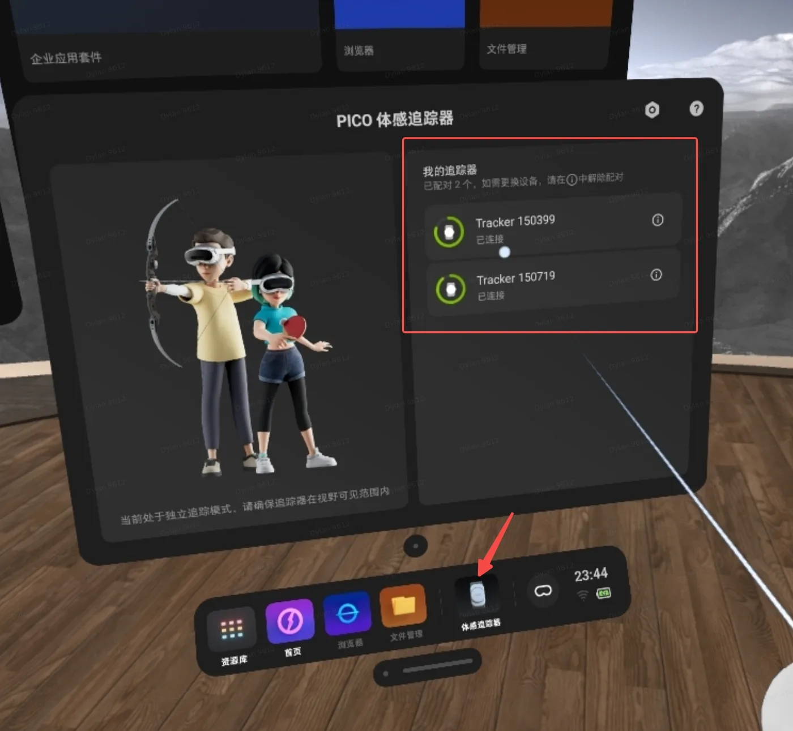{ width="440" }

!!! warning "开机是短按,配对才要长按"
    只亮蓝灯是普通开机,不是配对状态,App 扫不到。日常开机短按到蓝灯亮;只有首次绑定才长按约 6 秒到蓝红交替闪烁。

绑定关系存在头显上,日常开关机、重启 APP 不用重绑;换追踪器、换头显或恢复出厂后要重绑,配错了也一样:先在列表项右侧的 ⓘ 里解除配对,再绑新的。

!!! warning "独立追踪模式下,追踪器必须在头显视野内"
    被身体、桌沿或另一只手长时间遮挡会丢跟踪(位姿跳变或卡住),别让夹爪顶部的追踪器长时间脱离头显视野。

### 读取追踪器 SN {#pico-tracker-sn}

SN 决定左右(`G` 前一个数字单左双右),也是采集单元识别追踪器的依据。头显里看不到它:「体感追踪器」App 只显示短编号(如 `Tracker 150399`),XTac-UMI XR 的 Network 面板显示的 SN(如 `PA9410MGL…`)是头显自己的。完整 SN(形如 `PC2310MLL3200496G`)最直接的来源是追踪器背面的二维码。

=== "背包版"

    背包版只认二维码上的 SN,没有命令行接口。连上后到控制台「实时监控」页,位姿视图会显示左右爪位姿,逐个摇晃夹爪可以确认左右没装反。

=== "PC 版"

    用 PC Service 的 Python 接口读:

    ```python
    import xensevr_pc_service_sdk as xrt

    xrt.init()
    print(xrt.get_motion_tracker_serial_numbers())   # 例:['PC2310MLL3200496G', ...]
    ```

    它只返回服务当前收到数据的追踪器,所以要先:追踪器已绑定并开机 → XTac-UMI XR [「已连接」](#pico-toolkit-ui) → 主机已启动 [PC Service](../pc/host-setup.md#35),少一步就是空列表。拿到 SN 可用 `--robot.tracker_serial=<SN>` 直接钉住,跳过[自动匹配](../pc/host-setup.md#33);逐个摇晃夹爪确认哪个 SN 是哪只手,再写进配置。

## 追踪模式 {#pico-tracker}

绑定完成后,在头显里打开「体感追踪」,进设置找到「追踪模式」,选「独立追踪」并点「确定」,改完这一行应显示「独立追踪」。出厂默认「全身动捕」是把追踪器戴在身上追人体;「独立追踪」是把追踪器固定在物体上追物体位姿,夹爪就是这种用法。

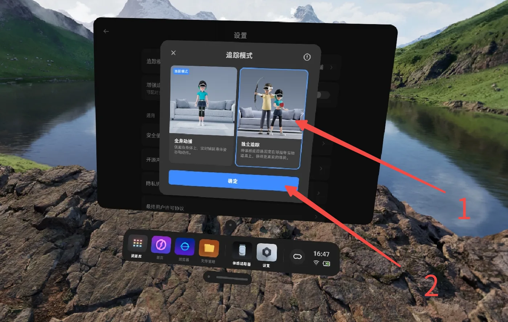{ width="480" }

## 打开 App 后的界面 {#pico-toolkit-ui}

戴上头显,从资源库打开 XTac-UMI XR。首次打开会问「允许"XTac-UMI XR"使用相机权限吗?」,点「允许」,否则取不到头显相机画面。「状态」显示「已连接」之前,采集单元读不到任何位姿;右上角「折叠」收起面板。

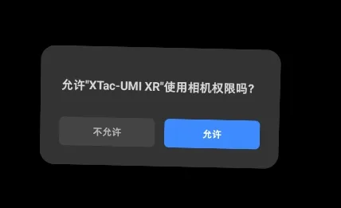{ width="380" }

=== "背包版"

    面板里勾选「USB 网络」→ 点「连接」(有线);走 WiFi 时不勾,填背包 IP 再点「连接」。追踪器数据精度不准、与背包断开时,面板上会出现图标提示。

    连上后打开控制台「实时监控」页,位姿视图应出现头显与左右爪的位姿;录制按钮未就绪时会给出原因,其中「Pico 位姿或时钟未就绪」就是头显还没连好。

=== "PC 版"

    界面只有状态、分辨率、重连三项。不用填 PC 端 IP:[有线共享网络](#pico-network)接好后 APP 会自动识别主机上的 XTac-UMI XR PC Service,但要点一下「重连」才会连,打开 APP 不会自动连。

    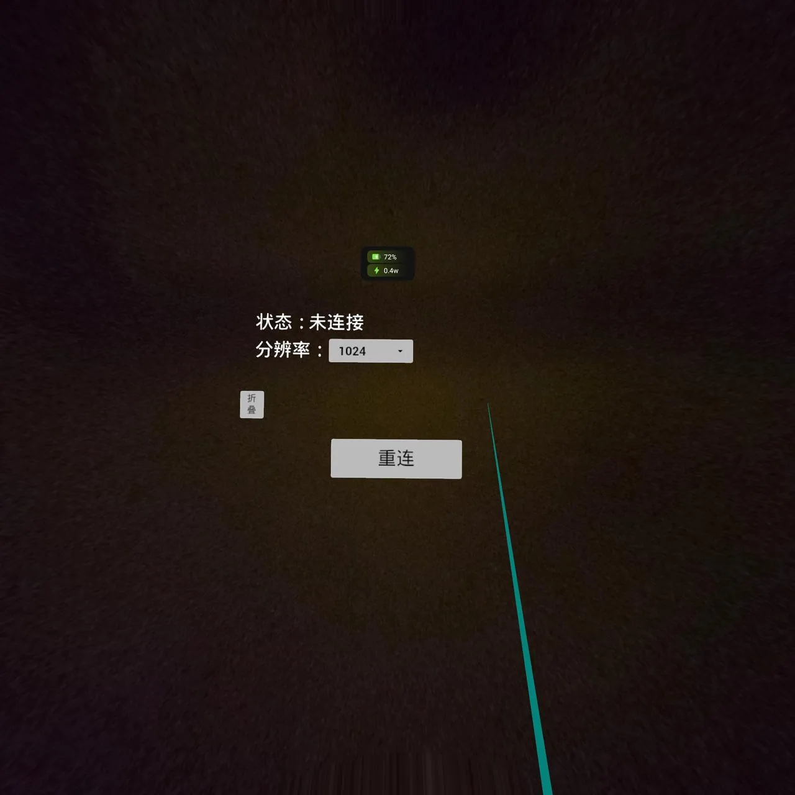{ width="420" }

    「分辨率」是[头显相机](../pc/recording.md#56)的取流分辨率,三档 `640` / `1024` / `1280`,默认 `640`,推荐就用它;不用头显相机时不起作用。在这里调高了,采集命令的 `--robot.head_camera_width/_height` 要跟着改成对应值,否则 connect 报首帧尺寸不符,对应表见[头显相机](../pc/recording.md#56)。

    高精度追踪默认开启,没有开关。一直连不上,多半是[网络](#pico-network)没接好或电脑 WiFi 没关。显示「已连接」后,在主机上用 `/opt/apps/roboticsservice/` 的 `ConsoleDemo` 或 `python -m lerobot.robots.taccap_gripper.check_tracker` 确认能读到带 `sn` 的位姿:头显显示连上和主机真的收到数据是两件事。

## 启动与坐标系对齐 {#pico-frame}

佩戴头显启动 XTac-UMI XR 时面朝机器人正前方,再在 APP 里[连上](#pico-toolkit-ui);启动瞬间冻结世界系的原点与方向。

世界系的定义(轴向、原点、冻结规则)与示意图见[坐标系](coordinates.md);数据集里所有位姿都以它为参考。

!!! danger "启动时面朝机器人正前方;分集之间不要重启 XTac-UMI XR"
    面朝正前方,世界系 X 轴才对齐机器人正前方;只需对齐方向,站在哪不影响。重启 XTac-UMI XR 后原点/方向会变,同一数据集内位姿参考系不一致。
