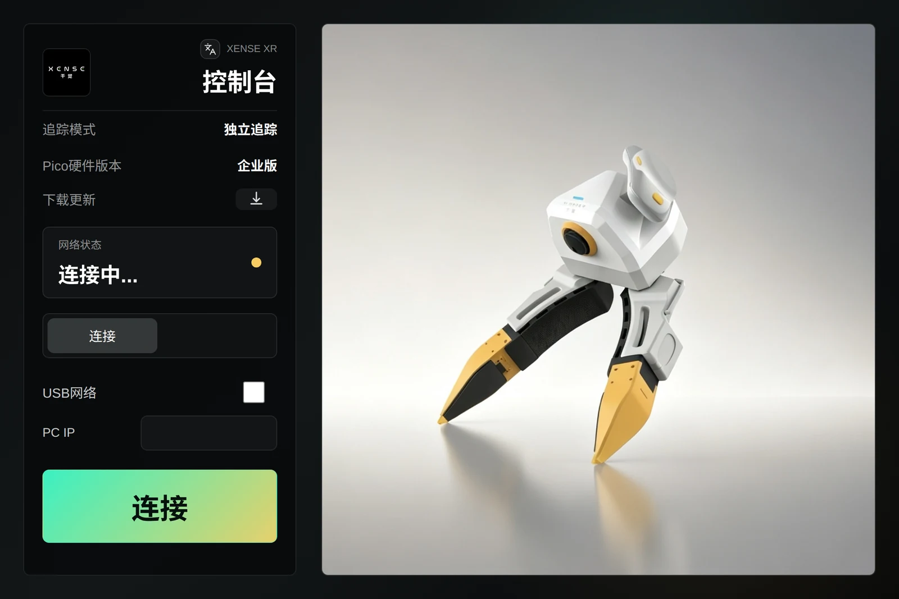

# Pico4 头显与追踪器配置 {#34}

Pico4 Ultra 企业版配套的独立运动追踪器装在夹爪顶部，提供 6-DoF 位姿；头显上运行 XTac-UMI XR（VR 客户端 APP），把位姿送到采集单元。两种形态用同一台头显、同一套追踪器，只有「头显接到哪、位姿服务在哪跑、APP 里怎么连」三处不同，本页把这几步放进「背包版 / PC 版」标签页，其余步骤两边完全一样。

| | 背包版 | PC 版 |
|---|---|---|
| 头显接到哪 | 数采背包的 `PICO` 口，**只能有线** | 数采主机的 Type-C 口（USB 有线共享网络），或与主机接同一个 WiFi |
| 位姿服务在哪跑 | XenseVR 运行时内置在 XTac-UMI Collector 里，背包开机即在，不用单独启动 | 数采主机上的 [XenseVR PC Service](../pc/host-setup.md#35)，每次采集前手动启动 |
| APP 里怎么连 | **不勾选**「USB网络」，「PC IP」留空 → 点「连接」（默认连 `192.168.100.1`） | 有线：**勾选**「USB网络」→ 点「连接」（默认连 `192.168.58.1`）；WiFi：不勾，在「PC IP」填数采主机 IP |

出厂已配置的头显，开发者模式、电源策略、APP、追踪器绑定、追踪模式都已设好且断电不丢（恢复出厂或换头显才要重做），直接从[网络连接](#pico-network)开始；接线、短按追踪器电源键到蓝灯亮、在 APP 里[连上](#pico-toolkit-ui)、[启动对齐](#pico-frame)每次采集都要做。

## 开箱与系统更新 {#pico-unbox}

1. 开箱：撕掉机身前面板保护贴、控制器胶条与镜片贴纸，长按电源键开机。

    { width="440" }

2. 更新系统，新机必做，出厂系统偏低，升级后才能正常使用，要在配追踪器、装 APP 之前做完：连有网的 WiFi，进 设置 → 系统升级，点「下载并安装」升到 Pico OS 5.15.5.U 或更高，安装包约 1.9 GB。

    { width="560" }

## 系统设置：开发者模式与电源策略 {#pico-system}

1. 开启开发者模式：设置 → 关于本机 → 连续点击「软件版本号」数次（用手柄时对着它连续扣食指扳机）→ 左侧出现「开发者选项」→ 打开 USB 调试。

    { width="480" }

    { width="480" }

2. 关闭休眠与灭屏：开发者选项里点「企业设置」→ 系统设置 → 电源策略（只有企业版有这一项，消费版调不到「永不」）。出厂默认灭屏 30 秒、系统休眠 5 分钟、电量图标不显示，三项都改，按顺序：
    1. 先设 系统休眠 = 永不；
    2. 再设 灭屏（息屏）= 永不；
    3. 把最下方的电量及充电状态图标设为「常驻显示」，采集途中可看电量。

    { width="480" }

!!! warning "先休眠、后灭屏，顺序不能反"
    灭屏时间受系统休眠约束：先改灭屏，系统休眠还是默认值，灭屏的「永不」会被钳回有限值，看着已设置，实际没生效。改完退出设置再进来确认两项都是「永不」。

不关的后果：头显在采集间隙灭屏/休眠后 XTac-UMI XR 会被挂起或杀掉，追踪中断，重启它又会重设世界系（见[坐标系对齐](#pico-frame)）；摘下头显放置时同样会触发。

## 安装 XTac-UMI XR {#pico-app}

APK 文件名形如 `XTac-UMI-XR-<版本>.apk`，当前版本为 0.3.2。在头显里用文件管理安装：

1. 电脑侧：USB 线连接头显与电脑，把 APK 拷到头显的 `Download/` 目录。

    { width="480" }

2. 戴上头显，任务栏点「文件管理」，进「Download」文件夹。

    { width="480" }

3. 点 APK，在「要安装此应用吗？」里选「安装」。装好后「资源库」里应出现 XTac-UMI XR。

    { width="480" }

电脑上装了 adb（Android platform-tools）的话，USB 调试已打开、「USB 连接」选「传输文件」后可以一键安装，不用进头显点：

```bash
adb devices                          # 应列出头显
adb install XTac-UMI-XR-0.3.2.apk    # 换成拿到的那份
```

## 网络连接 {#pico-network}

追踪数据要送到采集单元的 XenseVR 位姿服务。**背包版只能走有线**；PC 版默认也走有线，WiFi 只作临时调试用。有线是 Type-C 线直连，链路独占，延迟稳定可预期。

!!! warning "PC 版的无线只用于临时调试，不要用来正式采集"
    头显与采集单元走 WiFi 时要和现场其他设备抢信道，链路会出现网络波动，位姿数据随之延迟到达：轻则位姿卡顿、抖动，重则丢帧。这些问题在录制过程中看不出来，事后从数据里也难与别的原因区分，整批数据只能重采。正式采集一律用有线。

两种形态都先在头显里把 USB 设对：设置 → 开发者选项 → 打开「USB 调试」→「USB 连接」选「传输文件」。每次拔插 USB 后都要回来确认，它会掉回默认值；选不了就重启 Pico。

{ width="520" }

=== "背包版"

    有线连接步骤：

    1. 头显连接线（Pico → Pack，双 Type-C）一端接头显侧面的 Type-C 口，另一端接背包的 `PICO` 口。适配器供电与充电宝供电都是这样接，接线见[开箱、接线与供电](../backpack/unbox-connect.md#order)。
    2. 背包开机。XenseVR 运行时内置在 Collector 里，随背包一起启动，不需要单独开服务。
    3. 打开 XTac-UMI XR，不勾选「USB网络」，「PC IP」留空（默认连接背包的 `192.168.100.1`），点「连接」。

    背包版不支持头显走 WiFi，头显必须用 Type-C 线接背包。

=== "PC 版"

    有线连接步骤：

    1. 电脑端先启动服务（见[启动 XenseVR PC Service](../pc/host-setup.md#35)）：`runService.sh`。服务没起来，APP 连不上。
    2. Type-C 线直连头显与数采主机，头显给主机分配 IP。
    3. 打开 XTac-UMI XR，勾选「USB网络」，点「连接」，网络状态变成「连接成功」（见[打开 App 后的界面](#pico-toolkit-ui)）。勾选后 APP 自动连接数采主机（`192.168.58.1`），不用填 IP。

    走 WiFi 时头显和数采主机接同一网络，不勾选「USB网络」，在「PC IP」里填数采主机的 IP，再点「连接」。

    !!! warning "走有线时，关掉数采主机的 WiFi"
        有线共享网络会与主机上的其他网络（尤其 WiFi）冲突（路由 / 网卡抢占），导致追踪器连不上或位姿不稳。只保留头显的共享网络。

## 绑定运动追踪器到头显 {#pico-tracker-bind}

首次使用或更换追踪器后，必须先把 PICO Motion Tracker 绑定到这台头显，否则追踪模式里选不到它，XTac-UMI XR 与采集单元也发现不了它的 SN。

配对前先用手机扫追踪器背面的二维码拿到完整 SN，按单左双右（见[序列号与左右识别](gripper.md#sn)）装夹爪。红框里的六位数就是配对后「我的追踪器」列表里的编号（如 `Tracker 150311`）。

| 扫这里 | 扫出来是这样 |
|---|---|
| { width="300" } | { width="320" }<br>`G` 前是 `1`，单数 → 装左夹爪 |

1. 从资源库打开「体感追踪器」App，点主界面右上角的图标进入配对界面。

    { width="440" }

2. 长按追踪器电源键约 6 秒，直到指示灯蓝红交替闪烁，这是蓝牙配对状态。
3. 点「开始配对」。配对成功时头显会响一声提示音，该追踪器出现在「我的追踪器」列表里，显示电量与编号（如 `Tracker 150399`）并标注「已连接」。
4. 两只夹爪各一枚，要绑两枚，列表顶部应显示「已配对 2 个」。

    { width="440" }

!!! warning "开机是短按，配对才要长按"
    只亮蓝灯是普通开机，不是配对状态，App 扫不到。日常开机短按到蓝灯亮；只有首次绑定才长按约 6 秒到蓝红交替闪烁。

绑定关系存在头显上，日常开关机、重启 APP 不用重绑；换追踪器、换头显或恢复出厂后要重绑，配错了也一样：先在列表项右侧的 ⓘ 里解除配对，再绑新的。

!!! warning "独立追踪模式下，追踪器必须在头显视野内"
    被身体、桌沿或另一只手长时间遮挡会丢跟踪（位姿跳变或卡住），别让夹爪顶部的追踪器长时间脱离头显视野。

### 读取追踪器 SN {#pico-tracker-sn}

SN 决定左右（`G` 前一个数字单左双右），也是采集单元识别追踪器的依据。头显里看不到它：「体感追踪器」App 只显示短编号（如 `Tracker 150399`），XTac-UMI XR 的 Network 面板显示的 SN（如 `PA9410MGL…`）是头显自己的。完整 SN（形如 `PC2310MLL3200496G`）最直接的来源是追踪器背面的二维码。

=== "背包版"

    背包版只认二维码上的 SN，没有命令行接口。连上后到控制台「实时监控」页，位姿视图会显示左右爪位姿，逐个摇晃夹爪可以确认左右没装反。

=== "PC 版"

    用 PC Service 的 Python 接口读：

    ```python
    import xensevr_pc_service_sdk as xrt

    xrt.init()
    print(xrt.get_motion_tracker_serial_numbers())   # 例:['PC2310MLL3200496G', ...]
    ```

    它只返回服务当前收到数据的追踪器，所以要先：追踪器已绑定并开机 → XTac-UMI XR [「连接成功」](#pico-toolkit-ui) → 主机已启动 [PC Service](../pc/host-setup.md#35)，少一步就是空列表。拿到 SN 可用 `--robot.tracker_serial=<SN>` 直接钉住，跳过[自动匹配](../pc/host-setup.md#33)；逐个摇晃夹爪确认哪个 SN 是哪只手，再写进配置。

## 追踪模式 {#pico-tracker}

绑定完成后，在头显里打开「体感追踪」，进设置找到「追踪模式」，选「独立追踪」并点「确定」，改完这一行应显示「独立追踪」。出厂默认「全身动捕」是把追踪器戴在身上追人体；「独立追踪」是把追踪器固定在物体上追物体位姿，夹爪就是这种用法。

{ width="480" }

## 打开 App 后的界面 {#pico-toolkit-ui}

戴上头显，从资源库打开 XTac-UMI XR，进入「XENSE XR 控制台」。连接只用到左侧这几项：

| 项目 | 说明 |
|---|---|
| 追踪模式 | 应显示「独立追踪」，不是的话回到[追踪模式](#pico-tracker)重新设置 |
| Pico硬件版本 | 应显示「企业版」 |
| 网络状态 | 「连接成功」之前，采集单元读不到任何位姿 |
| USB网络 | PC 版有线连接时勾选，APP 自动连接数采主机（`192.168.58.1`）；**背包版不勾选** |
| PC IP | 背包版留空（默认连接背包的 `192.168.100.1`）；PC 版走 WiFi 时填数采主机的 IP，有线连接不用填 |
| 连接 / 断开 | 点「连接」开始连接，连上后按钮变为「断开」 |

=== "未连接"

    刚打开时网络状态是「未连接」。背包版不勾选「USB网络」、「PC IP」留空；PC 版有线连接勾选「USB网络」。然后点「连接」。

    { width="560" }

=== "连接成功"

    网络状态变为「连接成功」，就可以开始采集了。

    { width="560" }

两种形态在连接上的差别：

=== "背包版"

    面板里**不勾选**「USB网络」，「PC IP」留空（默认连接背包的 `192.168.100.1`），点「连接」；背包版只能有线连接。追踪器数据精度不准、与背包断开时，面板上会出现图标提示。

    连上后打开控制台「实时监控」页，位姿视图应出现头显与左右爪的位姿；录制按钮未就绪时会给出原因：「Pico 未就绪」后面跟的是头显这一侧的原因（如未连接或连接超时、位姿数据缺失或超时、时钟同步缺失或超时），「Tracker 未就绪」后面跟的是追踪器的原因（如不在视野内或静止超过 5 秒），两者可以同时出现。录制中头显断开会立即停止这条录制，见[录制中头显断联](../backpack/monitor-record.md#pico-disconnect)。

=== "PC 版"

    有线连接勾选「USB网络」，APP 自动连接数采主机（`192.168.58.1`）；走 WiFi 时不勾，在「PC IP」里填数采主机的 IP，再点「连接」。

    一直连不上，多半是[网络](#pico-network)没接好或电脑 WiFi 没关。显示「连接成功」后，在主机上用 `/opt/apps/roboticsservice/` 的 `ConsoleDemo` 或 `python -m lerobot.robots.taccap_gripper.check_tracker` 确认能读到带 `sn` 的位姿：头显显示连上和主机真的收到数据是两件事。

## 启动与坐标系对齐 {#pico-frame}

佩戴头显启动 XTac-UMI XR 时面朝机器人正前方，再在 APP 里[连上](#pico-toolkit-ui)；启动瞬间冻结世界系的原点与方向。

世界系的定义（轴向、原点、冻结规则）与示意图见[坐标系](coordinates.md)；数据集里所有位姿都以它为参考。

!!! danger "启动时面朝机器人正前方；分集之间不要重启 XTac-UMI XR"
    面朝正前方，世界系 X 轴才对齐机器人正前方；只需对齐方向，站在哪不影响。重启 XTac-UMI XR 后原点/方向会变，同一数据集内位姿参考系不一致。
