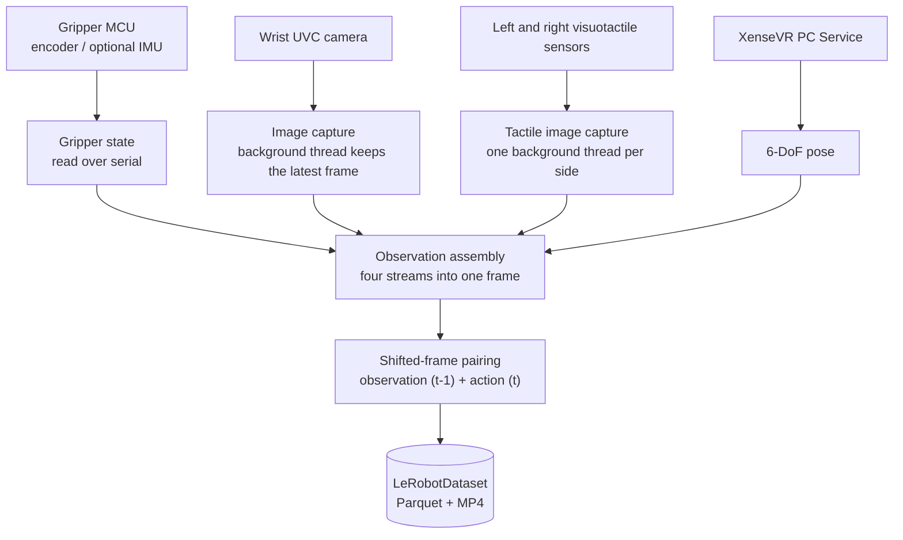

# Know your device

The XTac-UMI G1 is XenseRobotics' handheld UMI data-collection gripper for robot manipulation learning. The leader gripper integrates two visuotactile sensors, a wrist fisheye camera, an encoder and an IMU, and works with the Pico4 Ultra tracker to capture RGB, tactile images, 6-DoF pose and jaw opening in sync. The follower gripper mounts on the robot's end effector for execution or replay. This page helps you identify each part, connect the leader and follower grippers to the host and verify they are detected, and understand the power and safety requirements.

{ width="720" }

During collection the motor is **never driven** (it is never enabled). The operator holds the leader gripper and performs the demonstration by hand, so there is no separate teleoperator and no `--teleop.*` flags are needed on the CLI.

## System components

| Part | Notes | Rate / connection |
|---|---|---|
| Leader gripper (side-specific) | Hand-held operation and collection; the main MCU is an STM32; left and right are identified by their marking | USB Type-C for both power and communication |
| Follower gripper (not side-specific) | Mounted on the robot end effector; has a motor jaw; for robot-side execution or replay | 24V power + Type-C communication |
| Encoder (per gripper) | Jaw opening angle; [calibration](calibration.md#41) normalises it to closed = 0, open = 1 (the physical travel differs per unit) | 100 Hz |
| IMU (per gripper) | Accel / gyro / mag / temperature | 100 Hz |
| Visuotactile sensors ×2 (GSPS, per gripper) | One per finger; three-colour-light visuotactile imaging; rectified image ~`(400, 700, 3)` | ~30 Hz, UVC |
| Wrist fisheye camera (XC, per gripper) | Wrist-view RGB, very wide field of view | ~30 Hz, UVC |
| Pico4 Ultra motion tracker | Mounted on top of the leader gripper; wireless link to the headset | — |
| Pico4 Ultra Enterprise headset | Pairs with the tracker, establishes the world frame, and sends the 6-DoF pose to the host over a Type-C cable or WiFi; setup in [Pico4 Ultra Enterprise setup](host-setup.md#34) | — |
| XenseVR PC Service | Host daemon; the collection side reads the pose from it. Can optionally carry the headset's stereo frames (off by default, needs service ≥ v0.2.0, see [Headset camera](recording.md#56)) | — |
| `xense.taccap` / `xensesdk` | The former reads the MCU's encoder and optional IMU over serial; the latter reads the tactile images | — |
| `lerobot-record` (`taccap_gripper` robot type) | Pairs the observation (frame t-1) with the action (frame t pose + normalised opening) and writes a LeRobotDataset; see [How collection works](recording.md#51) | — |
| Pad, collection backpack 🚧 | Task operation / status view; portable collection unit. Optional configurations still in development; may not ship at this stage | — |

Items marked 🚧 are subject to the final release. Cables, power adapters, the collection terminal and so on follow the contract configuration and the packing list; if something is missing, contact your project lead or technical support rather than substituting your own. Supported platforms and dependency versions are in [You must upgrade to the latest versions](versions.md#required).

## Architecture and data flow

`xense-taccap-lerobot` handles device discovery, camera capture, observation assembly and dataset recording. The four data streams are first assembled into one observation frame; `lerobot-record` then does the shifted-frame pairing and the write:



Camera data does not pass through `xense.taccap`: the wrist camera is read via OpenCV / V4L2 and the tactile images via `xensesdk`. At assembly time the latest image from each stream is taken and combined with the gripper state and the Pico4 pose into one frame. Each frame records the EEF TCP pose (`tcp.*`), the normalised opening (`gripper.pos`), the optional IMU, the left and right tactile images and the wrist camera image; the fields are listed in [What each frame records](recording.md#53).

## Leader gripper connection and use {#install}

=== "Left leader gripper"

    { width="360" }

=== "Right leader gripper"

    { width="360" }

The leader gripper takes both power and communication over USB Type-C. The buttons are for recording control; the indicator LED shows the running state.

{ width="480" }

### Before connecting

- Have ready the left and right leader grippers, two USB locking cables (a Type-C locking connector on the gripper end, Type-C or Type-A on the other end to match the terminal's port) and the collection terminal (requirements in [Collection host requirements](install.md#host-spec)).
- Make sure no 9V/12V fast-charging adapter is connected directly to the leader gripper.
- The Type-C locking end is intact and there is nothing foreign inside the gripper's port.
- The visuotactile sensor surfaces are free of dirt, scratches, looseness and foreign objects.

### Connection steps

{ width="560" }

1. Take out the USB Type-C communication cable.
2. Plug it into the Type-C port on the leader gripper body and **tighten the locking screws**.
3. Plug the other end into the collection terminal (either a Type-C or a Type-A port works).

{ width="480" }

### Power-on and detection

Once connected, the LED should be solid white. Then check the UVC device count with `lsusb`: a dual-gripper setup should show 6 (2 wrist cameras + 4 visuotactile sensors), a single arm 3.

```bash
lsusb
```

{ width="720" }

Each of the two red boxes is one leader gripper; inside it are that gripper's 3 UVC devices:

| Text in the box | What it is | Per leader gripper |
|---|---|---|
| `Xense Robotics ... GSPS01…` | Visuotactile sensor | 2 |
| `Sunplus ... XCA…` | Wrist fisheye camera | 1 |

The last digit of the serial number tells the side (odd = left, even = right, see [Serial numbers and side identification](#sn)): in the picture `…0069`/`…0071` are left and `…0070`/`…0072` are right. If the count is wrong, check the cable locking and the USB port contact; if it is still wrong, see [Hardware faults](troubleshooting.md#hardware).

### LED states 🚧 {#buttons-leds}

| LED | Meaning | What you do |
|---|---|---|
| Solid white | Normal operation | Powered on; you can start collecting |

The LED patterns for recording, faults, OTA and so on are still in development and testing and are subject to the final release. If the LED is anything other than solid white, follow [Hardware faults](troubleshooting.md#hardware).

### Button functions 🚧 {#buttons}

The two buttons are for recording control; the single-press / double-press / long-press mapping is still being developed. For now, control recording from the command line; see [Data collection](recording.md).

An uncalibrated leader gripper is refused at connect; with two grippers, calibrate both sides, see [Gripper calibration](calibration.md#41). Firmware, SDK and repository versions must match; see [You must upgrade to the latest versions](versions.md#required).

## Follower gripper mounting and connection

{ width="360" }

The follower gripper mounts on the robot's end effector and is not side-specific. When mounting, mind the flange orientation, the cable routing and the robot's workspace.

### Before mounting

- The robot is stopped and in a safe pose.
- The end-effector flange size, screw specification, mounting orientation and end-effector payload meet the project requirements.
- The 24V adapter, the Type-C communication cable and the locking parts are intact.
- Plan the cable routing so it does not interfere with the joints, the gripper's range of motion or obstacles.

### Flange mounting

It mounts on the robot's end effector through a flange; dimensions and hole positions are in the figures below.

=== "Flange mounting"

    { width="420" }

=== "Flange dimensions"

    { width="420" }

### Power and communication connection

The follower gripper has separate communication and power: communication over Type-C, power from the 24V adapter.

{ width="560" }

1. Take out the USB Type-C communication cable and the 24V power adapter.
2. Connect the 24V power adapter to the follower gripper body.
3. Plug the screw end of the Type-C locking cable into the follower gripper body and **tighten the locking screws**.
4. Plug the other end into the collection terminal and confirm in the software that the follower gripper is communicating.

{ width="480" }

!!! warning "Cable and mounting check"
    Make sure the follower gripper is firmly fixed, the 24V connection is secure, the Type-C is locked with enough slack, and the cables cannot be pulled, bent or tangled while the robot moves. Before the first run, test at low speed to confirm nothing interferes.

## Power and connection requirements

| Item | Leader gripper | Follower gripper |
|---|---|---|
| Power | USB Type-C bus power, DC 5V/500mA, no separate supply needed | 24V power adapter (do not use a supply with the wrong rating or a faulty one); Type-C is communication only |
| Cables | Supplied locking cable: Type-C on the gripper end, Type-C or Type-A on the other | Type-C communication cable + 24V power cable |
| Connect and lock order | Connect the gripper end and tighten the locking screws first, then the collection terminal | Connect 24V power first, then Type-C, and tighten the locking screws |
| Disconnect order | Unplug the collection terminal end first, then loosen the screws and unplug the gripper end | Unplug the collection terminal end first, then cut 24V, and finally loosen the screws and unplug the gripper-end Type-C |
| Static | Take anti-static precautions when powering on/off and when removing or fitting sensors | Same as leader |

Stop collection, recording, robot motion and replay before unplugging anything. The power-on and power-off order for the whole system is in [Power-on and power-off order](quickstart.md#power-on). On an unexpected reboot, a device that is not detected, or a blinking red LED, stop immediately and follow [Hardware faults](troubleshooting.md#hardware).

## Serial numbers and side identification {#sn}

The side is given by whether the last digit of the serial number's running number is odd or even: **odd = left, even = right**. The collection software assigns sides automatically from this (see [Device discovery rules](host-setup.md#33)), so you normally do not need to tell them apart by hand; to check manually, run `lsusb` and look at the last digit.

## Specifications {#specs}

Electrical and interface details are in "Power and connection requirements" above. The table below gives the sensor and whole-unit specifications; the actual rates during collection can be configured as needed (for example recording tactile at a lower frame rate), which does not change the sensor specification.

| Parameter | Specification |
|---|---|
| Gripper type / dimensions | Two-finger; 145 × 186 × 170 mm |
| Weight (leader) / payload | About 370 g; max 2.5 kg |
| Opening travel / angle | 0–150 mm; the angular travel differs per unit, the measured value written to firmware by [calibration](calibration.md#41) is authoritative |
| Battery life | The leader gripper has no built-in battery and is powered from the USB Type-C bus; portable run time depends on the collection backpack (🚧 in development) |
| Multi-device time sync / positioning | 5 ms; < 3 mm |
| Visuotactile | 2 × three-colour light, range 0–25 N, 120 FPS (640×480 MJPG) |
| IMU | 9-axis, 100 Hz |
| Wrist fisheye camera | FOV 190°; 640×480 @ 30 FPS MJPG |
| Output data | RGB, multimodal tactile, jaw opening angle, IMU, spatial position trajectory |

Internal communication: the external interface is USB Type-C; the internal MCU serial port is bridged by a CH343 (`1a86:55d2`), enumerates as `/dev/ttyACM*`, USART3 @ 3 Mbps; the visuotactile sensors and the wrist camera are UVC (`/dev/video*`); the follower passes through to the RobStride motor over FDCAN1 @ 1 Mbps.

## Safety notes {#safety}

!!! danger "Read before connecting, powering on, or removing/fitting parts"
    If you notice a strange smell, smoke, noticeable heat, structural damage or a frayed cable, cut power immediately and stop using the device.

| Risk | Requirement | Consequence |
|---|---|---|
| Leader gripper power | Connect to the collection terminal only with the supplied USB Type-C cable, DC 5V/500mA | A wrong rating can damage the device |
| No direct fast charging | Never connect a 9V/12V fast-charging adapter directly to the leader gripper | Can burn out the control board |
| Follower gripper power | Power and communication are separate; power from the 24V adapter | A wrong power connection can damage the hardware |
| Plugging and unplugging | Stop collection before plugging or unplugging a Type-C with locking screws; loosen the screws before pulling | Avoids stress on the port / data interruption |
| Static protection | Take anti-static precautions when powering on/off and when removing or fitting sensors | Static affects the sensors / communication |
| Sensor surface | Keep sharp objects away from the visuotactile surface; do not scratch or press it | Elastomer / optical damage affects the data |

Cleaning, storage and removal/fitting of the visuotactile sensors are in [Maintenance](maintenance.md). Once everything is connected and detected, follow [Quickstart](quickstart.md) to power on and run your first collection.
