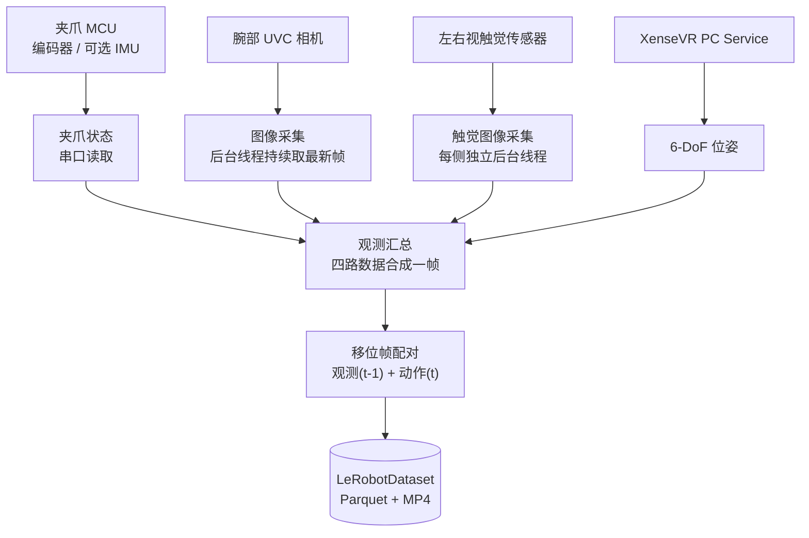

# 认识设备

XTac-UMI G1 是 XenseRobotics 面向机器人操作学习的手持式 UMI 数采夹爪:主夹爪集成双视触觉传感器、腕部鱼眼相机、编码器与 IMU,配合 Pico4 Ultra 追踪器同步采集 RGB、触觉图像、6-DoF 位姿与夹爪开度;从夹爪装在机器人末端,用于执行或回放。本页帮你认清各部件、把主 / 从夹爪接上主机并核对识别,并了解供电与安全要求。

{ width="720" }

采集时**不驱动电机**(电机始终不使能),操作员手持主夹爪机械地完成演示动作,因此没有独立遥操作端,命令行不需要任何 `--teleop.*` 参数。

## 数采系统组成

| 部件 | 说明 | 采样率 / 连接 |
|---|---|---|
| 主夹爪(区分左右) | 人手侧操作与采集;主控 MCU 为 STM32;左右按标识区分 | USB Type-C 统一供电 + 通信 |
| 从夹爪(不区分左右) | 装在机器人末端,带电机夹爪(motor jaw),用于执行端操作或回放 | 24V 供电 + Type-C 通信 |
| 编码器(每只夹爪) | 夹爪开合角度;[标定](calibration.md#41)后归一化为闭合 = 0、张开 = 1,真实行程每台各异 | 100 Hz |
| IMU(每只夹爪) | 加速度 / 角速度 / 磁力 / 温度 | 100 Hz |
| 视触觉传感器 ×2(GSPS,每只夹爪) | 左右指各一,三色光视触觉成像;校正后约 `(400, 700, 3)` | ~30 Hz,UVC |
| 腕部鱼眼相机(XC,每只夹爪) | 手腕视角 RGB,超大视场角 | ~30 Hz,UVC |
| Pico4 Ultra 运动追踪器 | 装在主夹爪顶部,无线连头显 | — |
| Pico4 Ultra 企业版头显 | 配对追踪器、建立世界坐标系,经 Type-C 有线或 WiFi 把 6-DoF 位姿送到主机;配置见 [Pico4 Ultra 企业版配置](host-setup.md#34) | — |
| XenseVR PC Service | 主机守护进程,采集端从中读位姿;可选送头显双目画面(默认关闭,需服务 ≥ v0.2.0,见 [头显相机](recording.md#56)) | — |
| `xense.taccap` / `xensesdk` | 前者经串口读 MCU 的编码器与可选 IMU,后者读触觉图像 | — |
| `lerobot-record`(`taccap_gripper` 设备类型) | 把观测(t-1 帧)与动作(t 帧位姿 + 归一化开度)配对写出 LeRobotDataset,见 [采集原理](recording.md#51) | — |
| Pad、数采背包 🚧 | 任务操作 / 状态查看;便携采集单元。研发中的可选配置,现阶段可能不随货 | — |

标 🚧 的内容以最终发布版本为准;线缆、电源适配器、采集终端等以合同配置及随货清单为准,缺件时联系项目负责人或技术支持,勿自行替代。支持的平台与依赖版本见 [必须升级到最新版本](versions.md#required)。

## 系统架构与数据流

`xense-taccap-lerobot` 负责设备发现、相机采集、观测汇总与数据集录制。四路数据先汇总成一帧观测,再由 `lerobot-record` 完成移位帧配对与写入:



相机数据不经过 `xense.taccap`:腕相机经 OpenCV / V4L2 读取,触觉图像经 `xensesdk` 读取,汇总时取各路最新图像,与夹爪状态、Pico4 位姿合成一帧。每帧记录 EEF TCP 位姿(`tcp.*`)、归一化开度(`gripper.pos`)、可选 IMU、左右触觉图与腕相机图,字段见 [每帧记录内容](recording.md#53)。

## 主夹爪连接与使用 {#install}

=== "左主夹爪"

    { width="360" }

=== "右主夹爪"

    { width="360" }

主夹爪的电源与通信统一走 USB Type-C;按键用于录制控制,指示灯用于判断运行状态。

{ width="480" }

### 连接前检查

- 备齐左 / 右主夹爪、两根 USB 锁紧线(夹爪端 Type-C 锁紧接头,另一端按终端接口选 Type-C 或 Type-A)、数采终端(配置要求见 [采集主机配置要求](install.md#host-spec))。
- 确认未使用 9V/12V 快充适配器直连主夹爪。
- Type-C 锁紧端完好、夹爪接口内无异物。
- 视触觉传感器表面无污渍、划伤、松动、异物。

### 连接步骤

{ width="560" }

1. 取出 USB Type-C 通讯线。
2. 接主夹爪本体端的 Type-C 接口,**旋紧锁紧螺钉**。
3. 另一端接数采终端(Type-C 或 Type-A 口皆可)。

{ width="480" }

### 上电与识别

接好后指示灯应白色长亮,再用 `lsusb` 核对 UVC 设备数:双夹爪应有 6 个(2 个腕部相机 + 4 个视触觉传感器),单臂 3 个。

```bash
lsusb
```

{ width="720" }

两个红框各对应一只主夹爪,框内是它的 3 个 UVC 设备:

| 框内字样 | 是什么 | 每只主爪 |
|---|---|---|
| `Xense Robotics ... GSPS01…` | 视触觉传感器 | 2 个 |
| `Sunplus ... XCA…` | 腕部鱼眼相机 | 1 个 |

序列号末位可看出左右(单左双右,见 [序列号与左右识别](#sn)):图中 `…0069`/`…0071` 是左,`…0070`/`…0072` 是右。数量不对时检查线缆锁紧与 USB 口接触;仍不对见 [硬件异常](troubleshooting.md#hardware)。

### 指示灯状态 🚧 {#buttons-leds}

| 指示灯 | 含义 | 用户动作 |
|---|---|---|
| 白色长亮 | 正常运行 | 已上电,可以开始采集 |

录制中、故障、OTA 等灯语尚在开发测试中,以最终发布版本为准;非白色长亮时按 [硬件异常](troubleshooting.md#hardware) 处理。

### 按键功能 🚧 {#buttons}

两个按键用于录制控制,单击 / 双击 / 长按的映射仍在开发完善中;当前用命令行控制录制,见 [数据采集](recording.md)。

没标定的主夹爪会被拒绝连接,双夹爪两侧都要标,见 [夹爪标定](calibration.md#41);固件、SDK 与仓库版本要配套,见 [必须升级到最新版本](versions.md#required)。

## 从夹爪安装与连接

{ width="360" }

从夹爪装在机器人末端,不区分左右;安装时注意法兰方向、线缆走线与机器人运动空间。

### 安装前检查

- 机器人已停机、处于安全姿态。
- 末端法兰尺寸、螺钉规格、安装方向与末端负载满足项目要求。
- 24V 适配器、Type-C 通信线与锁紧结构完好。
- 规划线缆走线,避免与关节 / 夹爪运动区 / 障碍物干涉。

### 法兰安装

通过法兰装到机器人末端,尺寸与孔位见下图。

=== "法兰安装"

    { width="420" }

=== "法兰尺寸"

    { width="420" }

### 电源与通信连接

从夹爪通信与供电分开:通信走 Type-C,供电用 24V 适配器。

{ width="560" }

1. 取出 USB Type-C 通讯线、24V 电源适配器。
2. 接从夹爪本体端的 24V 电源适配器。
3. Type-C 锁紧线带螺钉的一端接从夹爪本体,**旋紧锁紧螺钉**。
4. 另一端接数采终端,在软件中确认从夹爪通信正常。

{ width="480" }

!!! warning "线缆与安装检查"
    确认从夹爪固定牢靠、24V 连接可靠、Type-C 已锁紧并留足余量,线缆不会在机器人运动中被拉扯 / 弯折 / 缠绕。首次运行前先低速测试,确认无干涉。

## 供电与连接要求

| 项目 | 主夹爪 | 从夹爪 |
|---|---|---|
| 供电 | USB Type-C 总线供电,DC 5V/500mA,无需单独电源 | 24V 电源适配器(勿用规格不匹配或带故障的电源),Type-C 只做通信 |
| 线缆 | 配套锁紧线:夹爪端 Type-C,另一端 Type-C 或 Type-A | Type-C 通信线 + 24V 电源线 |
| 接线锁紧顺序 | 先接夹爪端并旋紧锁紧螺钉,再接数采终端 | 先接 24V 电源,再接 Type-C 并旋紧锁紧螺钉 |
| 拔线顺序 | 先拔数采终端端,再松螺钉拔夹爪端 | 先拔数采终端端,再断 24V,最后松螺钉拔夹爪端 Type-C |
| 静电 | 上下电、拆装传感器时防静电 | 同左 |

拔线前先停止采集 / 录制 / 机器人运动 / 回放;整套系统的上电与下电顺序见 [上电与下电顺序](quickstart.md#power-on)。出现异常重启、无法识别或红灯闪烁时立即停止,按 [硬件异常](troubleshooting.md#hardware) 处理。

## 序列号与左右识别 {#sn}

左右侧别由序列号流水号末位的单双数区分:**单数 = 左,双数 = 右**。采集软件据此自动分侧(见 [设备发现规则](host-setup.md#33)),通常无需手动辨别;手动核对时跑 `lsusb` 看末位即可。

## 技术参数 {#specs}

电气与接口见上文《供电与连接要求》。下表是传感器与整机规格;采集时实际速率可按需配置(如触觉以较低帧率录制),不改变传感器规格。

| 参数项 | 规格 |
|---|---|
| 夹爪类型 / 外形 | 二指结构;145 × 186 × 170 mm |
| 重量(主爪)/ 负载 | 约 370 g;最大 2.5 kg |
| 开合行程 / 角度 | 0–150 mm;角度行程每台各异,以[标定](calibration.md#41)写入固件的实测值为准 |
| 续航 | 主夹爪无内置电池,由 USB Type-C 总线供电;便携续航取决于数采背包(🚧 研发中) |
| 多设备时间同步 / 定位 | 5 ms;< 3 mm |
| 视触觉 | 2 × 三色光,量程 0–25 N,120 FPS(640×480 MJPG) |
| IMU | 9 轴,100 Hz |
| 腕部鱼眼相机 | FOV 190°;640×480 @ 30 FPS MJPG |
| 输出数据 | RGB、多模态触觉、夹爪开口角度、IMU、空间定位轨迹 |

内部通信:对外接口为 USB Type-C;内部 MCU 串口经 CH343(`1a86:55d2`)桥接,枚举为 `/dev/ttyACM*`,USART3 @ 3 Mbps;视触觉与腕相机为 UVC(`/dev/video*`);从爪经 FDCAN1 @ 1 Mbps 透传灵足电机。

## 安全须知 {#safety}

!!! danger "连接 / 上电 / 拆装前必读"
    出现异味、冒烟、明显发热、结构破损或线缆破皮时,立即断电并停止使用。

| 风险项 | 要求 | 后果 |
|---|---|---|
| 主夹爪供电 | 仅用配套 USB Type-C 线连数采终端,DC 5V/500mA | 规格不符可能损坏设备 |
| 禁止快充直连 | 禁止 9V/12V 快充适配器直连主夹爪 | 可能烧毁控制板 |
| 从夹爪供电 | 供电与通信分开,供电用 24V 适配器 | 电源接错可能损坏硬件 |
| 线缆插拔 | 插拔带锁紧螺钉的 Type-C 前先停止采集;拔出前先松螺钉 | 避免接口受力 / 数据中断 |
| 静电防护 | 上下电、拆装传感器时注意防静电 | 静电影响传感器 / 通信 |
| 传感器表面 | 避免尖锐物触碰、划伤、挤压视触觉表面 | 弹性体 / 光学损伤影响数据 |

视触觉传感器的清洁、存放与拆装见 [维护保养](maintenance.md)。接好并识别正常后,按 [快速开始](quickstart.md) 上电并跑通第一次采集。
