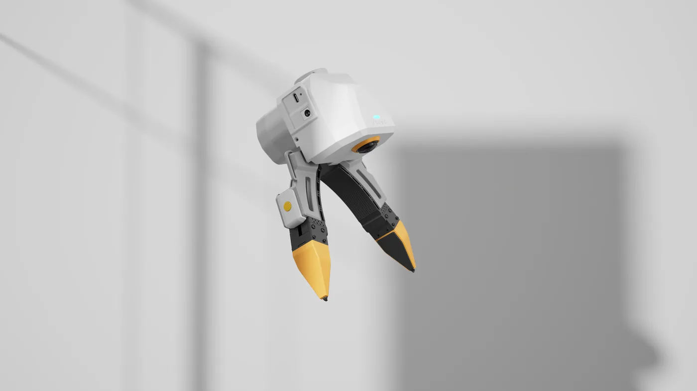

# 从夹爪概览

从夹爪(Follower)装在机器人末端,由电机驱动开合。主夹爪拿在手里采集动作,从夹爪在机器人上执行动作。
本章介绍怎样用 `xense.taccap` SDK 控制从夹爪。

{ width="720" }

!!! warning "本章使用单独安装的 SDK 0.3.2"
    本章按 [TacCap-Gripper](https://github.com/XenseRobotics-AI/TacCap-Gripper) **v0.3.2** 编写,
    需要按 [准备与自检](follower-setup.md#install) 单独安装。数采环境里自带的是旧版 SDK,不要混用。

## 和主夹爪的区别 {#vs-leader}

| | 主夹爪 | 从夹爪 |
|---|---|---|
| 用途 | 手持采集 | 装在机器人末端执行开合与夹持 |
| 电机 | 无 | RobStride EL05 |
| 供电 | USB Type-C | USB Type-C + **24V** |
| IMU / 编码器 / 按键 | 有 | 无 |
| 行程标定 | 手动标定 | 上电自动标定 |
| 序列号末位字母 | `m` | `s` |
| 随 SDK 0.3.2 附带的固件 | 1.2.5 | 1.2.9 |

主夹爪和从夹爪的固件各自编号,两边版本号不同是正常的。

{ width="720" }

## 序列号 {#sn}

以 `TCGU01A24A0001s` 为例:

- **最后一个字母**是角色:`m` = 主夹爪,`s` = 从夹爪。刷固件时按它选镜像。
- **倒数第二位数字**的单双数是侧别:单数 = 左,双数 = 右。从夹爪机械上不分左右,但软件用它区分两只从夹爪。

## 电机 {#motor-model}

| 持续堵转额定 | 额定力矩 | 力矩量程 | 速度量程 |
|---|---|---|---|
| 1.1 N·m | 1.8 N·m | 6.0 N·m | 50 rad/s |

**持续堵转额定**是爪子顶住物体时可以一直保持的力矩,也是默认的夹持力和上限。

## 安全须知 {#safety-model}

- 夹爪固件内置**运动安全包络**(力矩上限、过热降额),任何程序都绕不过去。
  **它出厂时是关的**,第一次运动前必须按 [写入运动安全包络](follower-setup.md#envelope) 打开。
  不打开的话,爪子顶住硬物时会把 24V 电源拉垮,**夹爪松手、USB 断开**。
- 停止控制、程序退出或 USB 断开时,夹爪会松开,夹着的东西会掉。
- 上电后夹爪会自己开合一次做标定(约 10 秒),期间不要放东西、不要发命令。

## 接下来 {#next}

1. 安装与接线:[硬件介绍 → 从夹爪安装与连接](hardware.md#follower-install)
2. 安装 SDK、自检、写入包络:[准备与自检](follower-setup.md)
3. 让它动起来:[运动控制](follower-control.md)
4. 升级固件:[固件与电机升级](follower-firmware.md)
5. 出问题时:[从夹爪故障排查](follower-troubleshooting.md)
