# 硬件介绍

XTac-UMI G1 的机械、电气与操作说明,面向数采使用的
**设备了解与连接上手**。连接、上电或拆装前请先阅读文末 [安全须知](#safety)。

## 产品组成

| 部件 | 说明 |
|---|---|
| 主夹爪(区分左右) | 人手侧操作与数据采集;左右按标识区分;Type-C 统一供电+通信 |
| 从夹爪(不区分左右) | 安装于机器人末端,用于执行端操作或回放;24V 供电 + Type-C 通信 |
| 视触觉传感器 ×2 | 左右指各一,三色光视触觉成像 |
| 腕部鱼眼相机 | 手腕视角 RGB,超大视场角 |
| Pico4 Ultra 企业版 | 配对运动追踪器、建立世界坐标系并向 PC 传输主夹爪 6-DoF 位姿(见 [3.4 Pico4 Ultra 企业版配置](03-host-hardware.md#34)) |
| Pad 🚧 | 任务操作 / 状态查看;**研发中,可选** |
| 数采背包 🚧 | 便携采集单元(数采盒子);**研发中,可选** |
| 主控 MCU | STM32 |

!!! info "🚧 表示尚在开发完善中"
    本手册中标 🚧 的内容都**尚未定版**,以最终发布版本为准。

    - **Pad** 与**数采背包**:研发中的**可选配置**,现阶段可能不随货提供,实际以合同配置为准。
    - [**指示灯状态**](#buttons-leds) 与[**按键功能**](#buttons):功能已有,但灯语与按键映射还在确定中。

!!! note "包装清单以随货为准"
    标准系统配置(线缆、电源适配器、采集终端等)以**合同配置及随货发货清单**为准;
    缺少关键线缆/电源/终端时请联系项目负责人或技术支持,勿自行替代。

### 主夹爪(区分左右)

=== "左主夹爪"

    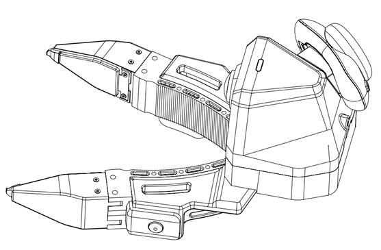{ width="360" }

=== "右主夹爪"

    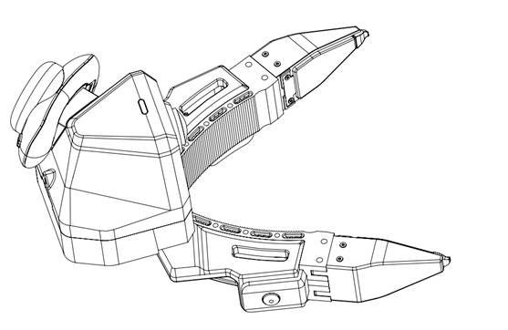{ width="360" }

主夹爪的电源与通信统一通过 USB Type-C 完成;**按键**用于录制控制,**指示灯**用于判断运行状态。

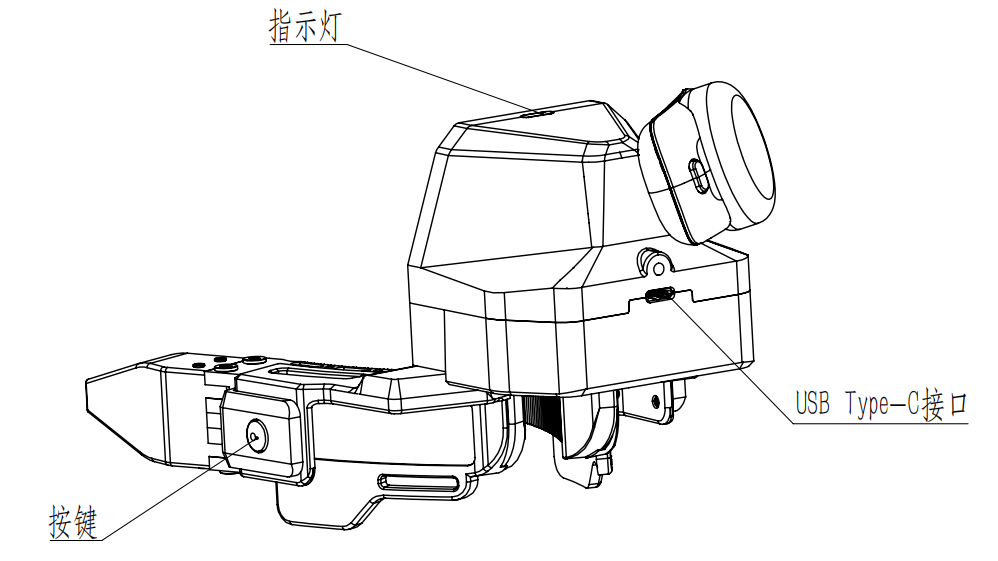{ width="480" }

### 从夹爪(不区分左右)

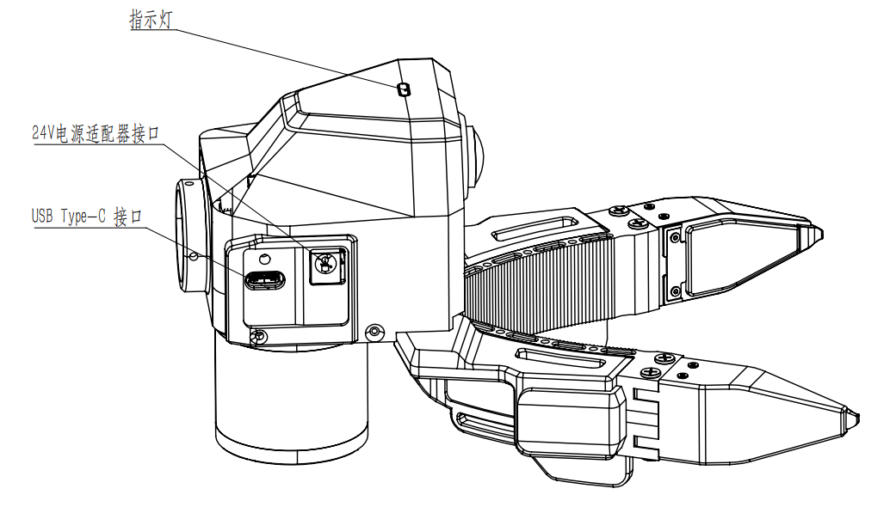{ width="360" }

从夹爪安装在机器人末端,当前硬件不区分左右;安装时注意法兰方向、线缆走线与机器人运动空间。

## 主夹爪连接与使用 {#install}

### 连接前检查

- 备齐:左/右主夹爪、两根 **USB 锁紧线**、笔记本/数采终端(这台机器的配置要求见
  [采集主机配置要求](02-environment.md#host-spec))。线缆**夹爪端固定为 Type-C 锁紧接头**,另一端按数采终端的接口选 **Type-C 或 Type-A** 均可。
- 确认**未使用 9V/12V 快充适配器**直连主夹爪。
- 检查 Type-C 锁紧端完好、夹爪接口内无异物。
- 检查视触觉传感器表面无污渍、划伤、松动、异物。

### 连接步骤

主夹爪与上位机的连接关系:

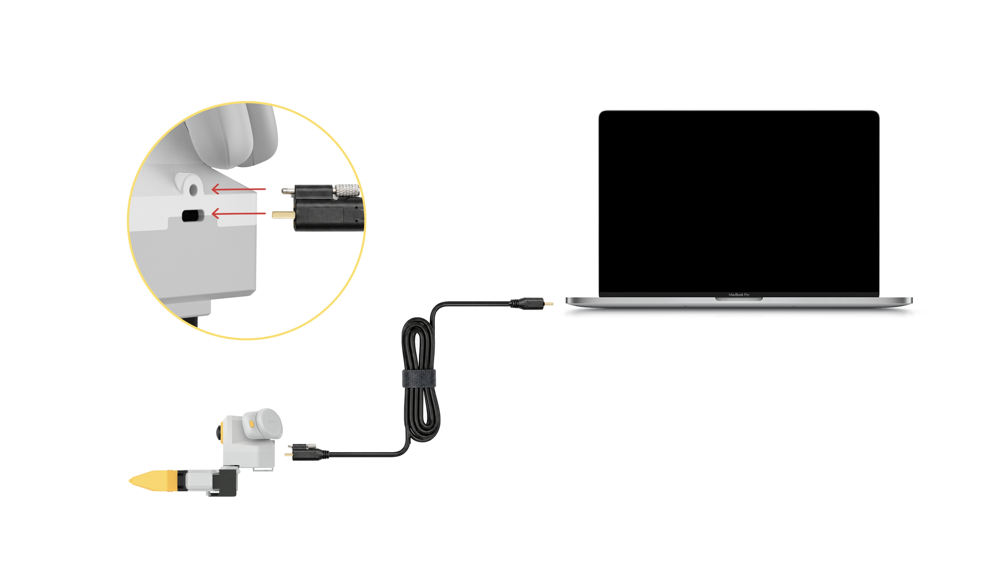{ width="560" }

1. 取出 USB Type-C 通讯线。
2. 连接主夹爪本体端的 Type-C 接口,**旋紧锁紧螺钉**。
3. 另一端接数采终端(Type-C 或 Type-A 口皆可),在采集软件中确认主夹爪通信正常。

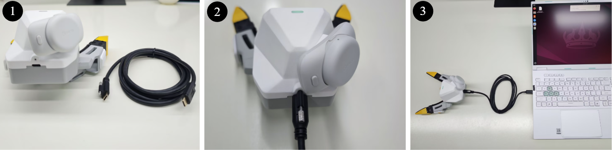{ width="480" }

### 上电与识别

主夹爪**无需单独电源**,供电与通信都走 Type-C。连接后观察指示灯,并在采集软件中确认左右主夹爪识别正常。

**用 `lsusb` 核对传感器**:接线完毕后运行 `lsusb`,确认能看到全部 UVC 传感器——
**双夹爪**应有 **6 个**:2 个腕部相机(wrist camera)+ 4 个视触觉传感器(每只主爪 1 相机 + 2 触觉);
**单臂** 3 个(1 相机 + 2 触觉)。

```bash
lsusb
```

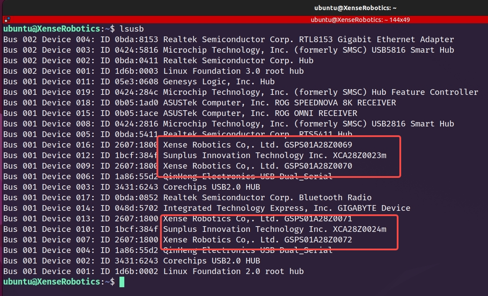{ width="720" }

上图是**双夹爪**接好后的实际输出。**两个红框各对应一只主夹爪**,每框内是这只爪的 3 个 UVC 设备:

| 框内字样 | 是什么 | 每只主爪 |
|---|---|---|
| `Xense Robotics ... GSPS01…` | 视触觉传感器 | 2 个 |
| `Sunplus ... XCA…` | 腕部鱼眼相机 | 1 个 |

序列号末位还能直接看出左右(单左双右,见 [序列号与左右识别](#sn)):图中 `…0069`/`…0071`
是左,`…0070`/`…0072` 是右。

数量不对时,检查线缆是否锁紧、USB 口是否接触良好;排查见 [异常排查](#troubleshoot)。

### 指示灯状态 🚧 {#buttons-leds}

| 指示灯 | 含义 | 用户动作 |
|---|---|---|
| 白色长亮 | 正常运行 | 已上电,可以开始采集 |

!!! warning "其余灯态仍在确定中"
    录制中、故障、OTA 升级等状态的灯语目前**尚在开发测试中**,本手册暂不列出,
    以最终发布版本为准。看到非白色长亮的灯态时,先按[异常排查](#troubleshoot)处理。

### 按键功能 🚧 {#buttons}

!!! warning "按键功能正在开发完善中"
    主夹爪机身上的两个按键用于录制控制,具体的单击 / 双击 / 长按对应哪些操作
    **仍在开发完善中**,本手册暂不列出,以最终发布版本为准。

    当前阶段请用命令行控制录制,见 [数据采集](05-data-collection.md)。

!!! warning "没标定的主夹爪连不上,必须先标"
    主夹爪的开合在数据里记为归一化的 `gripper.pos`(`0.0` 闭合 / `1.0` 张开)。这两个端点
    存在 MCU flash 中,**每台标一次即可**,断电不丢。没标过的主夹爪采集程序会拒绝连接,
    并提示要跑哪条命令——双夹爪两台都要标 → [4.1 夹爪标定](04-calibration.md#41)

    标定要求**固件 ≥ V2.1**。固件、SDK 与仓库版本必须配套升级,
    见 [必须升级到最新版本](versions.md#required)。

## 从夹爪安装与连接

### 安装前检查

- 确认机器人已停机、处于安全姿态。
- 确认末端法兰尺寸、螺钉规格、安装方向与末端负载满足项目要求。
- 确认 24V 适配器、Type-C 通信线与锁紧结构完好。
- 规划线缆走线,避免与关节/夹爪运动区/障碍物干涉。

### 法兰安装

从夹爪通过法兰安装到机器人末端(尺寸/孔位见下图)。

=== "法兰安装"

    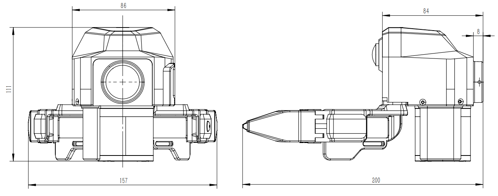{ width="420" }

=== "法兰尺寸"

    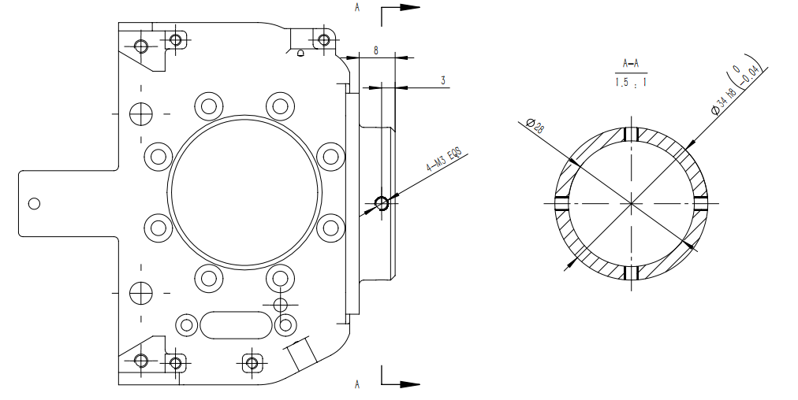{ width="420" }

### 电源与通信连接

从夹爪**通信与供电分开**:通信走 Type-C,供电用 24V 适配器。

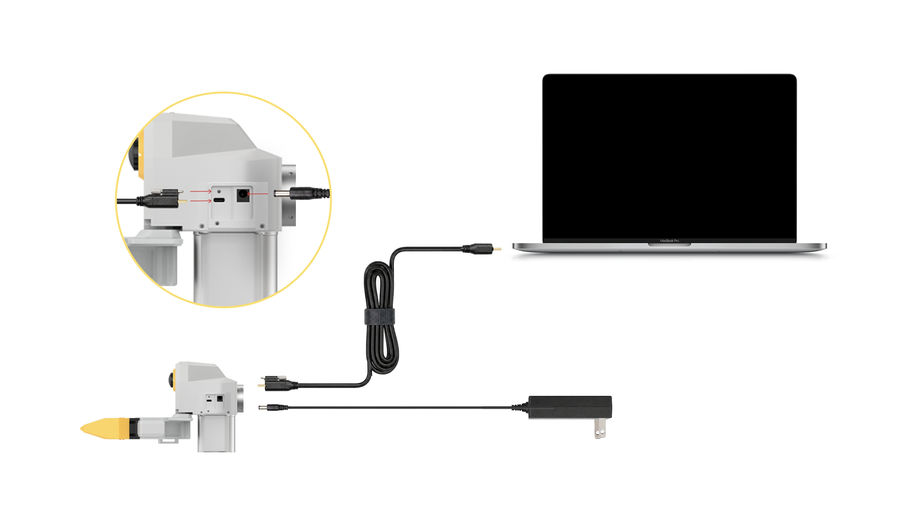{ width="560" }

1. 取出 USB Type-C 通讯线、24V 电源适配器。
2. 连接从夹爪本体端的 **24V 电源适配器**。
3. 将 Type-C 锁紧线带螺钉的一端接从夹爪本体,**旋紧锁紧螺钉**。
4. 另一端接数采终端,在软件中确认从夹爪通信正常。

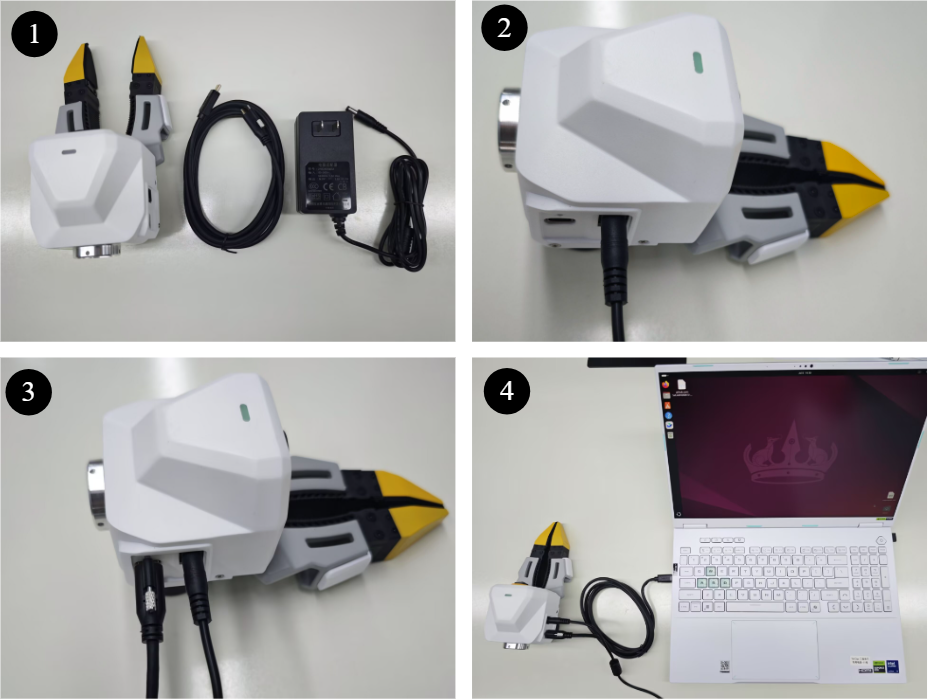{ width="480" }

!!! warning "线缆与安装检查"
    确认从夹爪固定牢靠、24V 连接可靠、Type-C 已锁紧并留足余量;线缆不会在机器人运动中被拉扯/弯折/缠绕。
    **首次运行前建议低速测试**,确认无干涉。

## 视触觉传感器维护与拆装

视触觉传感器的清洁、存放与拆装见 [维护保养](maintenance.md)。

## 上电与下电顺序

| 设备 | 供电 | 上电顺序 | 下电顺序 |
|---|---|---|---|
| 主夹爪 | USB Type-C,DC 5V/500mA | 先连夹爪端并锁紧,再连数采终端 | 先拔数采终端端,再松螺钉拔夹爪端 |
| 从夹爪 | 24V 适配器 + Type-C | 先连 24V 电源,再连 Type-C 并锁紧 | 先拔数采终端端,再断 24V,最后拔夹爪端 Type-C |

上电后观察指示灯并在软件确认识别正常;下电前先**停止当前采集/录制/机器人运动/回放**。

!!! warning "静电与异常"
    上下电注意防静电。若出现异常重启、无法识别或红灯闪烁,立即停止并按[异常排查](#troubleshoot)处理。

## 序列号与左右识别 {#sn}

设备的**左右侧别**由序列号**流水号末位的单双数**区分:**单数 = 左,双数 = 右**(单左双右)。
采集软件据此**自动分侧**(见 [3.3 设备发现规则](03-host-hardware.md#33)),通常无需手动辨别。

需要手动核对时,跑 [`lsusb`](#上电与识别) 看序列号末位即可。

## 技术参数 {#specs}

### 电气与接口

| 项目 | 主夹爪 | 从夹爪 |
|---|---|---|
| 供电 | USB Type-C | 24V 电源适配器 |
| 通信 | USB Type-C | USB Type-C |
| 标准供电规格 | DC 5V/500mA | 24V |
| 线缆 | 配套锁紧线,夹爪端 Type-C;另一端 Type-C 或 Type-A | Type-C 通信线 + 24V 电源线 |
| 禁止事项 | 禁止 9V/12V 快充直连 | 禁止供电规格不匹配/带故障电源 |

### 产品规格(整机)

下表是**传感器与整机规格**。采集时实际速率可按需配置(如触觉以较低帧率录制),属**使用选择**,不改变传感器规格。

| 参数项 | 规格 |
|---|---|
| 夹爪类型 / 外形 | 二指结构;145 × 186 × 170 mm |
| 重量(主爪)/ 负载 | 约 370 g;最大 2.5 kg |
| 开合行程 / 角度 | 0–150 mm;角度行程**每台各异**,以[标定](04-calibration.md#41)写入固件的实测值为准 |
| 续航 | 主夹爪无内置电池,由 USB Type-C 总线供电;便携续航取决于数采背包(🚧 研发中) |
| 多设备时间同步 / 定位 | 5 ms;< 3 mm |
| 视触觉 | 2 × 三色光,量程 0–25 N,120 FPS(640×480 MJPG) |
| IMU | 9 轴,100 Hz |
| 腕部鱼眼相机 | FOV 190°;640×480 @ 30 FPS MJPG |
| 输出数据 | RGB、多模态触觉、夹爪开口角度、IMU、空间定位轨迹 |

!!! note "内部通信(技术参考)"
    对外接口为 USB Type-C;内部 MCU 串口经 CH343(`1a86:55d2`)桥接,枚举 `/dev/ttyACM*`,
    USART3 @ 3 Mbps;视触觉与腕相机为 UVC(`/dev/video*`);从爪经 FDCAN1 @ 1 Mbps 透传灵足电机。

## 异常排查 {#troubleshoot}

先记录「设备型号/编号、连接方式、指示灯状态、软件报错、现场照片」,再按下表排查;软件类问题见 [故障排查](troubleshooting.md)。

| 现象 | 可能原因 | 处理 |
|---|---|---|
| 指示灯不亮 | 线缆未插紧/供电不足/接口损坏 | 重插线缆、确认配套 Type-C、换终端接口;仍异常则停用 |
| 软件识别不到主夹爪 | USB 异常/线缆故障/软件未刷新 | 检查左右连接、重开采集软件、换 Type-C 接口或线缆 |
| 红色闪烁 | 设备故障/通信异常 | 停止录制并重新上电;反复出现则联系技术支持(附灯态与日志) |
| 图像黑屏/无图像 | UVC 未识别/传感器连接异常/通道选错 | 检查系统是否识别 UVC、重启采集软件、重新上电 |
| 图像污点/模糊 | 表面污渍/异物/损伤 | 无尘布清洁;有划伤/凹陷需更换传感器 |
| 录制过程中断 | 线缆松动/接触不良/供电不稳 | 检查锁紧螺钉、避免线缆受力、重录当前回合 |
| 从夹爪不上电 | 24V 未连接/适配器异常 | 检查 24V 适配器、插座、电源接口与规格 |
| 从夹爪通信异常 | Type-C 未连/未识别/线缆干涉 | 重连 Type-C、检查机器人运动是否拉扯线缆 |
| OTA 蓝灯过久 | 升级未完成/流程异常 | 升级期间勿断电;长时间无变化按 OTA 指引并联系支持 |

!!! danger "严重异常"
    若发生异味、冒烟、明显发热、结构破损或线缆破皮,**立即断电并停止使用**。

## 安全须知 {#safety}

!!! danger "连接 / 上电 / 拆装前必读"
    | 风险项 | 要求 | 后果 |
    |---|---|---|
    | 主夹爪供电 | 仅用配套 USB Type-C 线连数采终端,**DC 5V/500mA** | 规格不符可能损坏设备 |
    | 禁止快充直连 | **禁止 9V/12V 快充适配器直连主夹爪** | 可能烧毁控制板 |
    | 从夹爪供电 | 供电与通信分开,供电用 **24V 适配器** | 电源接错可能损坏硬件 |
    | 线缆插拔 | 插拔带锁紧螺钉的 Type-C 前先停止采集;拔出前先松螺钉 | 避免接口受力/数据中断 |
    | 静电防护 | 上下电、拆装传感器时注意防静电 | 静电影响传感器/通信 |
    | 传感器表面 | 避免尖锐物触碰、划伤、挤压视触觉表面 | 弹性体/光学损伤影响数据 |
