# 硬件介绍

XTac-UMI G1 各部件的作用、接线与规格。连接、上电或拆装前请先阅读文末 [安全须知](#safety)。

## 产品组成

<div class="tc-pair tc-pair--products" markdown>

<figure class="tc-shot" markdown>

<figcaption>主夹爪</figcaption>
</figure>

<figure class="tc-shot" markdown>

<figcaption>从夹爪</figcaption>
</figure>

</div>

一套数采系统（以双夹爪为例）由以下部件组成：

| 部件 | 数量 | 作用 | 连接 |
|---|---|---|---|
| 主夹爪（左 / 右） | 2 | 手持演示，采集开合度、视触觉和腕部画面 | USB Type-C，供电与通信共用一根线 |
| Pico4 Ultra 运动追踪器 | 2 | 装在主夹爪顶部，提供夹爪的 6-DoF 位姿 | 无线连头显 |
| Pico4 Ultra 企业版头显 | 1 | 跟踪追踪器、建立世界坐标系；完全体档还录第一视角画面 | 有线（推荐）或 WiFi 接数采电脑 |
| 从夹爪 | 按需 | 装在机器人末端，执行或回放动作 | USB Type-C 通信 + 24V 供电 |
| 数采电脑 | 1 | 运行采集软件 | 配置要求见 [平台要求](01-overview.md#platform) |

每只主夹爪集成两个视触觉传感器（左右指各一）、一个腕部鱼眼相机和开合编码器。线缆、电源适配器等配件以合同配置和随货清单为准，缺少时请联系技术支持，不要自行替代。

## 主夹爪

主夹爪分左右，供电与通信都走一根 USB Type-C 线，不需要单独电源。

=== "左主夹爪"

    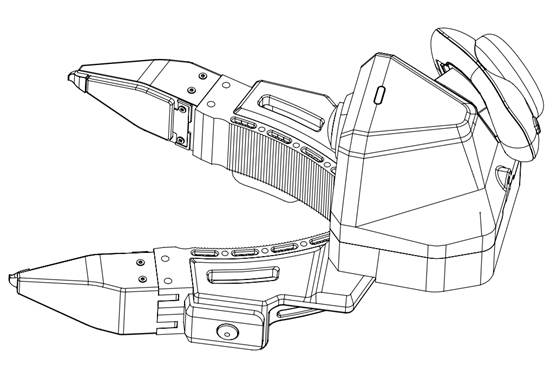{ width="360" }

=== "右主夹爪"

    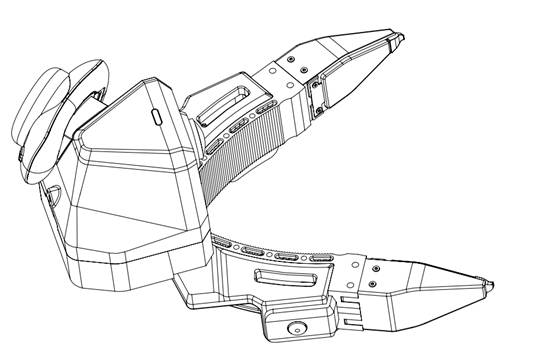{ width="360" }

=== "相机一侧"

    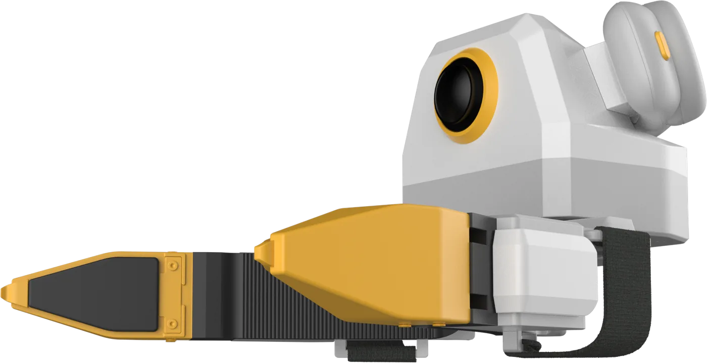{ width="560" }

=== "接口一侧"

    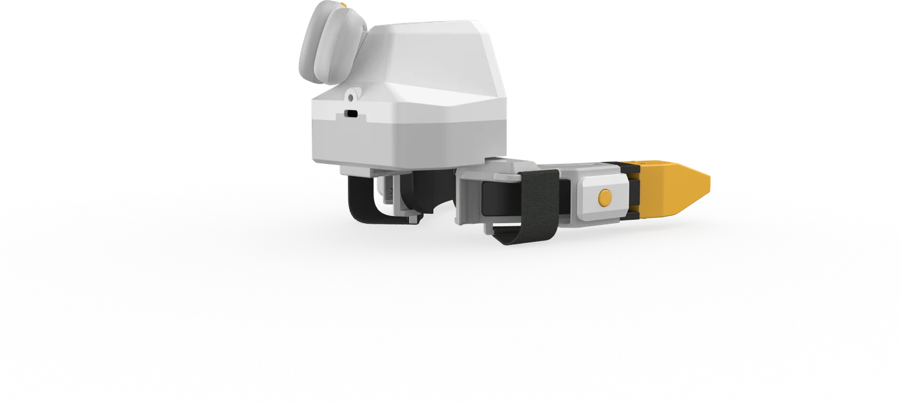{ width="560" }

=== "背面"

    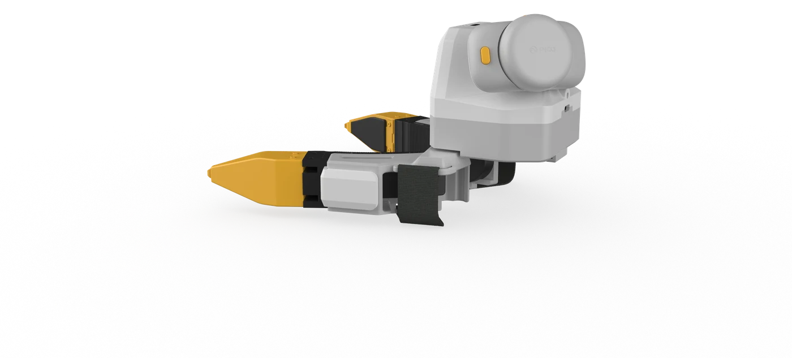{ width="560" }

### 左右识别 {#sn}

左右由序列号流水号末位的单双数区分：**单数为左，双数为右**。采集软件据此自动分侧（见 [3.3 设备发现规则](03-host-hardware.md#33)），
一般不用手动辨别；需要核对时，看 [`lsusb`](#lsusb) 输出里的序列号末位即可。

## 从夹爪

从夹爪装在机器人末端，不分左右；通信走 USB Type-C，供电用 24V 适配器。
安装步骤见下文 [从夹爪安装与连接](#follower-install)，控制与 SDK 见 [从夹爪概览](follower-overview.md)。

## Pico4 Ultra 企业版 {#pico4}

头显建立世界坐标系，运动追踪器装在主夹爪顶部，把主夹爪的 6-DoF 位姿传给数采电脑。
配置步骤见 [3.4 Pico4 Ultra 企业版配置](03-host-hardware.md#34)。

=== "头显与手柄"

    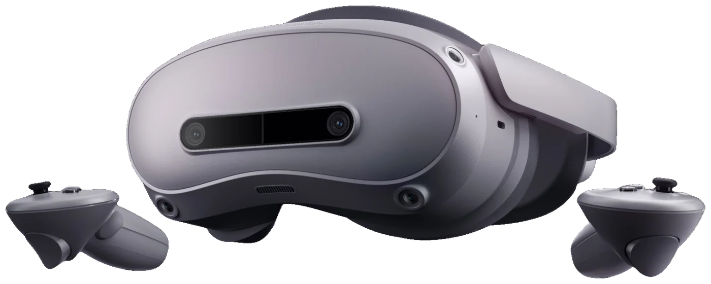{ width="560" }

=== "运动追踪器"

    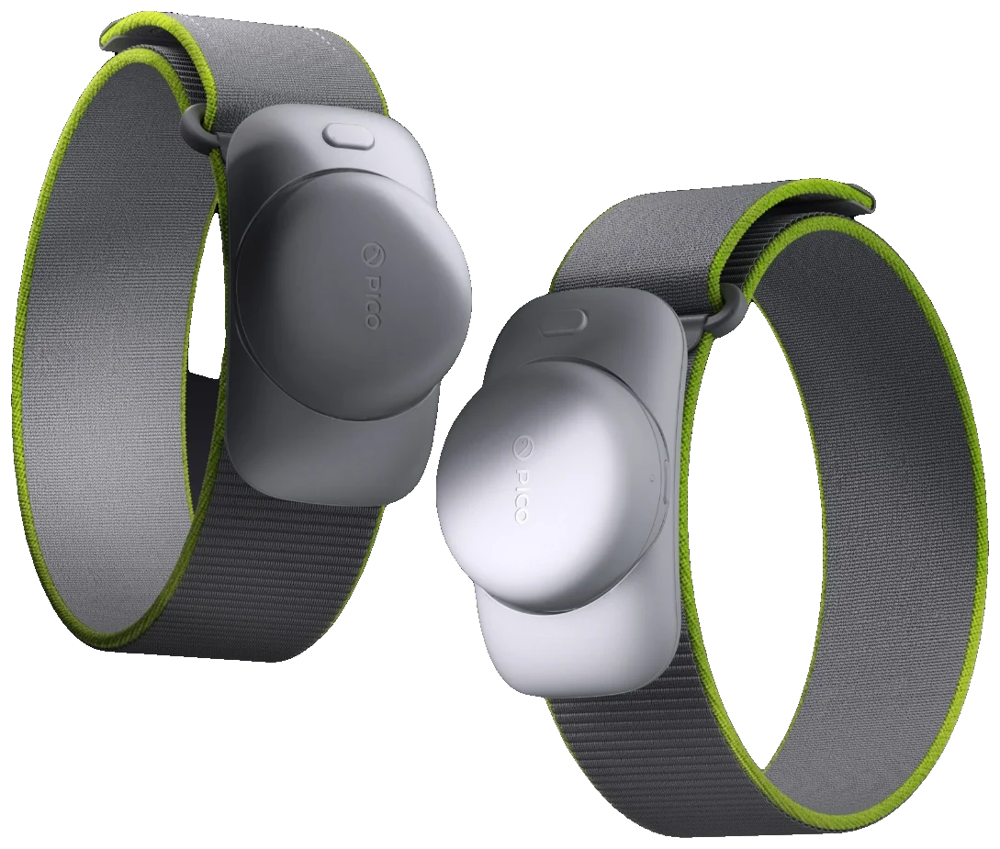{ width="420" }

    图中是出厂的腕带形态；数采时追踪器装在主夹爪顶部，不戴在手腕上。

## 主夹爪连接 {#install}

### 连接前检查

- 备齐：左右主夹爪、两根 **USB 锁紧线**、数采电脑。线缆夹爪端为 Type-C 锁紧接头，另一端按电脑接口选 Type-C 或 Type-A。
- 不要用 9V / 12V 快充适配器直连主夹爪。
- 检查 Type-C 锁紧端完好、夹爪接口内无异物，视触觉传感器表面无污渍、划伤或松动。

### 连接步骤

{ width="560" }

1. 取出 USB Type-C 锁紧线。
2. 接主夹爪的 Type-C 接口，**旋紧锁紧螺钉**。
3. 另一端接数采电脑。

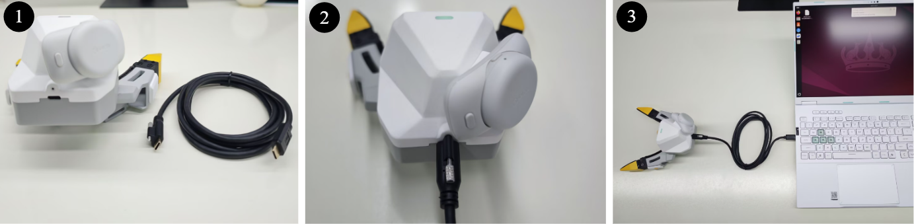{ width="480" }

### 确认识别 {#lsusb}

接好后运行 `lsusb`，确认能看到全部相机设备：**双夹爪 6 个**（每只 2 个视触觉传感器 + 1 个腕部相机），单夹爪 3 个。

```bash
lsusb
```

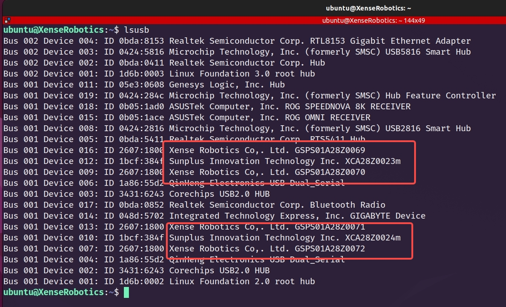{ width="720" }

图中**两个红框各对应一只主夹爪**：

| 框内字样 | 是什么 | 每只主夹爪 |
|---|---|---|
| `Xense Robotics ... GSPS01…` | 视触觉传感器 | 2 个 |
| `Sunplus ... XCA…` | 腕部鱼眼相机 | 1 个 |

序列号末位单数为左、双数为右：图中 `…0069` / `…0071` 是左，`…0070` / `…0072` 是右。
数量不对时，检查线缆是否锁紧、USB 口是否接触良好，见 [异常排查](#troubleshoot)。

!!! warning "主夹爪要先标定才能采集"
    开合度在数据里记为归一化的 `gripper.pos`（闭合 0、张开 1），两个端点存在夹爪里，**每台标一次**，断电不丢。
    没标定的主夹爪会被采集程序拒绝连接，见 [4.1 夹爪标定](04-calibration.md#41)。
    标定要求夹爪固件支持 [命令集 V2.1](versions.md#v21)。

## 从夹爪安装与连接 {#follower-install}

### 安装前检查

- 机器人已停机、处于安全姿态。
- 末端法兰尺寸、螺钉规格、安装方向与末端负载满足项目要求。
- 24V 适配器、Type-C 通信线与锁紧结构完好。
- 规划好线缆走线，避免与关节、夹爪运动区或障碍物干涉。

### 法兰安装

从夹爪通过法兰装到机器人末端，尺寸与孔位见下图。

=== "法兰安装"

    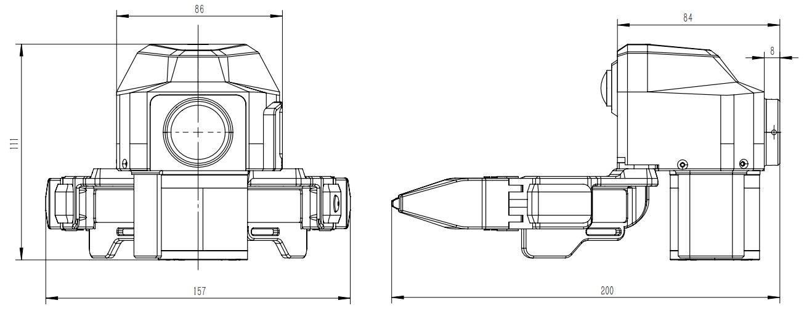{ width="420" }

=== "法兰尺寸"

    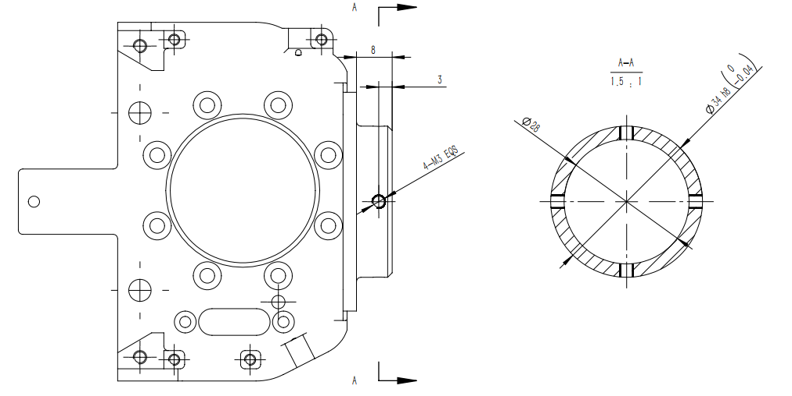{ width="420" }

### 电源与通信连接

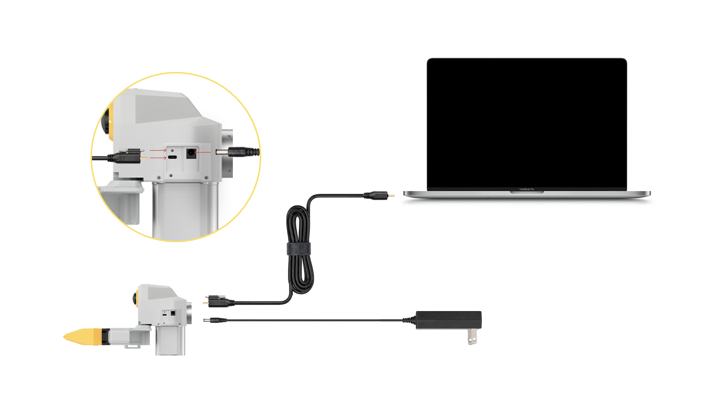{ width="560" }

1. 取出 USB Type-C 锁紧线和 24V 电源适配器。
2. 接从夹爪的 **24V 电源**。
3. 将 Type-C 锁紧线带螺钉的一端接从夹爪，**旋紧锁紧螺钉**。
4. 另一端接数采电脑。

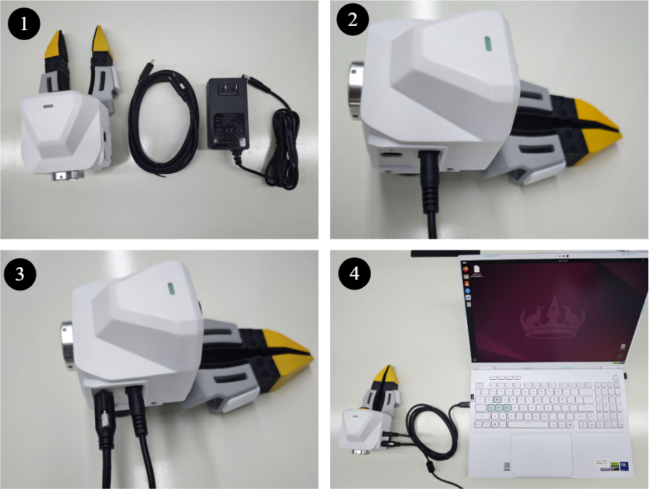{ width="480" }

!!! warning "线缆与安装检查"
    确认从夹爪固定牢靠、24V 连接可靠、Type-C 已锁紧并留足余量，线缆不会在机器人运动中被拉扯、弯折或缠绕。
    **首次运行前建议低速测试**，确认无干涉。

接好后先自检并写入运动安全包络，再让从夹爪运动，见 [从夹爪 → 准备与自检](follower-setup.md)。

## 上电与下电顺序

| 设备 | 上电 | 下电 |
|---|---|---|
| 主夹爪 | 先接夹爪端并锁紧，再接电脑 | 先拔电脑端，再松螺钉拔夹爪端 |
| 从夹爪 | 先接 24V，再接 Type-C 并锁紧 | 先拔电脑端，再断 24V，最后拔夹爪端 Type-C |

下电前先停止当前的采集、录制或机器人运动。上下电注意防静电。

## 技术参数 {#specs}

### 主夹爪规格

下表是传感器与整机规格。采集时的实际帧率可以按需配置（如触觉以 30 fps 录制），不改变传感器本身的规格。

| 参数项 | 规格 |
|---|---|
| 夹爪类型 / 外形 | 二指结构；145 × 186 × 170 mm |
| 重量 / 负载 | 约 370 g；最大 2.5 kg |
| 开合行程 | 0–150 mm；角度行程每台各异，以 [标定](04-calibration.md#41) 结果为准 |
| 供电 | USB Type-C，DC 5V / 500mA；无内置电池 |
| 多设备时间同步 / 定位 | 5 ms；< 3 mm |
| 视触觉 | 2 × 三色光，量程 0–25 N，120 FPS（640 × 480 MJPG） |
| 腕部鱼眼相机 | FOV 190°；640 × 480 @ 30 FPS MJPG |
| IMU | 9 轴，100 Hz |

从夹爪的电机与规格见 [从夹爪概览](follower-overview.md#motor-model)。

### 电气与接口

| 项目 | 主夹爪 | 从夹爪 |
|---|---|---|
| 供电 | USB Type-C，DC 5V / 500mA | 24V 电源适配器 |
| 通信 | USB Type-C | USB Type-C |
| 线缆 | 配套锁紧线，夹爪端 Type-C；另一端 Type-C 或 Type-A | Type-C 通信线 + 24V 电源线 |
| 禁止事项 | 禁止 9V / 12V 快充直连 | 禁止使用规格不符或有故障的电源 |

## 视触觉传感器维护

视触觉传感器的清洁、存放与拆装见 [维护保养](maintenance.md)。

## 异常排查 {#troubleshoot}

先记下设备序列号、连接方式、软件报错和现场照片，再按下表排查；软件类问题见 [故障排查](troubleshooting.md)。

| 现象 | 可能原因 | 处理 |
|---|---|---|
| 软件识别不到主夹爪 | 线缆未锁紧、USB 口接触不良、线缆故障 | 重新插紧锁紧线，换 USB 口或线缆，重开采集软件 |
| `lsusb` 里相机数量不对 | 线缆松动、USB 带宽不够 | 检查锁紧螺钉；双夹爪分接两条 USB 总线，见 [USB 带宽预算](03-host-hardware.md#usb-budget) |
| 图像黑屏 / 无图像 | 相机未识别、传感器连接异常 | 确认 `lsusb` 能看到该相机，重新上电后重开采集软件 |
| 图像有污点 / 模糊 | 传感器表面有污渍、异物或损伤 | 用无尘布清洁；有划伤或凹陷需更换，见 [维护保养](maintenance.md) |
| 录制过程中断 | 线缆松动、接触不良 | 检查锁紧螺钉，避免线缆受力，重录当前这一集 |
| 从夹爪不上电 | 24V 未接好、适配器异常 | 检查 24V 适配器、插座与电源接口 |
| 从夹爪通信异常 | Type-C 未接好、被机器人运动拉扯 | 重新接好 Type-C，检查走线；更多见 [从夹爪故障排查](follower-troubleshooting.md) |

!!! danger "严重异常"
    出现异味、冒烟、明显发热、结构破损或线缆破皮时，**立即断电并停止使用**。

## 安全须知 {#safety}

!!! danger "连接 / 上电 / 拆装前必读"
    | 风险项 | 要求 | 后果 |
    |---|---|---|
    | 主夹爪供电 | 仅用配套 USB Type-C 线接数采电脑，**DC 5V / 500mA** | 规格不符可能损坏设备 |
    | 禁止快充直连 | **禁止 9V / 12V 快充适配器直连主夹爪** | 可能烧毁控制板 |
    | 从夹爪供电 | 供电与通信分开，供电用 **24V 适配器** | 电源接错可能损坏硬件 |
    | 线缆插拔 | 插拔带锁紧螺钉的 Type-C 前先停止采集；拔出前先松螺钉 | 避免接口受力、数据中断 |
    | 静电防护 | 上下电、拆装传感器时注意防静电 | 静电影响传感器与通信 |
    | 传感器表面 | 避免尖锐物触碰、划伤、挤压视触觉表面 | 弹性体与光学损伤影响数据 |
