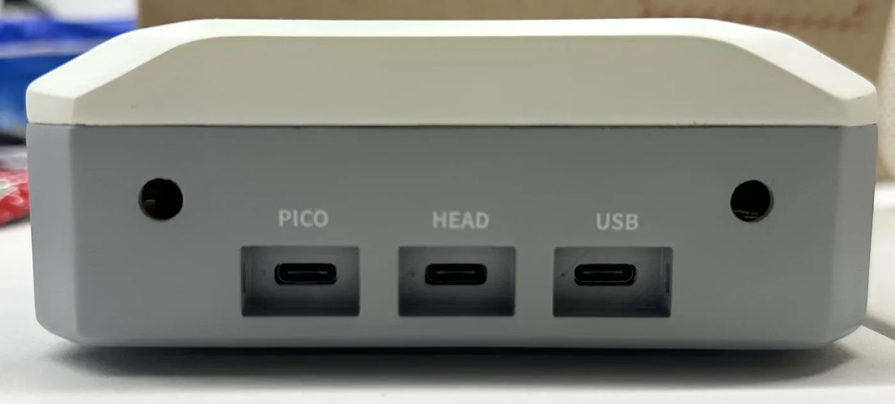
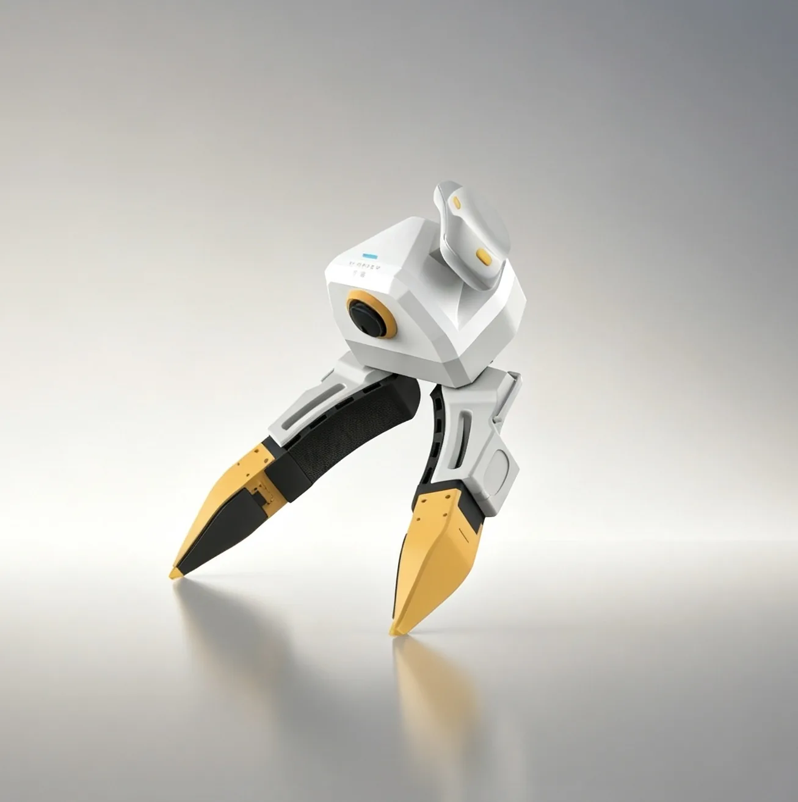
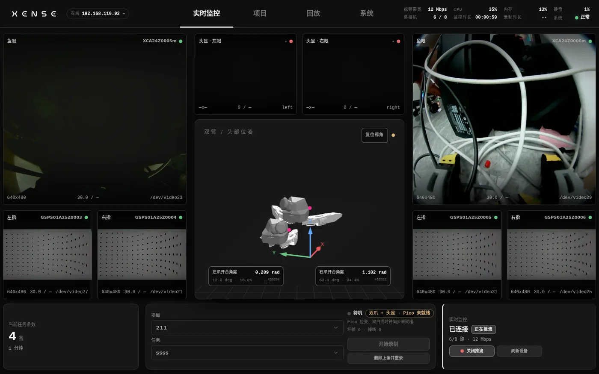

**3 streams / gripper** 1 fisheye + 2 visuotactile

**6DoF** headset and dual-tracker pose

**30 Hz** synchronized multi-source recording

**MCAP · LeRobot v3** raw and training formats

## Two kits, one gripper

Pick one to start. Hardware, calibration and data definitions are the same on both sides; the only differences are where the compute lives and what you operate it with.

-   { .xu-card__img }

    Backpack Kit

    **XTac-UMI Data Collection Backpack**{ .xu-card__title }

    ---

    - The backpack is the host and a tablet is the console; no PC needed
    - Start recording from the gripper button with LED feedback; one person can run it
    - Raw MCAP recording, one-click LeRobot publishing to ModelScope

    For: collection teams, field work, collection at scale
    { .xu-card__fit }

    [Quick start](backpack/index.md){ .md-button .md-button--primary }
    [About the backpack](product/backpack.md){ .md-button }
    { .xu-card__actions }

-   { .xu-card__img }

    Developer Kit

    **XTac-UMI G1 Developer Kit**{ .xu-card__title }

    ---

    - Plugs into your own x86 workstation and runs entirely on the LeRobot framework
    - `lerobot-record` writes a LeRobotDataset directly
    - Easy to modify the code or attach a custom robot

    For: research and algorithm teams, self-hosted training pipelines
    { .xu-card__fit }

    [Quick start](pc/index.md){ .md-button .md-button--primary }
    [Compare the two kits](product/editions.md){ .md-button }
    { .xu-card__actions }

## See it before you record

The console shows all six cameras, both visuotactile sensors and the headset pose at once, with gripper opening normalized in real time. Recording state, free disk space and tracker loss are on the same screen, viewable from a tablet or a phone.

## Related repositories

| Repo / package | Role |
|---|---|
| [`xense-taccap-lerobot`](https://github.com/XenseRobotics-AI/xense-taccap-lerobot) | Data-collection repo (lerobot 0.5.1 customized branch, providing the `taccap_gripper` robot type) |
| [`xense.taccap`](https://github.com/XenseRobotics-AI/TacCap-Gripper) | Gripper SDK (repo `TacCap-Gripper`, submodule `third_party/taccap-gripper`): IMU, encoder, buttons, protocol, and the motor control that only the follower gripper has |
| [`xensevr_pc_service_sdk`](https://github.com/XenseRobotics-AI/XenseVR-PC-Service) | Pico4 Ultra tracker PC service (installed as a `.deb`, **not a submodule**); from v0.2.0 it also carries the [head camera](pc/recording.md#56) frames |
| [`xensesdk`](https://github.com/XenseRobotics/xensesdk) | Visuotactile sensor SDK, provided by the install script ([docs site](https://xensedoc.readthedocs.io/en/latest/)) |

The Developer Kit pages match `xense.taccap 0.1.9` and `xense-taccap-lerobot`, customized from lerobot 0.5.1. For commands and field names, go by the device notes shipped with your local checkout of the main repo; for upgrades see [Versions and upgrades](pc/versions.md#required).
