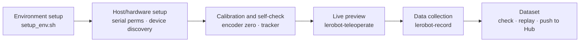

---
hide:
  - navigation
  - toc
---

XenseRobotics · XTac-UMI G1

# Handheld tactile data collection, from unboxing to a dataset

XTac-UMI G1 handheld tactile gripper × Pico4 Ultra Enterprise headset and tracker capture synchronized vision · tactile · first-person stereo · hand and head pose with lerobot, straight to a training-ready <code>LeRobotDataset</code>

[Quickstart :material-arrow-right-bold:](quickstart.md){ .md-button .md-button--primary }
[Installation](install.md){ .md-button }
[About the device](device.md){ .md-button }

{ .tc-hero-img }

## The whole flow in 5 minutes

## Three steps

This is the **xense-taccap-lerobot data-collection quickstart**. Three parts: **get ready → record → understand the data**.

-   :material-check-decagram-outline: __① Getting ready (prerequisites)__

    ---

    Know your hardware → connect and power it on → install the environment and set up the host and devices. These three are the prerequisites for collection.

    [:octicons-arrow-right-24: About the device](device.md) · [Installation](install.md) · [Host and Pico4 setup](host-setup.md)

-   :material-record-circle-outline: __② Software usage__

    ---

    Calibration and self-check → preview the streams with `lerobot-teleoperate` → record with `lerobot-record`. The core data-collection workflow.

    [:octicons-arrow-right-24: Calibration and self-check](calibration.md) · [Data collection](recording.md)

-   :material-database-outline: __③ Data__

    ---

    What a `LeRobotDataset` looks like, what is recorded per frame, how to check and upload it.

    [:octicons-arrow-right-24: Dataset](dataset.md)

If you build on the `xense.taccap` SDK directly, see [Reference](reference.md).

## Related repositories

| Repo / package | Role |
|---|---|
| [`xense-taccap-lerobot`](https://github.com/XenseRobotics-AI/xense-taccap-lerobot) | Data-collection repo (lerobot 0.5.1 customized branch, providing the `taccap_gripper` robot type) |
| [`xense.taccap`](https://github.com/XenseRobotics-AI/TacCap-Gripper) | Gripper SDK (repo `TacCap-Gripper`, submodule `third_party/taccap-gripper`): IMU, encoder, buttons, protocol, and the motor control that only the follower gripper has |
| [`xensevr_pc_service_sdk`](https://github.com/XenseRobotics-AI/XenseVR-PC-Service) | Pico4 Ultra tracker PC service (installed as a `.deb`, **not a submodule**); from v0.2.0 it also carries the [head camera](recording.md#56) frames |
| [`xensesdk`](https://github.com/XenseRobotics/xensesdk) | Visuotactile sensor SDK, provided by the install script ([docs site](https://xensedoc.readthedocs.io/en/latest/)) |

This manual matches `xense.taccap 0.1.9` and `xense-taccap-lerobot`, customized from lerobot 0.5.1. For commands and field names, go by the device notes shipped with your local checkout of the main repo; for upgrades see [Versions and upgrades](versions.md#required).
