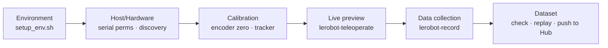

---
hide:
  - navigation
  - toc
---

# Handheld tactile data collection, from unboxing to a dataset

XTac-UMI G1 works with the Pico4 Ultra Enterprise headset to record vision, touch and hand and head pose in sync with lerobot, giving you a training-ready <code>LeRobotDataset</code>.

[Quickstart](quickstart.md){ .md-button .md-button--primary }
[About the device](01-overview.md){ .md-button }

<figure class="tc-tile tc-tile--leader" markdown>

<figcaption markdown>[Leader: hand-held capture](hardware.md)</figcaption>
</figure>

<figure class="tc-tile tc-tile--follower" markdown>

<figcaption markdown>[Follower: on the robot](follower-overview.md)</figcaption>
</figure>

!!! info "English coverage"
    The Home and Overview pages are available in English. Other navigation entries currently fall back to the Chinese source pages; command examples remain directly usable.

## The whole flow in 5 minutes

```mermaid
flowchart LR
    A[Environment<br/>setup_env.sh] --> B[Host/Hardware<br/>serial perms · discovery]
    B --> C[Calibration<br/>encoder zero · tracker]
    C --> P[Live preview<br/>lerobot-teleoperate]
    P --> D[Data collection<br/>lerobot-record]
    D --> E[Dataset<br/>check · replay · push to Hub]
```

## Three steps

This is the **xense-taccap-lerobot data-collection quickstart**. Three parts: **get ready → record → understand the data**.

-   :material-check-decagram-outline: __① Getting Ready (prerequisites)__

    ---

    Know your hardware → connect & power it on → set up the software environment and host/device config.

    [Hardware](hardware.md), [Environment Setup](02-environment.md)

-   :material-record-circle-outline: __② Software Usage__

    ---

    Calibration → preview the streams with `lerobot-teleoperate` → record with `lerobot-record`. The core data-collection workflow.

    [Calibration](04-calibration.md), [Data Collection](05-data-collection.md)

-   :material-database-outline: __③ Data__

    ---

    What a `LeRobotDataset` looks like, what's recorded per frame, checking & upload.

    [Dataset & Examples](06-dataset.md)

## Related repositories

| Repo / package | Role |
|---|---|
| [`xense-taccap-lerobot`](https://github.com/XenseRobotics-AI/xense-taccap-lerobot) | Data-collection repo (lerobot 0.5.1 customized branch, providing the `taccap_gripper` robot type) |
| [`xense.taccap`](https://github.com/XenseRobotics-AI/TacCap-Gripper) | Gripper SDK (repo `TacCap-Gripper`, submodule `third_party/taccap-gripper`): IMU, encoder, keys, protocol, and follower-only motor control |
| [`xensevr_pc_service_sdk`](https://github.com/XenseRobotics-AI/XenseVR-PC-Service) | Pico4 Ultra tracker PC service (installed as a `.deb`, **not a submodule**); from v0.2.0 it also carries the [headset camera](05-data-collection.md#56) frames |
| [`xensesdk`](https://github.com/XenseRobotics/xensesdk) | Visuotactile sensor SDK, provided by the install script ([docs](https://xensedoc.readthedocs.io/en/latest/)) |

!!! note "Versions this manual is written against"
    `xense.taccap 0.1.9`, and `xense-taccap-lerobot` customized from **lerobot 0.5.1**.
    Go by the device notes shipped with your own checkout of the main repo for commands and
    field names.
