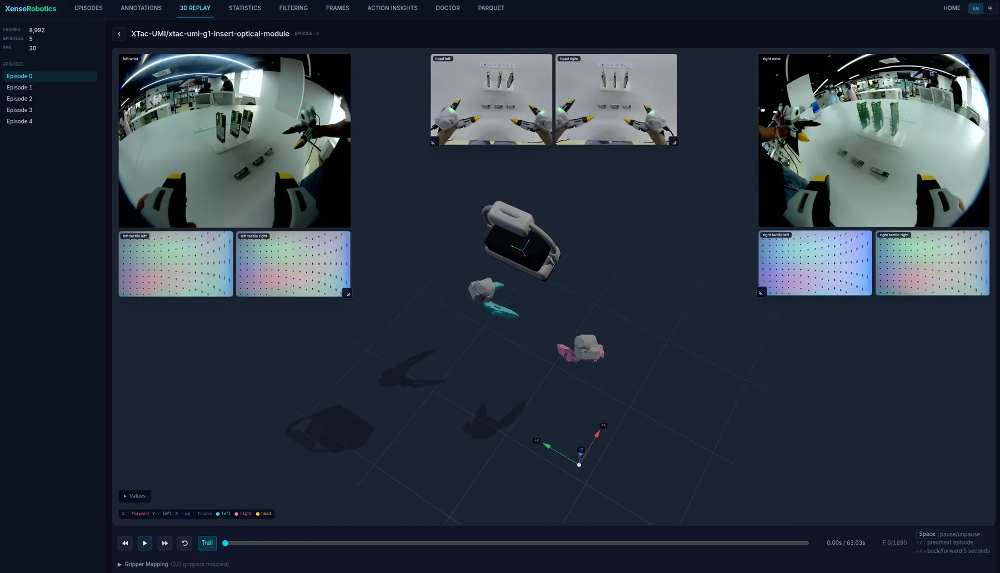
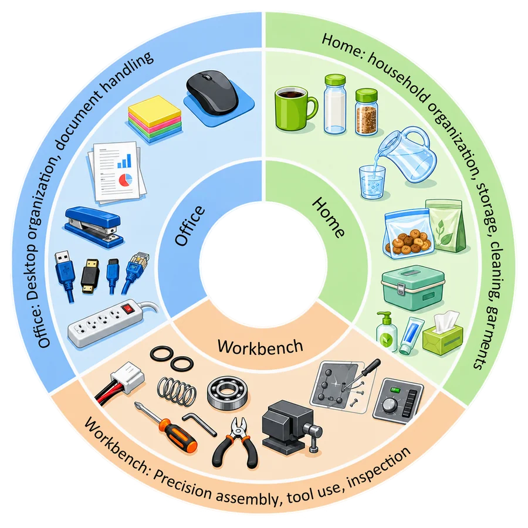

---
hide:
  - navigation
  - toc
---

XTac-UMI · Handheld multimodal data collection

# Give robot datasets a sense of touch

Two-handed touch, vision and pose in sync One demonstration, a training-ready dataset

XTac-UMI&nbsp;G1 grippers with the Pico4&nbsp;Ultra&nbsp;Enterprise headset in a Backpack Kit or a Developer Kit

[About XTac-UMI G1](product/g1.md){ .md-button .md-button--primary }
[Choose a kit](product/editions.md){ .md-button }

<figure class="tc-tile tc-tile--leader" markdown>

<figcaption markdown>[Leader: hand-held capture](common/gripper.md)</figcaption>
</figure>

<figure class="tc-tile tc-tile--follower" markdown>

<figcaption markdown>[Follower: isomorphic end effector](follower/index.md)</figcaption>
</figure>

**8 image streams** 4 tactile + 2 wrist + 2 headset

**3 × 6DoF poses** both grippers + head

**5 ms sync** positioning < 3 mm

**MCAP · LeRobot v3** raw and training formats

## Highlights {#highlights}

<figure class="tc-video">
<video controls preload="none" playsinline poster="../assets/highlights/video-poster.webp">
<source src="../assets/video/xtac-umi-g1-market.mp4" type="video/mp4">
</video>
</figure>

- **Visuotactile fusion**: tri-colour fingertip sensors capture contact location, grasp stability and slip
- **Close to the hand**: the wearable leader handles grasping, insertion and thin-part picking
- **Precise sync**: 5 ms multi-device time sync, < 3 mm positioning
- **Open formats**: LeRobot / MCAP output, compatible with mainstream data ecosystems

[More highlights](product/highlights.md){ .md-button .md-button--primary }

## Two kits for different settings

Both kits use the same grippers and headset and produce the same data. The Backpack Kit is a turnkey unit whose collection software is not open source; the Developer Kit's collection software and gripper SDK are open source and free to customize.

-   { .xu-card__img }

    Backpack Kit

    **XTac-UMI Data Collection Backpack**{ .xu-card__title }

    ---

    - The backpack runs all collection; no computer needed
    - A tablet browser is the console; gripper buttons start and stop recording
    - One person wears it, suited to field work and long sessions
    - Upload datasets to ModelScope in one click, as MCAP or LeRobotDataset v3

    Turnkey, closed-source collection software; for large-scale collection teams and data factories
    { .xu-card__fit }

    [Quick start](backpack/quickstart.md){ .md-button .md-button--primary }
    [About the backpack](product/backpack.md){ .md-button }
    { .xu-card__actions }

-   { .xu-card__img }

    Developer Kit

    **XTac-UMI G1 Developer Kit (open source)**{ .xu-card__title }

    ---

    - Grippers and headset connect straight to your workstation
    - Built on open-source LeRobot; recording produces a LeRobotDataset
    - Open-source collection software and gripper SDK, free to customize
    - Supports the follower gripper for executing and replaying motions on a robot

    For research and algorithm teams with their own training pipelines
    { .xu-card__fit }

    [Quick start](pc/quickstart.md){ .md-button .md-button--primary }
    [Compare the two kits](product/editions.md){ .md-button }
    { .xu-card__actions }

## The data you get

<figure class="tc-shot" markdown>

<figcaption>Sensor positions and dataset keys</figcaption>
</figure>

<figure class="tc-shot" markdown>

<figcaption>Live Rerun preview while recording (Developer Kit)</figcaption>
</figure>

<figure class="tc-shot" markdown>

<figcaption>3D replay in xense-lerobot-viewer</figcaption>
</figure>

## Open dataset: TacVerse {#tacverse}

Visuotactile manipulation data collected with XTac-UMI G1 grippers, released as LeRobotDataset v3 under CC BY-SA 4.0 and ready to download and train on.

- **122 tasks** across office, home and workbench scenes
- **17,690 demonstrations**: 370 hours, about 40 million frames
- **Two-handed touch**: four tactile streams, two wrist views and gripper poses per frame

[Hugging Face](https://huggingface.co/TacVerse){ .md-button .md-button--primary }
[ModelScope](https://modelscope.cn/datasets/XenseRobotics/TacVerse-Opendata){ .md-button }

## Developer Kit open-source repositories

The Developer Kit's collection repo, gripper SDK, tracker service and viewer are open source under Apache-2.0, see [the list](pc/index.md#repos); the Backpack Kit's software is closed.
