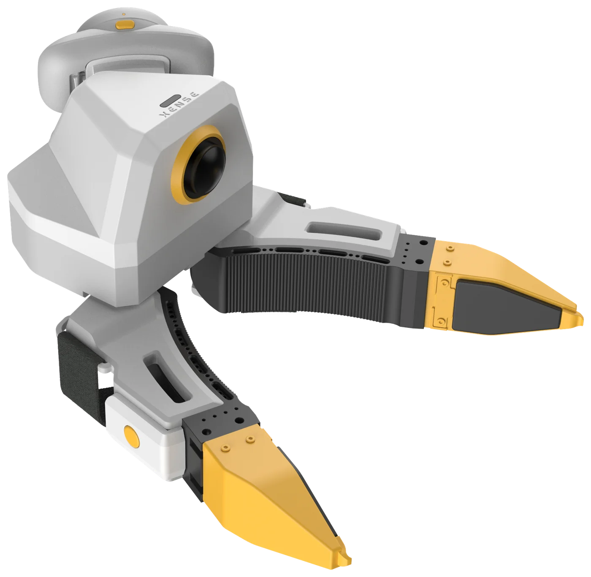
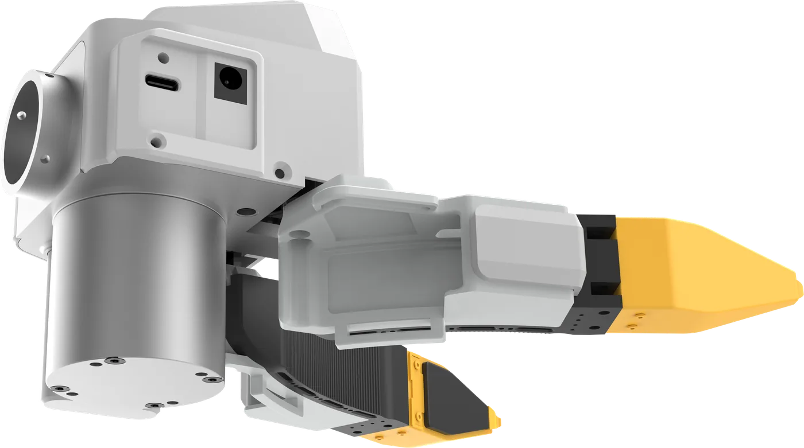
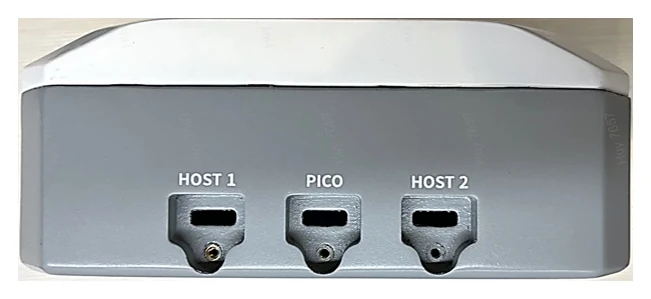
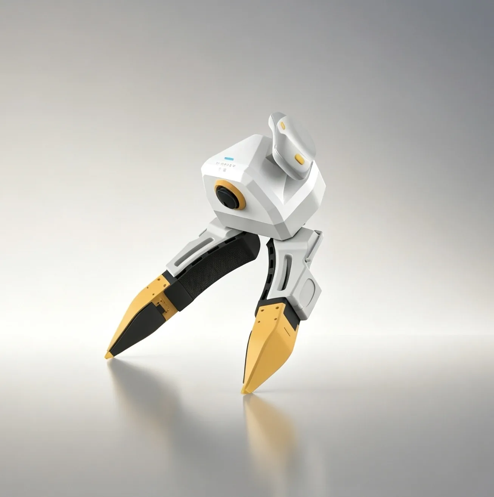
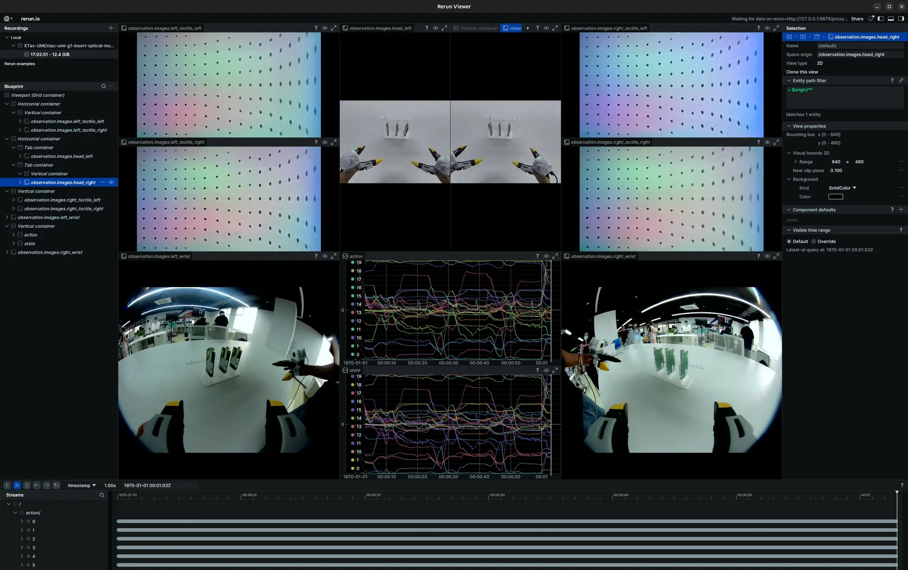

---
hide:
  - navigation
  - toc
---

XTac-UMI · Handheld multimodal data collection

# Give robot datasets a sense of touch

Two-handed touch, vision and pose in sync One demonstration, a training-ready dataset

XTac-UMI&nbsp;G1 grippers with the Pico4&nbsp;Ultra&nbsp;Enterprise headset in a Backpack Kit or a Developer Kit

[Choose a kit](product/editions.md){ .md-button .md-button--primary }
[Watch the video](#highlights){ .md-button }

<figure class="tc-tile tc-tile--leader" markdown>

<figcaption markdown>[Leader: hand-held capture](common/gripper.md)</figcaption>
</figure>

<figure class="tc-tile tc-tile--follower" markdown>

<figcaption markdown>[Follower: isomorphic end effector](follower/index.md)</figcaption>
</figure>

**8 image streams** 4 tactile + 2 wrist + 2 headset

**3 × 6DoF poses** both grippers + head

**5 ms sync** positioning < 3 mm

**MCAP · LeRobot v3** raw and training formats

## Highlights {#highlights}

<figure class="tc-video">
<video controls preload="none" playsinline poster="../assets/highlights/video-poster.webp">
<source src="../assets/video/xtac-umi-g1-market.mp4" type="video/mp4">
</video>
</figure>

- **Visuotactile fusion**: tri-colour fingertip sensors capture contact location, grasp stability and slip
- **Close to the hand**: the wearable leader handles grasping, insertion and thin-part picking
- **Precise sync**: 5 ms multi-device time sync, < 3 mm positioning
- **Ready to train**: native LeRobot and MCAP output

[More highlights](product/highlights.md){ .md-button .md-button--primary }

## Two kits for different settings

Both kits use the same grippers and headset and produce the same data. The Backpack Kit is a turnkey unit whose collection software is not open source; the Developer Kit's collection software and gripper SDK are open source and free to customize.

-   { .xu-card__img }

    Backpack Kit

    **XTac-UMI Data Collection Backpack**{ .xu-card__title }

    ---

    - The backpack runs all collection; no computer needed
    - A tablet browser is the console; gripper buttons start and stop recording
    - One person wears it, suited to field work and long sessions
    - Publish datasets to ModelScope in one click, as MCAP or LeRobotDataset v3

    Turnkey, closed-source collection software; for large-scale collection teams and data factories
    { .xu-card__fit }

    [Quick start](backpack/index.md){ .md-button .md-button--primary }
    [About the backpack](product/backpack.md){ .md-button }
    { .xu-card__actions }

-   { .xu-card__img }

    Developer Kit

    **XTac-UMI G1 Developer Kit (open source)**{ .xu-card__title }

    ---

    - Grippers and headset connect straight to your workstation
    - Built on open-source LeRobot; recording produces a LeRobotDataset
    - Open-source collection software and gripper SDK, free to customize
    - Supports the follower gripper for executing and replaying motions on a robot

    For research and algorithm teams with their own training pipelines
    { .xu-card__fit }

    [Quick start](pc/quickstart.md){ .md-button .md-button--primary }
    [Compare the two kits](product/editions.md){ .md-button }
    { .xu-card__actions }

## The data you get

<figure class="tc-shot" markdown>

<figcaption>Headset connected</figcaption>
</figure>

<figure class="tc-shot" markdown>

<figcaption>Eight streams in sync</figcaption>
</figure>

<figure class="tc-shot" markdown>

<figcaption>Live preview in Rerun</figcaption>
</figure>

## See it before you record

The console's live monitor is a Backpack Kit capability; the main text is in the [Backpack Kit entry point](backpack/index.md#overview).

## Developer Kit open-source repositories

The Developer Kit is fully open source: the data-collection repo, gripper SDK, tracker service and viewer are all public on GitHub; see [Developer Kit open-source repositories](pc/index.md#repos). The Backpack Kit's collection software is not open source and comes preinstalled on the backpack, so none of these repositories need installing.
