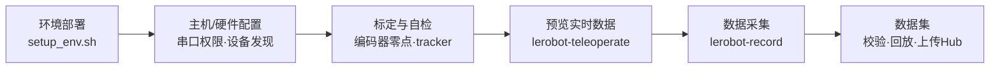

---
hide:
  - navigation
  - toc
---

XenseRobotics · XTac-UMI G1

# 手持触觉数采,从开箱到数据集

XTac-UMI G1 手持触觉数采夹爪 × Pico4 Ultra 企业版头显与追踪器 基于 lerobot 同步采集视觉 · 触觉 · 第一视角双目 · 手部与头部位姿,直出可训练的标准 <code>LeRobotDataset</code>

[一页速通 :material-arrow-right-bold:](quickstart.md){ .md-button .md-button--primary }
[环境安装](02-environment.md){ .md-button }
[了解设备](01-overview.md){ .md-button }

{ .tc-hero-img }

## 5 分钟看懂全流程

## 三步走

本手册是 **xense-taccap-lerobot 数采快速使用文档**,主线三块:**准备就绪 → 采集数据 → 认识数据**。

-   :material-check-decagram-outline: __① 准备工作(前提)__

    ---

    认识拿到的硬件 → 连接硬件、上电 → 装好软件环境与主机/设备配置。这三件是采集前的前提。

    [:octicons-arrow-right-24: 硬件介绍](hardware.md) · [环境安装](02-environment.md)

-   :material-record-circle-outline: __② 软件使用__

    ---

    标定自检 → `lerobot-teleoperate` 预览确认数据流 → `lerobot-record` 录制。数采的核心操作。

    [:octicons-arrow-right-24: 标定与自检](04-calibration.md) · [数据采集](05-data-collection.md)

-   :material-database-outline: __③ 数据介绍__

    ---

    `LeRobotDataset` 长什么样、每帧记录了什么、如何校验与上传。

    [:octicons-arrow-right-24: 数据集与示例](06-dataset.md)

!!! note "二次开发?"
    需要直接调 `xense.taccap` SDK 的,见 [参考 → 附录:SDK 与二次开发](sdk-overview.md)。

## 相关仓库

| 仓库 / 包 | 作用 |
|---|---|
| [`xense-taccap-lerobot`](https://github.com/Vertax42/xense-taccap-lerobot) | 数采主仓库(lerobot 0.5.1 定制分支,提供 `taccap_gripper` 设备类型) |
| [`xense.taccap`](https://github.com/Vertax42/TacCap-Gripper) | 夹爪 SDK(仓库 `TacCap-Gripper`,子模块 `third_party/taccap-gripper`):IMU、编码器、按键、协议及仅从夹爪具备的电机控制 |
| [`xensevr_pc_service_sdk`](https://github.com/Vertax42/XenseVR-PC-Service) | Pico4 Ultra 追踪器 PC 服务(以 `.deb` 安装,**不是子模块**);v0.2.0 起也承载[头显相机](05-data-collection.md#56)画面 |
| [`xensesdk`](https://github.com/XenseRobotics/xensesdk) | 视触觉传感器 SDK,由安装脚本提供([文档站](https://xensedoc.readthedocs.io/en/latest/)) |

!!! note "适用版本"
    本手册对应 `xense.taccap 0.1.9`、`xense-taccap-lerobot` 基于 **lerobot 0.5.1** 定制。
    命令与字段以你本地这一版主仓库附带的设备说明为准。
