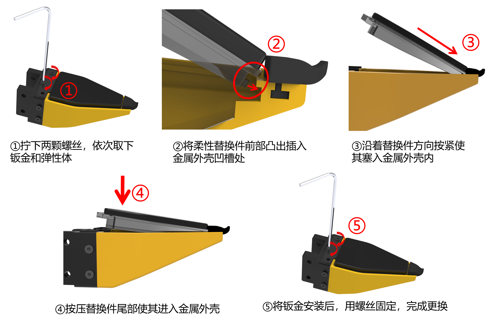

# 维护保养

保持设备状态良好,数据才稳。重点是**娇贵的视触觉传感器表面**与**标定有效性**。

!!! warning "具体材料以随货说明为准"
    不同硬件批次允许使用的清洁剂、耗材与拆修方式可能不同。本页只给出不依赖材料型号的安全做法;涉及液体清洁、更换或返修时请联系交付 / 售后人员确认。

## 视触觉传感器(最需要小心)

视触觉传感器的成像面是**弹性体/凝胶类材料,较娇贵**,直接决定触觉数据质量。

- **避免**:尖锐物刮擦、指甲抠压、硬物撞击、长时间重压变形、油污与溶剂。
- **清洁**:先用气吹移除浮尘,必要时再用干净的无绒软布轻拭。未获得对应硬件批次的官方说明前,不要自行使用酒精、溶剂或其它液体清洁剂。
- **存放**:避光、常温、避免长期受压导致表面变形;不用时让触觉表面悬空或使用随货保护件,不要让硬物直接压住表面。
- **接触**:采集时正常接触物体即可,避免异常大力挤压。

!!! danger "不要做"
    不要用尖锐物清理表面、不要撕扯贴合面、不要在未确认的情况下用溶剂擦拭。

## 传感器拆装

{ width="480" }

- 拆装后若图像质量明显下降,检查传感器是否压紧、有无污渍或装反,并重新运行触觉与相机预览自检。编码器零点标定不能修复图像问题。

## 相机镜头

- 腕相机与触觉光学面用**气吹 + 无绒布**清洁,避免刮花。
- 保持镜头清洁,过脏会直接降低图像质量。

## 编码器与标定

- **标定是一次性的**:零点与行程上限写在 MCU flash,断电不丢、换主机不用重标。日常只需确认
  闭合 `gripper.pos`≈0、张到底≈1.0(见 [4.1 夹爪标定](04-calibration.md#41))。
- **需要重标的情况**:跌落 / 大力冲击后机械松动、拆装过编码器或机械限位、固件擦除。
  这几种情况下**零点和行程要一起重标**——限位变了,行程上限也就变了。
- 建议在每个采集批次前做一次快速自检([一页速通 §2](quickstart.md))。

## 线缆与接口

- USB / 串口线**避免反复弯折**、避免拉扯根部;插拔轻柔。
- 固定走线,减少采集中被牵扯导致的接触不良/掉线。

## 通用

- 避免跌落、进液、极端温湿度。
- 长期不用**断电存放**,置于干燥避光处。

## 保养周期建议

| 项目 | 建议周期 | 处理原则 |
|---|---|---|
| 传感器表面检查 | 每个采集批次前;接触尖锐物或发生碰撞后立即检查 | 观察划痕、污渍、永久压痕与图像异常 |
| 传感器表面清洁 | 发现灰尘或污渍时按需处理 | 先气吹,再用干净无绒软布轻拭;不使用未经确认的液体 |
| 编码器零点检查 / 复标 | 每批次前快速检查;确认漂移时复标 | 完全闭合读数应≈0,正常时不重复标定 |
| 腕相机镜头检查 | 每批次前;画面模糊或有污点时清洁 | 先气吹,必要时用镜头布轻拭 |
| 线缆与锁紧件检查 | 每批次前;机器人运动或运输后重点检查 | 确认无破损、松动、过度弯折和运动干涉 |

## 官方信息与售后

清洁剂型号、传感器耗材寿命以及返修 / 送检方式可能随硬件批次变化,不在现场自行推断。需要使用清洁剂、更换触觉表面或拆修内部结构时,请根据设备随货资料联系交付或售后人员,并提供设备 SN 与现场照片。
