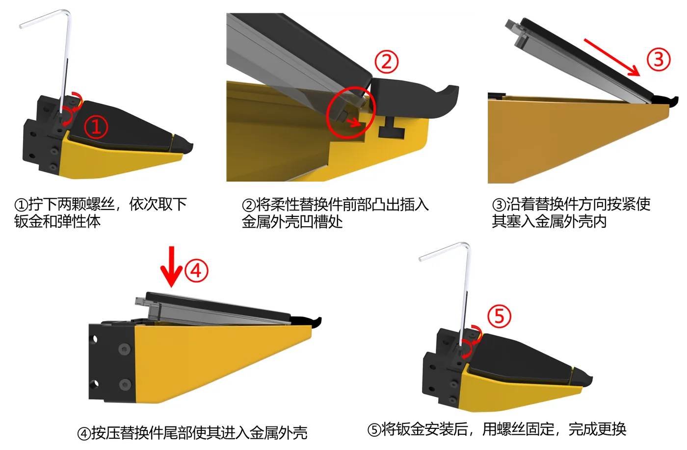

# 维护保养

本页讲视触觉传感器、镜头、编码器与线缆的保养和传感器拆装后的检查;读完能按周期自己做检查与清洁,并知道哪些事要交给售后。

## 视触觉传感器

成像面是弹性体 / 凝胶类材料,最娇贵,直接决定触觉数据质量。

- 避免:尖锐物刮擦、指甲抠压、硬物撞击、长时间重压变形、油污与溶剂。
- 清洁:先用气吹移除浮尘,必要时再用干净的无绒软布轻拭。没有对应硬件批次的官方说明时,不要用酒精、溶剂或其它液体清洁剂。
- 存放:避光、常温;不用时让触觉表面悬空或装上随货保护件,别让硬物压住表面。
- 接触:采集时正常接触即可,避免异常大力挤压。

!!! danger "会损坏传感器表面的操作"
    不用尖锐物清理表面、不撕扯贴合面、不在未确认时用溶剂擦拭;划伤或凹陷只能更换传感器。

### 拆装步骤

全程注意防静电;断开主夹爪 Type-C 前先停止采集。

{ width="480" }

装回后重新跑触觉与相机预览自检(见[开录前预览](recording.md#preview));图像明显变差时检查传感器是否压紧、有无污渍或装反,编码器零点标定修不了图像问题。

## 相机镜头

腕相机与触觉光学面用气吹 + 无绒布清洁,避免刮花;过脏会直接降低图像质量。

## 编码器与标定

- 标定是一次性的:零点与行程上限写在 MCU flash,断电不丢、换主机不用重标。日常只需确认闭合 `gripper.pos`≈0、张到底≈1.0,见[夹爪标定](calibration.md#41)。
- 需要重标:跌落 / 大力冲击后机械松动、拆装过编码器或机械限位、固件擦除。零点和行程要一起重标,限位变了行程上限也变。
- 每个采集批次前做一次快速自检(见[快速开始的自检](quickstart.md#self-check))。

## 线缆与接口

- USB / 串口线避免反复弯折与拉扯根部;插拔轻柔,锁紧 Type-C 先松螺钉再拔。
- 固定走线,避免采集中被牵扯而接触不良 / 掉线。

## 通用

- 避免跌落、进液、极端温湿度。
- 长期不用断电存放,置于干燥避光处。

## 保养周期建议

| 项目 | 建议周期 | 处理原则 |
|---|---|---|
| 传感器表面检查 | 每批次前;接触尖锐物或碰撞后立即查 | 看划痕、污渍、永久压痕与图像异常 |
| 传感器表面清洁 | 发现灰尘或污渍时 | 先气吹,再用无绒软布轻拭;不用未经确认的液体 |
| 编码器零点检查 / 复标 | 每批次前快速检查;确认漂移时复标 | 全闭读数应≈0,正常时不重标 |
| 腕相机镜头检查 | 每批次前;画面模糊或有污点时清洁 | 先气吹,必要时用镜头布轻拭 |
| 线缆与锁紧件检查 | 每批次前;机器人运动或运输后重点查 | 无破损、松动、过度弯折和运动干涉 |

## 官方信息与售后

清洁剂型号、传感器耗材寿命、返修 / 送检方式随硬件批次不同,本页只给不依赖材料型号的做法,不在现场自行推断。需要用清洁剂、换触觉表面或拆修内部结构时,按随货资料联系交付或售后人员,附设备 SN 与现场照片;反馈渠道与要附带的信息见[支持与反馈](reference.md#support)。
