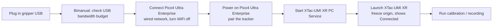

# XTac-UMI G1 Developer Kit

The Developer Kit (the PC edition) puts the compute on your own x86 workstation (NVIDIA GPU recommended; Mamba source install or the Docker image): the grippers plug straight into the host over USB, the Pico4 Ultra Enterprise headset plugs into the host over a Type-C cable as a wired shared network (wired by default; WiFi is for quick debugging only), its pose comes in through the XTac-UMI XR PC Service running on the host, and the whole chain runs on the LeRobot framework.
The hardware you need is the XTac-UMI G1 leader gripper (one or a pair), the Pico4 Ultra Enterprise with its trackers, and that workstation.
The operator's interface is the terminal plus a Rerun preview window; `lerobot-record` writes a LeRobotDataset v3 straight to disk, ready to push to the Hugging Face Hub.
Built on the open-source lerobot ecosystem, it suits research and algorithm teams with their own training pipelines; it is fully open to customization, whether that means changing the Python code or hooking up a custom robot.
If you want no PC at all, with a collection team driving it from a tablet and the gripper buttons in the field, that is the [Backpack Kit](../backpack/index.md); the two editions are compared in [Editions](../product/editions.md).

Hardware connected, environment installed, leader gripper calibrated? What follows takes you from
power-on to your first episode; copy it as-is. First time through, go through
[XTac-UMI G1](../product/g1.md) → [Installation](install.md) → [Host setup](host-setup.md) →
[Pico4 headset and trackers](../common/pico4.md) → [Calibration and self-check](calibration.md) first, then come back.

Before you start, confirm:

- The repo, submodules, SDK and gripper firmware have all been upgraded per
  [Upgrade to the latest versions](versions.md#required). On a mismatched stack, collection still
  runs to completion and writes to disk; only `gripper.pos` ends up on a scale that does not match
  anyone else's, and nothing in the data shows it afterwards. The firmware requirement is command set
  V2.1, which means leader ≥ 1.2.0 / follower ≥ 1.1.0; a higher build does not need to be flashed
  back ([the difference between the two](versions.md#v21)).
- The [serial permissions and ModemManager](host-setup.md#31) one-off host setup is done; on a
  bimanual rig, the [USB bandwidth budget](host-setup.md#usb-budget) has been checked.
- Every leader gripper has been through [gripper calibration](calibration.md#41): an uncalibrated
  leader is refused at connect. On a bimanual rig calibrate both sides; doing only one leaves left
  and right on different scales.
- You are inside the collection environment: `mamba activate xense-taccap` on the Mamba path, or
  `docker compose run --rm xense-taccap` to enter the container on the Docker path.

## Power-on and power-off sequence {#power-on}

1. Plug the XTac-UMI G1 into the host (USB).
2. Bimanual rig: check the [USB bandwidth budget](host-setup.md#usb-budget) before going any further.
3. Connect the Pico4 Ultra Enterprise's wired shared network and turn off the collection PC's WiFi.
   The wired shared network conflicts with the PC's WiFi, which makes tracking unstable or
   unreachable. The headset also supports WiFi, but the link fluctuates and pose data arrives late, so keep it for quick debugging; see
   [Network connection](../common/pico4.md#pico-network).
4. Power on the Pico4 Ultra Enterprise and short-press the tracker's power button until the blue light comes on (first use needs [binding](../common/pico4.md#pico-tracker-bind) first).
5. Start the XTac-UMI XR PC Service on the host:

    ```bash
    /opt/apps/roboticsservice/runService.sh    # before opening the app
    ```

6. Facing straight towards the robot, launch the XTac-UMI XR app (this freezes the world origin and orientation, see [frames](../common/pico4.md#pico-frame)),
   then tap "Reconnect" so the [status reads "Connected"](../common/pico4.md#pico-toolkit-ui).
7. Run the calibration / self-check / recording scripts.



!!! warning "Step 5 must come before step 6: start the service, then open the app"
    The app connects to this service. With it down, the app just sits on "Not connected", and restarting the app to reconnect resets the world origin again.

Never restart XTac-UMI XR during collection: it resets the world origin and leaves poses inside one dataset referenced to different frames; see [Startup and frame alignment](../common/pico4.md#pico-frame).

Power off in the reverse order: stop recording / replay first and wait for the current episode to be saved, then quit XTac-UMI XR and stop the XTac-UMI XR PC Service, and finally unplug the cables in the order given in [Power and connection requirements](../common/gripper.md#power): unplug the host end first, then loosen the screws and unplug the gripper end; on the follower gripper, cut the 24V before unplugging the gripper end.

## Self-check {#self-check}

```bash
# Grippers readable: role should be Leader/Follower, firmware_sn non-empty
python -c "from xense.taccap import scan_grippers
for g in scan_grippers(): print(g.side.name, g.role.name, repr(g.firmware_sn))"
```

Anything wrong, see [Troubleshooting](troubleshooting.md).

## Preview

Before recording, open Rerun with `lerobot-teleoperate` and confirm the streams; it only reads the devices and writes nothing:

```bash
lerobot-teleoperate \
    --robot.type=bi_taccap_gripper \
    --robot.id=0 \
    --robot.enable_tracker=true \
    --robot.enable_head_camera=false \
    --fps=30 \
    --display_data=true \
    --show_trajectory=true
```

In Rerun you should see the left and right tactile streams and the wrist camera frames, `gripper.pos`
reaching 1.0 open / 0.0 closed, and the EE marker in `/world` moving smoothly with the gripper. Once
confirmed, `Ctrl+C` to exit. For a single gripper, swap in `--robot.type=taccap_gripper`, and add
`--robot.side=left|right` only when both are plugged in. For the other two stages, gripper only or
with the head camera added, see [Preview](recording.md#preview).

## Record

```bash
lerobot-record \
    --robot.type=bi_taccap_gripper \
    --robot.id=0 \
    --robot.enable_tracker=true \
    --robot.enable_head_camera=false \
    --display_data=false \
    --dataset.repo_id=<your_org>/<your_dataset> \
    --dataset.num_episodes=1 \
    --dataset.fps=30 \
    --dataset.push_to_hub=false \
    --dataset.episode_time_s=120 \
    --dataset.reset_time_s=60 \
    --dataset.single_task='Pick up the object'
```

`--robot.id` is the required station number. Pass a bare number, one per rig (a bimanual rig counts
as one); leaving it out fails at command-line parse time
([`--robot.id` and the hardware manifest](recording.md#robot-id)). Keep `--robot.enable_tracker` and
`--robot.enable_head_camera` the same as the stage you previewed; `--display_data` is on to preview,
off to record. The commands for all three stages and every parameter are in [Record](recording.md#52).

## Check the local dataset

Use the same `repo_id` you recorded with to verify the local dataset's structure and contents:

```bash
lerobot-check-dataset --repo-id <your_org>/<your_dataset>
```

For checking only certain episodes and other variants, see [Dataset check](dataset.md#62).

## Push to the Hub (optional)

Run `hf auth login` or set `HF_TOKEN` first, then push:

```bash
lerobot-push-dataset-to-hub \
    --repo-id <your_org>/<your_dataset> \
    --dataset-path ~/.cache/huggingface/lerobot/<your_org>/<your_dataset> \
    --upload-large-folder
```

For variants such as a private repo or skipping the video, see [Push to the Hub](dataset.md#64); for what the dataset looks like and what each frame holds, see [Dataset](dataset.md).
