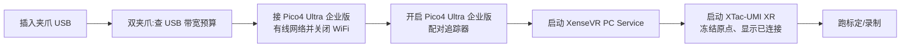

# PC 版:XTac-UMI G1 开发套件

PC 版把计算放在你自己的 x86 工作站上(推荐 NVIDIA GPU,Mamba 源码安装或 Docker 镜像二选一):夹爪 USB 直连主机,Pico4 Ultra 企业版头显也用 Type-C 线直连主机走有线共享网络(也支持 WiFi),位姿经主机上的 XenseVR PC Service 接入,整条链路走 LeRobot 框架。
需要的硬件是 XTac-UMI G1 主夹爪(单只或一对)、Pico4 Ultra 企业版加追踪器,以及这台工作站。
操作界面是终端命令加 Rerun 预览窗口,`lerobot-record` 直接落盘 LeRobotDataset v3,可推到 Hugging Face Hub。
基于 lerobot 开源生态,适合研究与算法团队、自建训练管线;完全开放二次开发,改 Python 代码或接自定义机器人都可以。
不需要 PC、由采集团队在现场用平板和夹爪按键操作的是[背包版](../backpack/index.md);两种配置的对比见[产品线与配置对比](../product/editions.md)。

硬件已连好、环境已装好、主夹爪已标定?下面从上电到出第一条数据,照抄即可。第一次用请先走
[认识 XTac-UMI G1](../product/g1.md) → [安装](install.md) → [主机配置](host-setup.md) →
[Pico4 头显与追踪器](../common/pico4.md) → [标定与自检](calibration.md),再回来。

开始前确认:

- 仓库、子模块、SDK 与夹爪固件都已按[必须升级到最新版本](versions.md#required)升级。版本不配套时采集
  照样能跑完并落盘,只是 `gripper.pos` 的刻度和别人对不上,事后从数据里看不出来。固件要求命令集
  V2.1,对应主夹爪 ≥ 1.2.0 / 从夹爪 ≥ 1.1.0,更高版本不必回刷([两者的区别](versions.md#v21))。
- 已做[串口权限与 ModemManager](host-setup.md#31) 一次性主机配置;双夹爪已查过
  [USB 带宽预算](host-setup.md#usb-budget)。
- 每台主夹爪已做过[夹爪标定](calibration.md#41):没标定的主夹爪会被拒绝连接;双夹爪两侧都要标,
  只标一侧会让左右刻度不一致。
- 已进入采集环境:Mamba 路径执行 `mamba activate xense-taccap`;Docker 路径执行
  `docker compose run --rm xense-taccap` 进容器。

## 上电与下电顺序 {#power-on}

1. 将 XTac-UMI G1 插入主机(USB)。
2. 双夹爪:先查 [USB 带宽预算](host-setup.md#usb-budget),再往后走。
3. 接好 Pico4 Ultra 企业版的有线共享网络,并关闭数采电脑的 WiFi——有线共享网络会与电脑 WiFi
   冲突,导致追踪不稳或连不上。头显也支持 WiFi 接入,但正式采集建议走有线,见
   [网络连接](../common/pico4.md#pico-network)。
4. 开启 Pico4 Ultra 企业版,短按追踪器电源键至蓝灯亮起(首次使用需先[绑定](../common/pico4.md#pico-tracker-bind))。
5. 启动主机的 XenseVR PC Service:

    ```bash
    /opt/apps/roboticsservice/runService.sh    # 要在打开 APP 之前
    ```

6. 面朝机器人正前方,启动 XTac-UMI XR APP(冻结世界系原点与方向,见[坐标系](../common/pico4.md#pico-frame)),
   点「重连」使[状态变为「已连接」](../common/pico4.md#pico-toolkit-ui)。
7. 运行标定 / 自检 / 录制脚本。



!!! warning "第 5 步必须在第 6 步之前:服务先起,再打开 APP"
    APP 去连的就是这个服务。服务没起来,APP 只会停在「未连接」;重启 APP 重连还会把世界系原点重设一次。

采集全程不要重启 XTac-UMI XR:重启会重设世界原点,同一数据集内位姿参考系就不一致了,见[启动与坐标系对齐](../common/pico4.md#pico-frame)。

下电按相反顺序:先停止录制 / 回放并等当前集存盘,再退出 XTac-UMI XR、停掉 XenseVR PC Service,最后按[供电与连接要求](../common/gripper.md#power)里的拔线顺序拔线:先拔数采终端端,再松螺钉拔夹爪端,从夹爪拔夹爪端前先断 24V。

## 自检 {#self-check}

```bash
# 夹爪可读:role 应为 Leader/Follower,firmware_sn 非空
python -c "from xense.taccap import scan_grippers
for g in scan_grippers(): print(g.side.name, g.role.name, repr(g.firmware_sn))"
```

出问题看[故障排查](troubleshooting.md)。

## 预览

录制前先用 `lerobot-teleoperate` 打开 Rerun 确认数据流,它只读设备不写数据:

```bash
lerobot-teleoperate \
    --robot.type=bi_taccap_gripper \
    --robot.id=0 \
    --robot.enable_tracker=true \
    --robot.enable_head_camera=false \
    --fps=30 \
    --display_data=true \
    --show_trajectory=true
```

Rerun 里应看到左右触觉与腕相机画面、`gripper.pos` 张到 1.0 / 闭到 0.0、`/world` 里的 EE 标记随夹爪
平滑移动;确认后 `Ctrl+C` 退出。单夹爪换成 `--robot.type=taccap_gripper`,两只都接着时再加
`--robot.side=left|right`。只有夹爪、或加头显相机的另外两档,见[预览](recording.md#preview)。

## 录制

```bash
lerobot-record \
    --robot.type=bi_taccap_gripper \
    --robot.id=0 \
    --robot.enable_tracker=true \
    --robot.enable_head_camera=false \
    --display_data=false \
    --dataset.repo_id=<your_org>/<your_dataset> \
    --dataset.num_episodes=1 \
    --dataset.fps=30 \
    --dataset.push_to_hub=false \
    --dataset.episode_time_s=120 \
    --dataset.reset_time_s=60 \
    --dataset.single_task='Pick up the object'
```

`--robot.id` 是必填的工位号,直接填数字,一套设备一个(双夹爪算一套),漏了会在解析命令行时就报错退出
([`--robot.id` 与硬件清单](recording.md#robot-id))。`--robot.enable_tracker` 与
`--robot.enable_head_camera` 和预览用的那一档保持一致;`--display_data` 预览时开、录制时关。
三档命令与全部参数见[录制](recording.md#52)。

## 检查本地数据

用录制时相同的 `repo_id` 检查本地数据集结构与内容是否完整:

```bash
lerobot-check-dataset --repo-id <your_org>/<your_dataset>
```

只查某几集等用法见[数据校验](dataset.md#62)。

## 上传 Hub(可选)

先 `hf auth login` 或设置 `HF_TOKEN`,再推送:

```bash
lerobot-push-dataset-to-hub \
    --repo-id <your_org>/<your_dataset> \
    --dataset-path ~/.cache/huggingface/lerobot/<your_org>/<your_dataset> \
    --upload-large-folder
```

私有仓库、不传视频等变体见[上传 Hub](dataset.md#64);数据集长什么样、每帧记录了什么见[数据集](dataset.md)。
