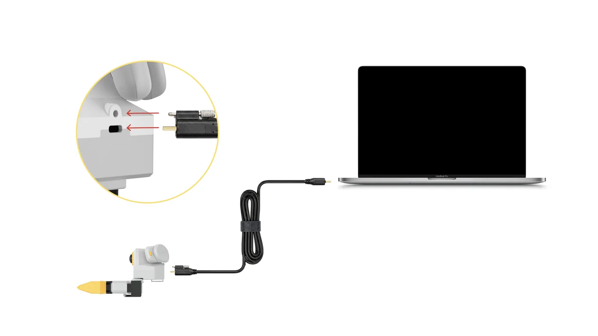

# Quickstart

From power-on to your first recorded episode. Before you start, make sure these five are done:

- Hardware connected → [Gripper connection](../common/gripper.md#install)
- Environment installed and active (`mamba activate xense-taccap` or the Docker container) → [Installation](install.md)
- Host configured: serial permissions, ModemManager kept off the ports → [Host setup](host-setup.md#31)
- Every leader gripper calibrated (an uncalibrated leader is refused) → [Gripper calibration](calibration.md#41)
- Repo, SDK and gripper firmware all up to date → [Required versions](versions.md#required)

## 1. Power on and connect {#power-on}

1. Plug in the gripper USB.
2. Wire the headset network and **turn off the PC's WiFi**.
3. Turn on the headset and short-press the tracker power button until the LED is solid blue.
4. Start the XenseVR PC Service: `/opt/apps/roboticsservice/runService.sh`
5. **Facing the robot**, open XTac-UMI XR and tap Connect; Status turns to Connected.

<div class="tc-pair" markdown>

<figure class="tc-shot" markdown>

<figcaption>The gripper connects to the PC over USB Type-C</figcaption>
</figure>

<figure class="tc-shot" markdown>

<figcaption>XTac-UMI XR Status turns to Connected</figcaption>
</figure>

</div>

!!! warning "Three common mistakes"
    - Start the PC Service before opening the XR app, or it cannot connect.
    - With a wired headset the PC's WiFi must be off, or tracking is unstable. See [Network](../common/pico4.md#pico-network).
    - Do not restart the XR app during collection: it resets the world origin, so poses within one dataset stop lining up.

Power off in reverse: stop recording and let the current episode save, quit the XR app, stop the PC Service, then unplug, in the order given in [Power and connection requirements](../common/gripper.md#power).

## 2. Self-check {#self-check}

```bash
python -c "from xense.taccap import scan_grippers
for g in scan_grippers(): print(g.side.name, g.role.name, repr(g.firmware_sn))"
```

One line per gripper, `role` is `Leader` or `Follower`, and the serial is not empty. If not, see [Troubleshooting](troubleshooting.md).

## 3. Preview check

=== "② With wrist pose"

    ```bash
    lerobot-teleoperate \
        --robot.type=bi_taccap_gripper \
        --robot.id=0 \
        --fps=30 \
        --display_data=true
    ```

    

=== "③ Full rig"

    ```bash
    lerobot-teleoperate \
        --robot.type=xtac_umi_g1 \
        --robot.id=0 \
        --fps=30 \
        --display_data=true
    ```

    

Move and open/close the grippers, check that every image, tactile stream and pose updates, then press Ctrl+C.

The tiers are chosen with `--robot.type`; **record with the same tier you previewed**:

<div class="tc-tiers" markdown>

| Tier | How | Data included |
|---|---|---|
| ① Grippers only | `--robot.type=bi_taccap_gripper`<br>`--robot.enable_tracker=false` | Tactile, wrist cameras, gripper opening; no PC Service needed |
| ② With wrist pose | `--robot.type=bi_taccap_gripper` | Adds the gripper pose `tcp.*` |
| ③ Full rig | `--robot.type=xtac_umi_g1` | Adds headset stereo images and head pose |

</div>

Keep the trackers in the headset's view before starting; occlusion loses tracking.

## 4. Full recording

=== "② With wrist pose"

    ```bash
    lerobot-record \
        --robot.type=bi_taccap_gripper \
        --robot.id=0 \
        --dataset.repo_id=<your_org>/<dataset_name> \
        --dataset.single_task='Pick up the object' \
        --dataset.num_episodes=1 \
        --dataset.fps=30 \
        --dataset.episode_time_s=120 \
        --dataset.reset_time_s=60 \
        --dataset.push_to_hub=false
    ```

    Each frame records 6 image streams (four visuotactile, both wrist cameras), plus gripper opening and gripper pose.

=== "③ Full rig"

    ```bash
    lerobot-record \
        --robot.type=xtac_umi_g1 \
        --robot.id=0 \
        --dataset.repo_id=<your_org>/<dataset_name> \
        --dataset.single_task='Pick up the object' \
        --dataset.num_episodes=1 \
        --dataset.fps=30 \
        --dataset.episode_time_s=120 \
        --dataset.reset_time_s=60 \
        --dataset.push_to_hub=false
    ```

    Each frame records 8 image streams, adding the headset stereo pair, plus the head pose:

    <figure class="tc-shot tc-shot--narrow" markdown>
    
    <figcaption>The eight streams and their keys in the dataset</figcaption>
    </figure>

- `--robot.id` is required: the station number as a plain number (`0`, `1`, …), one per kit.
- Keep `--robot.type` (and whether you add `--robot.enable_tracker=false`) the same as in the preview; for grippers only, add that switch to the ② command.
- Single gripper: `--robot.type=taccap_gripper`; with both grippers plugged in, add `--robot.side=left` or `right`.

All parameters: [Recording parameters](recording.md#params).

## 5. Check and upload

Check the dataset:

```bash
lerobot-check-dataset --repo-id <your_org>/<dataset_name>
```

Upload to the Hugging Face Hub when needed:

```bash
lerobot-push-dataset-to-hub \
    --repo-id <your_org>/<dataset_name> \
    --dataset-path ~/.cache/huggingface/lerobot/<your_org>/<dataset_name> \
    --upload-large-folder
```

Dataset layout and fields: [Dataset](dataset.md).
