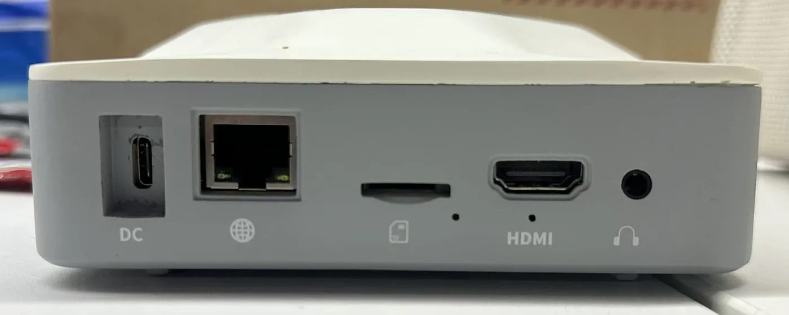
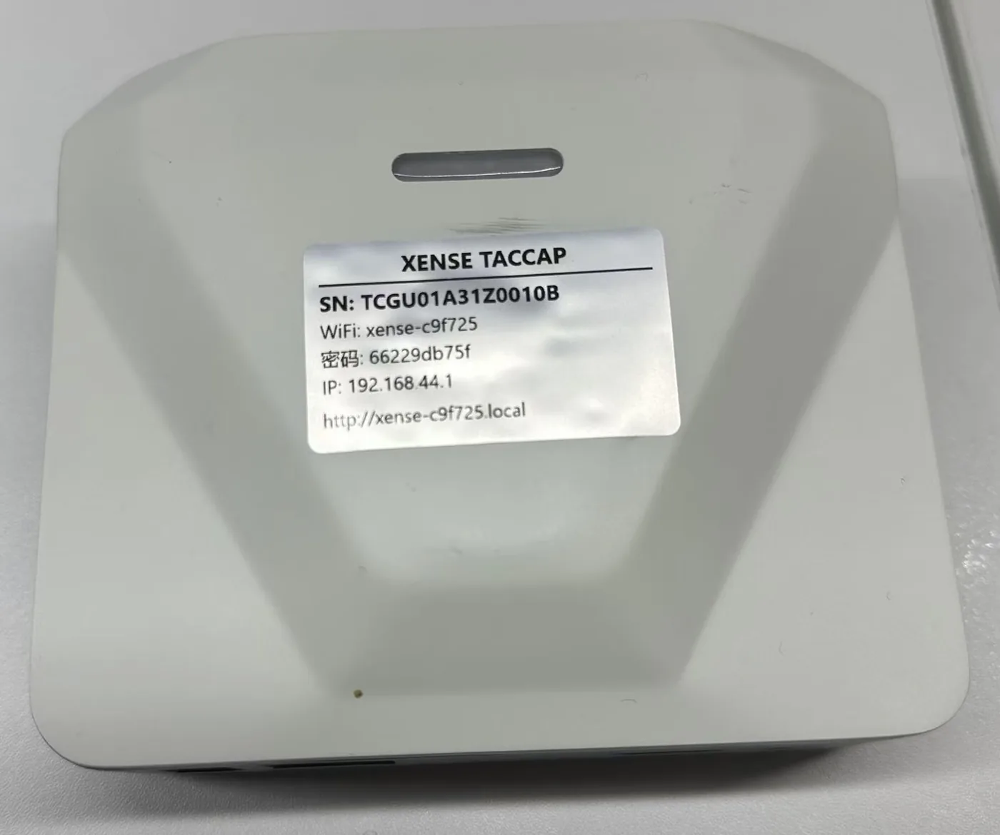

# 认识数采背包

**XTac-UMI 数采背包**是背包版的计算节点:夹爪和头显直接接在它身上,采集软件 XTac-UMI Collector 跑在它上面,手机或平板用浏览器打开的就是它的控制台;采集、回放与 LeRobot 导出都在设备上完成,不需要 PC。本页讲它的接口、标签、控制台、采集模式、数据与升级方式,读完能判断它是否适合你的采集场景。

{ width="720" }

[快速开始](../backpack/index.md){ .md-button .md-button--primary }
[对比两种配置](editions.md){ .md-button }

## 它是什么

数采背包是一台随机附带的 RK3588 计算节点(eMMC 系统盘 + NVMe 数据盘),负责集中接收、缓存与落盘 XTac-UMI G1 和 Pico 系统的采集数据,并按项目、任务组织。它内置了 PC 版里跑在工作站上的 XenseVR 运行时,头显直接接到它身上。

采集时它同时记录:每只主夹爪的腕部鱼眼、两路视触觉、编码器开合角度与 IMU;头显与两只追踪器的 6DoF 位姿;可选的头显双目画面。所有通道写进同一条 MCAP 记录,按项目 / 任务 / 时间归档。

它是背负式的:随采集人员移动,不依赖现场网络与 PC,适合连续示教与多场景采集。数据本地落盘、按任务管理,在控制台里回放、删除与导出,交付 LeRobot 数据集用于模仿学习与 VLA 训练。

## 接口 {#ports}

| 位置 | 标识 | 接什么 |
|---|---|---|
| 前面板 | `PICO` | Pico4 Ultra 头显,Type-C。XR 里勾选 USB 网络点连接,背包会自动在 USB 链路上建网(地址 `192.168.58.1`),不用手填 |
| 前面板 | `HEAD` | Type-C。采集接线不用 |
| 前面板 | `USB` | Type-C。采集接线不用 |
| 侧面 | `UMI-L` / `UMI-R` | 左 / 右主夹爪,Type-C,兼作夹爪供电 |
| 后面板 | `DC` | 12 V 输入,接线图上标为 Type-C,以实物为准:配套 12 V 3 A 适配器,或充电宝的 12 V 输出 |
| 后面板 | 网口 | 有线网,出厂 DHCP,可在系统页改静态 IP |
| 后面板 | SD 卡槽、`HDMI`、耳机 | 采集接线不用 |

{ width="720" }

接什么线、按什么顺序接见[开箱、接线与供电](../backpack/unbox-connect.md#order)。

## 机身标签 {#label}

背包顶盖上的标签印着这台设备的全部入口,认机、连网、报修都看它:

| 字段 | 含义 |
|---|---|
| `SN` | 设备序列号,系统 → 设备信息页显示同一串;报修时抄它 |
| `WiFi` | 背包常开热点的名字 `xense-<序列后 6 位>`(取自硬件序列,设备信息页可查),也是这台设备的名字 |
| `密码` | 热点的 WPA2 密码 |
| `IP` | 热点网关 `192.168.44.1`,连上热点后浏览器打开它就是控制台 |
| `http://xense-….local` | mDNS 设备名,与背包同网段时可以直接用它访问 |

认机看 SN 和热点名,不要记 IP:有线口的 IP 走 DHCP,会变且每台不同。图中的序列号与密码只是示例。

{ width="480" }

## 控制台

控制台跑在背包上,任何浏览器打开 `http://192.168.44.1`(热点)或 `http://xense-<序列后 6 位>.local` 即可,不用带端口号。顶栏四个标签页:

- **实时监控**:两路鱼眼、头显双目、双臂 / 头部位姿与左右开合角度、四路视触觉同屏显示;底部选项目 / 任务,开始、结束录制。
- **项目**:按项目 → 任务 → 录制条目管理已录数据:回放、删除、导出(MCAP 批量下载 / 发布 LeRobot)。
- **回放**:任意录制条目在线流式回放,布局与实时监控一致,可拖动进度条。
- **系统**:设备信息、夹爪配置(开合标定与 MCU 固件)、采集模式、上传配置、网络 / 配网、按键绑定、相机参数包、系统更新;纳管页预留给多机管理,当前不需要配置。

顶栏右侧常驻视频带宽、相机路数、CPU、内存、硬盘、监控 / 录制时长与系统状态,点开是系统日志。夹爪物理按键由设备端接管,浏览器不在线也能录:右爪长按开始、左爪长按停止,灯语见[夹爪按键、指示灯与序列号](../common/gripper.md#buttons-leds)。

## 采集模式

系统 → 采集模式 里选这台设备的通道预设,它决定实时布局、录制内容与导出:

| 模式 | 夹爪 | 头显双目 |
|---|---|---|
| 双爪 | 左 + 右 | — |
| 双爪 + 头显 | 左 + 右 | 录 |
| 单爪 | 一只,侧别按实际接的爪自动判定 | — |
| 单爪 + 头显 | 一只 | 录 |
| 仅头显 | — | 录 |

「+ 头显」只决定要不要录头显双目画面,6DoF 位姿始终来自头显与追踪器。录制中不能切换,切换只影响之后的新录制;同一任务从头到尾用同一模式,否则导出预检会拦下。仅头显录的数据不能进双臂 LeRobot 数据集。

## 数据

背包以 MCAP 为原始记录:每条 episode 一个 `.mcap` 文件,相机帧与编码器、IMU、位姿、设备事件各占一个 topic,布局对齐 Foxglove,可以直接在 Foxglove Studio 里回放。导出对话框的「转码」下载与回放页的「下载 H264」给出硬件转码后的 `.h264.mcap`。

LeRobot 是离线导出,不在录制时生成:项目页对一个任务点「导出」,设备先预检(通道完整、采集模式一致),再转码、构建并增量发布到 ModelScope,数据集根目录就是 `meta/`、`data/`、`videos/`,格式为 LeRobotDataset v3,视频统一重采样到 30 fps,`meta/` 里带逐 episode 的 `taccap_extrinsics.json`。同一个对话框里的「MCAP 批量下载」按勾选逐条把原始记录推到浏览器;凭据在 系统 → 上传配置 里按档管理,新建项目时绑定。发布后默认删除本地文件,可勾选保留;需要本地留档的,发布前先在导出对话框批量下载 MCAP。

数据落在 NVMe 数据盘上。多路视频同录体积不小,3 分钟量级的任务导出约 1.5 GB,传输与存储按这个量级预留。

## 升级

采集端整体以固件包(`.tar.zst`)升级:系统 → 系统更新 里上传并校验,核对版本号与 `sha256`,「应用更新并重启」,步骤见[导入升级包](../backpack/update.md#bundle)。设备保留上一个版本,更新出问题可以「回滚到上一版本」(从未成功应用过更新时没有可回滚的版本),见 [A/B 双槽与回滚](../backpack/update.md#rollback)。手动应用前先停录;0.3.9 起[远程下发](../backpack/update.md#remote)的更新会等当前这条录完再重启,重启后首次打开控制台会显示这一版的更新内容。夹爪 MCU 固件单独在 系统 → 夹爪配置 里刷写,刷写期间不要断电或拔线,刷完等夹爪重启后给背包断电再上电,见[夹爪固件](../backpack/update.md#gripper-firmware)。

## 与 PC 版的关系

两种配置用同一套 XTac-UMI G1 主夹爪和 Pico4 Ultra 头显,夹爪的按键、灯语、序列号规则和头显的配置步骤都通用。差别在中间那一层:PC 版把夹爪 USB 直连工作站,由 `lerobot-record` 直接落盘 LeRobotDataset;背包版把它们接到背包,以 MCAP 为原始记录,LeRobot 只是导出。两边导出的 LeRobot 数据集都是 v3,同一套工具能读;但操作流程不通用,别混着看。选哪一边见[产品线与配置对比](editions.md)。

## 已知限制

- 回放与实时预览共用背包的硬件编码器,整机同一时间只能做一个;回放不会抢占正在进行的预览,被拒时会提示是谁在占用。
- 背包只连 5 GHz WiFi:系统页扫描只列 5 GHz 网络,2.4 GHz 的路由器看不到也连不上;现场只有 2.4 GHz 时用网线,或直接走背包热点。
- iOS Safari 访问设备名要敲全 `http://` 前缀(`http://xense-xxxxxx.local`),只输名字会被当成搜索词;部分安卓机型打不开 `.local` 名,用 `http://192.168.44.1`。Windows 对 mDNS 解析不稳定,打不开设备名时同样用热点 IP。
- 系统页的「纳管」预留给多机管理,当前不需要配置。

## 版本

| 部件 | 版本 |
|---|---|
| Collector(采集端) | 0.3.9 |
| 背包 OS 固件 | V1.2.0 |
| 主夹爪固件 | V1.2.2 |
| XTac-UMI XR(头显 APK) | 0.2.5 |
| Pico OS | ≥ 5.15.5.U |
| 平板 OS(小米平板) | 建议 ≥ 3.0.303 |

本表是写作时的基线,版本号只是示例;实际以 系统 → 设备信息页 显示为准,升级后先到那里核对采集端版本是否已变。
