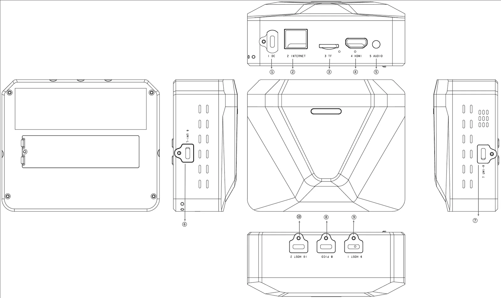
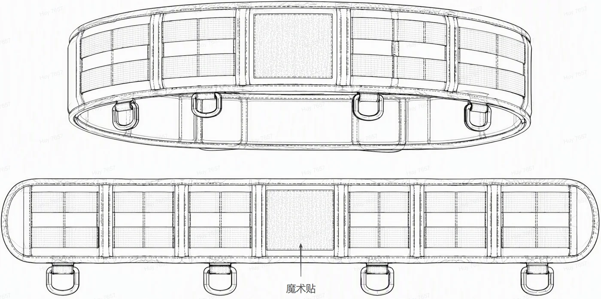

# 认识数采背包

**XTac-UMI 数采背包**是背包版的采集主机，随采集人员背负移动：夹爪与头显直接接上，平板浏览器即控制台，采集、回放与导出都在背包上完成。

{ width="720" }

[一页速通](../backpack/quickstart.md){ .md-button .md-button--primary }
[对比两种配置](editions.md){ .md-button }

## 它是什么

不需要电脑，也不依赖现场网络，开机即可采集。

-   :material-record-circle-outline: __记录__

    ---

    双爪视触觉、腕部鱼眼、开合度与 IMU，头显与追踪器位姿，可选头显画面

-   :material-harddisk: __存储__

    ---

    每条人类示范一个 MCAP 原始记录，按项目与任务管理

-   :material-export-variant: __交付__

    ---

    导出 LeRobot 数据集或 MCAP，下载或一键发布到 ModelScope

## 接口 {#ports}

{ width="900" }

| 编号 | 接口 | 位置 | 用途 |
|---|---|---|---|
| ① | `DC IN` | 后面板 | 12 V 供电输入，接配套 12 V 3 A 适配器，或经电源线接充电宝 |
| ② | 网口 | 后面板 | 有线网，出厂 DHCP，可在系统页改静态 IP |
| ③ | TF | 后面板 | TF 存储卡槽，日常采集不用 |
| ④ | `HDMI` | 后面板 | 视频输出，日常采集不用 |
| ⑤ | 耳机 | 后面板 | 3.5 mm 耳机口 |
| ⑥ | `UMI-L` | 左侧 | 左主夹爪，Type-C 锁紧线，兼作夹爪供电 |
| ⑦ | `UMI-R` | 右侧 | 右主夹爪，Type-C 锁紧线，兼作夹爪供电 |
| ⑧ | `PICO` | 前面板 | Pico4 Ultra 头显，Type-C。XR 里勾选「USB网络」点「连接」即可，不用手填地址 |
| ⑨ ⑩ | `HOST1` / `HOST2` | 前面板 | USB 主机接口，可接平板等设备 |

接什么线、按什么顺序接见[开箱、接线与供电](../backpack/unbox-connect.md#order)。

### 腰带 {#belt}

腰带用来固定数采背包和充电宝，减少线缆对操作者动作的影响。

{ width="720" }

- 佩戴前确认数采背包、充电宝与腰带固定可靠。
- 走线留出活动余量，避免转身、弯腰或抬臂时拉扯接口。
- 不要遮挡数采背包与充电宝的散热区域。

## 机身标签 {#label}

{ width="420" }

| 字段 | 用途 |
|---|---|
| SN | 设备序列号，报修时提供 |
| WiFi / 密码 | 背包热点的名字与密码 |
| IP / 设备名 | 连上背包后在浏览器打开，进入控制台 |

认机看 SN 和热点名，不要记 IP。连接方法见[网络与控制台入口](../backpack/network.md)。

## 控制台

浏览器打开背包地址即进入控制台，顶栏四个页面：

| 页面 | 做什么 |
|---|---|
| 实时监控 | 各路画面、位姿与开合度同屏显示；选项目与任务，开始 / 结束录制 |
| 项目 | 管理录制：回放、删除、导出、归档 |
| 回放 | 在线回放任意一条录制 |
| 系统 | 设备信息、夹爪标定与固件、采集设置、上传配置、网络、系统更新、界面语言 |

=== "实时监控"

    

=== "项目"

    

录制主要用夹爪按键：右爪长按开始、左爪长按停止，浏览器不在线也能录，并有灯语与语音提示，见[夹爪按键、指示灯与语音](../backpack/gripper.md)。

## 采集模式

采集模式在**新建项目时选定**，之后不能改；要换模式就新建项目。每种模式都需要头显提供位姿。

| 模式 | 相机路数 |
|---|---|
| 双爪 | 6 |
| 双爪 + 头显双目 | 8 |
| 双爪 + 头显右单目 | 7 |

## 数据与导出

- **原始记录**：每条人类示范一个 MCAP 文件，存在背包的 NVMe 数据盘上。
- **按任务导出**：LeRobotDataset v3 或 MCAP，两种可以都导；导出前自动检查数据完整性。
- **取回方式**：下载压缩包，或上传到 ModelScope、S3、FTP / FTPS、NFS。
- **数据量**：一个 3 分钟左右的任务导出约 1.5 GB。

详见[项目、导出与发布](../backpack/projects-export.md)。

## 升级

- **采集软件**：在 系统 → 系统更新 导入升级包，出问题可回滚到上一版本，见[升级与 OTA](../backpack/update.md)。
- **夹爪固件**：在 系统 → 夹爪配置 里刷写，见[夹爪固件](../backpack/update.md#gripper-firmware)。

当前各部件的版本见[背包版 · 版本](../backpack/versions.md)。

## 已知限制

- 回放与实时预览不能同时进行。
- 背包只连 5 GHz WiFi；现场只有 2.4 GHz 时用网线或背包热点。
- 部分手机与 Windows 打不开设备名（`.local`），改用 IP 地址访问。
