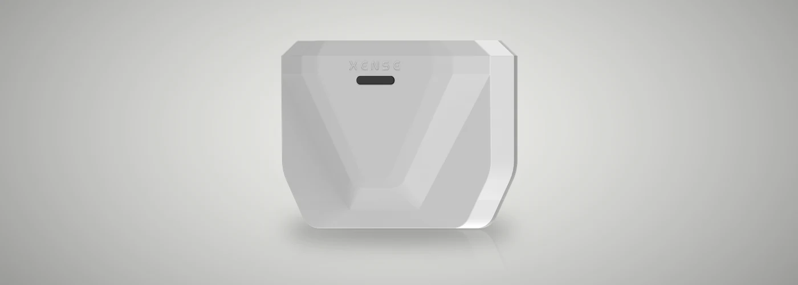
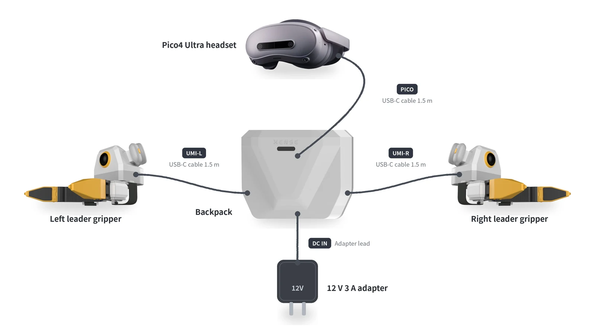
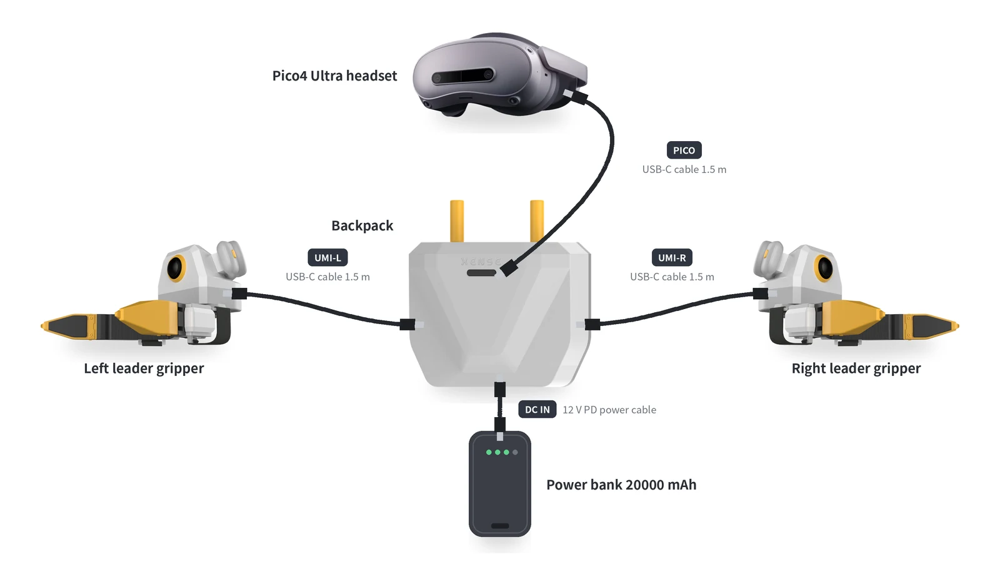

# Product line and configuration comparison

XTac-UMI comes in two configurations that share the same XTac-UMI G1 grippers and Pico4 Ultra Enterprise headset and record the same data:

- **Backpack Kit**: the backpack runs all collection and a tablet browser is the console; turnkey and built for large-scale field collection. The collection software is not open source.
- **Developer Kit (open source)**: the grippers and headset connect straight to your workstation and record with open-source LeRobot; built for research and algorithm teams who want to customise freely.

This page compares the two and lists each kit's box contents and wiring.

-   { .xu-card__img }

    Backpack Kit

    **XTac-UMI Data Collection Backpack**{ .xu-card__title }

    ---

    The backpack is the host and a tablet the console; record with the gripper buttons and upload to ModelScope in one click.

    [Quickstart](../backpack/quickstart.md){ .md-button .md-button--primary }

-   { .xu-card__img }

    Developer Kit

    **XTac-UMI G1 Developer Kit (open source)**{ .xu-card__title }

    ---

    Plugs into your workstation and records a LeRobotDataset; the collection software and SDK are open source.

    [Quickstart](../pc/quickstart.md){ .md-button .md-button--primary }

## How the two differ

| | Backpack Kit · XTac-UMI Backpack | Developer Kit · XTac-UMI G1 Developer Kit |
|---|---|---|
| Compute | The backpack in the box | Your own x86 workstation, NVIDIA GPU recommended |
| Interface | Browser console; a tablet is enough | Terminal + Rerun preview window |
| Headset link | Type-C to the backpack, wired only | Type-C to the workstation, wired by default |
| Recording control | Mainly the gripper buttons; the console works too | `lerobot-record` command line |
| Capture modes | Two grippers, optionally with headset stereo or right-eye images | One or two grippers, optionally with headset images |
| On disk | One MCAP raw recording per take | LeRobotDataset v3 directly |
| Export and upload | Export per task as LeRobot v3 / MCAP; download, or upload to ModelScope, S3, FTP, NFS and more | Push to the Hugging Face Hub |
| Upgrades | Import an update package in the console; can roll back | Update the repo or image |
| Customisation | Not open source; build on the exported data | Open source (Apache-2.0); change the code, hook up your own robot |
| For | Large-scale data factories and field collection teams | Research and algorithm teams with their own training pipelines |

## Box contents and wiring {#kit}

=== "Backpack Kit"

    | Item | Qty | Spec and notes |
    |---|---|---|
    | XTac-UMI G1 leader gripper | 2 | One left and one right, told apart by the last digit of the serial number: odd is left, even is right |
    | Leader gripper cable | 2 | Type-C to Type-C, 1.5m, one per side; locking connector at the gripper end, the other end into the backpack's `UMI-L` / `UMI-R` |
    | Pico4 Ultra Enterprise headset | 1 | With controllers and motion trackers; the trackers mount on top of the two leader grippers |
    | Tracker charging dock | 1 | Three-way |
    | Headset cable (Pico → Pack) | 1 | Type-C to Type-C, 1.5m, headset to the backpack's `PICO` port |
    | Backpack | 1 | Compute node with a built-in 5 GHz hotspot (off by default) |
    | Waist belt | 1 | For wearing the backpack |
    | 12V power adapter | 1 | 12V 3A, 1.5m lead, into the backpack's `DC` port |
    | Power bank | 1 | 20000mAh, 45W |
    | 12V PD power cable | 1 | 0.3m, power bank to the backpack's `DC` port |
    | Tablet | 1 | 6 GB + 128 GB, with case; serves as the console |
    | Type-C charging plug | 1 | PD fast charging, 100W |

    Use the adapter at a fixed workstation and the power bank for mobile collection:

    === "Adapter power (fixed station)"

        

    === "Power bank (mobile collection)"

        

    The wiring steps are in [Adapter power](../backpack/unbox-connect.md#adapter) and [Power-bank power](../backpack/unbox-connect.md#powerbank); the safety requirements for powering and unplugging in order are in [The backpack and its power](safety.md#backpack-power); opening the console is in [The tablet over USB](../backpack/network.md#tablet), or use [the backpack hotspot](../backpack/network.md#softap) without a tablet.

=== "Developer Kit"

    | Item | Qty | Spec and notes |
    |---|---|---|
    | XTac-UMI G1 leader gripper | 2 | One left and one right, told apart by the last digit of the serial number: odd is left, even is right |
    | Leader gripper cable | 2 | Type-C to Type-A, USB 2.0, 3m; locking connector at the gripper end |
    | Pico4 Ultra Enterprise headset | 1 | With controllers and motion trackers; the trackers mount on top of the two leader grippers |
    | Tracker charging dock | 1 | Three-way |
    | Headset cable | 1 | Type-C to Type-C, 1.5m, headset to the host |

    With the optional follower grippers you also get:

    | Item | Qty | Spec and notes |
    |---|---|---|
    | XTac-UMI G1 follower gripper | 2 | One left and one right, mounted on the robot's end effector |
    | 24V power adapter | 2 | 24V 2.5A, 4.5m lead with ferrite, one per follower |
    | Cable sleeve | 1 | 3m, for routing cables along the arm |

    You supply the host; the requirements are in [Collection host requirements](../pc/install.md#host-spec). Three cables in total:

    - **Leader grippers × 2**: a Type-C to USB-A cable from each gripper to a USB-A port on the host; put the two grippers on two separate USB buses, see [The USB bandwidth budget](../pc/host-setup.md#usb-budget).
    - **Headset × 1**: a Type-C to Type-C cable to the host, over wired network sharing, see [Network connection](../common/pico4.md#pico-network).

    The power-up order and your first collection run are in [Developer Kit quickstart](../pc/quickstart.md#power-on).

## Common questions

??? question "Can data from the two kits be trained on together?"

    Yes. Both produce LeRobotDataset v3 and the same LeRobot tools read them; camera keys and field layout differ slightly, so compare each `meta/info.json` before merging.

??? question "Can the Backpack Kit be customised?"

    Only lightly: the collection software is not open source, so customisation builds on the exported data, the upload configuration and the capture settings. To change the collection logic or connect your own robot, choose the open-source Developer Kit.

??? question "Does the Developer Kit need an NVIDIA GPU?"

    An NVIDIA GPU is recommended for real collection, see [Host requirements](../pc/install.md#host-spec). It still records without one, but saving is slower and frames drop more easily, see [Recording on a host with no NVIDIA GPU](../pc/recording.md#no-gpu).

??? question "Is the headset required?"

    On the Backpack Kit, yes: every capture mode takes its poses from the headset and trackers. On the Developer Kit you can record grippers only (tactile, wrist views, opening) without the headset.

??? question "Can a phone be the Backpack Kit console?"

    Yes. Tablets, phones and computers all open the console in a browser; how to connect is in [Network and console access](../backpack/network.md).

??? question "Does the Backpack Kit need internet access?"

    Not for collection; the backpack has its own hotspot. You only need a network to upload: ModelScope and S3 need internet access, while FTP / NFS on your LAN only need the same LAN.

## Getting started and after-sales support

- **Getting started**: see the [Backpack Kit quickstart](../backpack/quickstart.md) or the [Developer Kit quickstart](../pc/quickstart.md).
- **Missing or damaged items in the box**: contact our after-sales team for a replacement; do not substitute other cables or power supplies.
- **Problems in use**: check the troubleshooting page for your kit first; if that does not solve it, contact our after-sales team with the device serial numbers and logs described in [Support and feedback](../common/reference.md#support).
