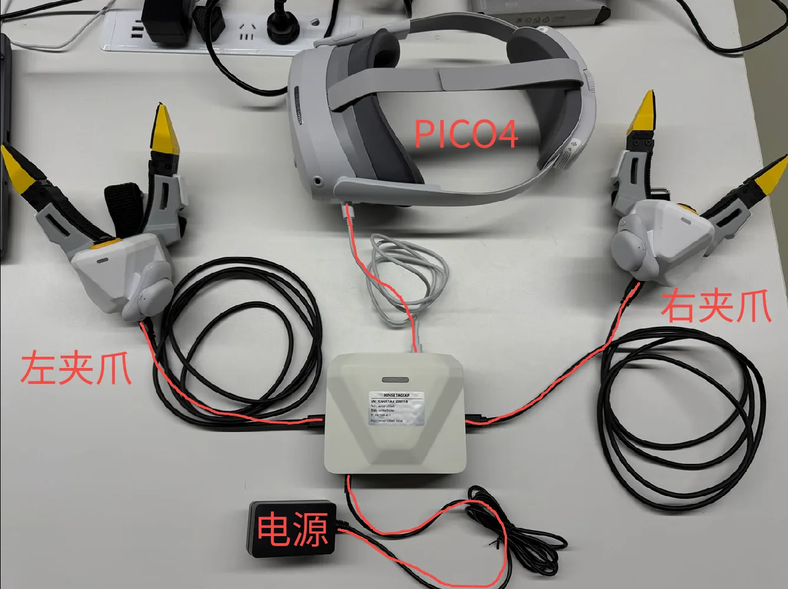
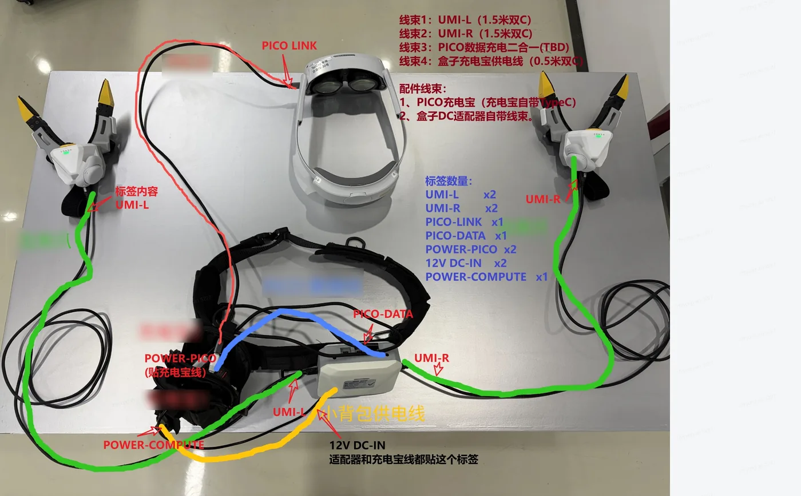

# 产品线与配置对比

XTac-UMI 有两种配置:**背包版**(XTac-UMI 数采背包)和 **PC 版**(XTac-UMI G1 开发套件)。两者用的是同一套 XTac-UMI G1 主夹爪和 Pico4 Ultra 头显,差别只在计算节点放在哪、操作员面对什么界面、原始数据以什么格式落盘。本页帮你选定一边,并核对箱内清单与接线。

-   :material-bag-personal:{ .lg .middle } __背包版 · XTac-UMI 数采背包__

    ---

    - 背包即主机,平板即控制台,不需要 PC
    - 夹爪按键开录,灯语反馈,单人可操作
    - MCAP 原始记录,一键发布 LeRobot 到 ModelScope

    **适合**:采集团队、外部现场、规模化采集

    [快速开始](../backpack/index.md){ .md-button .md-button--primary }

-   :material-desktop-tower-monitor:{ .lg .middle } __PC 版 · XTac-UMI G1 开发套件__

    ---

    - 接入你自己的 x86 工作站,完全走 LeRobot 框架
    - `lerobot-record` 直接产出 LeRobotDataset
    - 改代码、接自定义机器人都方便

    **适合**:研究与算法团队、自建训练管线

    [快速开始](../pc/index.md){ .md-button .md-button--primary }

## 两种配置的差别

| | 背包版 · XTac-UMI 数采背包 | PC 版 · XTac-UMI G1 开发套件 |
|---|---|---|
| 计算节点 | 随机附带的 RK3588 数采背包,eMMC 系统盘 + NVMe 数据盘 | 用户自备 x86 工作站,Mamba 源码安装或 Docker 镜像;正式采集要求 NVIDIA GPU,Mamba 路径没有 GPU 也能装,只能降级录制 |
| 操作界面 | 浏览器控制台:实时监控 / 项目 / 回放 / 系统;平板、手机、PC 都只当浏览器 | 终端命令 + Rerun 预览窗口 |
| 接入方式 | 夹爪接 `UMI-L` / `UMI-R`;头显接 `PICO` 口走 USB 网络,或 WiFi;操作端连背包热点或局域网 | 夹爪 USB 直连 PC;头显经 XenseVR PC Service |
| 录制控制 | 右爪长按开始、左爪长按停止、左爪双击删除上一条;灯语反馈;控制台也可操作 | `lerobot-record` 命令行参数,`--robot.id` 必填 |
| 采集模式 | 双爪 · 双爪 + 头显 · 单爪 · 单爪 + 头显 · 仅头显 | 单 / 双夹爪,可选头显相机 |
| 原始数据 | MCAP(每条 episode 一个文件)+ H.264;LeRobot 是离线导出 | LeRobotDataset v3 直接落盘 |
| 导出与上传 | 浏览器按 episode 下载 MCAP;LeRobot 发布到 ModelScope,发布后默认清盘 | Hugging Face Hub |
| 升级 | 系统页导入固件包(`.tar.zst`),保留上一版本可回滚;手动应用前先停录,远程下发的更新会等当前条录完再重启 | 拉仓库、跑安装脚本或换镜像 tag;夹爪固件 OTA 用 SDK 脚本 |
| 二次开发 | 不面向改代码;交付 MCAP / LeRobot 数据 | 改 Python 代码、接自定义机器人都方便 |
| 适合谁 | 数据采集团队、外部现场、规模化采集 | 研究与算法团队,自建训练管线 |

## 箱内清单与接线 {#kit}

=== "背包版"

    | 物品 | 数量 | 说明 |
    |---|---|---|
    | Pico4 Ultra 企业版头显 + 手柄 | 1 | 配套两只体感追踪器,装在两只主夹爪顶部 |
    | XTac-UMI G1 主夹爪 | 2 | 左右各一,按序列号末位区分:单数左、双数右 |
    | Type-C 线 | 2 | 夹爪端为锁紧接头,另一端接背包 `UMI-L` / `UMI-R` |
    | 数采背包 | 1 | RK3588 计算节点,常开 5 GHz 热点 |
    | 电源适配器 | 1 | 12 V 3 A,36 W,接背包 `DC` 口 |
    | 充电宝 | 2 | Type-C 输出 5 V 3 A / 12 V 3 A;一只供背包,一只供头显 |

    固定工位用适配器供电,移动采集用充电宝供电:

    { width="720" }

    { width="720" }

    接线步骤见[适配器供电](../backpack/unbox-connect.md#adapter)与[充电宝供电](../backpack/unbox-connect.md#powerbank);供电与拔线顺序的安全要求见[数采背包与供电](safety.md#backpack-power);连上背包、打开控制台见[背包热点](../backpack/network.md#softap)。

=== "PC 版"

    | 物品 | 数量 | 说明 |
    |---|---|---|
    | XTac-UMI G1 主夹爪 | 2 | 左右各一,按序列号末位区分:单数左、双数右 |
    | Type-C 线 | 2 | 夹爪端为锁紧接头,另一端按主机接口选 Type-C 或 Type-A |
    | Pico4 Ultra 企业版头显 | 1 | 含手柄 |
    | 体感追踪器 | 2 | 装在两只主夹爪顶部 |

    主机自备,配置要求见[采集主机配置要求](../pc/install.md#host-spec)。接线只有两处:

    - 两只夹爪各用一条 Type-C 线直连主机,双夹爪的六路相机要分挂两条 USB 总线,见 [USB 带宽预算](../pc/host-setup.md#usb-budget)。
    - 头显用 Type-C 线接主机走有线共享网络,或走 WiFi,见[网络连接](../common/pico4.md#pico-network)。

    上电顺序与第一次采集见 [PC 版快速开始](../pc/index.md#power-on)。

## 常见问题

??? question "两种配置采的数据能混在一起训练吗"

    可以。背包版从 MCAP 导出的和 PC 版直接落盘的都是 LeRobotDataset v3,同一套 `lerobot` 工具都能加载。两边的相机键名与状态字段布局不完全相同,合并前先对照各自的 `meta/info.json`;PC 版的字段见[数据集](../pc/dataset.md#61)。

??? question "背包版能改代码吗"

    不面向。背包上的采集软件以固件包整体交付和升级,交付物是 MCAP 与 LeRobot 数据。要改采集逻辑、接自定义机器人,选 PC 版。

??? question "PC 版一定要 NVIDIA 显卡吗"

    正式采集要:最低 RTX 3060 / 8 GB 显存,推荐 RTX 4070 / 12 GB,驱动 ≥ 570.144,见[主机配置要求](../pc/install.md#host-spec)。没有显卡的机器可以关掉流式编码把数据录下来,但存盘慢、更容易掉帧,只是临时办法,见[没有 NVIDIA GPU 的主机怎么录](../pc/recording.md#no-gpu)。

??? question "头显是必需的吗"

    两种配置都需要。6DoF 位姿来自头显与装在夹爪顶部的两只追踪器,没有头显就没有位姿。背包版采集模式里的「+ 头显」指额外录头显双目画面,不是指要不要头显。

??? question "手机能当背包版的控制台吗"

    可以,平板、手机、PC 都只当浏览器。连上背包热点后打开 `http://192.168.44.1`,或用设备名 `http://xense-<序列后 6 位>.local`。iOS Safari 要敲全 `http://` 前缀,否则设备名会被当成搜索词;部分安卓机型打不开 `.local` 名,直接用 IP。

??? question "背包版需要联网吗"

    采集不需要。背包常开自己的 5 GHz 热点,网关固定 `192.168.44.1`,不依赖现场网络。只有发布到 ModelScope 时背包要能上外网:接网线,或在系统页把背包配上现场的 5 GHz WiFi。

## 联系与快速开始

选好了就去各自的入口页:[背包版快速开始](../backpack/index.md)、[PC 版快速开始](../pc/index.md)。线缆、适配器、充电宝等以合同配置及随货清单为准,缺件联系项目负责人,勿自行替代;技术问题的反馈渠道与要附带的信息见[支持与反馈](../common/reference.md#support)。
